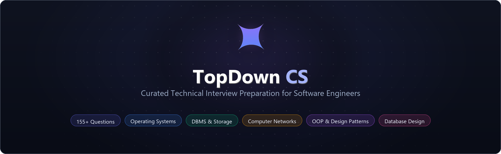

<div align="center">
  <a href="https://topdowncs.com">
    
  </a>
  <p align="center">
    <a href="https://topdowncs.com"></a>
    
    
    <a href="https://github.com/jaicharan-dev/topdown-cs/issues"></a>
  </p>

  <p align="center">
    <a href="https://topdowncs.com"><b>🌐 Live Website</b></a> &nbsp;&nbsp;•&nbsp;&nbsp;
    <a href="#-curriculum--question-bank"><b>📚 Curriculum</b></a> &nbsp;&nbsp;•&nbsp;&nbsp;
    <a href="#-the-topdown-methodology"><b>🎯 Methodology</b></a> &nbsp;&nbsp;•&nbsp;&nbsp;
    <a href="#️-local-development"><b>🛠️ Setup</b></a> &nbsp;&nbsp;•&nbsp;&nbsp;
    <a href="#-contributing"><b>🤝 Contributing</b></a>
  </p>
</div>

---

<table align="center" width="100%">
  <tr align="center">
    <td width="25%">
      <sub>CURATED QUESTIONS</sub><br/>
      <font size="5"><b>155+</b></font><br/>
      <sub>Interview Problems</sub>
    </td>
    <td width="25%">
      <sub>CORE DISCIPLINES</sub><br/>
      <font size="5"><b>4 + 1</b></font><br/>
      <sub>OS • DBMS • CN • OOP</sub>
    </td>
    <td width="25%">
      <sub>PEDAGOGICAL MODEL</sub><br/>
      <font size="5"><b>3-Layer</b></font><br/>
      <sub>Intuitive → Deep → Summary</sub>
    </td>
    <td width="25%">
      <sub>ACCESS</sub><br/>
      <font size="5"><b>100% Free</b></font><br/>
      <sub>Open Source Resource</sub>
    </td>
  </tr>
</table>

---

## 🎯 The TopDown Methodology

Most interview preparation materials either jump straight into low-level code without context or recite rote textbook definitions. **TopDown CS** structures every question around three layers designed for deep technical comprehension and rapid recall:

<table width="100%">
  <tr>
    <td width="33%" valign="top">
      <h4 align="center">💡 1. Intuitive Mental Model</h4>
      <p>Real-world engineering analogies and physical intuitions that deconstruct abstract low-level mechanisms before touching syntax or theory.</p>
    </td>
    <td width="33%" valign="top">
      <h4 align="center">🔬 2. Technical Deep Dive</h4>
      <p>Architectural diagrams, OS kernel internals, memory layouts, bytecode inspections, concurrency execution traces, and failure modes.</p>
    </td>
    <td width="33%" valign="top">
      <h4 align="center">🎯 3. Interview-Ready Summary</h4>
      <p>Crisp, high-signal verbal takeaways calibrated specifically for what engineering hiring managers and bar-raisers actively listen for.</p>
    </td>
  </tr>
</table>

> [!TIP]
> **Recommended Study Flow:** Start with **Essentials** in each track to build your core architectural foundation, advance to **Additional** for deep-dive system nuances, and tackle **Problems** to master numerical calculations and formal proofs.

---

## 📚 Curriculum & Question Bank

The repository contains **155+ curated questions** organized by subject and module tier:

### 💻 Operating Systems

*43 Curated Questions • 3 Modules*

| Module | Questions | Difficulty | Core Topics Covered | Explore |
|:---|:---:|:---|:---|:---:|
| [**OS Essentials**](https://topdowncs.com/docs/os-essential/1-process-vs-thread) | 20 | 🟢&nbsp;9&nbsp;Easy &nbsp;•&nbsp; 🟡&nbsp;11&nbsp;Med | Processes, threads, CPU scheduling, virtual memory, paging, deadlocks, IPC | [Explore&nbsp;→](https://topdowncs.com/docs/os-essential/1-process-vs-thread) |
| [**OS Additional**](https://topdowncs.com/docs/os-additional/1-priority-inversion-mars-rover) | 15 | 🟡&nbsp;8&nbsp;Med &nbsp;•&nbsp; 🔴&nbsp;7&nbsp;Hard | Priority inversion, spinlocks, TLB flushing, kernel threads, POSIX signals | [Explore&nbsp;→](https://topdowncs.com/docs/os-additional/1-priority-inversion-mars-rover) |
| [**OS Problems**](https://topdowncs.com/docs/os-problems/1-cpu-scheduling-fcfs-sjf-srtf-round-robin) | 8 | 🟡&nbsp;7&nbsp;Med &nbsp;•&nbsp; 🔴&nbsp;1&nbsp;Hard | Scheduling Gantt charts, Banker's algorithm, Bélády's anomaly proofs | [Explore&nbsp;→](https://topdowncs.com/docs/os-problems/1-cpu-scheduling-fcfs-sjf-srtf-round-robin) |

---

### 🗄️ Database Management Systems

*33 Curated Questions • 2 Modules*

| Module | Questions | Difficulty | Core Topics Covered | Explore |
|:---|:---:|:---|:---|:---:|
| [**DBMS Essentials**](https://topdowncs.com/docs/dbms-essential/1-what-is-a-transaction) | 15 | 🟢&nbsp;7&nbsp;Easy &nbsp;•&nbsp; 🟡&nbsp;8&nbsp;Med | ACID guarantees, WAL protocols, B+ Trees, transaction states, SQL order, indexing | [Explore&nbsp;→](https://topdowncs.com/docs/dbms-essential/1-what-is-a-transaction) |
| [**DBMS Additional**](https://topdowncs.com/docs/dbms-additional/9-bcnf-vs-3nf) | 18 | 🟢&nbsp;1&nbsp;Easy &nbsp;•&nbsp; 🟡&nbsp;14&nbsp;Med &nbsp;•&nbsp; 🔴&nbsp;3&nbsp;Hard | BCNF vs. 3NF normalization, OLTP vs. OLAP, ER schema translation, query planning | [Explore&nbsp;→](https://topdowncs.com/docs/dbms-additional/9-bcnf-vs-3nf) |

---

### 🌐 Computer Networks

*26 Curated Questions • 3 Modules*

| Module | Questions | Difficulty | Core Topics Covered | Explore |
|:---|:---:|:---|:---|:---:|
| [**CN Essentials**](https://topdowncs.com/docs/cn-essential/1-osi-model-tcp-ip) | 10 | 🟢&nbsp;5&nbsp;Easy &nbsp;•&nbsp; 🟡&nbsp;4&nbsp;Med &nbsp;•&nbsp; 🔴&nbsp;1&nbsp;Hard | OSI vs. TCP/IP, TCP 3-way handshake & teardown, flow control, DNS, HTTP/2/3 | [Explore&nbsp;→](https://topdowncs.com/docs/cn-essential/1-osi-model-tcp-ip) |
| [**CN Additional**](https://topdowncs.com/docs/cn-additional/1-sessions-vs-jwt) | 6 | 🟢&nbsp;1&nbsp;Easy &nbsp;•&nbsp; 🟡&nbsp;4&nbsp;Med &nbsp;•&nbsp; 🔴&nbsp;1&nbsp;Hard | Cookie sessions vs. JWTs, WebSockets scaling, CORS preflight, TLS 1.3 handshake | [Explore&nbsp;→](https://topdowncs.com/docs/cn-additional/1-sessions-vs-jwt) |
| [**CN Problems**](https://topdowncs.com/docs/cn-problems/1-subnetting) | 10 | 🟢&nbsp;1&nbsp;Easy &nbsp;•&nbsp; 🟡&nbsp;6&nbsp;Med &nbsp;•&nbsp; 🔴&nbsp;3&nbsp;Hard | Subnetting, VLSM design, CRC-32 division, Hamming codes, framing efficiency | [Explore&nbsp;→](https://topdowncs.com/docs/cn-problems/1-subnetting) |

---

### ☕ OOP, Code Tracing & Design Patterns

*53 Curated Questions • 4 Modules*

| Module | Questions | Difficulty | Core Topics Covered | Explore |
|:---|:---:|:---|:---|:---:|
| [**OOP Essentials**](https://topdowncs.com/docs/oop-essential/1-four-pillars-of-oop) | 22 | 🟢&nbsp;7&nbsp;Easy &nbsp;•&nbsp; 🟡&nbsp;11&nbsp;Med &nbsp;•&nbsp; 🔴&nbsp;4&nbsp;Hard | Core pillars, SOLID principles, HashMap internals, memory models, immutability | [Explore&nbsp;→](https://topdowncs.com/docs/oop-essential/1-four-pillars-of-oop) |
| [**OOP Additional**](https://topdowncs.com/docs/oop-additional/19-static-binding-vs-dynamic-binding) | 17 | 🟢&nbsp;3&nbsp;Easy &nbsp;•&nbsp; 🟡&nbsp;11&nbsp;Med &nbsp;•&nbsp; 🔴&nbsp;3&nbsp;Hard | Static vs. dynamic binding, method hiding, covariant returns, generics, reflection | [Explore&nbsp;→](https://topdowncs.com/docs/oop-additional/19-static-binding-vs-dynamic-binding) |
| [**Code Tracing**](https://topdowncs.com/docs/code-tracing/1-code-trace-static-instance-constructor) | 8 | 🟡&nbsp;4&nbsp;Med &nbsp;•&nbsp; 🔴&nbsp;4&nbsp;Hard | Step-by-step traces: class initialization, MRO linearization, variable shadowing | [Explore&nbsp;→](https://topdowncs.com/docs/code-tracing/1-code-trace-static-instance-constructor) |
| [**Design Patterns**](https://topdowncs.com/docs/design-patterns/1-singleton-pattern) | 6 | 🟡&nbsp;5&nbsp;Med &nbsp;•&nbsp; 🔴&nbsp;1&nbsp;Hard | Idiomatic implementations: Singleton, Factory, Strategy, Builder, Decorator, Observer | [Explore&nbsp;→](https://topdowncs.com/docs/design-patterns/1-singleton-pattern) |

---

### 📐 Database Design

*8 High-Scale Schema Designs*

| Module | Questions | Difficulty | Core Topics Covered | Explore |
|:---|:---:|:---|:---|:---:|
| [**Database Design**](site/docs/database-design/1-wallet-payment-system.md) | 8 | 🟡&nbsp;8&nbsp;Med | High-scale schemas: Wallets, Splitwise, Swiggy/Zomato, Uber/Ola, Zerodha, Amazon | [Explore&nbsp;→](site/docs/database-design/1-wallet-payment-system.md) |

---

## 🛠️ Local Development

TopDown CS is built with [Docusaurus 3](https://docusaurus.io/), [React](https://react.dev/), and [KaTeX](https://katex.org/). You can run the entire site locally:

```bash
# 1. Clone the repository
git clone https://github.com/jaicharan-dev/topdown-cs.git
cd topdown-cs/site

# 2. Install dependencies
npm install

# 3. Start local development server
npm start
```

The documentation server will launch at `http://localhost:3000`.

To test the production build locally:
```bash
npm run build
npm run serve
```

---

## 🤝 Contributing

Contributions, errata corrections, and question suggestions are welcome!

* 🐛 **Report Errata:** Found a typo or inaccurate technical detail? Please [open an issue](https://github.com/jaicharan-dev/topdown-cs/issues).
* 💡 **Suggest Questions:** Have a question that frequently appears in technical rounds? Open an issue with the proposed topic.
* 🚀 **Submit Improvements:** Fork the repo, create a branch (`git checkout -b feature/topic-improvement`), and submit a Pull Request following our 3-step question structure.

<br/>

<div align="center">
  <p>⭐ If you find TopDown CS helpful for your interview preparation, consider starring the repo!</p>
</div>
