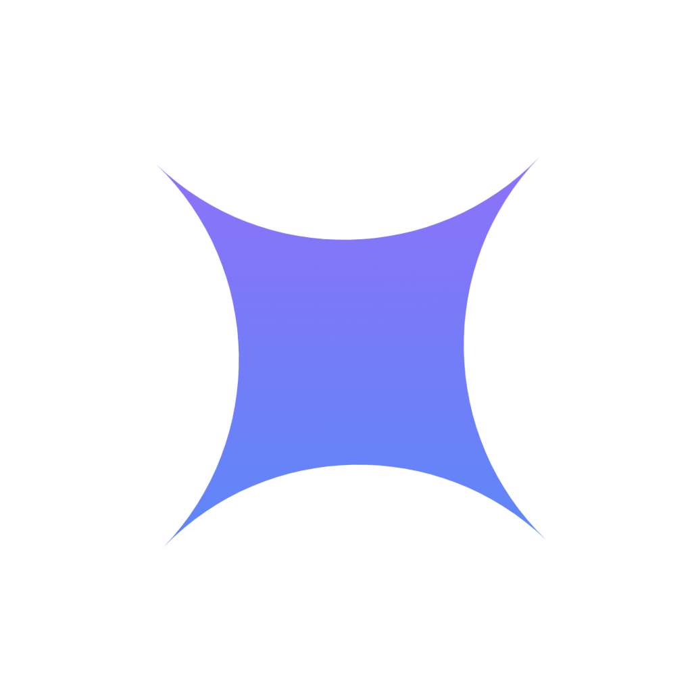

<div align="center">
  
  <h1>TopDown CS</h1>
  <p><strong>Curated, interview-ready Computer Science fundamentals and practical problems for Software Development Engineer (SDE) interviews.</strong></p>

  <p>
    <a href="https://topdowncs.com"><strong>Explore the Live Site at topdowncs.com »</strong></a>
  </p>

  <p>
    <a href="https://topdowncs.com"></a>
    
    
    
  </p>
</div>

---

## 📌 About TopDown CS

**TopDown CS** is an open-source technical interview question bank covering core computer science subjects tested in software engineering interviews.

Questions are generally structured around three layers:

$$\text{Intuitive Mental Model} \longrightarrow \text{Technical Deep Dive} \longrightarrow \text{Interview-Ready Summary}$$

1. **Intuitive Mental Model:** A clean real-world analogy establishing foundational intuition.
2. **Technical Deep Dive:** Architecture diagrams, memory layouts, bytecode inspection, and edge cases.
3. **Interview-Ready Summary:** A focused summary tailored to what interviewers look for.

---

## 🗺️ DSA Learning Roadmap

Below is the 6-tier progression roadmap implemented on TopDown CS, organizing 15 foundational DSA topics:

<div align="center">
  
</div>

> **Interactive Version:** An interactive version of this roadmap with real-time topic highlights is live on [topdowncs.com](https://topdowncs.com).

---

## 📚 Curriculum & Question Bank

The question bank contains **155+ curated questions** categorized by subject and module type:

### 1. Operating Systems (43 Questions)

| Module | Questions | Breakdown | Topics Covered | Link |
|---|:---:|:---:|---|---|
| **OS Essentials** | **20** | 🟢 9 Easy • 🟡 11 Med | Processes, threads, context switching, CPU scheduling, virtual memory, paging, deadlocks, and IPC. | [View Questions →](https://topdowncs.com/docs/os-essential/1-process-vs-thread) |
| **OS Additional** | **15** | 🟡 8 Med • 🔴 7 Hard | Priority inversion, spinlocks, TLB flushing, kernel vs. user threads, and POSIX signals. | [View Questions →](https://topdowncs.com/docs/os-additional/1-priority-inversion-mars-rover) |
| **OS Problems** | **8** | 🟡 7 Med • 🔴 1 Hard | Step-by-step numerical calculations: CPU scheduling Gantt charts, Banker's algorithm, and Bélády's anomaly. | [View Questions →](https://topdowncs.com/docs/os-problems/1-cpu-scheduling-fcfs-sjf-srtf-round-robin) |

---

### 2. Database Management Systems (33 Questions)

| Module | Questions | Breakdown | Topics Covered | Link |
|---|:---:|:---:|---|---|
| **DBMS Essentials** | **15** | 🟢 7 Easy • 🟡 8 Med | ACID guarantees, WAL protocols, B+ Trees, transaction states, SQL execution order, and indexing. | [View Questions →](https://topdowncs.com/docs/dbms-essential/1-what-is-a-transaction) |
| **DBMS Additional** | **18** | 🟢 1 Easy • 🟡 14 Med • 🔴 3 Hard | BCNF vs. 3NF normalization, OLTP vs. OLAP engines, ER schema translation, and query optimization. | [View Questions →](https://topdowncs.com/docs/dbms-additional/9-bcnf-vs-3nf) |

---

### 3. Computer Networks (26 Questions)

| Module | Questions | Breakdown | Topics Covered | Link |
|---|:---:|:---:|---|---|
| **CN Essentials** | **10** | 🟢 5 Easy • 🟡 4 Med • 🔴 1 Hard | OSI vs. TCP/IP layers, TCP 3-way handshake & termination, flow control, DNS, HTTP/2/3, and proxies. | [View Questions →](https://topdowncs.com/docs/cn-essential/1-osi-model-tcp-ip) |
| **CN Additional** | **6** | 🟢 1 Easy • 🟡 4 Med • 🔴 1 Hard | Cookie sessions vs. JWTs, WebSockets scaling, CORS preflight requests, and the TLS 1.3 handshake. | [View Questions →](https://topdowncs.com/docs/cn-additional/1-sessions-vs-jwt) |
| **CN Problems** | **10** | 🟢 1 Easy • 🟡 6 Med • 🔴 3 Hard | Subnetting, VLSM design, CRC-32 binary polynomial division, Hamming codes, and framing calculations. | [View Questions →](https://topdowncs.com/docs/cn-problems/1-subnetting) |

---

### 4. OOP, Code Tracing & Design Patterns (53 Questions)

| Module | Questions | Breakdown | Topics Covered | Link |
|---|:---:|:---:|---|---|
| **OOP Essentials** | **22** | 🟢 7 Easy • 🟡 11 Med • 🔴 4 Hard | Core pillars, SOLID principles, HashMap collision handling, memory models, and immutability. | [View Questions →](https://topdowncs.com/docs/oop-essential/1-four-pillars-of-oop) |
| **OOP Additional** | **17** | 🟢 3 Easy • 🟡 11 Med • 🔴 3 Hard | Static vs. dynamic binding, bytecode method hiding, covariant return types, Java generics, and reflection. | [View Questions →](https://topdowncs.com/docs/oop-additional/19-static-binding-vs-dynamic-binding) |
| **Code Tracing** | **8** | 🟡 4 Med • 🔴 4 Hard | Step-by-step JVM and Python execution traces: class loading order, MRO linearization, and attribute shadowing. | [View Questions →](https://topdowncs.com/docs/code-tracing/1-code-trace-static-instance-constructor) |
| **Design Patterns** | **6** | 🟡 5 Med • 🔴 1 Hard | Idiomatic implementations of Singleton, Factory, Strategy, Builder, Decorator, and Observer patterns. | [View Questions →](https://topdowncs.com/docs/design-patterns/1-singleton-pattern) |

---

### 5. Database Design (8 Questions)

| Module | Questions | Breakdown | Topics Covered | Link |
|---|:---:|:---:|---|---|
| **Database Design** | **8** | 🟡 8 Med | High-scale schema & transactional design: Digital Wallets, Splitwise, Swiggy/Zomato, Uber/Ola, Zerodha, and Amazon. | [Explore Questions →](site/docs/database-design/1-wallet-payment-system.md) |

---

## 🛠️ Local Development

TopDown CS is built with [Docusaurus 3](https://docusaurus.io/), React, and KaTeX.

```bash
# 1. Clone the repository
git clone https://github.com/jaicharan-dev/topdown-cs.git
cd topdown-cs/site

# 2. Install dependencies
npm install

# 3. Start local development server
npm start
```

To run a production build locally:
```bash
npm run build
npm run serve
```

---

## 🤝 Contributing

Contributions are welcome! If you would like to help expand TopDown CS:

1. **Report Errata:** Found a technical inaccuracy, typo, or outdated explanation? Please [open an issue](https://github.com/jaicharan-dev/topdown-cs/issues).
2. **Suggest Questions:** Have a question that frequently appears in technical interviews? Open an issue with the proposed question and outline.
3. **Submit Improvements:** Fork the repository, create a branch (`git checkout -b feature/topic-improvement`), and submit a Pull Request following the project's question format.
