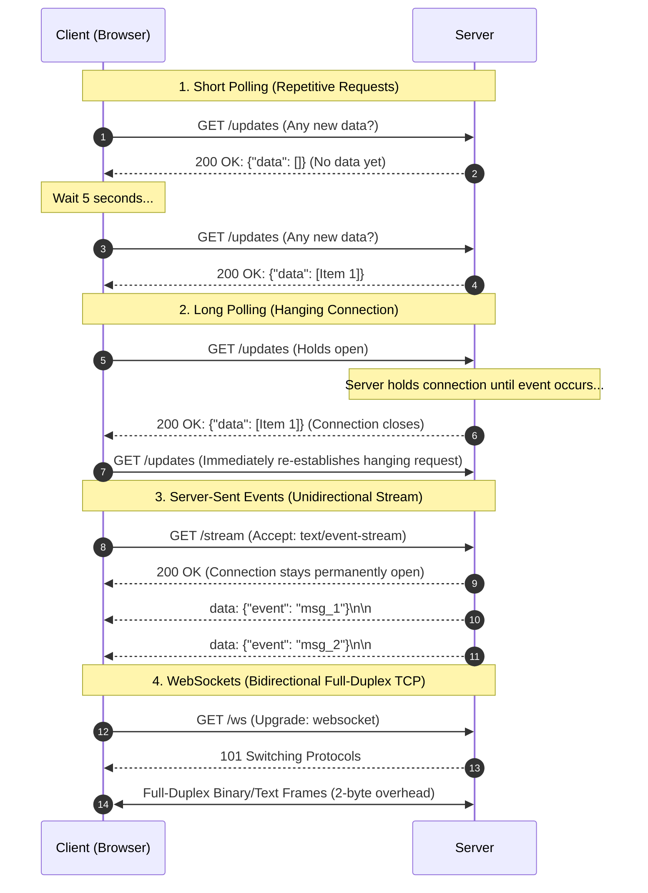
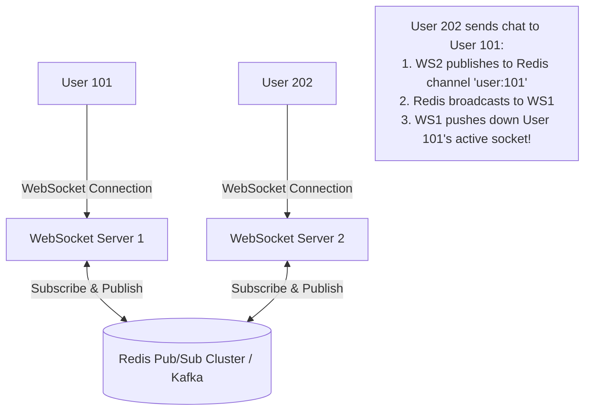

<span className="badge badge--warning margin-bottom--md">Medium</span>

> **Interview Question:** "Compare Short Polling, Long Polling, Server-Sent Events (SSE), and WebSockets. What network and memory overhead does each carry, and what architectural tradeoff do you accept when scaling WebSockets across a multi-server cluster?"

Real-time web applications, such as financial market order books, collaborative text editors, live location trackers, and AI chat streams, require transmitting updates from server to client with millisecond latency.

Because standard HTTP was designed as a client-initiated, request-response protocol, engineering teams choose between four progressive real-time paradigms: **Short Polling**, **Long Polling**, **Server-Sent Events (SSE)**, and **WebSockets**.

---

### Conceptual Architecture Overview



---

### Deep Dive: The Four Real-Time Mechanisms

#### 1. Short Polling (The Impatient Child)
The client issues regular HTTP requests at fixed intervals (e.g., every 3 to 5 seconds):
- **Overhead:** Massive network and CPU waste. 95%+ of polling requests return empty responses, yet each request incurs full TCP handshakes, TLS records, and 500–1,000 bytes of redundant HTTP request/response headers.
- **Latency:** Average latency is $\frac{\text{Interval}}{2}$. High-frequency events suffer delayed delivery.

#### 2. Long Polling (Comet)
The client sends an HTTP request, but the server **delays its response**, holding the HTTP connection open until new data is published or an internal timeout (e.g., 30 seconds) expires:
- Once data arrives, the server returns the HTTP response and closes the connection.
- The client immediately issues a new request to wait for subsequent events.
- **Overhead:** High server memory consumption. Thousands of idle, hanging HTTP connections occupy thread pools and file descriptors. Frequent reconnection overhead after every dispatched event.

#### 3. Server-Sent Events (SSE)
Standardized in HTML5 (RFC 8895), SSE establishes a persistent, unidirectional stream from server to client over standard HTTP:
- **Transport:** Standard HTTP/1.1 or HTTP/2 using the MIME type `text/event-stream`.
- **Browser Native:** Supported out-of-the-box via the `EventSource` JavaScript API.
- **Built-in Resilience:** Automatic client reconnection with state tracking (`Last-Event-ID` header allows catching up on missed messages).
- **HTTP/2 Advantage:** Multiplexes multiple streams over a single TCP connection without head-of-line blocking.
- **Limitation:** Strictly **unidirectional** (Server $\to$ Client only). The client cannot send upstream data on the same stream; it must send separate HTTP POST requests.
- **Ideal Use Cases:** Real-time dashboards, stock tickers, and streaming LLM responses (e.g., ChatGPT token output).

#### 4. WebSockets (RFC 6455)
WebSockets bypass HTTP entirely after an initial handshake, establishing a persistent, **bidirectional, full-duplex TCP socket connection**:
- **The Upgrade Handshake:**
  ```http
  GET /chat HTTP/1.1
  Host: server.example.com
  Upgrade: websocket
  Connection: Upgrade
  Sec-WebSocket-Key: dGhlIHNhbXBsZSBub25jZQ==
  Sec-WebSocket-Version: 13
  ```
  The server responds with `HTTP/1.1 101 Switching Protocols` containing `Sec-WebSocket-Accept: <SHA1_hash>`.
- **Framing Overhead:** Once upgraded, HTTP headers are discarded. Data is exchanged in lightweight binary frames with only **2 to 10 bytes of framing overhead** per message!
- **Ideal Use Cases:** Multiplayer gaming, real-time audio/chat, high-frequency trading platforms, and collaborative whiteboards (e.g., Figma).

---

### Comparative Evaluation Matrix

| Dimension | Short Polling | Long Polling | Server-Sent Events (SSE) | WebSockets |
| :--- | :--- | :--- | :--- | :--- |
| **Protocol** | Standard HTTP | Standard HTTP | HTTP/1.1 or HTTP/2 | WebSocket protocol (`ws://`, `wss://`) |
| **Directionality** | Client pull | Client pull (delayed) | **Unidirectional** (Server $\to$ Client) | **Full-Duplex** (Bidirectional) |
| **Framing Overhead** | Massive ($\sim 1\text{ KB}$ HTTP headers) | Massive per event ($\sim 1\text{ KB}$) | Minimal (plain text `data: ...\n\n`) | **Lowest** (2 to 10 bytes per frame) |
| **Connection State** | Ephemeral | Semi-persistent (reconnects) | Persistent HTTP stream | Persistent raw TCP socket |
| **Auto-Reconnection** | Manual app logic | Manual app logic | **Built-in** (`Last-Event-ID`) | Manual app logic / library |
| **Firewall / Proxy** | Traverses 100% | Traverses 100% | Traverses 100% (Standard HTTP) | Can be blocked by strict enterprise proxies |

---

### The Architectural Tradeoff at Scale: The Statefulness Bottleneck

A critical staff-level interview topic: **Why is scaling WebSockets vastly harder than scaling HTTP?**

#### 1. Stateless HTTP Scaling:
Standard HTTP APIs are completely **stateless**. A reverse proxy load balancer (like NGINX or AWS ALB) can route request 1 to Server A, request 2 to Server B, and request 3 to Server C. If traffic surges, you spin up 10 new servers with zero coordination.

#### 2. Stateful WebSocket Bottleneck:
When User 101 connects via WebSocket, they establish a persistent TCP socket anchored in the **RAM and file descriptor table of one specific physical server** (Server A):
- If User 202 connects to Server B, and User 202 sends a private message to User 101:
- Server B cannot simply deliver the message because it holds **no network connection to User 101**!
- Broadcasting or routing messages across isolated WebSocket servers fails without an inter-server message bus.

#### 3. The Enterprise Multi-Server Architecture: Redis Pub/Sub
To scale WebSockets horizontally across a fleet of backend instances, architectures decouple socket connections from message routing using an intermediate **Message Broker**:



1. Each WebSocket server maintains an in-memory hash table mapping local connected user IDs to active socket descriptors: `connected_users[user_id] = socket`.
2. When a user connects to Server 1, Server 1 subscribes to that user's message channel on a centralized Redis Pub/Sub cluster.
3. When any server in the cluster needs to dispatch a message to User 101, it publishes the payload to Redis.
4. Redis routes the message to the designated server holding the active socket, which pushes the frame down to the client.

---

### Summary

"Short polling wastes bandwidth sending repeated HTTP requests with heavy headers, while long polling reduces latency by holding connections open until updates occur. Server-Sent Events (SSE) provide lightweight, unidirectional streaming over standard HTTP with built-in auto-reconnection, making it ideal for dashboards and LLM token generation. WebSockets deliver bidirectional, full-duplex communication with minimal 2-byte framing overhead. However, WebSockets are stateful, requiring sticky routing and an inter-server message broker like Redis Pub/Sub to scale horizontally across multi-node clusters."

---

### Python Verification: Polling vs. WebSocket Frame Broadcast Simulation

The following executable Python script simulates the bandwidth and latency characteristics of Short Polling versus a full-duplex WebSocket broadcast over simulated network traffic:

```python
"""
Real-Time Communication Simulator: Polling vs WebSockets
Demonstrates:
  1. Header overhead accumulation in Short Polling
  2. Frame efficiency in WebSockets (2-byte framing)
  3. Decoupled multi-server broadcasting via simulated Pub/Sub broker
"""

import time
from typing import List, Dict

class PollingSimulator:
    def __init__(self, poll_interval_ms: int = 1000):
        self.poll_interval_ms = poll_interval_ms
        self.bytes_transferred = 0
        self.requests_sent = 0

    def poll(self, new_data_available: bool) -> int:
        self.requests_sent += 1
        # HTTP GET Request Headers ~ 450 bytes
        req_bytes = 450
        # HTTP Response Headers ~ 300 bytes + Body
        resp_bytes = 300 + (120 if new_data_available else 2) # Empty JSON "{}" is 2 bytes
        total_cycle = req_bytes + resp_bytes
        self.bytes_transferred += total_cycle
        return total_cycle


class WebSocketSimulator:
    def __init__(self):
        self.handshake_bytes = 650  # Initial 101 Upgrade Handshake
        self.bytes_transferred = self.handshake_bytes
        self.frames_sent = 0

    def send_message(self, payload_bytes: int):
        self.frames_sent += 1
        # WebSocket Frame Header: 2 bytes for payload <= 125 bytes
        frame_overhead = 2
        total_msg = frame_overhead + payload_bytes
        self.bytes_transferred += total_msg
        return total_msg


def main():
    print("=== Real-Time Protocol Simulation: Polling vs WebSockets ===\n")
    SIMULATION_DURATION_SEC = 60
    POLL_INTERVAL_SEC = 2  # Poll every 2 seconds -> 30 requests

    # Scenario: 3 events occurred during the 60-second window
    event_timestamps = {12, 28, 46}

    # 1. Run Short Polling
    poller = PollingSimulator()
    for second in range(0, SIMULATION_DURATION_SEC, POLL_INTERVAL_SEC):
        has_data = second in event_timestamps
        poller.poll(new_data_available=has_data)

    print(f"--- 1. Short Polling ({SIMULATION_DURATION_SEC}s window, poll every 2s) ---")
    print(f"  Total Requests:     {poller.requests_sent}")
    print(f"  Total Bandwidth:    {poller.bytes_transferred:,} bytes (~{poller.bytes_transferred / 1024:.1f} KB)")
    print(f"  Average Waste:      90% of requests carried empty payloads!")

    # 2. Run WebSocket
    ws = WebSocketSimulator()
    MESSAGE_PAYLOAD_SIZE = 120  # Identical 120-byte event payload
    for _ in event_timestamps:
        ws.send_message(MESSAGE_PAYLOAD_SIZE)

    print(f"\n--- 2. WebSocket ({SIMULATION_DURATION_SEC}s window, 3 events pushed) ---")
    print(f"  Frames Dispatched:  {ws.frames_sent}")
    print(f"  Total Bandwidth:    {ws.bytes_transferred:,} bytes (~{ws.bytes_transferred / 1024:.1f} KB)")
    print(f"  Framing Overhead:   Only 2 bytes per message (vs 750 bytes per HTTP poll)")

    savings = (1 - (ws.bytes_transferred / poller.bytes_transferred)) * 100
    print(f"\nResult: WebSockets reduced total network data volume by {savings:.1f}%!")

if __name__ == "__main__":
    main()
```
