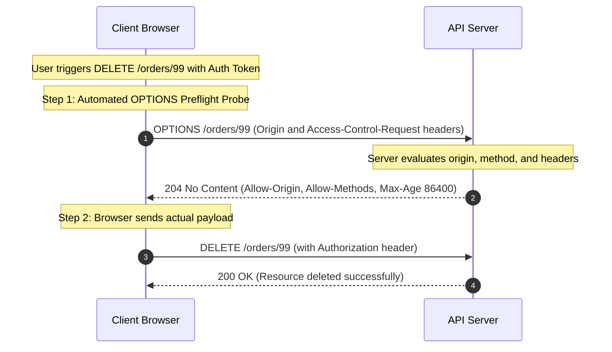

<span className="badge badge--warning margin-bottom--md">Medium</span>

> **Interview Question:** "What is CORS, and why does it exist as a browser security mechanism? Explain what triggers an HTTP `OPTIONS` preflight request, how preflight caching works, and why `Access-Control-Allow-Origin: *` fails when credentials are included."

**Cross-Origin Resource Sharing (CORS)** is a browser-enforced security protocol (W3C / WHATWG standard) that relaxes the restrictive **Same-Origin Policy (SOP)**. 

It defines a standardized mechanism for a server to explicitly declare which foreign origins (domains, schemes, or ports) are authorized to read sensitive resources loaded in a client web browser.

---

### Foundational Concept: What Defines an "Origin"?

Two URLs share the **Same Origin** if and only if their **Scheme**, **Host**, and **Port** are strictly identical:

$$\text{Origin} = \text{Protocol} + \text{Domain/Host} + \text{Port}$$

```
Comparing with Reference: https://example.com:443/app/index.html
├── https://example.com/api/data        -> SAME ORIGIN (Default HTTPS port 443 matches)
├── http://example.com/api/data         -> CROSS ORIGIN (Scheme mismatch: http vs https)
├── https://api.example.com/data        -> CROSS ORIGIN (Subdomain mismatch)
└── https://example.com:8443/data       -> CROSS ORIGIN (Port mismatch: 8443 vs 443)
```

> **The #1 Misconception:** The Same-Origin Policy does **NOT** block browsers from *sending* cross-origin requests. It blocks the browser's JavaScript from **reading the response** unless the server explicitly grants permission via CORS response headers!

---

### The Two Request Classes: Simple vs. Preflighted

Browsers split cross-origin requests into two categories depending on their potential to mutate server state:

```
                            INCOMING BROWSER REQUEST
                                       │
            ┌──────────────────────────┴──────────────────────────┐
            ▼                                                     ▼
   [ SIMPLE REQUEST ]                                   [ PREFLIGHTED REQUEST ]
• Method: GET, HEAD, or POST                         • Method: PUT, DELETE, PATCH
• Content-Type:                                      • Custom Headers: Authorization, X-Api-Key
  - application/x-www-form-urlencoded               • Content-Type: application/json
  - multipart/form-data                              • Request paused; browser dispatches
  - text/plain                                         an HTTP OPTIONS preflight probe first!
• Dispatched immediately to server!
```

#### Why `application/json` Triggers a Preflight:
Historically, HTML `<form>` tags could only submit `application/x-www-form-urlencoded`, `multipart/form-data`, or `text/plain`. 

Because modern REST and GraphQL APIs communicate via `Content-Type: application/json` or attach `Authorization: Bearer <token>` headers, **virtually every modern API request requires a preflight probe**!

---

### The Preflight Request Handshake (HTTP `OPTIONS`)

Before transmitting a potentially destructive request (e.g., `DELETE /users/42`), the browser automatically sends an **HTTP `OPTIONS`** probe asking the server for permission:



---

### Latency Optimization: Preflight Caching (`Access-Control-Max-Age`)

Sending two network roundtrips (`OPTIONS` followed by `POST`/`DELETE`) for every single API interaction would double API latency, adding 100–300 ms of overhead.

To eliminate redundant roundtrips, servers attach the **`Access-Control-Max-Age`** header:
```http
Access-Control-Max-Age: 86400
```
This instructs the browser's internal CORS cache to cache the preflight approval for **86,400 seconds (24 hours)**. Subsequent cross-origin calls to matching routes execute in a single roundtrip!

---

### The Lethal Trap: Wildcards vs. Credentials

A notorious bug in full-stack architecture is handling authenticated cross-origin requests (e.g., sending session cookies or `Authorization` headers with `credentials: 'include'`).

```http
// THE FATAL COMBINATION (REJECTED BY ALL BROWSERS):
Access-Control-Allow-Origin: *
Access-Control-Allow-Credentials: true
```

#### Why Browsers Block Wildcards with Credentials:
If a server returned `*` with credentials allowed, any malicious site on the internet could initiate a background fetch to `api.bank.com`, the browser would attach the user's live banking session cookies, and the malicious site could read their balance!

#### The Required Secure Pattern:
When `Access-Control-Allow-Credentials: true` is enabled, the backend **must dynamically validate the incoming `Origin` header** against a trusted whitelist and echo back the exact origin:

```http
// CORRECT BACKEND CONFIGURATION:
Access-Control-Allow-Origin: https://frontend.com
Access-Control-Allow-Credentials: true
Vary: Origin
```

> **The `Vary: Origin` Header:** Mandatory when dynamically reflecting origins. It instructs intermediate CDNs and caching proxies not to serve cached CORS responses intended for Origin A to Origin B.

---

### Summary

"CORS is a browser security protocol that relaxes the Same-Origin Policy, enabling authorized cross-origin requests. Requests utilizing non-standard methods (PUT, DELETE) or custom headers (Authorization, application/json) trigger an automated HTTP OPTIONS preflight probe to verify permissions before the actual request is dispatched. Preflight overhead is mitigated via Access-Control-Max-Age caching. Crucially, when requests include credentials, using wildcard origins (*) is strictly forbidden by browsers; the server must validate and explicitly reflect the trusted origin."

---

### Python Verification: CORS Preflight & Security Validation Server

The following executable Python script implements an HTTP server handling CORS preflight `OPTIONS` requests, validating origins, demonstrating preflight caching, and illustrating credential security constraints:

```python
"""
CORS Preflight & Security Validation Server
Demonstrates:
  1. Automated handling of HTTP OPTIONS preflight requests
  2. Verification of Origin, Methods, and Allowed Headers
  3. Preflight caching via Access-Control-Max-Age
  4. Proper credential handling without illegal wildcard origins
"""

from typing import Dict, Tuple

class CORSService:
    def __init__(self, allowed_origins: list):
        self.allowed_origins = set(allowed_origins)

    def handle_request(self, method: str, headers: Dict[str, str]) -> Tuple[int, Dict[str, str], str]:
        origin = headers.get("Origin")

        # 1. Reject unapproved origins
        if origin not in self.allowed_origins:
            return 403, {}, "CORS Policy Violation: Origin unauthorized"

        # 2. Handle HTTP OPTIONS Preflight Probe
        if method == "OPTIONS":
            req_method = headers.get("Access-Control-Request-Method", "")
            req_headers = headers.get("Access-Control-Request-Headers", "")

            response_headers = {
                "Access-Control-Allow-Origin": origin,  # Explicit origin (NOT wildcard *)
                "Access-Control-Allow-Credentials": "true",
                "Access-Control-Allow-Methods": "GET, POST, PUT, DELETE, OPTIONS",
                "Access-Control-Allow-Headers": "Authorization, Content-Type",
                "Access-Control-Max-Age": "86400",       # Cache preflight for 24 hours
                "Vary": "Origin"                         # Prevent CDN cache poisoning
            }
            return 204, response_headers, ""

        # 3. Handle Actual Request (e.g., DELETE /api/resource)
        response_headers = {
            "Access-Control-Allow-Origin": origin,
            "Access-Control-Allow-Credentials": "true",
            "Content-Type": "application/json"
        }
        return 200, response_headers, '{"status": "success", "message": "Resource mutated"}'


def main():
    print("=== CORS Preflight & Security Verification ===\n")
    service = CORSService(allowed_origins=["https://dashboard.example.com"])

    # Test Case 1: Preflight OPTIONS Request from Authorized Origin
    print("--- 1. Handling Preflight OPTIONS Request ---")
    preflight_headers = {
        "Origin": "https://dashboard.example.com",
        "Access-Control-Request-Method": "DELETE",
        "Access-Control-Request-Headers": "authorization, content-type"
    }
    status, res_headers, _ = service.handle_request("OPTIONS", preflight_headers)
    print(f"Response Status: {status} (Expected 204 No Content)")
    for k, v in res_headers.items():
        print(f"  {k}: {v}")

    # Test Case 2: Actual DELETE Request following preflight
    print("\n--- 2. Handling Actual DELETE Request ---")
    actual_headers = {
        "Origin": "https://dashboard.example.com",
        "Authorization": "Bearer secret_token_123"
    }
    status, res_headers, body = service.handle_request("DELETE", actual_headers)
    print(f"Response Status: {status} OK")
    print(f"Body: {body}")

    # Test Case 3: Malicious Origin Blocked
    print("\n--- 3. Handling Request from Malicious Origin ---")
    bad_headers = {"Origin": "https://evil-hacker.com"}
    status, _, body = service.handle_request("POST", bad_headers)
    print(f"Response Status: {status} Forbidden | {body}")

if __name__ == "__main__":
    main()
```
