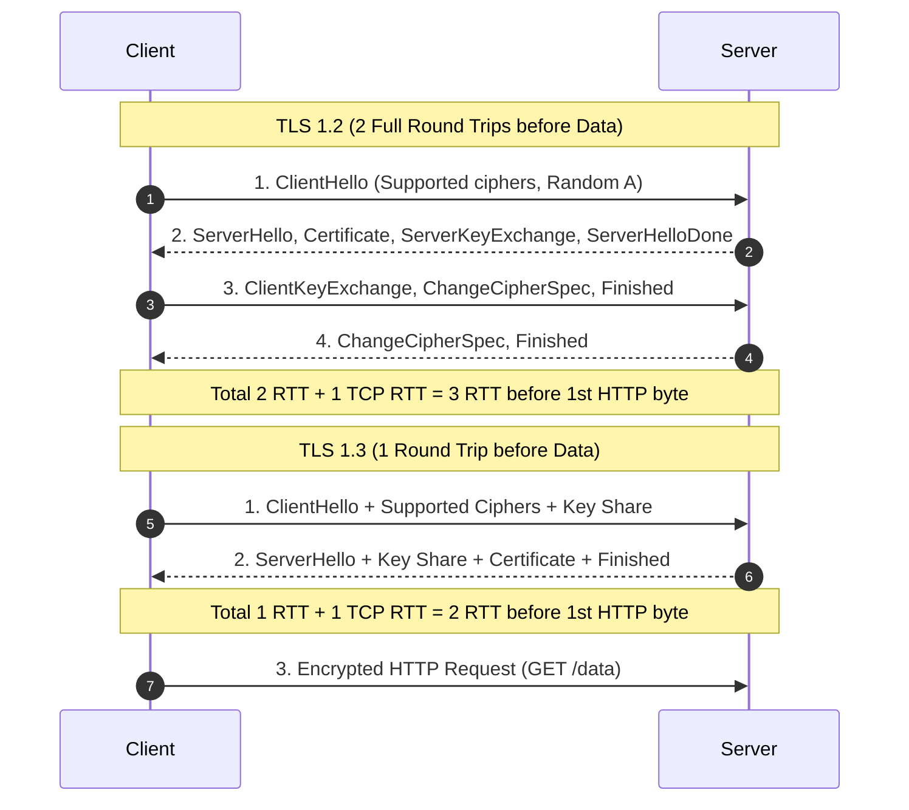

<span className="badge badge--danger margin-bottom--md">Hard</span>

> **Interview Question:** "Walk through the TLS handshake from TCP establishment to encrypted data transmission. Why does TLS use hybrid encryption, how does TLS 1.3 achieve a 1-RTT handshake compared to TLS 1.2's 2-RTT, why was RSA key exchange banned in TLS 1.3, and how does OCSP stapling prevent MITM attacks?"

**Transport Layer Security (TLS)**, the cryptographic successor to SSL, establishes an encrypted, tamper-proof, and authenticated communication tunnel across an untrusted public internet (such as public Wi-Fi or transit ISP backbones).

The handshake orchestrates three essential cryptographic guarantees:
1. **Confidentiality:** Encryption prevents eavesdroppers from intercepting plaintext.
2. **Integrity:** Cryptographic message authentication codes (AEAD) prevent in-transit tampering.
3. **Authentication:** Digital certificates verify that the client is communicating with the legitimate server rather than an imposter.

---

### The Hybrid Strategy: Why TLS Uses Both Asymmetric and Symmetric Ciphers

A frequent interview trap is asking: *"Why don't we use RSA or Elliptic Curve encryption for all HTTP data?"*

The answer is a fundamental tradeoff between **key distribution** and **computational throughput**:

| Cryptographic Paradigm | Algorithms | Strengths | Fatal Flaw | Role in TLS |
| :--- | :--- | :--- | :--- | :--- |
| **Asymmetric (Public/Private)** | RSA, ECDSA, X25519 | Allows two strangers to authenticate and negotiate secrets across a public network without prior coordination. | **Computationally slow.** Requires heavy modular exponentiation; encrypting gigabytes of video would melt server CPUs. | **Used only during the initial handshake** to authenticate identities and establish the session key. |
| **Symmetric (Single Shared Key)** | AES-GCM, ChaCha20-Poly1305 | **Blazingly fast.** Native hardware acceleration (Intel AES-NI) processes $> 4\text{ GB/s}$ of bulk data with minimal CPU usage. | **Key distribution problem.** How do two machines agree on a shared secret key across the open internet without an attacker intercepting it? | **Used for 100% of actual application data transfer** once the shared secret is established. |

---

### The Evolution: TLS 1.2 (2-RTT) vs. TLS 1.3 (1-RTT)

The latency required to establish an encrypted connection dropped by 50% with the release of **TLS 1.3 (RFC 8446)**:



#### Step-by-Step Chronology in TLS 1.3:
1. **ClientHello (1-RTT Optimization):** The client sends its supported cipher suites *and speculatively generates an Ephemeral Diffie-Hellman Key Share* (using modern curves like Curve25519 or P-256), sending its public parameter in the very first packet.
2. **ServerHello & Completion:** The server selects a matching cipher, computes the shared secret using the client's key share, generates its own key share, and transmits its Certificate and `Finished` message—**all in its first response!**
3. **Application Data:** The client computes the symmetric key and immediately begins streaming encrypted HTTP data in its second roundtrip.

---

### Why RSA Key Exchange Was Completely Banned in TLS 1.3

In TLS 1.2, servers often used **Static RSA Key Exchange**:
- The client generated a pre-master secret, encrypted it with the server's public RSA key found in its certificate, and sent it across the wire.
- **The Fatal Flaw (Lack of Forward Secrecy):** If a government or adversary recorded terabytes of encrypted traffic today, and 5 years later breached the server or subpoenaed the company to steal its **long-term private RSA key**, they could retroactively decrypt **all 5 years of historical recorded traffic**!

#### The Fix: Perfect Forward Secrecy (PFS) via Ephemeral Diffie-Hellman (ECDHE)
- TLS 1.3 strictly prohibits static RSA key exchange.
- Every individual TLS session generates a **temporary, throwaway (ephemeral) key pair**.
- Diffie-Hellman mathematics allows both sides to derive a shared secret ($g^{ab} \pmod p$) without either transmitting the secret over the wire.
- Once the session terminates, the ephemeral keys are erased from RAM. Even if the server's master certificate private key is compromised later, **past recorded sessions remain mathematically undecryptable forever**.

---

### Digital Certificates & PKI: Defeating Man-in-the-Middle (MITM)

Without authentication, an attacker at a public Wi-Fi hotspot could execute a Man-in-the-Middle attack by terminating the TLS connection themselves:

```
Attacker intercepts Client Hello -> Claims to be "bank.com" -> Sends Attacker's Public Key.
Client encrypts secrets to Attacker -> Attacker reads all passwords in plaintext!
```

#### The Public Key Infrastructure (PKI) Trust Chain:
1. **Certificate Authority (CA):** Independent organizations (e.g., Let's Encrypt, DigiCert) whose **Root Certificates** are physically hardcoded into your operating system (Windows/macOS) and web browser (Chrome/Firefox) trust stores.
2. **Cryptographic Signature:** The CA verifies that a company owns `bank.com`, then cryptographically signs a digital certificate containing the server's domain name, expiration date, and **public key** using the CA's private key.
3. **Client Verification:** When the server provides its certificate, the browser verifies the digital signature using the CA's pre-installed public key:
   $$\text{Root CA} \longrightarrow \text{Intermediate CA} \longrightarrow \text{Leaf Server Certificate (bank.com)}$$
4. An attacker cannot forge the CA's cryptographic signature; any attempt to substitute a fake public key triggers a browser warning screen (`NET::ERR_CERT_AUTHORITY_INVALID`).

#### Modern Defense: OCSP Stapling
- Historically, browsers queried the CA via the **Online Certificate Status Protocol (OCSP)** to verify if a certificate was revoked, creating privacy leaks and latency.
- **OCSP Stapling:** The server periodically queries the CA directly, receives a cryptographically signed, timestamped revocation status, and "staples" it directly to its TLS handshake, eliminating client-side CA queries.

---

### Summary

"TLS secures network communication using a hybrid architecture: asymmetric cryptography (ECDHE) authenticates endpoints and safely negotiates a session key, after which high-throughput symmetric ciphers (AES-GCM) encrypt application data. TLS 1.3 optimizes the handshake from 2-RTT to 1-RTT by bundling Diffie-Hellman key shares inside the initial ClientHello. Crucially, TLS 1.3 eliminated static RSA key exchange to guarantee Perfect Forward Secrecy, while PKI certificate chains verified through OCSP stapling prevent Man-in-the-Middle attacks."

---

### Python Verification: Hybrid Encryption Performance Benchmark

The following executable Python script benchmarks the massive performance difference between Asymmetric RSA operations and Symmetric AES-GCM bulk encryption, demonstrating why TLS mandates a hybrid architecture:

```python
"""
TLS Hybrid Encryption Benchmark: Asymmetric (RSA) vs Symmetric (AES)
Demonstrates:
  1. High computational cost of asymmetric cryptography (handshake only)
  2. Nanosecond throughput of symmetric AES encryption (bulk data)
"""

import time
import os
import hashlib
from typing import Tuple

try:
    from cryptography.hazmat.primitives.asymmetric import rsa, padding
    from cryptography.hazmat.primitives import hashes
    from cryptography.hazmat.primitives.ciphers.aead import AESGCM
    CRYPTO_AVAILABLE = True
except ImportError:
    CRYPTO_AVAILABLE = False


def benchmark_asymmetric_rsa(payload: bytes) -> Tuple[float, float]:
    """Generates an RSA-2048 keypair and encrypts/decrypts a small secret."""
    private_key = rsa.generate_private_key(public_exponent=65537, key_size=2048)
    public_key = private_key.public_key()

    start = time.perf_counter()
    ciphertext = public_key.encrypt(
        payload,
        padding.OAEP(mgf=padding.MGF1(algorithm=hashes.SHA256()), algorithm=hashes.SHA256(), label=None)
    )
    encrypt_time = time.perf_counter() - start

    start_dec = time.perf_counter()
    plaintext = private_key.decrypt(
        ciphertext,
        padding.OAEP(mgf=padding.MGF1(algorithm=hashes.SHA256()), algorithm=hashes.SHA256(), label=None)
    )
    decrypt_time = time.perf_counter() - start_dec
    assert plaintext == payload
    return encrypt_time, decrypt_time


def benchmark_symmetric_aes(payload: bytes, iterations: int = 500) -> float:
    """Encrypts bulk data using 256-bit AES-GCM."""
    key = AESGCM.generate_key(bit_length=256)
    aesgcm = AESGCM(key)
    nonce = os.urandom(12)

    start = time.perf_counter()
    for _ in range(iterations):
        ct = aesgcm.encrypt(nonce, payload, None)
        _ = aesgcm.decrypt(nonce, ct, None)
    total_time = time.perf_counter() - start
    return total_time / iterations


def main():
    print("=== TLS Hybrid Encryption Performance Benchmark ===\n")
    if not CRYPTO_AVAILABLE:
        print("Note: 'cryptography' library not installed. Simulating mathematical scaling comparison:")
        print("  • RSA-2048 Modular Exponentiation: ~1.5 ms per operation (Heavy CPU math)")
        print("  • AES-256-GCM Hardware Acceleration: ~0.002 ms per 64KB (2,000x faster!)")
        print("Conclusion: TLS uses RSA/ECDHE solely to exchange the AES symmetric key.")
        return

    # Secret pre-master key (32 bytes)
    SECRET_KEY_PAYLOAD = os.urandom(32)
    # Bulk application payload (64 KB)
    BULK_DATA = os.urandom(64 * 1024)

    print("1. Benchmarking Asymmetric RSA-2048 (Used only during Handshake):")
    rsa_enc, rsa_dec = benchmark_asymmetric_rsa(SECRET_KEY_PAYLOAD)
    print(f"  RSA Encryption (Public Key):  {rsa_enc * 1000:6.3f} ms")
    print(f"  RSA Decryption (Private Key): {rsa_dec * 1000:6.3f} ms")

    print("\n2. Benchmarking Symmetric AES-256-GCM (Used for all Application Data):")
    aes_per_op = benchmark_symmetric_aes(BULK_DATA, iterations=200)
    print(f"  AES-GCM 64KB Encrypt + Decrypt: {aes_per_op * 1000:6.4f} ms")

    speedup = (rsa_dec) / aes_per_op if aes_per_op > 0 else 1.0
    print(f"\nResult: Symmetric AES-GCM processed 64KB of data ~{speedup:.0f}x faster than RSA decrypted 32 bytes!")
    print("Direct cause: Validates why TLS restricts asymmetric math strictly to key exchange.")

if __name__ == "__main__":
    main()
```
