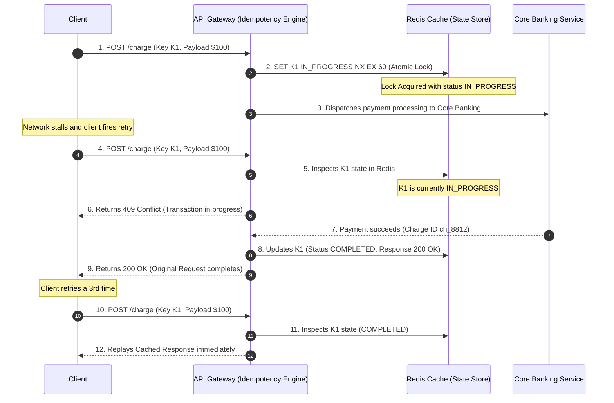

<span className="badge badge--warning margin-bottom--md">Medium</span>

> **Interview Question:** "What is API idempotency, and why is it critical for financial transactions? How do production idempotency keys handle concurrent in-flight retries, and what must the server do if a client reuses an idempotency key with a mutated payload?"

In API design and distributed systems, an operation is **Idempotent** if making multiple identical requests has the exact same side-effect on the system's persistent state as making a single request:

$$f(f(x)) = f(x)$$

While read operations are naturally idempotent, write mutations (such as processing credit card charges, booking flights, or transferring money) are non-idempotent by default. 

Because computer networks are inherently unreliable (experiencing packet drops, connection resets, and client timeouts), APIs must enforce **application-level idempotency** to prevent catastrophic duplicate transactions upon automatic network retries.

---

### The Two-Generals Network Failure Window

When a client submits an HTTP request to an API, execution spans three distinct phases:

```
[ Phase 1: Client to Server ] ──> [ Phase 2: Server Execution ] ──> [ Phase 3: Server to Client ]
    Request traverses web            Database mutates state;             Response returns 200 OK
                                     Payment charged!                    (NETWORK PACKET DROPPED!)
```

#### The Dilemma:
1. In Phase 2, the server executes the mutation: \$100 is deducted from the customer's bank account.
2. In Phase 3, the client's network connection resets, or the API gateway times out at 30 seconds.
3. The client's SDK receives a network timeout error (`ECONNRESET`). **The client has no idea whether the payment succeeded or failed.**
4. Standard retry policies (e.g., in payment SDKs or message queues) automatically retry the request.
5. If the endpoint is not idempotent, the server executes Phase 2 a second time, **double-charging the customer**.

---

### HTTP Verbs: RFC 9110 Idempotency Specifications

| HTTP Method | Idempotent by Specification? | Safe? (Read-Only) | Systems Nuance |
| :--- | :--- | :--- | :--- |
| **`GET` / `HEAD`** | **Yes** | **Yes** | Multiple reads do not alter server data state. |
| **`PUT`** | **Yes** | No | Replaces the entire resource state. Executing `PUT /users/42` with `{ "name": "Alice" }` ten times leaves the record identical. |
| **`DELETE`** | **Yes** | No | Deleting a resource ten times results in the resource being deleted. (The 1st call returns `200/204`, subsequent calls return `404`, but the persistent state is identical). |
| **`POST`** | **NO** | No | Non-idempotent by default. Typically appends a new child record (e.g., creating a new invoice or charge). |
| **`PATCH`** | **NO** | No | Non-idempotent by default (e.g., `PATCH /counter` with `{ "$increment": 1 }` mutates state on every execution). |

---

### The Solution: The Idempotency Key Architecture

To make `POST` and `PATCH` requests safely retryable, APIs (pioneered by Stripe and Adyen) implement **Idempotency Keys**:
- The client generates a unique token (typically a Version 4 UUID) and passes it in an HTTP header:
  ```http
  POST /v1/charges HTTP/1.1
  Host: api.stripe.com
  Idempotency-Key: 9b1deb4d-3b7d-4bad-9bdd-2b0d7b3dcb6d
  Content-Type: application/json

  { "amount": 1000, "currency": "usd" }
  ```

---

### The Idempotency Key State Machine & Concurrency Hazards

A common interview trap is assuming the server just checks if a key exists in Redis and returns the cached result. 

**What happens if a network glitch causes the client to send Request 2 while Request 1 is STILL PROCESSING in the background?**



#### The Three State Machine Transitions:
1. **`IN_PROGRESS` (Atomic Lease):**
   - The gateway executes an atomic **`SET key "IN_PROGRESS" NX EX 60`** in Redis.
   - If the key already exists and is `IN_PROGRESS`, a concurrent duplicate is executing. The gateway returns **`409 Conflict`** or blocks briefly to await resolution.
2. **`COMPLETED` (Cached Response):**
   - Once the downstream transaction completes, the gateway saves the exact HTTP status code, response headers, and response body in Redis with a 24- to 72-hour TTL.
   - Any future retry with this key **skips all business logic** and immediately replays the cached HTTP response.
3. **`FAILED`:**
   - If an unrecoverable system exception occurs (e.g., database timeout before charging), the key is deleted to allow the client to safely retry.

---

### The Security Guard: The Payload Hash Mismatch Check

What happens if a client (or an attacker) sends the same `Idempotency-Key`, but **changes the request body** (e.g., attempts to pay \$5,000 instead of \$10)?

```http
// Request 1:
Idempotency-Key: 9b1deb4d...
{ "amount": 1000 }

// Request 2 (Tampered / Buggy Retry):
Idempotency-Key: 9b1deb4d...
{ "amount": 500000 }
```

#### The Defense:
1. When storing the idempotency record, the server computes a cryptographic hash of the request parameters:
   $$\text{Payload\_Hash} = \text{SHA-256}(\text{HTTP\_Method} + \text{Path} + \text{Request\_Body})$$
2. On every subsequent request matching that key, the server recomputes the incoming hash and compares it against the stored hash.
3. If the hashes differ, the server **strictly aborts** and returns **`422 Unprocessable Entity`** or **`400 Bad Request`**:
   ```json
   {
     "error": "Idempotency-Key reused with modified parameters or different payload."
   }
   ```

---

### Summary

"API idempotency guarantees that duplicate requests cause no additional persistent mutations. While GET, PUT, and DELETE are idempotent by specification, POST requires client-generated Idempotency Keys. Production servers use an atomic state machine in Redis (IN_PROGRESS with lock lease, transitioning to COMPLETED with cached response replay). Concurrent in-flight retries are blocked with 409 Conflict, and payload hashing prevents accidental or malicious reuse of idempotency keys with altered parameters."

---

### Python Verification: Production-Grade Idempotency Engine Simulation

The following executable Python script implements an atomic Idempotency Gateway with in-progress concurrency locking, payload hash validation, and cached response replay:

```python
"""
API Idempotency Gateway Simulator
Demonstrates:
  1. Safe response caching and replay for identical retries
  2. Prevention of concurrent execution on in-flight requests (409 Conflict)
  3. Rejection of payload tampering / mismatch on reused keys (422 Unprocessable)
"""

import hashlib
import json
import time
from typing import Dict, Any, Tuple

class IdempotencyGateway:
    def __init__(self):
        # Simulated centralized Redis key store:
        # key -> {"status": "IN_PROGRESS" | "COMPLETED", "payload_hash": str, "response": dict}
        self.store: Dict[str, Dict[str, Any]] = {}

    def _hash_request(self, endpoint: str, body: Dict[str, Any]) -> str:
        serialized = f"{endpoint}:{json.dumps(body, sort_keys=True)}"
        return hashlib.sha256(serialized.encode('utf-8')).hexdigest()

    def process_charge(self, idempotency_key: str, endpoint: str, body: Dict[str, Any]) -> Tuple[int, Dict[str, Any]]:
        current_hash = self._hash_request(endpoint, body)

        # Step 1: Check existing idempotency record
        if idempotency_key in self.store:
            record = self.store[idempotency_key]

            # Security Guard: Verify payload hasn't mutated!
            if record["payload_hash"] != current_hash:
                return 422, {"error": "Idempotency key reused with different request payload!"}

            # Concurrency Guard: Is another thread currently processing this?
            if record["status"] == "IN_PROGRESS":
                return 409, {"error": "A concurrent request with this idempotency key is already in progress. Please retry later."}

            # State COMPLETED: Replay cached HTTP response!
            print(f"  [Idempotency Replay] Key '{idempotency_key}' found! Returning cached response.")
            return record["response"]["status"], record["response"]["body"]

        # Step 2: Atomic Lock acquisition (Simulating Redis SETNX key IN_PROGRESS)
        self.store[idempotency_key] = {
            "status": "IN_PROGRESS",
            "payload_hash": current_hash,
            "response": None,
            "created_at": time.time()
        }
        print(f"  [Lock Acquired] Key '{idempotency_key}' set to IN_PROGRESS.")

        # Step 3: Execute core banking business logic (Simulated mutation)
        charge_id = f"ch_{int(time.time() * 1000)}"
        response_body = {
            "charge_id": charge_id,
            "amount": body.get("amount"),
            "currency": body.get("currency"),
            "status": "succeeded"
        }
        status_code = 200

        # Step 4: Transition to COMPLETED and persist response
        self.store[idempotency_key]["status"] = "COMPLETED"
        self.store[idempotency_key]["response"] = {
            "status": status_code,
            "body": response_body
        }
        print(f"  [Execution Complete] Charge {charge_id} processed; response cached.")

        return status_code, response_body


def main():
    print("=== API Idempotency Key Gateway Simulation ===\n")
    gateway = IdempotencyGateway()
    KEY = "req_uuid_9921_alpha"
    ENDPOINT = "/v1/charges"
    PAYLOAD = {"amount": 2500, "currency": "USD", "customer": "cust_101"}

    # 1. First Request: Successfully processed
    print("--- 1. First Request (Fresh Idempotency Key) ---")
    status, body = gateway.process_charge(KEY, ENDPOINT, PAYLOAD)
    print(f"HTTP Status: {status} | Body: {body}\n")

    # 2. Simulated Network Timeout & Client Retry (Identical Payload)
    print("--- 2. Client Retry after Timeout (Identical Payload) ---")
    status_retry, body_retry = gateway.process_charge(KEY, ENDPOINT, PAYLOAD)
    print(f"HTTP Status: {status_retry} | Body: {body_retry}")
    assert body["charge_id"] == body_retry["charge_id"], "Charge ID must match cached result!"
    print("Verification: Zero duplicate charges created; identical response replayed.\n")

    # 3. Malicious / Buggy Request: Reusing same key with altered amount ($99,000)
    print("--- 3. Reusing Key with Modified Payload ($99,000) ---")
    tampered_payload = {"amount": 99000, "currency": "USD", "customer": "cust_101"}
    status_tamper, body_tamper = gateway.process_charge(KEY, ENDPOINT, tampered_payload)
    print(f"HTTP Status: {status_tamper} | Body: {body_tamper}")
    assert status_tamper == 422
    print("Verification: Gateway correctly blocked payload mutation on reused idempotency key!")

if __name__ == "__main__":
    main()
```
