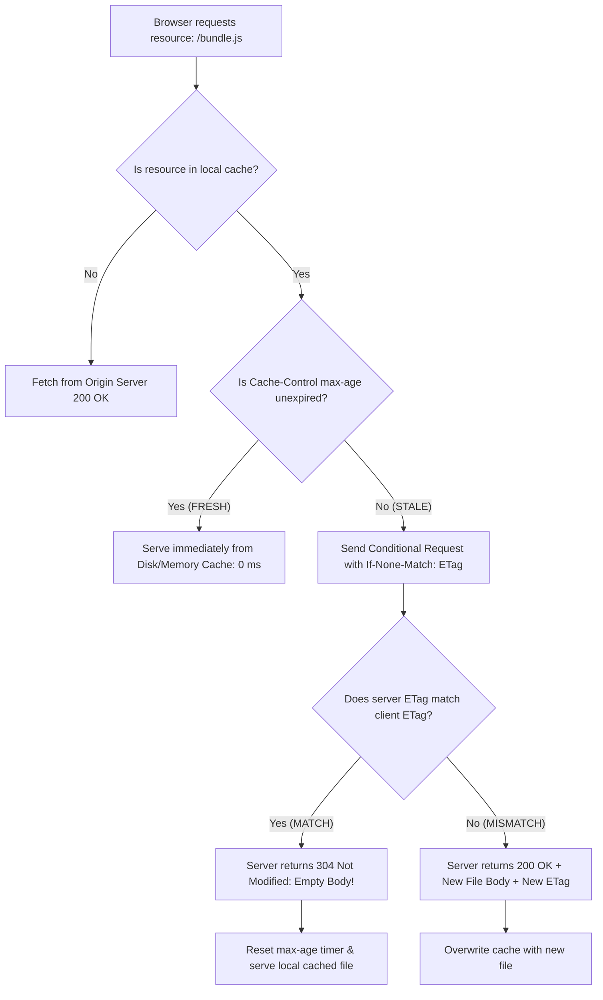

<span className="badge badge--success margin-bottom--md">Easy</span>

> **Interview Question:** "What is HTTP caching, and how do `Cache-Control` directives and ETags work together to eliminate redundant data transfer? What is the critical difference between `no-cache` and `no-store`, and what does an HTTP `304 Not Modified` response signify?"

**HTTP Caching** (RFC 9111) is the foundational performance architecture of the World Wide Web. By storing local copies of HTTP responses across browsers, CDNs, and forward proxies, caching dramatically reduces bandwidth consumption, eliminates server load, and delivers sub-millisecond page loads.

The caching lifecycle is governed by two complementary mechanisms: **Freshness (Time-To-Live)** and **Validation (Conditional Revalidation)**.

---

### The ELI5 Analogy: The Textbook and the Revision Stamp

Imagine a university student (the Browser) studying with a heavy 1,000-page physics textbook (a 10 MB web asset):
- **Freshness (`Cache-Control: max-age=30` days):** The professor (the Server) says: *"This edition is valid for 30 days. For the next month, do not bother checking my syllabus; read straight out of your book."* The student opens the book instantly with **zero walking time** (0 ms network latency).
- **Validation (`ETag: "v4.2-rev8"`):** After 30 days, the book becomes "stale." The student doesn't want to carry a brand new 10-pound book from the bookstore if nothing changed. They send a postcard asking: *"Professor, is edition `v4.2-rev8` still current?"* (`If-None-Match`).
- **`304 Not Modified`:** The professor checks the desk and replies with a tiny 1-line note: *"Yes, no changes made. Reset your timer for another 30 days."* The student saved money, time, and backpack weight.

---

### Freshness vs. Validation: The Caching Pipeline



---

### The #1 Interview Trap: `no-cache` vs. `no-store`

Interviewers frequently probe whether candidates understand this subtle distinction:

| Directive | Does it cache the file? | Behavior on Subsequent Requests | Typical Production Use Case |
| :--- | :--- | :--- | :--- |
| **`no-cache`** | **YES. The file IS saved to disk/RAM.** | The browser **MUST revalidate** with the server via `ETag` or `Last-Modified` before serving it. It cannot be served directly from cache without asking first. | HTML files (`index.html`), API endpoints that change dynamically. |
| **`no-store`** | **NO. Caching is strictly prohibited.** | The browser, proxies, and CDNs **never write the response to disk or memory**. Every request must download the full payload from the origin. | Banking account summaries, personal healthcare records (PII), credit card checkout pages. |

---

### Modern `Cache-Control` Directives Breakdown

A server manages caching policies via the `Cache-Control` response header:

- **`max-age=<seconds>`:** Defines how long the resource is considered fresh. During this window, the browser serves the file locally without contacting the server.
- **`s-maxage=<seconds>`:** Overrides `max-age` exclusively for **Shared Caches** (e.g., Cloudflare, Fastly CDNs), allowing a file to be cached for 1 hour at the edge CDN, but only 5 minutes in client browsers.
- **`public` vs. `private`:**
  - `private`: Only the end-user's browser may cache the response. Intermediate proxies and CDNs are forbidden from storing it.
  - `public`: Any intermediate proxy, ISP cache, or CDN can cache the response for multiple users.
- **`immutable` (The Modern Asset Silver Bullet):**
  - Used with content-hashed assets (e.g., `bundle.a8f2c.js` generated by Webpack/Vite).
  - Tells the browser: *"This file URL will never change its contents as long as it exists."*
  - The browser **never sends a revalidation request**, even when the user clicks the browser "Refresh" button!
- **`must-revalidate`:** Instructs caches that once a resource becomes stale, they must never serve the stale version under any circumstances (even if the server is temporarily offline).

---

### Validating Stale Content: ETags vs. Last-Modified

Once `max-age` expires, the client must revalidate the stale asset.

#### 1. Entity Tags (`ETag` and `If-None-Match`)
An ETag is an opaque identifier (typically a cryptographic hash of the content, like `SHA-256` or an inode/size/mtime tuple) assigned by the server:
- Initial Response: `ETag: "33a64df5"`
- Stale Revalidation Request: `If-None-Match: "33a64df5"`

#### Strong vs. Weak ETags:
- **Strong ETag (`ETag: "xyz123"`):** Guarantees byte-for-byte physical equality.
- **Weak ETag (`ETag: W/"xyz123"`):** Indicates semantic equivalence (e.g., the HTML table content is identical, but whitespace or compression formats differ).

#### 2. Why ETags Replaced `Last-Modified`
- **`Last-Modified` Limitation:** Relies on the `If-Modified-Since` header, which has a coarse **1-second clock resolution**. If a high-frequency system mutates a file multiple times in a single second, `Last-Modified` fails to detect the mutation.
- **Clock Drift:** Distributed server clusters can experience clock skew, causing false modification flags. ETags are based on content hashes and are immune to clock synchronization errors.

---

### The HTTP `304 Not Modified` Response

When a client transmits `If-None-Match: "33a64df5"`, and the file on the server has not changed:
1. The server generates the current file's ETag and observes a match.
2. The server returns:
   ```http
   HTTP/1.1 304 Not Modified
   ETag: "33a64df5"
   Cache-Control: max-age=3600
   ```
3. **The payload body is completely empty (0 bytes).**
4. The client extends the freshness timer of its local copy and renders the file immediately.

---

### Summary

"HTTP caching optimizes web performance through freshness timers and conditional revalidation. While Cache-Control max-age allows local in-memory serving, expired assets are validated using cryptographic ETags via the If-None-Match header. If unchanged, the server returns an empty-body HTTP 304 Not Modified response, instructing the client to renew its local cache. Crucially, no-cache permits caching provided the browser revalidates before use, whereas no-store strictly forbids persisting sensitive data."

---

### Python Verification: HTTP Caching & ETag Revalidation Server

The following executable Python script implements an HTTP caching simulator demonstrating content-based ETag generation, conditional `If-None-Match` validation, and `304 Not Modified` empty-body responses:

```python
"""
HTTP Caching & ETag Revalidation Simulator
Demonstrates:
  1. Content-based Strong and Weak ETag generation
  2. Conditional HTTP requests via If-None-Match
  3. 304 Not Modified empty-body response optimization
"""

import hashlib
from typing import Dict, Any, Tuple

class CachingOriginServer:
    def __init__(self):
        # Simulated backend resource
        self.resource_content = "<html><body><h1>Welcome to CSF Website</h1></body></html>"
        self.max_age = 3600  # 1 hour

    def _compute_etag(self, content: str, weak: bool = False) -> str:
        content_hash = hashlib.md5(content.encode('utf-8')).hexdigest()[:8]
        return f'W/"{content_hash}"' if weak else f'"{content_hash}"'

    def update_content(self, new_content: str):
        self.resource_content = new_content
        print(f"\n[SERVER UPDATE] Resource mutated on disk! New length: {len(new_content)} bytes")

    def handle_get(self, request_headers: Dict[str, str]) -> Tuple[int, Dict[str, str], str]:
        current_etag = self._compute_etag(self.resource_content)
        client_etag = request_headers.get("If-None-Match")

        # Conditional Check: Has the content changed?
        if client_etag == current_etag:
            # 304 Not Modified: ZERO body payload sent across wire!
            response_headers = {
                "ETag": current_etag,
                "Cache-Control": f"public, max-age={self.max_age}",
            }
            return 304, response_headers, ""

        # Content changed or initial fetch: Send full 200 OK with payload
        response_headers = {
            "ETag": current_etag,
            "Cache-Control": f"public, max-age={self.max_age}",
            "Content-Length": str(len(self.resource_content)),
            "Content-Type": "text/html"
        }
        return 200, response_headers, self.resource_content


def main():
    print("=== HTTP Caching, ETags & 304 Not Modified Simulation ===\n")
    server = CachingOriginServer()

    # 1. Initial Request (Cold Client Cache)
    print("--- 1. Initial Fetch (Cold Cache) ---")
    status, headers, body = server.handle_get(request_headers={})
    print(f"Status: {status} OK")
    print(f"ETag:   {headers['ETag']}")
    print(f"Body:   {body[:40]}... (Full {len(body)} bytes downloaded)")

    saved_etag = headers["ETag"]

    # 2. Subsequent Request after max-age expiration (Revalidation)
    print("\n--- 2. Conditional Revalidation (If-None-Match) ---")
    cond_headers = {"If-None-Match": saved_etag}
    status_reval, headers_reval, body_reval = server.handle_get(cond_headers)
    print(f"Status: {status_reval} Not Modified (Zero body transfer!)")
    print(f"Body:   '{body_reval}' (Bytes transferred: {len(body_reval)})")
    print("Result: Client refreshed max-age timer without wasting bandwidth!")

    # 3. Content updates on server
    server.update_content("<html><body><h1>Updated Version 2.0</h1></body></html>")

    # 4. Subsequent Request with old ETag
    print("--- 3. Conditional Request after Content Modification ---")
    status_updated, headers_updated, body_updated = server.handle_get(cond_headers)
    print(f"Status: {status_updated} OK (New payload downloaded)")
    print(f"New ETag: {headers_updated['ETag']}")
    print(f"New Body: {body_updated}")

if __name__ == "__main__":
    main()
```
