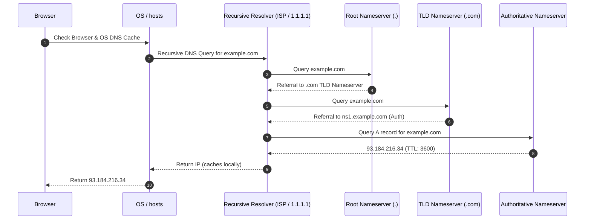
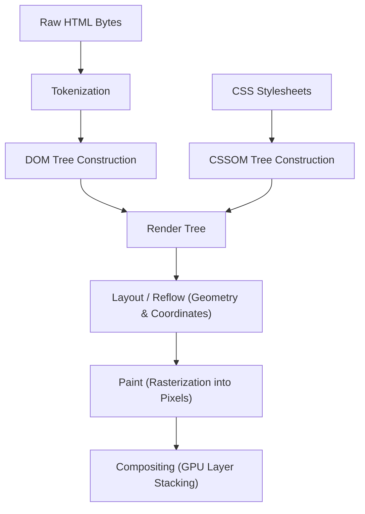

import Tabs from '@theme/Tabs';
import TabItem from '@theme/TabItem';

<span className="badge badge--danger margin-bottom--md">Hard</span>

> **Interview Question:** "Walk through everything that happens from the moment a user types a URL into their browser and hits Enter, to the moment the page is fully rendered. Include DNS resolution, the local ARP lookup, TCP 3-way handshake, TLS 1.3 handshake, HTTP request/response cycle, and the browser's Critical Rendering Path."

---

### Phase 1: Browser Pre-Flight & HSTS

1. **URL Parsing:** The browser breaks the input string into protocol (`https`), hostname (`example.com`), port (`443`), and resource path (`/`).
2. **HSTS Preload Inspection:** The browser checks its internal **HTTP Strict Transport Security (HSTS)** list. If `example.com` is registered, the browser automatically rewrites any cleartext `http://` requests to `https://` before sending a single network packet, defeating SSL-stripping attacks.
3. **Local Cache Inspection:** The browser inspects its in-memory and disk HTTP caches. If the target resource is cached and its `Cache-Control: max-age` is still fresh, the browser skips network calls entirely.

---

### Phase 2: DNS Resolution (Resolving the IP)

To establish a socket, the browser must map the human-readable domain to an IP address:



1. **Cache Hierarchy:** Browser DNS Cache $\to$ OS DNS Cache (`ipconfig /displaydns` or `/etc/hosts`) $\to$ Local Gateway Router DNS Cache.
2. **Recursive Lookup:** If uncached, the query is dispatched to the configured **Recursive Resolver** (ISP, Google `8.8.8.8`, or Cloudflare `1.1.1.1`).
3. **Iterative Traversal:** The resolver performs iterative queries across the global DNS hierarchy:
   - Root Nameserver (`.`) $\to$ TLD Nameserver (`.com`) $\to$ Authoritative Nameserver (`ns1.example.com`).
4. **Resolution Result:** The authoritative server returns the `A` record (`93.184.216.34`) or `AAAA` record for IPv6.

---

### Phase 3: The Missing Step: ARP & Local Gateway Resolution

> **Interview Bar-Raiser:** Most candidates jump directly from DNS to the TCP handshake. However, a computer cannot transmit an IP packet onto a local physical network without knowing the **Layer 2 MAC address** of the next hop!

1. **Subnet Evaluation:** The OS compares the destination IP (`93.184.216.34`) against its own local IP (`192.168.1.50`) and subnet mask (`255.255.255.0`).
2. **Default Gateway Forwarding:** Because the destination is off-subnet, the packet must be sent to the **Default Gateway** (local router, e.g., `192.168.1.1`).
3. **ARP Cache Lookup:** The OS checks its **Address Resolution Protocol (ARP)** cache table (`arp -a`) for the router's hardware MAC address.
4. **ARP Broadcast (If Cache Miss):**
   - The OS broadcasts an ARP Request frame to `FF:FF:FF:FF:FF:FF`: *"Who has 192.168.1.1? Tell 192.168.1.50."*
   - The local router responds with a unicast ARP Reply: *"192.168.1.1 is at `74:83:c2:41:9a:10`."*
5. **Frame Encapsulation:** The OS encapsulates the Layer 3 IP packet inside a Layer 2 Ethernet frame addressed to the router's MAC address and fires it out of the physical NIC/Wi-Fi radio.

---

### Phase 4: Connection Establishment (TCP & TLS 1.3)

#### 1. TCP 3-Way Handshake (1 RTT)
- **`SYN`:** Client chooses random Initial Sequence Number $ISN_C$ and sends `SYN`.
- **`SYN-ACK`:** Server acknowledges ($ISN_C + 1$) and sends its own $ISN_S$.
- **`ACK`:** Client acknowledges ($ISN_S + 1$). The TCP stream is now active.

#### 2. TLS 1.3 Handshake (1 RTT)
- **`ClientHello`:** Client sends supported cipher suites and its **Key Share** (ephemeral Diffie-Hellman public key parameters).
- **`ServerHello` + Certificate + `Finished`:** Server sends its matching key share, X.509 digital certificate, and cryptographic handshake MAC.
- **Key Derivation:** Both sides compute the shared symmetric master key. The secure tunnel is established in **just 1 RTT**.

---

### Phase 5: HTTP Request & Server Processing

1. **HTTP/2 Request:** Over the secure TLS tunnel, the browser sends an HTTP `HEADERS` frame for `GET /` along with cookies and headers.
2. **Edge Ingress:** The packet arrives at the origin's cloud edge:
   - **L4 Load Balancer (AWS NLB):** Forwards TCP packets to healthy ingress nodes.
   - **L7 Reverse Proxy (NGINX / ALB):** Decrypts TLS, verifies authentication, and routes `/` to the upstream web application.
3. **Application & Database Execution:** The web application queries internal caches (Redis) or SQL databases, renders the response, and returns an `HTTP/2 200 OK` response with headers (`Content-Type: text/html`, `ETag`, `Cache-Control`) and the HTML payload.

---

### Phase 6: The Critical Rendering Path (CRP)

Once the first chunk of HTML bytes arrives in the browser engine, the multi-threaded rendering pipeline begins:



#### 1. DOM Construction & Parser-Blocking Scripts
- The engine converts raw bytes to characters, tokens, and nodes to build the **Document Object Model (DOM)**.
- **Parser-Blocking JavaScript:** When the parser encounters `<script src="...">`:
  - It **halts DOM construction immediately**. It must download and execute the script because JavaScript can manipulate the DOM via `document.write` or DOM APIs.
  - **Optimization:** Use `defer` (downloads in background, executes after DOM is fully parsed in document order) or `async` (downloads in background, executes the exact instant download completes, interrupting parsing).

#### 2. CSSOM Construction & Render-Blocking CSS
- The engine parses all external and internal stylesheets into the **CSS Object Model (CSSOM)**.
- **Render-Blocking:** CSS is strictly render-blocking. The browser will **not render any pixels** to the screen until the CSSOM is completely constructed, preventing an unsightly Flash of Unstyled Content (FOUC).

#### 3. Render Tree Creation
- The engine combines the DOM and CSSOM into the **Render Tree**.
- It excludes elements that do not produce visual output (e.g., `<head>`, `<script>`, and any element with `display: none`). Elements with `visibility: hidden` are included because they occupy layout space.

#### 4. Layout (Reflow)
- The browser calculates the exact visual coordinates, width, and height of every node in the render tree relative to the viewport.

#### 5. Paint & Compositing
- **Paint:** The browser converts layout boxes into actual screen pixels (drawing text, colors, borders, and shadows).
- **Compositing:** The GPU arranges independent painted layers (promoted via `transform: translateZ()` or `will-change`) in correct z-order to produce the final screen display.

---

### The Interview Answer (90 seconds)

> "The URL-to-render lifecycle involves six distinct phases:
>
> 1. **Pre-flight:** The browser parses the URL, checks its HSTS preload list to enforce HTTPS, and inspects its local HTTP cache.
> 2. **DNS Resolution:** If uncached, the browser resolves the hostname to an IP through a hierarchy of caches, eventually falling back to a recursive resolver querying the Root, TLD, and Authoritative nameservers.
> 3. **ARP & Gateway Resolution:** Before leaving the local host, the OS determines the destination IP is off-subnet. It queries its local ARP cache (or broadcasts an ARP request) to find the default gateway router's MAC address, encapsulating the IP packet inside a Layer 2 Ethernet frame.
> 4. **TCP & TLS 1.3 Handshake:** The client connects to port 443 via a TCP 3-way handshake (1 RTT), followed immediately by a TLS 1.3 handshake (1 RTT) where ephemeral Diffie-Hellman keys are exchanged and certificates verified.
> 5. **HTTP Request & Ingress:** The browser sends an encrypted HTTP/2 GET request. An L4/L7 load balancer and reverse proxy route it to backend services, returning a 200 OK with the HTML stream.
> 6. **Critical Rendering Path:** The browser tokenizes the HTML to build the DOM. Because CSS is render-blocking, it downloads stylesheets to build the CSSOM. `<script>` tags block the parser unless marked with `defer` or `async`. The browser merges DOM and CSSOM into the Render Tree, computes geometric coordinates during Layout, paints the visual pixels, and composites layers on the GPU."

---

### Code Demonstration: Measuring Network Phase Latencies

The following Python script measures the exact millisecond breakdown of each stage: DNS lookup, TCP socket connect, TLS handshake, and Time-to-First-Byte (TTFB).

```python
import socket
import ssl
import time

def measure_url_breakdown(hostname: str, path: str = "/"):
    print(f"[*] Profiling connection phases for https://{hostname}{path}...")

    # Phase 1: DNS Resolution Time
    t0 = time.perf_counter()
    ip_address = socket.gethostbyname(hostname)
    dns_time = (time.perf_counter() - t0) * 1000

    # Phase 2: TCP Handshake Time (Layer 4)
    raw_socket = socket.socket(socket.AF_INET, socket.SOCK_STREAM)
    raw_socket.settimeout(5.0)
    t1 = time.perf_counter()
    raw_socket.connect((ip_address, 443))
    tcp_time = (time.perf_counter() - t1) * 1000

    # Phase 3: TLS Handshake Time (Layer 5/6)
    context = ssl.create_default_context()
    t2 = time.perf_counter()
    tls_socket = context.wrap_socket(raw_socket, server_hostname=hostname)
    tls_time = (time.perf_counter() - t2) * 1000

    # Phase 4: HTTP Request & Time to First Byte (TTFB)
    http_request = f"GET {path} HTTP/1.1\r\nHost: {hostname}\r\nConnection: close\r\n\r\n"
    t3 = time.perf_counter()
    tls_socket.sendall(http_request.encode('utf-8'))
    first_byte = tls_socket.recv(1)
    ttfb = (time.perf_counter() - t3) * 1000

    tls_socket.close()

    total_network_time = dns_time + tcp_time + tls_time + ttfb

    print(f"\n[+] Network Latency Breakdown:")
    print(f"    1. DNS Resolution : {dns_time:6.2f} ms (Resolved to {ip_address})")
    print(f"    2. TCP Handshake  : {tcp_time:6.2f} ms")
    print(f"    3. TLS Handshake  : {tls_time:6.2f} ms")
    print(f"    4. TTFB (Wait)    : {ttfb:6.2f} ms")
    print(f"    ------------------------------------")
    print(f"    Total Connection  : {total_network_time:6.2f} ms")

if __name__ == "__main__":
    measure_url_breakdown("www.google.com")
```
