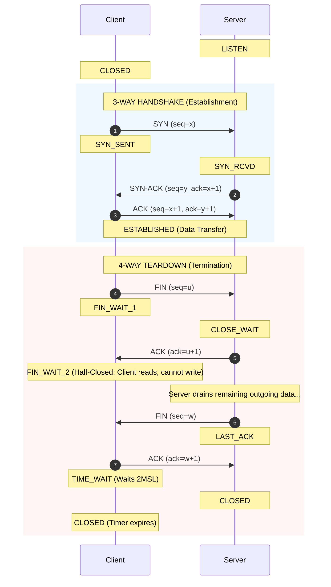

<span className="badge badge--warning margin-bottom--md">Medium</span>

> **Interview Question:** "Walk through the TCP 3-way handshake and 4-way termination sequence. Why does connection establishment need 3 steps instead of 2, why does termination need 4 steps, what is the TIME_WAIT state with 2MSL, and how do SYN Cookies defend against SYN Floods?"

TCP provides a reliable, full-duplex stream of bytes over an unreliable underlying IP network. To guarantee that both parties are synchronized before exchanging data and that connections are torn down cleanly without lingering packets, TCP employs a **3-Way Handshake** to connect and a **4-Way Handshake** to terminate.

---

### The TCP Lifecycle Sequence Diagram



---

### The 3-Way Handshake: Why 3 Steps and Not 2?

1. **Step 1 (`SYN`, $seq=x$):** Client requests connection and declares its Initial Sequence Number ($ISN_c = x$).
2. **Step 2 (`SYN-ACK`, $seq=y, ack=x+1$):** Server acknowledges the client's sequence number and declares its own Initial Sequence Number ($ISN_s = y$).
3. **Step 3 (`ACK`, $ack=y+1$):** Client confirms receipt of the server's sequence number.

#### Why a 2-Way Handshake Fails:
A 2-way handshake would introduce two critical vulnerabilities:
1. **Unilateral Commitment:** The server would transition to `ESTABLISHED` and allocate memory buffers the moment it sent `SYN-ACK`. If that packet was lost or delayed, the server would leave a "ghost" connection open waiting forever for a client that never arrived.
2. **Old Duplicate Packets:** If an old delayed `SYN` packet from a previously dead connection arrived at the server, a 2-way handshake would falsely open a new connection, corrupting application state. Step 3 allows the client to reject stale handshakes with an `RST`.

---

### The Security Defense: SYN Flood Attacks & SYN Cookies

In a **SYN Flood Attack**, an attacker sends millions of spoofed `SYN` packets without ever returning the final `ACK`. The server's **SYN Backlog Queue** fills up with half-open connections, exhausting kernel memory and denying service to legitimate users.

#### The Defense: SYN Cookies
Modern operating systems protect against SYN floods using **SYN Cookies** (`net.ipv4.tcp_syncookies = 1` in Linux):
- When the SYN backlog queue overflows, the server **allocates zero memory state** for new SYNs.
- Instead, it cryptographically encodes the connection metadata into the server's initial sequence number $y$:
  $$y = \text{HMAC}(\text{src\_ip}, \text{src\_port}, \text{dst\_ip}, \text{dst\_port}, \text{secret\_key}, \text{timestamp})$$
- When the client returns the final `ACK` with $ack = y + 1$, the server subtracts 1, recalculates the cryptographic hash, and verifies its authenticity. Only upon successful verification does the server allocate connection state in memory!

---

### 4-Way Teardown & The "Half-Closed" State

Because TCP is **full-duplex**, data flows in two completely independent channels:
1. **Client $\to$ Server Channel**
2. **Server $\to$ Client Channel**

When the client sends `FIN`, it signals: *"I have finished sending data."* The server acknowledges (`ACK`). 
However, the server may still have buffered database query results or file chunks to send back!
- The connection enters a **Half-Closed State (`FIN_WAIT_2` on Client, `CLOSE_WAIT` on Server)**: the client can no longer transmit, but continues receiving incoming data.
- Only when the server finishes all remaining transmissions does it send its own `FIN` packet, which the client acknowledges.

---

### The #1 TCP Interview Trap: The `TIME_WAIT` State & 2MSL

Why does the client (the active closer) remain in the **`TIME_WAIT`** state for **$2 \times \text{MSL}$** (Maximum Segment Lifetime, typically 1 to 2 minutes) instead of closing immediately?

There are two non-negotiable reasons:

1. **Guaranteed Delivery of the Final ACK:**  
   If the client's final `ACK` is dropped by network routers, the server will time out and retransmit its `FIN`. If the client had immediately closed to `CLOSED`, it would respond to the retransmitted `FIN` with a reset (`RST`), causing an abrupt, unclean connection error on the server. `TIME_WAIT` ensures the client stays alive to re-acknowledge any retransmitted `FIN`.
2. **Draining Lingering Duplicate Segments:**  
   Packets can wander through delayed routing loops on the internet. Waiting for $2\text{MSL}$ ensures that all packets belonging to this connection have died out in transit before a newly spawned connection can reuse the exact same 4-tuple `(src_ip, src_port, dst_ip, dst_port)`, preventing cross-connection data corruption.

---

### Summary
"The TCP 3-way handshake establishes bidirectional sequence numbers and protects against stale duplicates and memory exhaustion (mitigated under load via SYN Cookies). The 4-way teardown independently terminates the two full-duplex transmission streams via half-closed states. The active closer must stay in TIME_WAIT for 2MSL to ensure the final ACK arrives and allow lingering packets to expire."

---

### Code Demonstration: Half-Closed TCP Connection in Python

```python
import socket
import threading
import time

def run_server():
    server = socket.socket(socket.AF_INET, socket.SOCK_STREAM)
    server.bind(("127.0.0.1", 8888))
    server.listen(1)
    
    conn, _ = server.accept()
    # Read client request until EOF (Client FIN)
    request = conn.recv(1024)
    print(f"[Server] Received request: {request.decode()}")
    
    # Client has closed its sending side (Half-Closed),
    # but the server can still transmit buffered response data:
    time.sleep(0.5)
    conn.sendall(b"Server Final Response Data after Client FIN")
    
    # Server sends its own FIN to initiate final teardown
    conn.close()
    server.close()

def run_client():
    client = socket.socket(socket.AF_INET, socket.SOCK_STREAM)
    client.connect(("127.0.0.1", 8888))
    
    client.sendall(b"Client Query")
    
    # SHUT_WR sends FIN packet (Half-Closes client output stream)
    # The client cannot send more data, but keeps receiving!
    client.shutdown(socket.SHUT_WR)
    print("[Client] Client stream shut down (Sent FIN). Waiting for remaining response...")
    
    # Client successfully reads remaining server data
    response = client.recv(1024)
    print(f"[Client] Received: {response.decode()}")
    client.close()

if __name__ == "__main__":
    t_server = threading.Thread(target=run_server)
    t_server.start()
    time.sleep(0.1)
    run_client()
    t_server.join()
```
