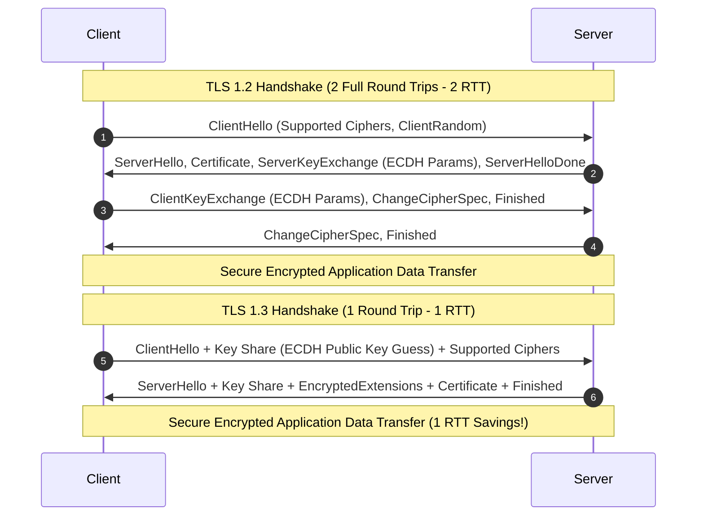

import Tabs from '@theme/Tabs';
import TabItem from '@theme/TabItem';

<span className="badge badge--success margin-bottom--md">Easy</span>

> **Interview Question:** "What are the main components of an HTTP request? Compare HTTP method idempotency vs safety. How does HTTPS secure traffic, what are the critical differences between TLS 1.2 and TLS 1.3, and what do common status codes like 301 vs 302 and 401 vs 403 signify?"

---

### Anatomy of an HTTP Request

An HTTP request is an application-layer text message (in HTTP/1.1) or a framed binary stream (in HTTP/2 and HTTP/3) sent by a client to invoke an operation on a server. An HTTP/1.1 request contains three mandatory structural sections:

```http
POST /api/v1/orders HTTP/1.1
Host: api.example.com
User-Agent: Mozilla/5.0
Content-Type: application/json
Content-Length: 42
Authorization: Bearer eyJhbGciOi...

{"item_id": 1042, "quantity": 2, "price": 49.99}
```

1. **The Request Line:**
   - **Method (Verb):** Indicates the action (`GET`, `POST`, `PUT`, `PATCH`, `DELETE`, `HEAD`, `OPTIONS`).
   - **Request Target (URI/Path):** Specifies the resource identifier and optional query parameters (e.g., `/api/v1/orders?status=active`).
   - **HTTP Version:** Identifies protocol capability (`HTTP/1.1`, `HTTP/2`, `HTTP/3`).
2. **The Headers:** Key-value metadata pairs (delimited by `:` and terminated by `\r\n`) controlling:
   - **Routing & Identification:** `Host` (mandatory in HTTP/1.1 to support virtual hosting), `User-Agent`.
   - **Payload Semantics:** `Content-Type` (MIME type of payload), `Content-Length` (exact byte count of body).
   - **Content Negotiation:** `Accept`, `Accept-Encoding` (gzip, br), `Accept-Language`.
   - **Authentication & Security:** `Authorization`, `Cookie`, `Origin`.
3. **The Body (Payload):**
   - Carries raw data bytes. Separated from headers by an empty line (`\r\n\r\n`).
   - Present in state-changing requests (`POST`, `PUT`, `PATCH`); typically absent in `GET`, `HEAD`, and `DELETE`.

---

### Method Semantics: Safety vs. Idempotency

Interviewers frequently probe whether a candidate understands the architectural contracts defined by RFC 7231 and RFC 5789:

- **Safe Methods:** An HTTP method is safe if it **does not alter server state** (read-only semantics). Safe methods can be pre-fetched, cached, and crawled without side effects.
- **Idempotent Methods:** An HTTP method is idempotent if **multiple identical requests have the exact same effect on the server state as a single request**:
  
$$f(f(x)) = f(x)$$

While the server response code might change (e.g., first `DELETE` returns `200` or `204`, second returns `404`), the underlying database state remains identical.

| HTTP Method | Safe? | Idempotent? | RFC Specification | Primary Semantic |
| :--- | :---: | :---: | :--- | :--- |
| **`GET`** | **Yes** | **Yes** | RFC 7231 | Retrieve resource representation without side effects. |
| **`HEAD`** | **Yes** | **Yes** | RFC 7231 | Same as `GET` but server returns headers only (no body). |
| **`OPTIONS`** | **Yes** | **Yes** | RFC 7231 | Describes supported communication options/CORS preflight. |
| **`PUT`** | **No** | **Yes** | RFC 7231 | **Complete replacement** of the target resource. Sending 5 times replaces with identical state. |
| **`DELETE`** | **No** | **Yes** | RFC 7231 | Removes target resource. Once deleted, subsequent calls leave it deleted. |
| **`POST`** | **No** | **No** | RFC 7231 | Submits entity for subordinate processing; each call typically creates a new record. |
| **`PATCH`** | **No** | **No\*** | RFC 5789 | **Partial modification**. Not guaranteed idempotent (e.g., a patch appending an item to an array changes state with every invocation). |

---

### HTTPS: The TLS Security Architecture

Standard HTTP transmits packets in plaintext. HTTPS (Hypertext Transfer Protocol Secure) delegates transport directly to **TLS (Transport Layer Security)** before application data is sent:

$$\text{HTTPS} = \text{HTTP} + \text{TLS} + \text{TCP} + \text{IP}$$

TLS delivers three fundamental cryptographic guarantees:

1. **Confidentiality (Encryption):**
   - Prevents eavesdropping. Raw HTTP requests/responses are converted to ciphertext using high-speed symmetric ciphers (e.g., AES-256-GCM or ChaCha20-Poly1305).
2. **Integrity (Tamper Proofing):**
   - Employs AEAD (Authenticated Encryption with Associated Data) or HMAC hashes. Any bit altered by a man-in-the-middle attacker causes decryption to fail immediately.
3. **Authentication (Identity Verification):**
   - The server presents an **X.509 Digital Certificate** containing its public key and domain identities (SAN).
   - The client verifies the certificate by tracing its cryptographic signature chain back to a pre-installed **Root Certificate Authority (CA)** in the OS/browser trust store.

---

### TLS 1.2 vs. TLS 1.3 Handshake



#### Why TLS 1.3 is Superior:

1. **Latency Reduction (1-RTT Handshake):**
   - **TLS 1.2** required **2 full round trips (2 RTT)** before encrypted application data could be sent.
   - **TLS 1.3** cuts this to **1 RTT** by optimistically guessing the key agreement algorithm (usually X25519) and sending the client's cryptographic key share directly inside `ClientHello`.
   - **0-RTT Resumption (Early Data):** Clients reconnecting to a previously visited server can send encrypted application data on the very first packet using a pre-shared key (PSK). *(Caution: 0-RTT data is vulnerable to replay attacks, so safe HTTP methods like `GET` must be enforced).*
2. **Mandatory Perfect Forward Secrecy (PFS):**
   - **TLS 1.2** permitted static RSA key exchange where the client encrypted the pre-master secret directly using the server's public key. If an adversary recorded encrypted traffic and years later stole the server's private key, **all historical traffic could be retroactively decrypted**.
   - **TLS 1.3 completely banned static RSA key exchange**. It mandates **Ephemeral Diffie-Hellman (ECDHE / DHE)**. Unique session keys are derived on the fly and discarded immediately after the session terminates. Compromising the server's long-term certificate private key does **not** compromise past sessions.
3. **Elimination of Legacy/Vulnerable Cryptography:**
   - TLS 1.3 stripped away vulnerable algorithms: RC4, CBC-mode ciphers (vulnerable to BEAST, POODLE, Lucky 13), SHA-1, and MD5. It reduced the cipher suite list from hundreds of combinations down to 5 AEAD suites.

---

### Critical HTTP Status Codes Dissected

Interviewers often ask candidates to contrast nuanced pairs of status codes:

#### 1. Redirection Nuance: `301` vs. `302` vs. `307` vs. `308`
- **`301 Moved Permanently`:** The resource URI has permanently changed. Search engine crawlers transfer SEO ranking (link juice) to the new URI. Browsers cache this redirect aggressively. Historically, browsers incorrectly transformed `POST` requests to `GET` on the new URI.
- **`302 Found` (Temporary):** Resource temporarily resides at another URI. Browsers do not permanently cache the redirect. Historically transformed `POST` to `GET`.
- **`307 Temporary Redirect`:** Introduced in HTTP/1.1. Explicitly mandates that the client **must not change the HTTP method** when following the redirect (a `POST` remains a `POST`).
- **`308 Permanent Redirect`:** Permanent redirect that guarantees method preservation (RFC 7538).

#### 2. Authentication vs. Authorization: `401` vs. `403`
- **`401 Unauthorized`:** A misnomer, as it actually means **Unauthenticated**. The client has not provided valid credentials. The server response must include a `WWW-Authenticate` header indicating the required authentication challenge.
- **`403 Forbidden`:** The client is successfully authenticated (their identity is known), but they **lack permission** to access the resource (e.g., a standard user trying to access `/admin`). Re-authenticating with the same credentials will not change the outcome.

#### 3. Rate Limiting: `429 Too Many Requests`
- Indicates the client has exceeded rate limits. Servers pair this with headers such as `Retry-After: 60`, `X-RateLimit-Limit`, and `X-RateLimit-Remaining` to facilitate graceful client backoff.

#### 4. Gateway Errors: `502 Bad Gateway` vs. `504 Gateway Timeout`
- **`502 Bad Gateway`:** An edge reverse proxy/load balancer (e.g., NGINX, Cloudflare) connected to an upstream application server (e.g., Node.js, Python Gunicorn), but the upstream process crashed or sent an invalid/empty response.
- **`504 Gateway Timeout`:** The edge proxy connected to the upstream application server, but the upstream failed to return a response before the proxy's configured read timeout expired (e.g., heavy database query running over 60 seconds).

---

### The Interview Answer (60-90 seconds)

> "An HTTP request consists of three parts: the Request Line (method, path, HTTP version), Headers (metadata like `Host`, `Authorization`, and `Content-Type`), and an optional Request Body containing payload data for methods like `POST` or `PUT`.
>
> In terms of method semantics, safe methods like `GET` do not alter server state. Idempotent methods like `PUT` and `DELETE` guarantee that sending $N$ identical requests leaves the server in the exact same state as sending 1 request. `POST` is neither safe nor idempotent because each invocation creates new records.
>
> Plain HTTP exposes headers and bodies in cleartext. HTTPS wraps HTTP inside a TLS tunnel, providing confidentiality via symmetric AEAD ciphers, integrity via cryptographic hashes, and authentication via X.509 CA certificate verification.
>
> The transition from TLS 1.2 to TLS 1.3 was a massive architectural upgrade: it slashed connection handshake latency from 2 RTTs down to 1 RTT (and 0-RTT for resumed sessions), eliminated obsolete ciphers like CBC and RC4, and mandated Ephemeral Diffie-Hellman (ECDHE) for Perfect Forward Secrecy, ensuring past traffic can never be decrypted even if the server's long-term private key is leaked.
>
> Finally, status codes carry critical operational distinctions: `401` means unauthenticated while `403` means authenticated but unauthorized; and `301` is a permanently cached redirect whereas `307` is a temporary redirect that strictly preserves the original HTTP request method."

---

### Code Demonstration: Inspecting HTTPS & TLS Handshake

The following clean Python script uses the standard library `ssl` and `socket` modules to connect to an HTTPS server, inspect the negotiated TLS version, examine the active cipher suite, verify Perfect Forward Secrecy (ECDHE), and send a raw HTTP/1.1 request over the secure tunnel.

```python
import socket
import ssl

def inspect_https_connection(hostname: str, port: int = 443):
    print(f"[*] Connecting to {hostname}:{port}...")

    # 1. Create a secure default SSL/TLS context
    context = ssl.create_default_context()

    # 2. Open a standard TCP socket (Layer 4)
    raw_socket = socket.create_connection((hostname, port), timeout=5.0)

    # 3. Wrap socket with TLS Handshake (Layer 5/6/7)
    with context.wrap_socket(raw_socket, server_hostname=hostname) as tls_socket:
        print("[+] TLS Handshake Successful!")
        print(f"    - Protocol Version: {tls_socket.version()}")
        cipher_name, proto_version, secret_bits = tls_socket.cipher()
        print(f"    - Negotiated Cipher Suite: {cipher_name}")
        print(f"    - Encryption Bits: {secret_bits}")
        
        # Verify Perfect Forward Secrecy
        is_pfs = "ECDHE" in cipher_name or "DHE" in cipher_name or "TLS_AES" in cipher_name
        print(f"    - Perfect Forward Secrecy (PFS): {'YES' if is_pfs else 'NO'}")

        # 4. Inspect Server Certificate
        cert = tls_socket.getpeercert()
        subject = dict(item[0] for item in cert.get('subject', ()))
        issuer = dict(item[0] for item in cert.get('issuer', ()))
        print(f"    - Certificate Subject: {subject.get('commonName')}")
        print(f"    - Certificate Issuer (CA): {issuer.get('organizationName', issuer.get('commonName'))}")

        # 5. Send a raw HTTP/1.1 GET request over the encrypted tunnel
        http_request = (
            f"GET / HTTP/1.1\r\n"
            f"Host: {hostname}\r\n"
            f"User-Agent: AntigravityTLSInspector/1.0\r\n"
            f"Connection: close\r\n\r\n"
        )
        tls_socket.sendall(http_request.encode('utf-8'))

        # 6. Read and parse the HTTP status line and headers
        response = tls_socket.recv(4096).decode('utf-8', errors='replace')
        status_line = response.split('\r\n')[0]
        print(f"\n[+] HTTP Response Status Line: {status_line}")

if __name__ == "__main__":
    inspect_https_connection("www.cloudflare.com")
```
