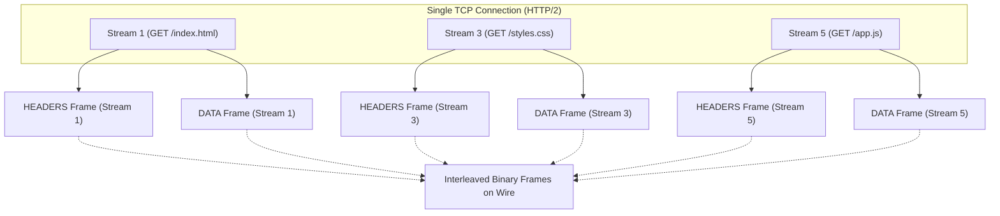

import Tabs from '@theme/Tabs';
import TabItem from '@theme/TabItem';

<span className="badge badge--success margin-bottom--md">Easy</span>

> **Interview Question:** "Compare HTTP/1.1, HTTP/2, and HTTP/3. Specifically: what is the HTTP/2 Binary Framing Layer, how does HPACK header compression work, what is transport-layer Head-of-Line blocking, and why does HTTP/3 switch to QUIC over UDP?"

---

### The Evolution: High-Level Architectural Shifts

The transition across HTTP specifications marks a continuous struggle against network latency and connection underutilization:

- **HTTP/1.1 (1997, RFC 2616):** Text-based, synchronous request-response pairs. Persists TCP connections via `Keep-Alive`, but requires multiple parallel TCP connections (browsers open up to 6 per origin) to bypass sequential bottlenecks.
- **HTTP/2 (2015, RFC 7540):** Binary framing protocol that introduces true concurrent **multiplexing** over a single TCP connection, accompanied by **HPACK** header compression and stream prioritization.
- **HTTP/3 (2022, RFC 9114):** Replaces TCP with **QUIC (RFC 9000)** over UDP, eliminating transport-level Head-of-Line blocking, enabling zero-RTT handshakes, and allowing seamless connection migration across network changes.

---

### HTTP/2: Binary Framing Layer & Multiplexing

In HTTP/1.1, messages are ASCII text strings delimited by newlines (`\r\n`). If an application sends multiple requests on the same TCP connection, they must be processed strictly sequentially: the client cannot send request #2 until request #1's response has fully arrived. This creates **Application-Layer Head-of-Line (HoL) Blocking**.

HTTP/2 solves this by introducing the **Binary Framing Layer** between the socket interface and the application layer:



#### Core Terminology:
1. **Frame:** The smallest communication unit in HTTP/2. Every frame begins with a fixed 9-byte header:
   - **Length (24 bits):** Length of frame payload.
   - **Type (8 bits):** `HEADERS` (metadata), `DATA` (payload), `PRIORITY`, `RST_STREAM` (abort stream), `SETTINGS`, `PING`, `GOAWAY`.
   - **Flags (8 bits):** E.g., `END_STREAM` (indicates last frame), `END_HEADERS`.
   - **Stream Identifier (31 bits):** Indicates which logical stream this frame belongs to. Stream `0x0` is reserved for connection-level control frames. Client streams use odd IDs (1, 3, 5...); server push uses even IDs (2, 4, 6...).
2. **Message:** A complete logical HTTP request or response composed of one or more frames (e.g., a `HEADERS` frame followed by one or more `DATA` frames).
3. **Stream:** A bidirectional, independent virtual channel within the single TCP connection. Because frames carry distinct Stream IDs, the client and server can **interleave frames arbitrarily on the wire** without waiting for preceding streams to finish.

---

### HPACK: Solving Header Overhead

In HTTP/1.1, every single request transmits 500 to 1,500 bytes of redundant ASCII headers (identical `User-Agent`, `Cookie`, `Accept`, and `Host` strings).

HTTP/2 introduced **HPACK (RFC 7541)**, a specialized header compression algorithm:
1. **Static Table:** A predefined, read-only table of 61 frequently used HTTP headers and common values (e.g., Index `2` represents `GET /`, Index `7` represents `:scheme: https`). The client sends a single 1-byte integer index instead of the string.
2. **Dynamic Table:** Both client and server maintain an in-memory table that updates dynamically as new headers are exchanged over the connection. If the client sends an authorization token once, subsequent requests reference the token's dynamic table index using just a few bits.
3. **Huffman Coding:** Any custom literal header values not found in the tables are compressed using a pre-computed static Huffman code table optimized for HTTP text.

HPACK routinely reduces HTTP header bandwidth consumption by **85% to 90%**.

---

### The Fundamental Flaw of HTTP/2: Transport-Layer HoL Blocking

Although HTTP/2 solved application-layer HoL blocking, it concentrated all website traffic into a **single underlying TCP connection**.

TCP guarantees strict, in-order byte delivery. If an intermediate router drops a single IP packet containing a frame for Stream 5:
1. The receiving OS kernel's TCP stack holds all subsequent incoming packets (even those for Streams 1, 3, and 7) in its receive buffer.
2. The OS refuses to release any data to the application until the dropped packet is retransmitted and acknowledged (via TCP ACK / SACK).
3. **Result:** On a lossy cellular connection (e.g., 2% packet loss), an HTTP/2 connection performs **worse than HTTP/1.1 with 6 separate TCP connections**, because one lost packet freezes all active requests simultaneously!

---

### HTTP/3 & QUIC: The UDP Paradigm Shift

HTTP/3 completely ditches TCP and TLS over TCP. It runs over **QUIC (Quick UDP Internet Connections)**, built directly on top of UDP.

```
+---------------------------------------+
|              HTTP/3                   |
+---------------------------------------+
|  QUIC (Streams + TLS 1.3 Encryption   |
|         + Congestion Control)         |
+---------------------------------------+
|                UDP                    |
+---------------------------------------+
|                 IP                    |
+---------------------------------------+
```

#### Why HTTP/3 and QUIC Outperform TCP:

1. **Independent Transport Streams (No HoL Blocking):**
   - QUIC implements flow control, reliable retransmission, and packet ordering **at the individual stream level**, rather than across the entire connection.
   - If a UDP packet containing data for Stream 3 is dropped, only Stream 3 is paused waiting for retransmission. Streams 1, 5, and 7 continue delivering data to the application layer without a millisecond of delay.
2. **0-RTT Connection Establishment:**
   - In traditional HTTPS (HTTP/1.1 or HTTP/2), establishing a secure connection requires:
     - 1 RTT for TCP 3-way handshake (`SYN`, `SYN-ACK`, `ACK`).
     - 1 RTT for TLS 1.3 handshake (or 2 RTT for TLS 1.2).
     - Total: **2 to 3 round trips (100–300 ms)** before a single HTTP byte is sent.
   - In QUIC, the transport handshake and TLS 1.3 cryptographic handshake are **combined into a single round trip (1-RTT)**. On subsequent connections, QUIC achieves **0-RTT**, sending encrypted application data in the very first packet.
3. **Connection Migration (Surviving IP Changes):**
   - TCP connections are identified by a 4-tuple: `(Source IP, Source Port, Destination IP, Destination Port)`.
   - When a mobile user walks out of their house and transitions from Wi-Fi to a 5G cellular network, their device's IP address changes immediately. In TCP, the socket breaks, all in-flight streams abort, and the connection must restart from scratch.
   - QUIC connections are identified by a unique, randomized **64-bit Connection ID (CID)** embedded in the packet header. When the client's IP changes, it continues sending UDP packets with the same CID. The server seamlessly routes packets to the existing session without dropping the connection.

---

### Protocol Comparison Matrix

| Feature | HTTP/1.1 | HTTP/2 | HTTP/3 |
| :--- | :--- | :--- | :--- |
| **Transport Protocol** | TCP | TCP | **QUIC (over UDP)** |
| **Handshake Latency** | 2–3 RTT (TCP + TLS) | 2–3 RTT (TCP + TLS) | **1 RTT (0-RTT on resume)** |
| **Data Format** | Plaintext ASCII | Binary Frames | Binary Frames (QPACK) |
| **Multiplexing** | No (pipelining broken) | Yes (over single TCP) | Yes (independent UDP streams) |
| **App-Layer HoL Blocking**| **Yes** | **Fixed** | **Fixed** |
| **Transport HoL Blocking**| No (6 parallel conns) | **Yes (severe flaw)** | **Fixed** |
| **Header Compression** | None | HPACK | QPACK (out-of-order safe) |
| **Connection Migration** | Impossible (IP bound) | Impossible (IP bound) | **Supported (via CID)** |

---

### The Interview Answer (60-90 seconds)

> "The evolution of HTTP represents a shift from plain text to binary multiplexing, and finally from TCP to UDP.
>
> In HTTP/1.1, messages were plain text, and requests on a single connection had to be processed sequentially, resulting in application-layer Head-of-Line blocking. HTTP/2 solved this by introducing the Binary Framing Layer, which breaks messages into small binary frames labeled with Stream IDs. This allowed requests and responses to be multiplexed concurrently over a single TCP connection. HTTP/2 also added HPACK header compression, cutting header overhead by 85%.
>
> However, because HTTP/2 consolidated everything onto one TCP connection, it suffered from transport-layer Head-of-Line blocking. Because TCP guarantees strict byte ordering, if a single packet drops on a lossy cellular link, the OS halts all active streams while waiting for retransmission.
>
> HTTP/3 fixes this by abandoning TCP in favor of QUIC over UDP. In QUIC, streams are truly independent; a dropped packet delays only the stream it belongs to. Furthermore, QUIC merges transport and TLS 1.3 handshakes into 1 RTT (or 0-RTT on resumption) and uses a 64-bit Connection ID rather than an IP 4-tuple, allowing active connections to survive when a user switches between Wi-Fi and 5G."

---

### Code Demonstration: Simulating HTTP/1.1 Blocking vs HTTP/2 Multiplexing

The following Python script simulates how HTTP/1.1 sequential processing causes Head-of-Line blocking when a slow resource is requested, compared to how HTTP/2 frame interleaving allows fast resources to finish immediately without waiting.

```python
import time
import queue

class Resource:
    def __init__(self, name: str, total_chunks: int, chunk_delay: float):
        self.name = name
        self.total_chunks = total_chunks
        self.chunk_delay = chunk_delay
        self.chunks_sent = 0

def simulate_http11(resources):
    print("--- Simulating HTTP/1.1 (Sequential / HoL Blocking) ---")
    start = time.perf_counter()
    # In HTTP/1.1 on a single connection, resource 2 cannot start until resource 1 is completely delivered
    for res in resources:
        print(f"[*] Starting download of {res.name}...")
        for chunk in range(1, res.total_chunks + 1):
            time.sleep(res.chunk_delay)
        elapsed = time.perf_counter() - start
        print(f"[+] Finished {res.name} at {elapsed:.2f}s")
    print(f"HTTP/1.1 Total Elapsed: {time.perf_counter() - start:.2f}s\n")

def simulate_http2_multiplexing(resources):
    print("--- Simulating HTTP/2 (Binary Framing / Multiplexed) ---")
    start = time.perf_counter()
    # In HTTP/2, frames for multiple streams are interleaved over the same connection
    active_streams = list(resources)
    while active_streams:
        for stream in list(active_streams):
            time.sleep(stream.chunk_delay)
            stream.chunks_sent += 1
            if stream.chunks_sent == stream.total_chunks:
                elapsed = time.perf_counter() - start
                print(f"[+] Finished {stream.name} at {elapsed:.2f}s (Did not wait for slow streams!)")
                active_streams.remove(stream)
    print(f"HTTP/2 Total Elapsed: {time.perf_counter() - start:.2f}s\n")

if __name__ == "__main__":
    # Resource A is a heavy script (5 chunks, slow network or server computation: 0.1s/chunk)
    # Resource B is a small, critical CSS file (1 chunk, fast: 0.05s/chunk)
    res_a = Resource("Heavy_Script.js", total_chunks=5, chunk_delay=0.1)
    res_b = Resource("Critical_Style.css", total_chunks=1, chunk_delay=0.05)

    simulate_http11([res_a, res_b])

    res_a2 = Resource("Heavy_Script.js", total_chunks=5, chunk_delay=0.1)
    res_b2 = Resource("Critical_Style.css", total_chunks=1, chunk_delay=0.05)
    simulate_http2_multiplexing([res_a2, res_b2])
```
