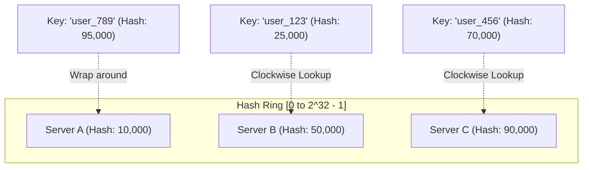

import Tabs from '@theme/Tabs';
import TabItem from '@theme/TabItem';

<span className="badge badge--warning margin-bottom--md">Medium</span>

> **Interview Question:** "Explain the fundamental differences between a forward proxy, a reverse proxy, and a load balancer. How does Layer 4 differ from Layer 7 load balancing? Why is consistent hashing crucial for distributed caching, and how does a CDN fit into modern web scale?"

---

### Architectural Roles: The Middlemen of Networking

Intermediate network components act as intermediaries between clients and servers, but their positioning, visibility, and architectural responsibilities differ fundamentally:

```
[ Clients ] ---> [ Forward Proxy ] ---> ( Internet ) ---> [ CDN Edge ] ---> [ L4/L7 Load Balancer ] ---> [ Reverse Proxy ] ---> [ Backend Services ]
(Protects Client)                                       (Caches Static)     (Distributes Traffic)    (Terminates TLS/Auth)
```

#### 1. Forward Proxy (Protects the Client)
- **Positioning:** Sits in front of a private client pool (e.g., an enterprise internal network).
- **Core Function:** Intercepts outbound internet requests on behalf of clients. It masks the client's internal IP address, enforces corporate filtering, logs outbound web traffic, and bypasses regional geolocation firewalls (VPNs).
- **Visibility:** The destination server on the internet has no knowledge of the real client IP; it only sees the forward proxy's IP.

#### 2. Reverse Proxy (Protects the Server)
- **Positioning:** Sits in front of private backend application servers.
- **Core Function:** Intercepts inbound public traffic. It masks backend server topology, handles SSL/TLS termination, provides centralized authentication/rate limiting, and caches frequently accessed responses.
- **Visibility:** The client has no idea which backend server executed their request; they communicate exclusively with the reverse proxy.

#### 3. Load Balancer (Scales Availability & Capacity)
- A specialized reverse proxy whose primary purpose is to balance inbound requests across a pool of redundant backend instances, preventing any single node from crashing under load and automatically bypassing degraded nodes via active health checks.

#### 4. Content Delivery Network (CDN)
- A globally distributed network of reverse proxy edge nodes (Points of Presence / PoPs). CDNs cache static assets (HTML, CSS, JS, images, video segments) geographically close to end users, offloading traffic from origin servers and minimizing speed-of-light transoceanic latency.

---

### Layer 4 vs. Layer 7 Load Balancing

A major bar-raising interview distinction is understanding the trade-offs between transport-layer (L4) and application-layer (L7) load balancing:

```
Layer 4 (L4) Load Balancing               Layer 7 (L7) Load Balancing
---------------------------               ---------------------------
Packet / Flow Level (TCP/UDP)             Application / Content Level (HTTP/HTTPS)
Inspects: IP addresses + TCP/UDP ports     Inspects: URI Path, HTTP Headers, Cookies
Does NOT terminate TLS                    Terminates TLS (Decrypts Payload)
Routing: Blind TCP packet forwarding      Routing: Path-based (/api vs /static), Cookie stickiness
Latency: Nanoseconds / Microseconds       Latency: Milliseconds (CPU-bound crypto & parsing)
Throughput: Millions of packets/sec       Throughput: Tens of thousands of requests/sec
Examples: AWS NLB, IPVS, HAProxy (L4)     Examples: AWS ALB, NGINX, Envoy, Traefik
```

| Dimension | Layer 4 (Transport) | Layer 7 (Application) |
| :--- | :--- | :--- |
| **Protocol Awareness** | IP, TCP, UDP | HTTP, HTTPS, gRPC, WebSocket |
| **TLS Termination** | Passes encrypted packets through untouched (or offloaded via hardware). | Decrypts TLS to inspect plaintext HTTP headers and paths. |
| **Routing Decision** | Destination IP and TCP port tuple only. | Content-aware: URL paths (`/api` vs `/images`), HTTP headers, JWT tokens, session cookies. |
| **Performance & CPU** | Extremely high throughput, ultra-low memory/CPU footprint. | Higher CPU consumption due to TLS decryption, HTTP parsing, and stream reassembly. |
| **Direct Server Return (DSR)** | Supported: Backends can respond directly to clients, bypassing the LB on return traffic. | Impossible: Reverse proxy terminates connection; both request and response must flow through L7 proxy. |

---

### Load Balancing Algorithms

1. **Round Robin / Weighted Round Robin:** Cycles through servers sequentially. Weighted assigns higher shares to more powerful machines.
2. **Least Connections / Weighted Least Connections:** Directs traffic to the server currently handling the fewest active concurrent connections (ideal for long-lived WebSocket or database transactions).
3. **Power of Two Random Choices:** Picks two servers at random and routes to the one with fewer active connections. Eliminates herd behavior without requiring centralized coordination.
4. **IP Hash:** Hashes the client IP to choose a backend, maintaining rudimentary session stickiness.

---

### Consistent Hashing: Preventing Cache Stampedes

In distributed systems (such as Memcached, Redis clusters, or CDN edge caches), routing cached requests using traditional modulo hashing causes catastrophic failures when nodes change:

$$\text{Server Index} = \text{hash}(\text{Key}) \pmod N$$

If you have $N = 4$ cache servers and one node crashes ($N = 3$), almost **every single key** ($N / (N+1)$ or roughly 75%–90%) hashes to a different index. The entire cache pool suffers a **cache stampede**, pounding the database origin with simultaneous misses.

#### The Solution: The Consistent Hashing Ring

Consistent hashing maps both **servers** and **keys** onto a circular 32-bit hash space ($[0, 2^{32} - 1]$):



1. **Ring Assignment:** Keys are placed on the ring by hashing their identifier. A key is assigned to the **first server encountered by moving clockwise**.
2. **Graceful Node Add/Drop:** If Server B crashes, only the keys that previously mapped to Server B are reassigned (to Server C). All other keys mapping to Server A and Server C remain untouched. On average, only $K / N$ keys need to be moved.
3. **Virtual Nodes (VNodes):** To prevent non-uniform data distribution (hotspots where one server receives 80% of keys), each physical machine is assigned multiple virtual positions across the ring (e.g., `ServerA_#1`, `ServerA_#2`, ... `ServerA_#100`). This balances the load evenly across all nodes.

---

### The Interview Answer (60-90 seconds)

> "A forward proxy sits in front of clients to protect their privacy, enforce enterprise filtering, and route outbound internet traffic. The destination web server only sees the proxy's IP. In contrast, a reverse proxy sits in front of backend servers to terminate TLS, cache responses, and hide internal architecture. The client only sees the reverse proxy.
>
> A load balancer is a specialized reverse proxy designed to distribute traffic across a server farm for high availability and throughput.
>
> The key architectural distinction is Layer 4 versus Layer 7 load balancing. An L4 balancer operates at the TCP/UDP packet level without inspecting application payloads or terminating TLS. It offers massive throughput and ultra-low latency, but cannot inspect URL paths or cookies. An L7 balancer terminates TLS and reconstructs HTTP requests, enabling content-based routing (such as routing `/api` to microservices and `/static` to storage), session stickiness, and WAF inspection, at the cost of higher CPU overhead.
>
> In distributed caching, standard modulo hashing causes severe cache stampedes when a server dies because nearly all keys are reshuffled. Consistent hashing solves this by placing servers and keys on a circular hash ring, ensuring that adding or removing a node only impacts $1/N$ keys on average, with virtual nodes guaranteeing uniform load distribution."

---

### Code Demonstration: Python L7 Reverse Proxy with Round-Robin & Health Checks

The following standalone Python script implements an active Layer 7 reverse proxy. It inspects incoming HTTP requests, maintains an active health-checked backend server pool, and routes traffic using Round-Robin load balancing.

```python
import http.server
import socketserver
import urllib.request
import threading
import time

BACKEND_POOL = [
    {"host": "httpstat.us", "path": "/200", "healthy": True},
    {"host": "httpstat.us", "path": "/200?sleep=100", "healthy": True},
]
current_backend_index = 0
lock = threading.Lock()

class Layer7LoadBalancer(http.server.BaseHTTPRequestHandler):
    def do_GET(self):
        global current_backend_index

        with lock:
            healthy_backends = [b for b in BACKEND_POOL if b["healthy"]]
            if not healthy_backends:
                self.send_response(503)
                self.end_headers()
                self.wfile.write(b"503 Service Unavailable: No healthy backends.")
                return

            # Round-Robin Selection
            current_backend_index = (current_backend_index + 1) % len(healthy_backends)
            target = healthy_backends[current_backend_index]

        # Construct upstream URL
        upstream_url = f"https://{target['host']}{target['path']}"
        print(f"[L7 LB] Routing client {self.client_address[0]} -> {upstream_url}")

        try:
            req = urllib.request.Request(
                upstream_url,
                headers={"User-Agent": "AntigravityL7Proxy/1.0"}
            )
            with urllib.request.urlopen(req, timeout=3.0) as response:
                status_code = response.getcode()
                content = response.read()

                # Send back to client
                self.send_response(status_code)
                self.send_header("Content-Type", "text/plain")
                self.send_header("X-Proxy-Target", target["host"])
                self.end_headers()
                self.wfile.write(content)
        except Exception as e:
            self.send_response(502)
            self.end_headers()
            self.wfile.write(f"502 Bad Gateway: {str(e)}".encode())

def health_check_daemon():
    """Background thread checking health of backends periodically"""
    while True:
        time.sleep(5)
        for backend in BACKEND_POOL:
            try:
                url = f"https://{backend['host']}{backend['path']}"
                req = urllib.request.Request(url, method="HEAD")
                with urllib.request.urlopen(req, timeout=2.0) as resp:
                    backend["healthy"] = (resp.getcode() == 200)
            except Exception:
                backend["healthy"] = False

if __name__ == "__main__":
    # Start health check daemon in background
    health_thread = threading.Thread(target=health_check_daemon, daemon=True)
    health_thread.start()

    PORT = 8080
    print(f"[*] Layer 7 Load Balancer running on port {PORT}...")
    server = socketserver.TCPServer(("", PORT), Layer7LoadBalancer)
    # Server can be started with server.serve_forever()
```
