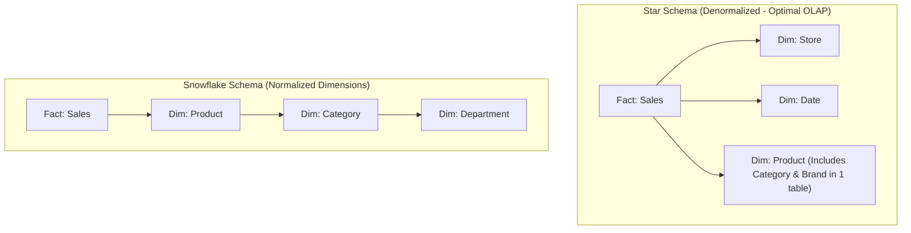

import Tabs from '@theme/Tabs';
import TabItem from '@theme/TabItem';

<span className="badge badge--warning margin-bottom--md">Medium</span>

> **Interview Question:** "What is the difference between OLTP and OLAP? Compare their query patterns, row vs. columnar disk storage, Star vs. Snowflake schemas, and explain the emergence of HTAP architectures."

---

### High-Level Comparison: Transactional vs. Analytical

Modern data infrastructure separates workloads into two distinct categories based on access patterns:

| Feature | OLTP (Online Transaction Processing) | OLAP (Online Analytical Processing) |
| :--- | :--- | :--- |
| **Primary Goal** | Real-time transaction processing for live applications. | Multi-dimensional analysis, business intelligence, reporting. |
| **Query Pattern** | High frequency, low latency reads and atomic writes (`INSERT`, `UPDATE`). | Low frequency, long-running aggregate scans (`SUM`, `AVG`, `GROUP BY`). |
| **Data Granularity**| Highly detailed, atomic operational records. | Aggregated, consolidated, historical multi-year data. |
| **Latency SLA** | Milliseconds ($1\text{ms} - 50\text{ms}$). | Seconds to minutes. |
| **Storage Layout** | **Row-Oriented** (records stored contiguously). | **Column-Oriented** (column values stored contiguously). |
| **Schema Design** | Normalized (3NF) to eliminate update anomalies. | Denormalized **Star Schema** or **Snowflake Schema**. |
| **Data Scale** | Gigabytes to Low Terabytes (active working set). | Terabytes to Petabytes. |
| **Engines** | PostgreSQL, MySQL, SQL Server, Oracle. | ClickHouse, Snowflake, Google BigQuery, Amazon Redshift. |

---

### Row-Oriented vs. Column-Oriented Storage Layout

The defining technical boundary between OLTP and OLAP is how data blocks are physically organized on disk:

```
Row-Oriented Layout (OLTP - e.g., PostgreSQL):
Page 1: [ID: 1, Name: "Alice", Age: 28, Balance: 4500] [ID: 2, Name: "Bob", Age: 34, Balance: 1200]
Page 2: [ID: 3, Name: "Charlie", Age: 22, Balance: 8900] [ID: 4, Name: "Diana", Age: 41, Balance: 6700]

Column-Oriented Layout (OLAP - e.g., ClickHouse):
Page 1 (IDs):      [1, 2, 3, 4, ...]
Page 2 (Names):    ["Alice", "Bob", "Charlie", "Diana", ...]
Page 3 (Ages):     [28, 34, 22, 41, ...]
Page 4 (Balances): [4500, 1200, 8900, 6700, ...]
```

#### Why Columnar Storage Dominates OLAP:
Suppose you execute an analytical query across 100,000,000 customer records:
```sql
SELECT AVG(Balance) FROM Customers WHERE Age > 30;
```
1. **Dramatic I/O Pruning:** 
   - A **row store** must read all 100M entire customer records off disk into RAM, wasting 90% of I/O throughput loading unrequested `Name`, `Email`, and `Address` bytes.
   - A **column store** reads **only Page 3 (Ages) and Page 4 (Balances)**, completely bypassing the remaining columns on disk.
2. **Extreme Compression Ratios:**
   - In row storage, adjacent data has mixed types (int, string, timestamp), making compression inefficient.
   - In columnar storage, an entire page contains identical data types (e.g., all 32-bit integers). Algorithms like **Run-Length Encoding (RLE)**, **Dictionary Encoding**, and **Delta-of-Delta** compress data by $5\times$ to $10\times$.
3. **Vectorized SIMD Processing:**
   - Columnar data forms contiguous memory arrays. Modern CPUs can load column arrays directly into **SIMD (Single Instruction, Multiple Data)** vector registers (AVX-512), evaluating aggregations on dozens of values per clock cycle.

---

### Dimensional Modeling: Star Schema vs. Snowflake Schema

In OLAP data warehouses, schemas are structured for read performance around **Fact Tables** and **Dimension Tables**:
- **Fact Table:** Central table containing numerical business metrics/measurements (e.g., `Sales_Fact`: quantity, price, tax, discount) along with foreign keys to dimensions.
- **Dimension Tables:** Contextual metadata surrounding business events (e.g., `Customer_Dim`, `Store_Dim`, `Time_Dim`).



| Dimension | Star Schema | Snowflake Schema |
| :--- | :--- | :--- |
| **Normalization** | Completely **Denormalized** dimensions. | **Normalized** dimensions (broken into sub-tables). |
| **Query Complexity** | Simple queries with **few `JOIN`s**. | Complex queries requiring **multiple nested `JOIN`s**. |
| **Query Performance** | **Fastest**: Optimized for massive columnar scans. | Slower due to join overhead across dimension tables. |
| **Disk Redundancy** | Higher (dimension attributes repeated). | Lower (eliminates redundant dimension text). |

---

### The Convergence: HTAP (Hybrid Transactional/Analytical Processing)

Historically, architectures required running separate OLTP and OLAP systems connected by fragile **ETL (Extract, Transform, Load)** pipelines:

$$\text{App} \longrightarrow \text{OLTP} \xrightarrow[\text{Batch / Kafka}]{\text{ETL Lag (1-24h)}} \text{OLAP Warehouse}$$

Modern distributed databases introduce **HTAP (Hybrid Transactional/Analytical Processing)** (e.g., **TiDB**, **SingleStore**, **Google AlloyDB**):
- Within the same unified cluster, data is written to a **row-oriented engine** (like TiKV) for ACID transactions.
- A background replication process asynchronously streams mutations into an in-memory **columnar replica** (like TiFlash).
- The query optimizer automatically routes simple OLTP queries to the row engine and complex aggregation queries to the columnar replica, eliminating ETL latency entirely.

---

### The Interview Answer (60-90 seconds)

> "OLTP systems are designed for high-concurrency, low-latency transactional writes and reads, using normalized 3NF row-oriented schemas where complete records are stored contiguously on disk pages.
>
> In contrast, OLAP systems are designed for long-running aggregate queries over massive historical datasets. They use column-oriented storage, storing values of each column contiguously. This reduces disk I/O by orders of magnitude because queries touch only the columns specified in `WHERE` and `SELECT` clauses. Furthermore, columnar data compresses 10x better and unlocks vectorized SIMD CPU processing.
>
> For data modeling, OLAP relies on dimensional Star and Snowflake schemas. Star schemas denormalize dimensions to minimize join overhead, making them preferred in modern warehouses.
>
> Finally, the industry is increasingly adopting HTAP databases like TiDB, which maintain synchronized row and columnar representations within a single engine, enabling real-time analytics without ETL pipelines."

---

### Code Demonstration: Row-Oriented vs. Columnar Memory Scan Benchmark

The following Python script simulates row-oriented storage (array of records) versus column-oriented storage (dictionary of arrays) across 500,000 records, measuring memory footprint and column aggregation performance.

```python
import time
import sys

def benchmark_storage_layouts():
    NUM_RECORDS = 500_000
    print(f"[*] Generating {NUM_RECORDS:,} synthetic e-commerce records...")

    # 1. Simulating Row-Oriented Storage (List of Dicts / Objects)
    row_store = [
        {
            "order_id": i,
            "customer_name": f"User_{i % 1000}",
            "email": f"user_{i % 1000}@example.com",
            "quantity": (i % 5) + 1,
            "amount": float((i % 100) + 10.5)
        }
        for i in range(NUM_RECORDS)
    ]

    # 2. Simulating Column-Oriented Storage (Contiguous Column Arrays)
    column_store = {
        "order_id": list(range(NUM_RECORDS)),
        "customer_name": [f"User_{i % 1000}" for i in range(NUM_RECORDS)],
        "email": [f"user_{i % 1000}@example.com" for i in range(NUM_RECORDS)],
        "quantity": [(i % 5) + 1 for i in range(NUM_RECORDS)],
        "amount": [float((i % 100) + 10.5) for i in range(NUM_RECORDS)]
    }

    # Benchmark: Compute Average Amount for orders where quantity > 3
    print("\n--- Benchmark: SELECT AVG(amount) WHERE quantity > 3 ---")

    # Row-Store Scan
    t0 = time.perf_counter()
    total_amount_row = 0.0
    count_row = 0
    for row in row_store:
        # Must touch the entire dictionary record
        if row["quantity"] > 3:
            total_amount_row += row["amount"]
            count_row += 1
    avg_row = total_amount_row / count_row if count_row else 0
    t_row = (time.perf_counter() - t0) * 1000

    # Column-Store Scan
    t1 = time.perf_counter()
    total_amount_col = 0.0
    count_col = 0
    quantities = column_store["quantity"]
    amounts = column_store["amount"]
    # Only touches the two necessary arrays; ignores names, emails, order_ids!
    for q, amt in zip(quantities, amounts):
        if q > 3:
            total_amount_col += amt
            count_col += 1
    avg_col = total_amount_col / count_col if count_col else 0
    t_col = (time.perf_counter() - t1) * 1000

    print(f"Row-Store Scan Time   : {t_row:6.2f} ms (Result: {avg_row:.2f})")
    print(f"Columnar-Store Scan Time: {t_col:6.2f} ms (Result: {avg_col:.2f})")
    print(f"Speedup Factor         : {t_row / t_col:.2f}x faster in columnar scan!")

if __name__ == "__main__":
    benchmark_storage_layouts()
```
