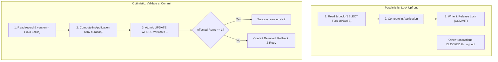

import Tabs from '@theme/Tabs';
import TabItem from '@theme/TabItem';

<span className="badge badge--warning margin-bottom--md">Medium</span>

> **Interview Question:** "What is the difference between optimistic and pessimistic locking? When should you choose each in production systems, what are the roles of `SELECT FOR UPDATE`, `NOWAIT`, and `SKIP LOCKED`, and how do you handle optimistic retry storms?"

---

### Core Concurrency Control Paradigms

When multiple concurrent database transactions attempt to read-modify-write the same record, systems must prevent the **Lost Update Problem** (where Transaction B silently overwrites Transaction A's uncommitted work).

- **Pessimistic Locking (Lock Upfront):** Assumes conflicts are **frequent and catastrophic**. It acquires exclusive database locks immediately upon reading the row, forcing concurrent transactions to wait in line.
- **Optimistic Locking (Validate at Commit):** Assumes conflicts are **rare**. It allows concurrent transactions to read and compute without acquiring database locks, checking for conflicts via a version counter right before committing.



---

### Comparison: Pessimistic vs. Optimistic Locking

| Dimension | Pessimistic Locking | Optimistic Locking |
| :--- | :--- | :--- |
| **Philosophical Assumption** | High contention; conflicts are probable. | Low contention; conflicts are rare. |
| **Locking Mechanism** | Database-level row/table locks (`FOR UPDATE`). | Application-level `version` column check. |
| **Deadlock Risk** | **High** (threads hold locks and wait on others). | **Zero** (no locks held during think time). |
| **Throughput / Scalability**| Low to Moderate (blocks concurrent threads). | **Very High** (reads never block). |
| **Failure Cost** | Transactions wait in queues, risking pool timeouts.| Aborted transactions must retry or notify users. |
| **Ideal Workloads** | High contention, financial balances, inventory reservation. | Read-heavy workloads, CMS edits, long user sessions. |

---

### Pessimistic Locking Flavors: `FOR UPDATE`, `NOWAIT` & `SKIP LOCKED`

In PostgreSQL, MySQL (InnoDB), and Oracle, pessimistic locking is implemented via the `SELECT ... FOR UPDATE` family:

#### 1. Standard `SELECT ... FOR UPDATE`
Acquires an Exclusive Lock on matching rows. Any other transaction attempting to read with `FOR UPDATE` or mutate these rows will block until the locking transaction issues `COMMIT` or `ROLLBACK`.
```sql
BEGIN;
SELECT balance FROM Accounts WHERE user_id = 101 FOR UPDATE;
-- Application logic...
UPDATE Accounts SET balance = balance - 50 WHERE user_id = 101;
COMMIT;
```

#### 2. `SELECT ... FOR UPDATE NOWAIT`
If any matching row is already locked by another transaction, the database does **not** block. It fails immediately with an error (`could not obtain lock on row`).
- *Use Case:* High-speed interactive APIs where blocking a worker thread for 5 seconds is unacceptable.

#### 3. `SELECT ... FOR UPDATE SKIP LOCKED` (The Queue Worker Standard)
> **Staff-Level Bar Raiser:** How do you build an ultra-high-throughput message queue or job processor in PostgreSQL without deadlocks?

Instead of waiting for locked rows or failing, `SKIP LOCKED` **silently ignores rows locked by other workers** and immediately locks the next available free rows!
```sql
-- 50 worker threads can run this concurrently without blocking each other!
BEGIN;
SELECT job_id, payload 
FROM Jobs 
WHERE status = 'pending' 
ORDER BY priority DESC 
LIMIT 1 
FOR UPDATE SKIP LOCKED;

UPDATE Jobs SET status = 'processing' WHERE job_id = :job_id;
COMMIT;
```

---

### Optimistic Locking Mechanics & The ABA Problem

Optimistic locking adds a dedicated `version INT` column (or monotonic timestamp) to the schema:

```sql
-- Step 1: Read without locks
SELECT id, title, content, version FROM Articles WHERE id = 42;
-- Reads version = 5

-- Step 2: Atomic update with version verification
UPDATE Articles 
SET content = 'New text...', version = version + 1 
WHERE id = 42 AND version = 5;
```

#### The Engine's Decision:
- If `affected_rows == 1`: Update succeeded. The record is now version 6.
- If `affected_rows == 0`: Another transaction committed an update in the interim (version is already 6). The application rolls back and prompts the user or retries.

#### Why Not Check Old Data Values? (The ABA Trap)
Never attempt optimistic locking with `WHERE content = 'old text'`. If User A changes content from `"A"` to `"B"`, and User B immediately changes it back from `"B"` to `"A"`, User C's stale update will succeed even though the record underwent two intermediate mutations! A strictly monotonic `version` integer completely prevents the **ABA Problem**.

---

### The Optimistic Retry Storm Vulnerability

> **Production Pitfall:** In extreme contention scenarios (e.g., a flash sale with 10,000 requests per second competing for 10 tickets), optimistic locking breaks down completely.

- 1 transaction succeeds; 9,999 transactions fail and abort.
- If all 9,999 clients immediately retry, they generate an **Optimistic Retry Storm**, hammering the database with 100,000 useless queries, saturating connection pools, and thrashing CPU.

#### Mitigations:
1. **Exponential Backoff with Random Jitter:** Space out retries to desynchronize requests.
2. **Switch to Pessimistic Locks:** For high-contention write bottlenecks, locking serialized rows upfront is far more efficient than thousands of aborts and retries.
3. **Atomic Decrement Queries:**
   ```sql
   UPDATE Inventory SET stock = stock - 1 WHERE item_id = 42 AND stock > 0;
   ```

---

### The Interview Answer (60-90 seconds)

> "Pessimistic locking prevents concurrent modification upfront by placing database-level exclusive row locks via `SELECT ... FOR UPDATE`, making it ideal for high-contention, high-value operations like bank withdrawals or ticket reservations. It prevents lost updates entirely, but risks deadlocks and reduces throughput.
>
> In contrast, optimistic locking avoids locks during reading. It uses a monotonically increasing `version` column, validating that the version hasn't changed at the moment of update (`WHERE id = ? AND version = ?`). It excels in read-heavy, low-contention environments like web applications, but can cause catastrophic retry storms under extreme contention.
>
> Furthermore, pessimistic locking offers specialized modes: `NOWAIT` to fail instantly if a lock is contested, and `SKIP LOCKED`, which is the industry standard for implementing lock-free distributed job queues in PostgreSQL."

---

### Code Demonstration: Simulating Optimistic Conflict Detection & Retry

The following Python script simulates two concurrent threads updating a shared bank account using optimistic locking, demonstrating conflict detection and automatic retry.

```python
import sqlite3
import threading
import time

def setup_db():
    conn = sqlite3.connect("optimistic_demo.db")
    cursor = conn.cursor()
    cursor.execute("DROP TABLE IF EXISTS Account;")
    cursor.execute("""
        CREATE TABLE Account (
            account_id INT PRIMARY KEY,
            balance REAL NOT NULL,
            version INT NOT NULL
        );
    """)
    cursor.execute("INSERT INTO Account VALUES (1, 1000.0, 1);")
    conn.commit()
    conn.close()

def optimistic_transfer(worker_name: str, deposit_amount: float):
    conn = sqlite3.connect("optimistic_demo.db", timeout=10.0)
    cursor = conn.cursor()
    
    max_retries = 3
    for attempt in range(1, max_retries + 1):
        # 1. Read balance and current version (No locks held!)
        cursor.execute("SELECT balance, version FROM Account WHERE account_id = 1;")
        balance, version = cursor.fetchone()
        
        # Simulate slight network / compute delay
        time.sleep(0.05)
        new_balance = balance + deposit_amount
        
        # 2. Attempt atomic update with version verification
        cursor.execute("""
            UPDATE Account 
            SET balance = ?, version = version + 1 
            WHERE account_id = 1 AND version = ?;
        """, (new_balance, version))
        conn.commit()
        
        if cursor.rowcount == 1:
            print(f"[{worker_name}] Attempt {attempt}: SUCCESS! Deposited {deposit_amount}. New Balance: {new_balance}")
            break
        else:
            print(f"[{worker_name}] Attempt {attempt}: CONFLICT DETECTED! (Expected version {version} was modified). Retrying...")
            time.sleep(0.02)
    conn.close()

if __name__ == "__main__":
    setup_db()
    print("--- Simulating Concurrent Optimistic Updates ---")
    t1 = threading.Thread(target=optimistic_transfer, args=("Thread-A", 100.0))
    t2 = threading.Thread(target=optimistic_transfer, args=("Thread-B", 200.0))

    t1.start()
    t2.start()
    t1.join()
    t2.join()

    # Final Verification
    conn = sqlite3.connect("optimistic_demo.db")
    c = conn.cursor()
    c.execute("SELECT balance, version FROM Account WHERE account_id = 1;")
    final_balance, final_version = c.fetchone()
    print(f"\nFinal State: Balance = {final_balance} | Version = {final_version} (Both updates applied cleanly!)")
    conn.close()
```
