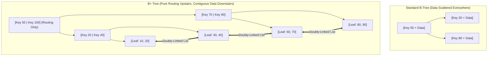

import Tabs from '@theme/Tabs';
import TabItem from '@theme/TabItem';

<span className="badge badge--warning margin-bottom--md">Medium</span>

> **Interview Question:** "Why do relational database storage engines (like MySQL InnoDB and PostgreSQL) use B+ Trees instead of standard B-Trees? Prove mathematically why B+ Trees have higher fan-out, and explain how leaf node linked lists optimize range scans."

---

### High-Level Comparison: B-Tree vs. B+ Tree

Both B-Trees and B+ Trees are self-balancing, multi-way search trees optimized for block storage devices (HDDs and SSDs). However, almost every major relational database engine (MySQL InnoDB, Postgres, SQLite, SQL Server, Oracle) selects the **B+ Tree** variant:

| Architectural Dimension | Standard B-Tree | B+ Tree |
| :--- | :--- | :--- |
| **Data Storage Location** | Keys AND row data/pointers stored in **all nodes** (root, internal, and leaves). | Row data/pointers stored **exclusively in Leaf Nodes**; internal nodes store only routing keys. |
| **Internal Node Fan-Out** | **Low:** Data payloads consume page bytes, leaving fewer slots for child pointers. | **Extremely High:** Internal nodes store only tiny `(key, pointer)` pairs. |
| **Tree Height** | Taller for large datasets ($4\text{--}6$ levels). | **Shorter and flatter** ($3\text{--}4$ levels for billions of rows). |
| **Leaf Node Connections**| Leaf nodes are completely independent. | All leaf nodes are connected via a **Doubly-Linked List**. |
| **Range Queries** | Requires expensive **in-order tree traversals** (jumping up and down levels). | Fast **sequential scan** across the leaf-level linked list. |
| **Search Latency** | Variable: $O(1)$ if found at root, $O(\log N)$ at leaf. | **Deterministic & Uniform:** Every lookup takes identical path length. |



---

### Mathematical Proof: Fan-Out & Capacity Calculation

> **Staff-Level Bar Raiser:** Prove with concrete numbers why B+ Trees minimize disk I/O.

Suppose a database uses a standard **16KB page size** ($16{,}384\text{ bytes}$, default in MySQL InnoDB):
- Key size: 8 bytes (`BIGINT`).
- Child page pointer: 6 bytes.
- Row data / tuple pointer: 100 bytes.

#### 1. Standard B-Tree Fan-Out
In a standard B-Tree, every entry in an internal node stores the key, the child pointer, and the actual row data:
$$\text{Entry Size} = 8 + 6 + 100 = 114\text{ bytes}$$
$$\text{Fan-Out } B_{\text{B-Tree}} \approx \frac{16{,}384}{114} \approx 143\text{ child pointers}$$

A 3-level B-Tree can index at most:
$$143^3 \approx 2{,}924{,}207 \approx \mathbf{2.9\text{ million rows}}$$

#### 2. B+ Tree Fan-Out
In a B+ Tree, internal nodes store **only keys and child pointers** ($8 + 6 = 14\text{ bytes}$):
$$\text{Fan-Out } B_{\text{B+ Tree}} \approx \frac{16{,}384}{14} \approx \mathbf{1{,}170\text{ child pointers!}}$$

Assume leaf pages store the 100-byte row records ($\approx 16{,}384 / 100 \approx 160\text{ rows per leaf page}$):
A 3-level B+ Tree can index:
$$1{,}170 \times 1{,}170 \times 160 \approx \mathbf{219{,}024{,}000\text{ rows (219 million rows!)}}$$

A 4-level B+ Tree can index:
$$1{,}170 \times 1{,}170 \times 1{,}170 \times 160 \approx \mathbf{256\text{ billion rows!}}$$

#### Why This Matters for Performance:
In production, the root page and level-1 intermediate pages are permanently cached in the database **Buffer Pool (RAM)**. Because a B+ Tree is only 3 levels deep for 200+ million records, **a point lookup requires at most 1 physical disk read**!

---

### Range Queries: $O(\log N + K)$ vs. In-Order Traversal

Relational queries are overwhelmingly range-based:
```sql
SELECT * FROM Orders WHERE order_date BETWEEN '2026-01-01' AND '2026-01-31';
```

- **In a Standard B-Tree:** The engine must perform a recursive **in-order tree traversal**. It must jump up to parent pages, down to left children, and up to right children, causing dozens of random page I/Os across the disk.
- **In a B+ Tree:**
  1. The engine performs a single binary search ($O(\log N)$) down to the leaf node holding `'2026-01-01'`.
  2. It then simply **walks along the horizontal doubly-linked list** at the leaf level ($O(K)$) until it hits `'2026-01-31'`.
  3. Adjacent leaf pages are physically stored contiguously on disk, allowing storage controllers to trigger **hardware read-ahead**, converting random seeks into high-throughput sequential reads.

---

### The Interview Answer (60-90 seconds)

> "Databases choose B+ Trees over standard B-Trees for two primary reasons: higher fan-out and optimal range scan performance.
>
> First, standard B-Trees store row data inside internal nodes, consuming page space and limiting fan-out to roughly 100. In contrast, B+ Trees store data exclusively in leaf nodes. Internal nodes hold only routing keys and child pointers, boosting fan-out to over 1,100 per 16KB page. A 3-level B+ Tree can index over 200 million records, meaning any record can be found in at most 3 hops, with upper levels cached in RAM.
>
> Second, B+ Trees link all leaf nodes in a horizontal doubly-linked list. A range query performs a single binary search to find the start key, and then sequentially traverses the linked list, turning random disk seeks into blistering sequential I/O.
>
> While a standard B-Tree can theoretically return a key in $O(1)$ if it sits at the root, relational databases prioritize predictable latency and massive range scan throughput over occasional root-level hits."

---

### Code Demonstration: Simulating B-Tree vs. B+ Tree Range Scans

The following Python script simulates range retrieval in a B-Tree (recursive in-order traversal requiring multiple parent-child node hops) versus a B+ Tree (horizontal leaf traversal), measuring the total number of node visits.

```python
class BTreeNode:
    def __init__(self, keys, values, children=None):
        self.keys = keys
        self.values = values
        self.children = children or []

class BPlusLeafNode:
    def __init__(self, keys, values):
        self.keys = keys
        self.values = values
        self.next = None  # Pointer to next leaf node

def simulate_range_scans():
    print("--- Simulating Range Scan: Keys [25 to 75] ---")

    # 1. B-Tree Simulation: Keys and data scattered across levels
    # In-order traversal counter
    btree_node_visits = 0
    def btree_inorder_range(node, low, high):
        nonlocal btree_node_visits
        if not node:
            return []
        btree_node_visits += 1
        results = []
        for i, k in enumerate(node.keys):
            if node.children and k > low:
                results.extend(btree_inorder_range(node.children[i], low, high))
            if low <= k <= high:
                results.append((k, node.values[i]))
        if node.children and node.keys[-1] < high:
            results.extend(btree_inorder_range(node.children[-1], low, high))
        return results

    # Construct small 2-level B-Tree
    root_btree = BTreeNode(
        keys=[50], values=["Data_50"],
        children=[
            BTreeNode([20, 30, 40], ["D20", "D30", "D40"]),
            BTreeNode([60, 70, 80], ["D60", "D70", "D80"])
        ]
    )
    b_tree_results = btree_inorder_range(root_btree, 25, 75)

    # 2. B+ Tree Simulation: Direct binary search to leaf + horizontal linked list
    leaf1 = BPlusLeafNode([20, 30, 40], ["D20", "D30", "D40"])
    leaf2 = BPlusLeafNode([50, 60, 70], ["D50", "D60", "D70"])
    leaf3 = BPlusLeafNode([80, 90, 100], ["D80", "D90", "D100"])
    leaf1.next = leaf2
    leaf2.next = leaf3

    # Seek down to leaf1 (1 seek to root, 1 seek to leaf1 = 2 seeks)
    bplus_node_visits = 2  # Root + target leaf
    curr_leaf = leaf1
    bplus_results = []
    while curr_leaf:
        for k, v in zip(curr_leaf.keys, curr_leaf.values):
            if 25 <= k <= 75:
                bplus_results.append((k, v))
            elif k > 75:
                break
        if curr_leaf.keys[-1] >= 75:
            break
        curr_leaf = curr_leaf.next
        if curr_leaf:
            bplus_node_visits += 1

    print(f"B-Tree Range Traversal  : {len(b_tree_results)} items found | Node Visits: {btree_node_visits} (Jumping up/down)")
    print(f"B+ Tree Leaf Linked Walk: {len(bplus_results)} items found | Node Visits: {bplus_node_visits} (Direct sequential walk)")
    print("Notice: B+ Tree avoids re-visiting internal nodes during range scanning!")

if __name__ == "__main__":
    simulate_range_scans()
```
