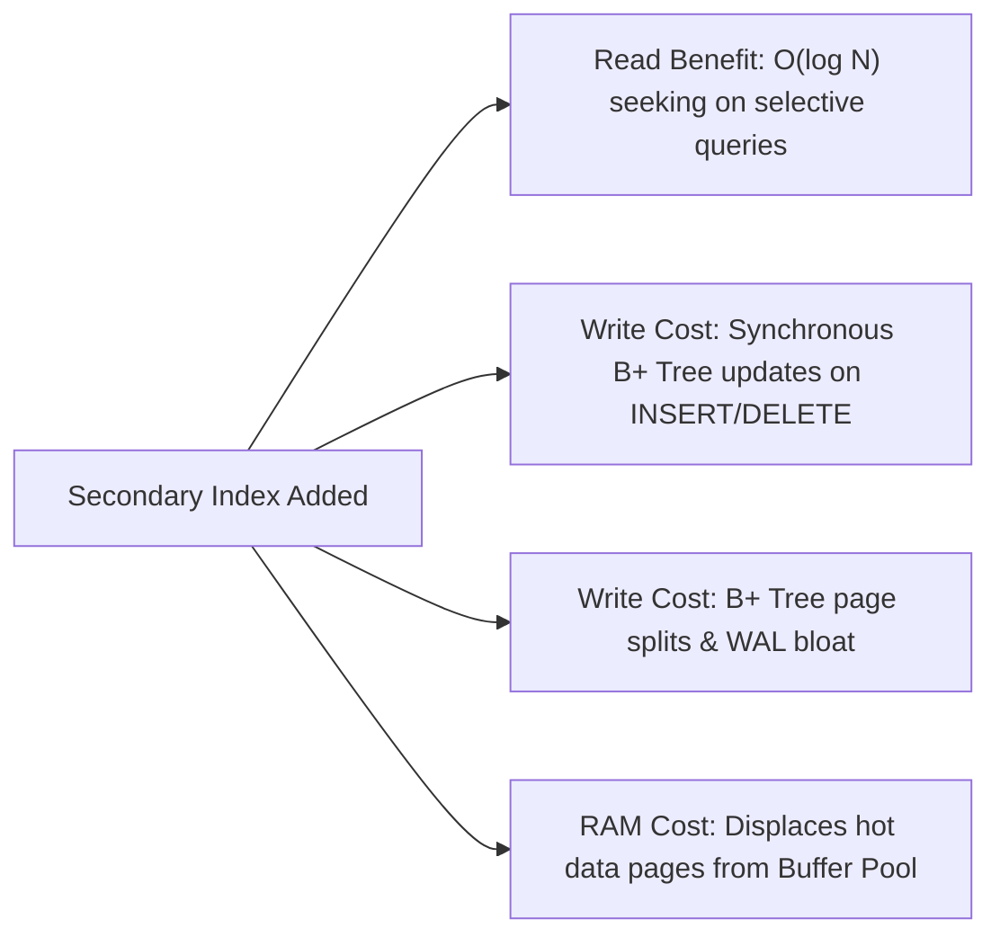

import Tabs from '@theme/Tabs';
import TabItem from '@theme/TabItem';

<span className="badge badge--warning margin-bottom--md">Medium</span>

> **Interview Question:** "When would you deliberately NOT create an index on a column, even if that column frequently appears in `WHERE` clauses? Explain the Cost-Based Optimizer's selectivity threshold, write amplification, and PostgreSQL's Heap-Only Tuples (HOT)."

---

### The Indexing Trade-Off

A prevalent junior misconception is that *"adding indexes always accelerates queries"*. In high-throughput production systems, indexes are not free; they represent a fundamental engineering trade-off: **faster read queries in exchange for degraded write throughput, increased disk footprint, and buffer pool RAM contention**.



---

### The 5 Scenarios Where Indexing Hurts Performance

#### 1. Low Cardinality & The CBO Selectivity Tipping Point
**Cardinality** is the number of distinct values in a column. **Selectivity** measures how uniquely a query filter isolates rows:

$$\text{Selectivity} = \frac{\text{Rows Returned}}{\text{Total Table Rows}}$$

- **The Tipping Point:** If a query filter matches more than **15% to 20%** of the rows in a table (e.g., `is_active = TRUE` or `gender = 'F'`), the **Cost-Based Optimizer (CBO)** will **deliberately ignore the index** and execute a Full Table Scan!
- **Why? The Cost of Random Bookmark Lookups:**
  Reading 500,000 rows through an index requires 500,000 random I/O page dereferences to fetch data from the clustered table. In contrast, a Full Table Scan reads pages sequentially from disk, utilizing hardware read-ahead to stream data into RAM at gigabytes per second. Traversing the index is substantially slower.

#### 2. Small Tables (Under a Few Thousand Rows)
If a table has fewer than 1,000 to 2,000 rows (e.g., lookup tables like `country_codes` or `roles`):
- The entire table occupies just one or two 8KB/16KB disk pages in memory.
- A sequential scan reads these pages in under 0.05 milliseconds.
- Using an index requires reading an index page to find a pointer, then reading the data page—doubling memory page dereferences for zero gain.

#### 3. Write-Heavy Ingestion Pipelines
In systems where the write-to-read ratio is extreme ($50:1$ or $100:1$, such as IoT telemetry, audit logs, or clickstreams):
- Every `INSERT` must synchronously traverse and update every secondary B+ tree index on the table.
- When an index leaf page is full, it triggers an expensive **B+ Tree Page Split**, allocating a new disk block, shuffling keys, and propagating updates up the tree.
- Adding 5 unneeded indexes can degrade ingestion write throughput by **70% to 80%**.

#### 4. Frequently Updated Columns & PostgreSQL Heap-Only Tuples (HOT)
When a column undergoes frequent mutations (e.g., `last_heartbeat_at`, `view_count`):
- In PostgreSQL, **Heap-Only Tuples (HOT)** is a critical optimization: if an `UPDATE` modifies a row and the new version fits in the same disk page, PostgreSQL chains the old tuple to the new tuple **without modifying any secondary indexes**!
- If you add an index on that updated column, **HOT is permanently disabled for those updates**. The database is forced to insert new index pointers into every single index on the table, causing severe index bloat and crushing Write-Ahead Log (WAL) throughput.

#### 5. Wide Text Columns Without Prefix Indexing
Indexing wide string columns (e.g., `VARCHAR(1000)` comments or URLs):
- Consumes massive page bytes, reducing B+ tree fan-out and inflating tree height.
- Evicts active data pages from the database buffer pool cache.
- *Best Practice:* Use prefix indexing (`CREATE INDEX idx_url ON links (url(30));`) or Full-Text search engines (GIN/GiST indexes or Elasticsearch).

---

### The Production Alternative: Partial (Filtered) Indexes

If a low-cardinality column has a highly skewed distribution where one specific value is exceptionally rare, use a **Partial Index** (supported natively in PostgreSQL and SQL Server):

```sql
-- 99.9% of orders are 'processed', 0.1% are 'failed'
CREATE INDEX idx_failed_orders 
ON Orders (created_at) 
WHERE status = 'failed';
```

- This index ignores the millions of `'processed'` rows and indexes only the few thousand `'failed'` rows.
- The index consumes negligible disk/RAM, incurs zero write penalty during normal order processing, and provides lightning-fast index seeking when querying for failures!

---

### The Interview Answer (60-90 seconds)

> "You should deliberately avoid creating an index in five key scenarios:
>
> 1. **Low Cardinality Columns:** If a column has few distinct values (like boolean flags), query selectivity will exceed 15% to 20%. The Cost-Based Optimizer will ignore the index and favor a Full Table Scan because random index bookmark lookups are far slower than sequential block scans.
> 2. **Small Tables:** Tables with fewer than a few thousand rows fit in one or two disk pages; traversing an index adds extra page reads for no benefit.
> 3. **Write-Heavy Ingestion Tables:** In audit logs or telemetry streams, every index degrades `INSERT` throughput by requiring synchronous B+ tree updates and triggering page splits.
> 4. **Frequently Updated Columns:** Modifying an indexed column breaks PostgreSQL's Heap-Only Tuples (HOT) optimization, causing massive write amplification and index bloat.
> 5. **Wide Text Columns:** Indexing large strings destroys B+ tree fan-out and wastes buffer pool memory.
>
> Where a low-cardinality status must be indexed, the senior solution is a Partial Index, indexing only the rare values while ignoring the majority."

---

### Code Demonstration: Write Ingestion Penalty Benchmark

The following Python script benchmarks how adding secondary indexes exponentially slows down `INSERT` operations and measures the time difference when inserting 100,000 rows into an unindexed versus multi-indexed table.

```python
import sqlite3
import time

def benchmark_indexing_overhead():
    conn = sqlite3.connect(":memory:")
    cursor = conn.cursor()

    NUM_ROWS = 100_000

    # 1. Benchmark Table with NO secondary indexes
    cursor.execute("""
        CREATE TABLE Ingestion_NoIndex (
            id INTEGER PRIMARY KEY,
            device_id INT,
            metric_val REAL,
            status TEXT
        );
    """)

    t0 = time.perf_counter()
    cursor.execute("BEGIN TRANSACTION;")
    for i in range(NUM_ROWS):
        cursor.execute("INSERT INTO Ingestion_NoIndex VALUES (?, ?, ?, ?);",
                       (i, i % 500, float(i * 1.5), "active"))
    conn.commit()
    t_no_index = time.perf_counter() - t0

    # 2. Benchmark Table with 4 Secondary Indexes
    cursor.execute("""
        CREATE TABLE Ingestion_WithIndexes (
            id INTEGER PRIMARY KEY,
            device_id INT,
            metric_val REAL,
            status TEXT
        );
    """)
    cursor.execute("CREATE INDEX idx_dev ON Ingestion_WithIndexes(device_id);")
    cursor.execute("CREATE INDEX idx_met ON Ingestion_WithIndexes(metric_val);")
    cursor.execute("CREATE INDEX idx_stat ON Ingestion_WithIndexes(status);")
    cursor.execute("CREATE INDEX idx_comp ON Ingestion_WithIndexes(device_id, status);")

    t1 = time.perf_counter()
    cursor.execute("BEGIN TRANSACTION;")
    for i in range(NUM_ROWS):
        cursor.execute("INSERT INTO Ingestion_WithIndexes VALUES (?, ?, ?, ?);",
                       (i, i % 500, float(i * 1.5), "active"))
    conn.commit()
    t_with_indexes = time.perf_counter() - t1

    print(f"[*] Ingesting {NUM_ROWS:,} rows:")
    print(f"    - Table with 0 Indexes : {t_no_index:.2f} seconds")
    print(f"    - Table with 4 Indexes : {t_with_indexes:.2f} seconds")
    print(f"    - Ingestion Degradation: {((t_with_indexes - t_no_index) / t_no_index) * 100:.1f}% slower due to B+ Tree updates!")

    conn.close()

if __name__ == "__main__":
    benchmark_indexing_overhead()
```
