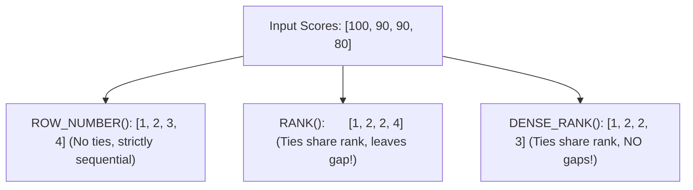

import Tabs from '@theme/Tabs';
import TabItem from '@theme/TabItem';

<span className="badge badge--warning margin-bottom--md">Medium</span>

> **Interview Question:** "What is the difference between `ROW_NUMBER()`, `RANK()`, and `DENSE_RANK()` in SQL? How does each handle duplicate ties mathematically, why can't window functions be filtered in a `WHERE` clause, and how do you find the top 2 highest earners per department?"

---

### The 3 Window Ranking Functions

SQL provides three foundational window ranking functions to assign ordinal positions to rows within a partition. The fundamental differences lie in **how they handle ties** and **whether they introduce gaps into the ranking sequence**:



---

### Comparison Matrix & Mathematical Definitions

Let $r$ be the current row in a sorted partition:

| Function | Mathematical Definition | Handling of Duplicate Ties | Leaves Gaps? | Primary Use Case |
| :--- | :--- | :--- | :---: | :--- |
| **`ROW_NUMBER()`** | $\text{ROW\_NUMBER}(r) = r$ | Ignores ties; assigns arbitrary sequential order | **No** | Pagination; deduplicating records (`WHERE rn = 1`). |
| **`RANK()`** | $1 + \sum_{i < r} 1$ | Identical values receive identical rank | **Yes** | Olympic competitions (two silver medals $\implies$ next is 4th). |
| **`DENSE_RANK()`** | $1 + \text{distinct\_count}(v < v_r)$ | Identical values receive identical rank | **No** | N-th highest distinct values (2nd highest salary, top leaderboards). |

---

### Visualizing the Difference in Action

Suppose we execute all three functions on an `Employees` table ordered by salary descending:

```sql
SELECT 
    name, 
    salary,
    ROW_NUMBER() OVER (ORDER BY salary DESC) AS row_num,
    RANK()       OVER (ORDER BY salary DESC) AS rnk,
    DENSE_RANK() OVER (ORDER BY salary DESC) AS dense_rnk
FROM Employees;
```

#### Output:

| Name | Salary | `ROW_NUMBER()` | `RANK()` | `DENSE_RANK()` | Analysis |
| :--- | :---: | :---: | :---: | :---: | :--- |
| **Alice** | \$100,000 | **1** | **1** | **1** | Sole highest salary |
| **Bob** | \$80,000 | **2** | **2** | **2** | Tied for 2nd place |
| **Charlie** | \$80,000 | **3** | **2** | **2** | Tied for 2nd place |
| **David** | \$70,000 | **4** | **4** | **3** | **Notice:** `RANK()` jumped to 4; `DENSE_RANK()` moved to 3! |
| **Emma** | \$60,000 | **5** | **5** | **4** | Dense sequence continues without skipping |

---

### The Non-Deterministic `ROW_NUMBER()` Trap

> **Staff-Level Trap:** If you call `ROW_NUMBER() OVER (ORDER BY salary DESC)` on rows with identical salaries without specifying a secondary unique column, **the returned ranking is non-deterministic**!

The database engine is free to assign `2` to Bob and `3` to Charlie on execution 1, and swap them on execution 2.
- **The Remedy:** Always provide a deterministic tie-breaker column in the `ORDER BY` clause:
```sql
ROW_NUMBER() OVER (ORDER BY salary DESC, employee_id ASC)
```

---

### Why Window Functions Cannot Be Filtered in a `WHERE` Clause

A common junior error is attempting to filter directly on a window function:
```sql
-- SYNTAX ERROR: Window functions not allowed here!
SELECT name, salary FROM Employees WHERE DENSE_RANK() OVER (ORDER BY salary DESC) <= 2;
```

#### The Reason: SQL Logical Query Processing Order
The relational engine evaluates clauses in this strict logical sequence:
1. `FROM` & `JOIN`
2. `WHERE` (Filters physical table rows)
3. `GROUP BY`
4. `HAVING`
5. `SELECT`
6. **Window Functions** (Evaluated *after* filtering and grouping!)
7. `ORDER BY`
8. `LIMIT`

Because the `WHERE` clause executes **before** window functions are calculated, the engine cannot filter on them directly. You must wrap the query in a **Common Table Expression (CTE)** or subquery!

---

### The Canonical Interview Query: Top-N Earners Per Department

```sql
WITH RankedDepartmentSalaries AS (
    SELECT 
        department_id,
        name,
        salary,
        DENSE_RANK() OVER (
            PARTITION BY department_id 
            ORDER BY salary DESC
        ) AS rnk
    FROM Employees
)
SELECT department_id, name, salary, rnk
FROM RankedDepartmentSalaries
WHERE rnk <= 2
ORDER BY department_id, rnk;
```

---

### The Interview Answer (60-90 seconds)

> "`ROW_NUMBER()`, `RANK()`, and `DENSE_RANK()` are window functions that evaluate rows within a partition.
>
> `ROW_NUMBER()` assigns a strictly unique, sequential integer to every row regardless of ties. Because identical values are ordered non-deterministically, a secondary tie-breaker column should always be provided in `ORDER BY`.
>
> `RANK()` assigns the same rank to identical values, but skips numbers for subsequent rows, leaving gaps in the ranking sequence equal to the number of ties.
>
> `DENSE_RANK()` also gives tied values the same rank, but leaves zero gaps, ensuring that the N-th distinct value receives rank $N$. This makes `DENSE_RANK()` the correct tool for finding the N-th highest metrics.
>
> Finally, because window functions are evaluated in the `SELECT` phase—long after the `WHERE` clause filters rows—filtering by rank requires wrapping the window query inside a CTE or subquery."

---

### Code Demonstration: Ranking Functions & Top-N Per Department

The following Python script tests `ROW_NUMBER()`, `RANK()`, and `DENSE_RANK()` in SQLite, proving gap behavior and solving the top-2 earners per department query.

```python
import sqlite3

def run_ranking_demo():
    conn = sqlite3.connect(":memory:")
    cursor = conn.cursor()

    cursor.execute("""
        CREATE TABLE Employees (
            emp_id INT PRIMARY KEY,
            name TEXT,
            dept_id INT,
            salary INT
        );
    """)

    cursor.executemany("INSERT INTO Employees VALUES (?, ?, ?, ?);", [
        (1, 'Alice',   10, 100000),
        (2, 'Bob',     10, 80000),
        (3, 'Charlie', 10, 80000),
        (4, 'David',   10, 70000),
        (5, 'Eve',     20, 120000),
        (6, 'Frank',   20, 95000),
        (7, 'Grace',   20, 95000)
    ])
    conn.commit()

    print("--- 1. Comparing Ranking Functions (Department 10) ---")
    cursor.execute("""
        SELECT 
            name, salary,
            ROW_NUMBER() OVER (ORDER BY salary DESC, emp_id ASC) as rn,
            RANK()       OVER (ORDER BY salary DESC) as rk,
            DENSE_RANK() OVER (ORDER BY salary DESC) as dr
        FROM Employees
        WHERE dept_id = 10;
    """)
    print(f"{'Name':<10} | {'Salary':<7} | {'ROW_NUM':<7} | {'RANK':<5} | {'DENSE_RANK':<10}")
    print("-" * 50)
    for row in cursor.fetchall():
        print(f"{row[0]:<10} | ${row[1]:<6} | {row[2]:<7} | {row[3]:<5} | {row[4]:<10}")

    print("\n--- 2. Querying Top 2 Highest Earners Per Department ---")
    cursor.execute("""
        WITH DepartmentRanks AS (
            SELECT 
                dept_id, name, salary,
                DENSE_RANK() OVER (PARTITION BY dept_id ORDER BY salary DESC) as rnk
            FROM Employees
        )
        SELECT dept_id, name, salary, rnk
        FROM DepartmentRanks
        WHERE rnk <= 2
        ORDER BY dept_id, rnk;
    """)
    print(f"{'Dept':<5} | {'Name':<10} | {'Salary':<7} | {'Rank':<5}")
    print("-" * 35)
    for row in cursor.fetchall():
        print(f"{row[0]:<5} | {row[1]:<10} | ${row[2]:<6} | {row[3]:<5}")

    conn.close()

if __name__ == "__main__":
    run_ranking_demo()
```
