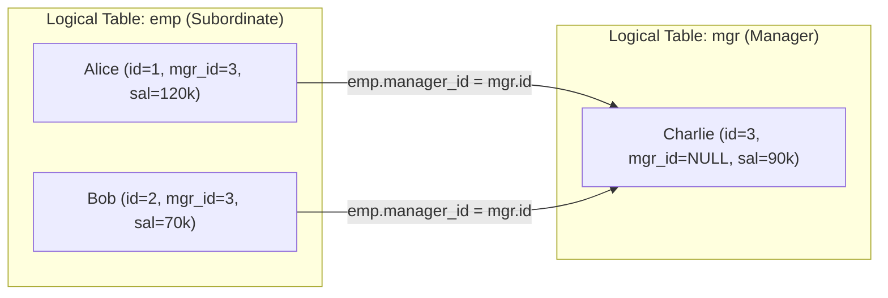

import Tabs from '@theme/Tabs';
import TabItem from '@theme/TabItem';

<span className="badge badge--warning margin-bottom--md">Medium</span>

> **Interview Question:** "Given an Employee table containing `(id, name, salary, manager_id)`, write a query to find all employees who earn more than their direct manager. How does the query optimizer execute this self-join physically, what index should you create, and how would you find employees earning more than ANY manager in their entire upstream reporting chain?"

---

### Schema & The Self-Join Paradigm

Hierarchical relationships within a single entity (such as employees reporting to managers, or categories having parent categories) are modeled using a unary relationship where a foreign key points back to the table's own primary key.

Table: `Employee`
- `id` (INT, Primary Key)
- `name` (VARCHAR)
- `salary` (INT)
- `manager_id` (INT, Foreign Key referencing `Employee.id`, Nullable)

A **Self-Join** treats the single physical table as two distinct logical relations in memory by assigning different table aliases: `emp` (representing the subordinate) and `mgr` (representing the manager).



---

### Solution 1: Explicit `INNER JOIN` (The Production Standard)

```sql
SELECT 
    emp.name AS Employee,
    emp.salary AS EmpSalary,
    mgr.name AS Manager,
    mgr.salary AS MgrSalary
FROM Employee emp
INNER JOIN Employee mgr 
    ON emp.manager_id = mgr.id
WHERE emp.salary > mgr.salary;
```

#### Execution Mechanics:
1. `INNER JOIN Employee mgr ON emp.manager_id = mgr.id`: Matches each subordinate row with their direct manager's row.
2. **Automatic Filtering of CEOs:** If an employee has `manager_id IS NULL` (e.g., the CEO or board chair), standard `INNER JOIN` equality fails (`NULL = mgr.id` evaluates to `UNKNOWN`), automatically discarding root nodes from the comparison without requiring an explicit `WHERE emp.manager_id IS NOT NULL`.
3. `WHERE emp.salary > mgr.salary`: Filters for subordinates whose compensation strictly exceeds their direct superior's.

---

### Solution 2: Correlated Subquery Alternative

```sql
SELECT emp.name AS Employee
FROM Employee emp
WHERE emp.manager_id IS NOT NULL 
  AND emp.salary > (
      SELECT mgr.salary 
      FROM Employee mgr 
      WHERE mgr.id = emp.manager_id
  );
```

#### Why Solution 1 is Superior:
The `INNER JOIN` allows the database Cost-Based Optimizer (CBO) to choose optimal set-based join algorithms (such as Hash Joins or Merge Joins). A correlated subquery forces many naive optimizers to execute an $O(N)$ row-by-row nested loop lookup.

---

### Physical Join Strategies in the Optimizer

When executing `emp.manager_id = mgr.id`, the database optimizer picks one of three physical algorithms:

1. **Nested Loop Join:**
   - Evaluates each row in `emp`, performing an index seek on `mgr.id`.
   - **Optimal When:** Table is small or the outer query has a highly selective filter.
2. **Hash Join:**
   - Scans `Employee`, builds an in-memory hash table on `id`, and probes it using `manager_id`.
   - **Optimal When:** Large tables without pre-sorted order. Executed in $O(N)$ linear time.
3. **Merge Join:**
   - If rows are already sorted on the join key (e.g., via clustered index), the engine steps through both streams in parallel.

---

### Indexing Strategy for Production Scale

In an enterprise database with 5,000,000 employee records:
- `id` is already indexed as the Primary Key (Clustered Index).
- However, scanning `emp` and filtering on `manager_id` causes full table scans if `manager_id` is unindexed.
- **The Optimal Composite Covering Index:**

```sql
CREATE INDEX idx_emp_mgr_salary ON Employee (manager_id, salary);
```
- **Why?** It places `manager_id` first (allowing the engine to skip all `NULL`s immediately) and includes `salary` in the index leaf pages, transforming the query into a high-speed **Index-Only Scan**.

---

### Bar-Raiser Follow-Up: Multi-Level Hierarchy Traversal

> **Senior Interview Follow-Up:** *"A self-join only compares an employee with their immediate direct manager (1 level up). What if you want to find employees who earn more than ANY manager in their entire chain of command up to the CEO?"*

Because the depth of management tiers is variable and unknown, a static self-join is insufficient. You must use a **Recursive CTE**:

```sql
WITH RECURSIVE ManagementChain AS (
    -- 1. Anchor: Direct manager relationships (Level 1)
    SELECT 
        emp.id AS emp_id,
        emp.name AS emp_name,
        emp.salary AS emp_salary,
        mgr.id AS manager_id,
        mgr.name AS manager_name,
        mgr.salary AS manager_salary,
        1 AS depth
    FROM Employee emp
    JOIN Employee mgr ON emp.manager_id = mgr.id

    UNION ALL

    -- 2. Recursive Member: Climb up the tree to the manager's manager
    SELECT 
        mc.emp_id,
        mc.emp_name,
        mc.emp_salary,
        upper_mgr.id,
        upper_mgr.name,
        upper_mgr.salary,
        mc.depth + 1
    FROM ManagementChain mc
    JOIN Employee upper_mgr ON mc.manager_id = upper_mgr.id
)
SELECT DISTINCT emp_name, emp_salary, manager_name, manager_salary, depth
FROM ManagementChain
WHERE emp_salary > manager_salary;
```

---

### The Interview Answer (60-90 seconds)

> "To find employees who earn more than their direct manager, we use an inner self-join: `SELECT emp.name FROM Employee emp JOIN Employee mgr ON emp.manager_id = mgr.id WHERE emp.salary > mgr.salary`.
>
> The self-join treats the single physical table as two distinct logical entities. Using an `INNER JOIN` automatically handles root employees with `NULL` manager IDs because equality checks against `NULL` evaluate to `UNKNOWN`.
>
> For indexing, creating a composite index on `(manager_id, salary)` allows the query optimizer to eliminate full table scans, discard `NULL` manager IDs immediately, and satisfy the join via an Index-Only Scan.
>
> If asked to evaluate the entire hierarchical management tree rather than just the direct manager, a static self-join cannot handle the unknown depth; we must switch to a Recursive CTE that iteratively traverses the reporting chain up to the CEO."

---

### Code Demonstration: Direct Manager Self-Join & Multi-Level Tree Search

The following Python script models an organizational tree in SQLite, demonstrating both the standard direct self-join and the recursive multi-level chain traversal.

```python
import sqlite3

def test_manager_queries():
    conn = sqlite3.connect(":memory:")
    cursor = conn.cursor()

    cursor.execute("""
        CREATE TABLE Employee (
            id INT PRIMARY KEY,
            name TEXT,
            salary INT,
            manager_id INT
        );
    """)

    # Organization:
    # Alice (CEO, sal=100k)
    #   -> Bob (VP, sal=80k)
    #        -> Charlie (Principal Eng, sal=110k) -- Earns more than Bob (Direct) AND Alice (CEO)!
    #        -> David (Junior Eng, sal=60k)
    cursor.executemany("INSERT INTO Employee VALUES (?, ?, ?, ?);", [
        (1, 'Alice',   100000, None),
        (2, 'Bob',     80000,  1),
        (3, 'Charlie', 110000, 2),
        (4, 'David',   60000,  2)
    ])
    conn.commit()

    print("--- 1. Direct Manager Self-Join (Level 1) ---")
    cursor.execute("""
        SELECT 
            emp.name AS Employee,
            emp.salary AS EmpSalary,
            mgr.name AS Manager,
            mgr.salary AS MgrSalary
        FROM Employee emp
        INNER JOIN Employee mgr ON emp.manager_id = mgr.id
        WHERE emp.salary > mgr.salary;
    """)
    for row in cursor.fetchall():
        print(f"Employee {row[0]} (${row[1]:,}) earns more than direct manager {row[2]} (${row[3]:,})")

    print("\n--- 2. Multi-Level Recursive Chain Traversal ---")
    cursor.execute("""
        WITH RECURSIVE ManagementChain AS (
            SELECT 
                emp.id AS emp_id,
                emp.name AS emp_name,
                emp.salary AS emp_salary,
                mgr.id AS manager_id,
                mgr.name AS manager_name,
                mgr.salary AS manager_salary,
                1 AS depth
            FROM Employee emp
            JOIN Employee mgr ON emp.manager_id = mgr.id

            UNION ALL

            SELECT 
                mc.emp_id,
                mc.emp_name,
                mc.emp_salary,
                upper_mgr.id,
                upper_mgr.name,
                upper_mgr.salary,
                mc.depth + 1
            FROM ManagementChain mc
            JOIN Employee upper_mgr ON mc.manager_id = upper_mgr.id
            WHERE upper_mgr.id IS NOT NULL
        )
        SELECT emp_name, emp_salary, manager_name, manager_salary, depth
        FROM ManagementChain
        WHERE emp_salary > manager_salary;
    """)
    for row in cursor.fetchall():
        print(f"{row[0]} (${row[1]:,}) earns more than upstream manager {row[2]} (${row[3]:,}) [Level {row[4]} above]")

    conn.close()

if __name__ == "__main__":
    test_manager_queries()
```
