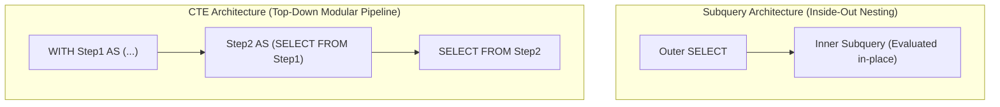

import Tabs from '@theme/Tabs';
import TabItem from '@theme/TabItem';

<span className="badge badge--warning margin-bottom--md">Medium</span>

> **Interview Question:** "What is a Common Table Expression (CTE) in SQL, and how does it differ from a subquery? Are CTEs materialized in memory or evaluated inline, when should you deliberately force materialization, and what are writable CTEs?"

---

### Conceptual Overview: CTE vs. Subquery

Both **Common Table Expressions (CTEs)** and **Subqueries** define temporary, named intermediate results within a SQL statement. However, their structural clarity and execution planner behaviors differ fundamentally:

- **Subquery (Derived Table):** Written inline within parentheses (`FROM (...) AS t`). Tends to nest "inside-out," making multi-step queries difficult to read, maintain, and reuse.
- **Common Table Expression (CTE):** Defined upfront using the `WITH` clause. Reads sequentially top-to-bottom like modular functions in application programming, can be referenced multiple times, and supports recursion.



---

### Comparison: CTE vs. Subquery

| Feature | Common Table Expression (CTE) | Subquery / Derived Table |
| :--- | :--- | :--- |
| **Readability** | **High:** Modular, top-to-bottom pipeline execution. | **Low:** Deeply nested, inside-out nesting. |
| **Reusability** | **Yes:** Can be referenced multiple times in the query. | **No:** Must duplicate the identical SQL block. |
| **Recursion** | **Yes:** Supports `WITH RECURSIVE` for tree/graph data. | **No:** Cannot self-reference. |
| **Data Modification** | **Yes:** Supports writable CTEs (`INSERT/UPDATE/DELETE RETURNING`). | Restricted to subquery operations. |
| **Scope** | Available across the entire query statement. | Confined strictly to its enclosing parentheses. |

---

### Performance: Are CTEs Inlined or Materialized?

A major senior interview topic is understanding the query optimizer's handling of CTEs:

#### 1. Modern Databases (PostgreSQL 12+, MySQL 8.0, SQL Server):
- By default, modern query planners **inline** non-recursive CTEs (known as **Subquery Flattening**).
- The optimizer merges the CTE definition directly into the parent query, pushing down `WHERE` predicates and leveraging indexes on the underlying base tables.
- Performance between an inlined CTE and a subquery is virtually identical.

#### 2. Legacy PostgreSQL (PostgreSQL 11 and earlier):
- In PostgreSQL 11 and older, CTEs functioned as rigid **Optimization Fences**.
- The engine *always* calculated and materialized the CTE into a temporary memory/disk buffer upfront, **preventing predicate pushdown**! A query filtering `WHERE id = 5` outside the CTE still forced the CTE to calculate 5,000,000 rows first.

---

### When to Deliberately Force Materialization (`MATERIALIZED`)

PostgreSQL 12+ allows developers to explicitly override optimizer inlining:
```sql
WITH CachedData AS MATERIALIZED (
    -- Forces the engine to calculate once and cache in memory
    SELECT department_id, AVG(salary) AS avg_sal 
    FROM Employees 
    GROUP BY department_id
)
```

#### Why force materialization?
1. **Multi-Referenced Expensive Subqueries:**
   If a complex aggregation or remote foreign data query is referenced 3 times (e.g., across multiple `JOIN` or `UNION` branches), inlining causes the engine to **recompute the query 3 separate times**. Forcing `MATERIALIZED` evaluates it once.
2. **Preventing Non-Deterministic Re-Execution:**
   If a CTE calls volatile functions like `RANDOM()` or `NOW()`, inlining might evaluate the function multiple times per row. Materialization guarantees a single evaluation.

---

### Staff-Level Feature: Writable (Data-Modifying) CTEs

In PostgreSQL, CTEs can contain `INSERT`, `UPDATE`, or `DELETE` statements paired with a `RETURNING` clause:

```sql
-- Atomic Data Archival: Move old orders to archive in a SINGLE query!
WITH MovedOrders AS (
    DELETE FROM ActiveOrders
    WHERE order_date < NOW() - INTERVAL '1 year'
    RETURNING *
)
INSERT INTO ArchivedOrders
SELECT * FROM MovedOrders;
```

#### Architectural Superiority:
- **Strictly Atomic:** Eliminates the risk of an application crash occurring between a separate `INSERT` and `DELETE`.
- **Zero Race Conditions:** Executes within a single transaction snapshot.
- **Minimal Network Round-Trips:** Performs the entire transfer inside the database engine in one round-trip.

---

### The Interview Answer (60-90 seconds)

> "A Common Table Expression (CTE) is a temporary named result set defined using the `WITH` clause. Compared to subqueries, CTEs dramatically improve SQL readability by structuring queries as top-to-bottom pipelines, can be referenced multiple times without duplicating code, and enable recursive queries.
>
> In modern databases like PostgreSQL 12+ and MySQL 8.0, the Cost-Based Optimizer inlines non-recursive CTEs by default, pushing down `WHERE` clauses and index scans just like derived subqueries. However, developers can explicitly specify `WITH data AS MATERIALIZED` when an expensive query is referenced multiple times across different joins or union branches to ensure it evaluates only once.
>
> Finally, PostgreSQL supports writable CTEs using `RETURNING`. This allows operations like moving expired rows from an active table to an archive table via `WITH moved AS (DELETE ... RETURNING *) INSERT INTO archive SELECT * FROM moved`, guaranteeing atomicity in a single statement."

---

### Code Demonstration: Reusable CTEs & Multi-Step Aggregations

The following Python script models an e-commerce order dataset in SQLite, demonstrating how a reusable CTE cleanly eliminates redundant subquery computations.

```python
import sqlite3

def run_cte_demo():
    conn = sqlite3.connect(":memory:")
    cursor = conn.cursor()

    cursor.execute("""
        CREATE TABLE Sales (
            id INT PRIMARY KEY,
            region TEXT,
            amount REAL
        );
    """)

    cursor.executemany("INSERT INTO Sales VALUES (?, ?, ?);", [
        (1, 'North', 1500.0),
        (2, 'North', 2500.0),
        (3, 'South', 800.0),
        (4, 'South', 1200.0),
        (5, 'East',  4000.0),
        (6, 'West',  3000.0)
    ])
    conn.commit()

    print("--- 1. Reusable CTE: Finding Regions Exceeding Company Average ---")
    # RegionalSales CTE is referenced TWICE: once for selection, once to compute overall average!
    cursor.execute("""
        WITH RegionalSales AS (
            SELECT region, SUM(amount) AS total_regional_sales
            FROM Sales
            GROUP BY region
        ),
        AverageSales AS (
            SELECT AVG(total_regional_sales) AS avg_sales
            FROM RegionalSales
        )
        SELECT 
            r.region, 
            r.total_regional_sales, 
            ROUND(a.avg_sales, 2) AS benchmark_avg
        FROM RegionalSales r
        CROSS JOIN AverageSales a
        WHERE r.total_regional_sales > a.avg_sales;
    """)
    for row in cursor.fetchall():
        print(f"Region: {row[0]:<6} | Total: ${row[1]:<7} | Benchmark Avg: ${row[2]}")

    conn.close()

if __name__ == "__main__":
    run_cte_demo()
```
