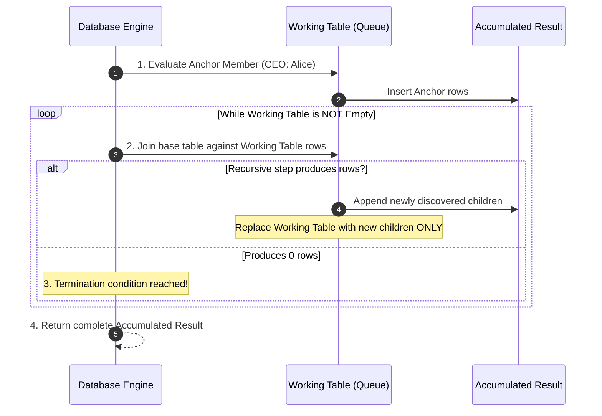

import Tabs from '@theme/Tabs';
import TabItem from '@theme/TabItem';

<span className="badge badge--danger margin-bottom--md">Hard</span>

> **Interview Question:** "What is a recursive CTE in SQL, and how does it execute iteratively under the hood? Write a query to traverse an organizational tree, explain how to compute a cumulative roll-up budget across an entire subordinate hierarchy, and how to guard against infinite loop cycles."

---

### What is a Recursive CTE?

A **Recursive Common Table Expression (CTE)** is an ANSI SQL construct that repeatedly evaluates an iterative loop, referencing its own intermediate output to query **hierarchical, tree-structured, or graph-structured data** of unknown depth:

- **Organizational Reporting Structures:** Navigating from the CEO down to individual contributors.
- **Bill of Materials (BOM):** Multi-tiered manufacturing part assemblies (Car $\to$ Engine $\to$ Piston $\to$ Ring).
- **Taxonomies & Category Trees:** E-Commerce navigation (Electronics $\to$ Computers $\to$ Laptops).
- **Graph Pathfinding:** Social networks (friends-of-friends) and flight layovers.

---

### The 3 Structural Pillars of `WITH RECURSIVE`

Every recursive CTE consists of three mandatory syntactic components combined with `UNION ALL`:

```sql
WITH RECURSIVE HierarchyCTE AS (
    -- 1. ANCHOR MEMBER: The base case (executes ONCE to seed the initial rows)
    SELECT id, name, manager_id, 1 AS level, CAST(name AS VARCHAR(255)) AS path
    FROM Employees
    WHERE manager_id IS NULL -- Starts at the CEO

    UNION ALL

    -- 2. RECURSIVE MEMBER: References HierarchyCTE (iterates over newly generated rows)
    SELECT e.id, e.name, e.manager_id, h.level + 1, CAST(h.path || ' -> ' || e.name AS VARCHAR(255))
    FROM Employees e
    INNER JOIN HierarchyCTE h ON e.manager_id = h.id
)
-- 3. TERMINATION: Loop halts automatically when the recursive member yields 0 rows
SELECT * FROM HierarchyCTE ORDER BY level, id;
```

---

### Under the Hood: The Iterative Working Table Engine

In the database kernel, recursive CTEs do **not** use procedural call stacks; they are implemented via two physical data queues: **The Intermediate Result Table** and **The Working Table**.



1. **Step 0 (Anchor Phase):** The engine executes the Anchor Query. The returned rows are written into both the *Accumulated Result* and the *Working Table*.
2. **Step 1..N (Recursive Iteration):** The engine joins the base table against the *Working Table*. Any newly discovered child rows are appended to the *Accumulated Result* and replace the contents of the *Working Table*.
3. **Termination:** The moment the recursive join produces an empty result set ($0$ rows), the iteration breaks and the accumulated rows are returned.

---

### Traversal Ordering: Breadth-First (BFS) vs. Depth-First (DFS)

Depending on reporting requirements, you can format the output hierarchy:

- **Breadth-First Search (BFS):** Displays all level-1 executives, followed by all level-2 directors, followed by managers:
  ```sql
  ORDER BY level ASC, name ASC;
  ```
- **Depth-First Search (DFS):** Displays an executive immediately followed by their subordinates before moving to peer executives:
  ```sql
  -- Order by the materialized breadcrumb path string!
  ORDER BY path ASC;
  ```

---

### Bar-Raiser Challenge: Cumulative Roll-Up Budget

> **Classic Senior Problem:** *"Calculate the total organizational budget for every manager, defined as their own salary PLUS the combined salaries of all employees reporting directly and indirectly under them."*

```sql
WITH RECURSIVE SubordinateTree AS (
    -- Anchor: Every employee reports to themselves at level 0
    SELECT id AS manager_id, id AS employee_id, salary
    FROM Employees

    UNION ALL

    -- Recursive: Find all indirect subordinates
    SELECT st.manager_id, e.id AS employee_id, e.salary
    FROM SubordinateTree st
    JOIN Employees e ON e.manager_id = st.employee_id
)
SELECT 
    mgr.name AS Manager,
    mgr.salary AS BaseSalary,
    SUM(st.salary) AS CumulativeBudget,
    COUNT(st.employee_id) - 1 AS TotalSubordinatesCount
FROM SubordinateTree st
JOIN Employees mgr ON mgr.id = st.manager_id
GROUP BY mgr.id, mgr.name, mgr.salary
ORDER BY CumulativeBudget DESC;
```

---

### The Infinite Loop Trap: Graph Cycles & Safeguards

If real-world data contains a circular reference (e.g., Alice reports to Bob, but Bob mistakenly reports to Alice), a recursive CTE will loop infinitely, exhausting database memory and CPU.

#### Defenses:
1. **Recursion Depth Limits:**
   - In SQL Server: `OPTION (MAXRECURSION 100)`.
2. **Cycle Detection Arrays (PostgreSQL & ANSI SQL):**
   Track visited node IDs in an array; terminate branches that revisit an ancestor:
```sql
WITH RECURSIVE SafeHierarchy AS (
    SELECT id, name, manager_id, ARRAY[id] AS visited_path
    FROM Employees WHERE manager_id IS NULL
    UNION ALL
    SELECT e.id, e.name, e.manager_id, visited_path || e.id
    FROM Employees e
    JOIN SafeHierarchy s ON e.manager_id = s.id
    WHERE NOT (e.id = ANY(s.visited_path)) -- HALTS IF CYCLE DETECTED!
)
```

---

### The Interview Answer (60-90 seconds)

> "A recursive CTE uses the `WITH RECURSIVE` syntax to query hierarchical and tree-structured data of arbitrary depth.
>
> Under the hood, the database executes an Anchor query once to seed a working table. It then iteratively joins the base table against the working table in a loop, appending new children to the result set and swapping the working table until the join yields zero rows.
>
> We use recursive CTEs for navigating organizational reporting lines, e-commerce taxonomy trees, and computing multi-level roll-up aggregations like total department payroll.
>
> In production, circular references in data can trigger infinite loops. To prevent server crashes, engineers must either enforce recursion depth limits or implement cycle detection by tracking an array of visited IDs to ensure no node is visited twice."

---

### Code Demonstration: Hierarchy Traversal & Roll-Up Budget Calculation

The following Python script models an organizational tree in SQLite, demonstrating hierarchical breadcrumb path generation and calculating the cumulative roll-up budget for each manager.

```python
import sqlite3

def run_recursive_demo():
    conn = sqlite3.connect(":memory:")
    cursor = conn.cursor()

    cursor.execute("""
        CREATE TABLE Employees (
            id INT PRIMARY KEY,
            name TEXT,
            salary INT,
            manager_id INT
        );
    """)

    # Hierarchy:
    # 1. Alice (CEO, 100k)
    #    -> 2. Bob (VP Eng, 80k)
    #         -> 4. David (Staff Eng, 60k)
    #         -> 5. Emma (Senior Eng, 50k)
    #    -> 3. Charlie (VP Sales, 75k)
    cursor.executemany("INSERT INTO Employees VALUES (?, ?, ?, ?);", [
        (1, 'Alice',   100000, None),
        (2, 'Bob',     80000,  1),
        (3, 'Charlie', 75000,  1),
        (4, 'David',   60000,  2),
        (5, 'Emma',    50000,  2)
    ])
    conn.commit()

    print("--- 1. Hierarchical Tree Traversal with Breadcrumb Path ---")
    cursor.execute("""
        WITH RECURSIVE OrgChart AS (
            SELECT id, name, manager_id, 1 AS level, name AS path
            FROM Employees
            WHERE manager_id IS NULL

            UNION ALL

            SELECT e.id, e.name, e.manager_id, o.level + 1, o.path || ' -> ' || e.name
            FROM Employees e
            JOIN OrgChart o ON e.manager_id = o.id
        )
        SELECT level, name, path FROM OrgChart ORDER BY level, id;
    """)
    for row in cursor.fetchall():
        print(f"Level {row[0]} | {row[1]:<8} | Path: {row[2]}")

    print("\n--- 2. Cumulative Roll-Up Budget per Manager ---")
    cursor.execute("""
        WITH RECURSIVE SubordinateTree AS (
            SELECT id AS manager_id, id AS employee_id, salary
            FROM Employees
            UNION ALL
            SELECT st.manager_id, e.id, e.salary
            FROM SubordinateTree st
            JOIN Employees e ON e.manager_id = st.employee_id
        )
        SELECT 
            mgr.name,
            mgr.salary AS base_salary,
            SUM(st.salary) AS total_cumulative_budget,
            COUNT(st.employee_id) - 1 AS subordinates_count
        FROM SubordinateTree st
        JOIN Employees mgr ON mgr.id = st.manager_id
        GROUP BY mgr.id, mgr.name, mgr.salary
        ORDER BY total_cumulative_budget DESC;
    """)
    for row in cursor.fetchall():
        print(f"Manager: {row[0]:<8} | Base: ${row[1]:<7} | Total Roll-Up Budget: ${row[2]:<7} | Direct/Indirect Subordinates: {row[3]}")

    conn.close()

if __name__ == "__main__":
    run_recursive_demo()
```
