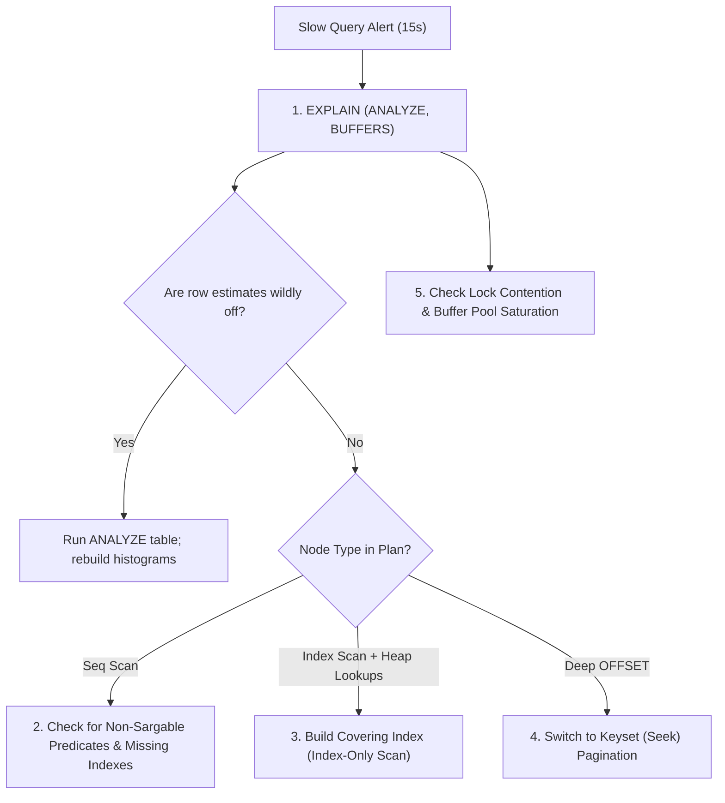

import Tabs from '@theme/Tabs';
import TabItem from '@theme/TabItem';

<span className="badge badge--danger margin-bottom--md">Hard</span>

> **Interview Question:** "You are alerted that a critical query on a 50-million-row table suddenly jumped from 50ms to 15 seconds. Walk me step-by-step through how you investigate, inspect the execution plan, verify sargability, and optimize it."

---

### The Production Diagnostic Playbook

Senior engineers do not guess or randomly add indexes when queries degrade. They follow a systematic 5-step diagnostic framework:



---

### Step 1: Capture Execution Plan & Buffer Telemetry

Never rely on standard `EXPLAIN` (which only shows theoretical estimates). Always run `EXPLAIN (ANALYZE, BUFFERS)` in staging or replica environments:

```sql
EXPLAIN (ANALYZE, BUFFERS, COSTS, VERBOSE)
SELECT order_id, user_id, total_amount
FROM Orders
WHERE status = 'shipped' 
  AND created_at >= '2026-01-01'
ORDER BY created_at DESC
LIMIT 50;
```

#### What to Inspect in the Output:
1. **Node Operators:**
   - `Seq Scan`: Full table scan reading millions of rows off disk.
   - `Index Scan`: Using an index, but visiting the heap table for column data.
   - `Index Only Scan`: The ideal scenario; all data retrieved directly from index leaf pages.
2. **Buffer Telemetry (`shared hit` vs. `shared read`):**
   - `shared hit`: Disk page read directly from the database **RAM Buffer Pool** ($\approx 0.001\text{ms}$).
   - `shared read`: Disk page had to be fetched via physical storage I/O ($\approx 1\text{--}10\text{ms}$).
   - If `read` is in the tens of thousands, the query is saturating physical disk IOPS.
3. **Cardinality Estimation Errors (Stale Statistics):**
   - If the planner estimated `rows=10` but the actual execution found `rows=4,500,000`, the database's catalog statistics are severely outdated.
   - *Immediate Fix:* Run `ANALYZE Orders;` to update distribution histograms.

---

### Step 2: The Sargability Matrix (The Silent Index Killer)

A query predicate is **Sargable** (Search-Argument-Able) if the database engine can utilize direct $O(\log N)$ B-Tree index seeking. 

Applying transformations, functions, or mathematical operations on indexed columns **destroys sargability**, forcing the engine to evaluate every single row via a Full Table Scan!

| Anti-Pattern (Non-Sargable / Destroys Index Seek) | Optimized Equivalent (Sargable / Enables Index Seek) | Why the Anti-Pattern Fails |
| :--- | :--- | :--- |
| `WHERE YEAR(created_at) = 2026` | `WHERE created_at >= '2026-01-01' AND created_at < '2027-01-01'` | Applying `YEAR()` requires evaluating the function on every row. |
| `WHERE SUBSTRING(phone, 1, 3) = '415'` | `WHERE phone LIKE '415%'` | String functions disable B-Tree prefix seeking. |
| `WHERE salary * 1.1 > 100000` | `WHERE salary > 100000 / 1.1` | Arithmetic on the column prevents direct key comparison. |
| `WHERE user_id = 5042` *(When `user_id` is `VARCHAR`)* | `WHERE user_id = '5042'` | **Implicit Type Cast:** Database converts every column value to int! |
| `WHERE email LIKE '%@gmail.com'` | Use Full-Text / Reverse Index | Leading wildcards (`%`) cannot seek down a B-Tree. |

---

### Step 3: Eliminate Bookmark Lookups with Covering Indexes

If the execution plan reveals an `Index Scan` followed by a massive `Bitmap Heap Scan` or key lookup:
- The secondary index found the matching rows, but had to perform hundreds of thousands of random disk seeks into the clustered heap table to fetch non-indexed columns (`total_amount`, `user_id`).
- **The Solution:** Build a **Covering Index** using the `INCLUDE` clause:

```sql
CREATE INDEX idx_orders_covering 
ON Orders (status, created_at DESC) 
INCLUDE (order_id, user_id, total_amount);
```
The database satisfies the entire query directly from the B-Tree leaf pages, executing an **Index-Only Scan** without touching the base table.

---

### Step 4: Fix Deep Pagination (`OFFSET` Bottleneck)

Queries using `LIMIT 50 OFFSET 1000000` are disastrous:
- The engine must read, sort, and discard $1,000,000$ rows just to return the 50 rows requested ($O(N)$ wasted work).

#### The Fix: Keyset (Cursor-Based) Pagination
Instead of telling the database how many rows to skip, filter by the unique sequential key of the last item seen on the previous page:

```sql
-- Keyset Seek Method (Strictly O(1) constant time!):
SELECT * FROM Orders
WHERE (created_at, order_id) < ('2026-02-15 14:30:00', 984021)
ORDER BY created_at DESC, order_id DESC
LIMIT 50;
```
This performs a single direct B-Tree seek to the specified position and streams the next 50 rows in under 1 millisecond.

---

### Step 5: Check Lock Contention & Resource Saturation

If the execution plan is optimal but the query still hangs in production:
1. **Lock Contention:** Query `pg_stat_activity` (Postgres) or `SHOW PROCESSLIST` (MySQL). Is the query blocked by an uncommitted transaction holding an exclusive lock on the table?
2. **Buffer Pool Eviction:** Check if a heavy analytical report flushed operational data pages out of RAM.
3. **Storage IOPS Throttling:** Check cloud disk metrics (e.g., AWS EBS GP3 burst bucket exhaustion).

---

### The Interview Answer (60-90 seconds)

> "To optimize a query that jumped from 50ms to 15 seconds, I follow a systematic 5-step playbook:
>
> 1. Run `EXPLAIN (ANALYZE, BUFFERS)` to inspect physical node operations and check buffer pool hit ratios. If estimated rows wildly diverge from actual rows, table statistics are stale and I run `ANALYZE`.
> 2. Check for non-sargable predicates. Wrapping indexed columns in functions (like `DATE(created_at)`), using leading wildcards (`LIKE '%xyz'`), or triggering implicit type casts disables B-Tree seeks and forces full table scans.
> 3. Check for heavy random I/O bookmark lookups. If secondary index scans spend seconds visiting the heap table for unindexed columns, I construct a Covering Index using `INCLUDE` to achieve an Index-Only Scan.
> 4. If the query uses deep `OFFSET` pagination, I replace it with Keyset (cursor) pagination to turn an $O(N)$ scan into an $O(1)$ B-Tree seek.
> 5. Finally, I verify database locks and buffer pool cache hit ratios to rule out hardware throttling or lock contention."

---

### Code Demonstration: Sargable vs. Non-Sargable Query Plans

The following Python script models an orders table in SQLite, demonstrating how a non-sargable date function disables index seeking, and how rewriting it as a sargable range query restores instant index performance.

```python
import sqlite3

def run_sargable_demo():
    conn = sqlite3.connect(":memory:")
    cursor = conn.cursor()

    cursor.execute("""
        CREATE TABLE Orders (
            order_id INTEGER PRIMARY KEY,
            created_at TEXT NOT NULL,
            total_amount REAL
        );
    """)

    cursor.execute("CREATE INDEX idx_created_at ON Orders(created_at);")

    # Insert sample records
    for i in range(1000):
        date_str = f"2026-01-{(i % 28) + 1:02d} 12:00:00"
        cursor.execute("INSERT INTO Orders VALUES (?, ?, ?);", (i, date_str, float(i * 10)))
    conn.commit()

    print("--- 1. NON-SARGABLE Query: SUBSTR(created_at, 1, 7) = '2026-01' ---")
    cursor.execute("""
        EXPLAIN QUERY PLAN 
        SELECT * FROM Orders 
        WHERE SUBSTR(created_at, 1, 7) = '2026-01';
    """)
    for row in cursor.fetchall():
        print("Plan:", row[3]) # Output: SCAN TABLE Orders (Index completely bypassed!)

    print("\n--- 2. SARGABLE Query: created_at >= '2026-01-01' AND created_at < '2026-02-01' ---")
    cursor.execute("""
        EXPLAIN QUERY PLAN 
        SELECT * FROM Orders 
        WHERE created_at >= '2026-01-01' AND created_at < '2026-02-01';
    """)
    for row in cursor.fetchall():
        print("Plan:", row[3]) # Output: SEARCH TABLE Orders USING INDEX idx_created_at

    conn.close()

if __name__ == "__main__":
    run_sargable_demo()
```
