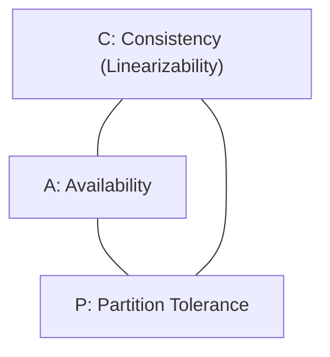

import Tabs from '@theme/Tabs';
import TabItem from '@theme/TabItem';

<span className="badge badge--warning margin-bottom--md">Medium</span>

> **Interview Question:** "What is the CAP theorem? Why is 'CA' a myth in distributed systems, what is the crucial difference between Consistency in CAP and Consistency in ACID, and how does the PACELC theorem extend CAP?"

---

### The CAP Theorem Defined

Formulated by Eric Brewer (2000) and formally proven by Seth Gilbert and Nancy Lynch (2002), the **CAP Theorem** states that any distributed data store can simultaneously guarantee at most **two out of three** fundamental properties:



1. **C - Consistency (Linearizability / Single-Copy Consistency):**
   Every read receives the most recent write or returns an error. Once a write is acknowledged, all subsequent reads across any node must see that value.
2. **A - Availability:**
   Every non-failing node must return a successful (non-error) response for every request, with no guarantee that it contains the most recent write.
3. **P - Partition Tolerance:**
   The system continues to function despite arbitrary message loss, dropped packets, or network delays between nodes.

---

### The Major Interview Trap: Consistency in CAP vs. Consistency in ACID

> **Staff-Level Bar Raiser:** Interviewers deliberately ask: *"Is the 'C' in CAP the same as the 'C' in ACID?"* **No, they mean completely different things!**

- **"C" in ACID (Application Invariants / Integrity):**
  Refers to **Application Constraint Correctness**. A transaction transitions the database from one valid state to another, preserving all declared schema rules, foreign keys, `CHECK` constraints, and unique indexes (e.g., account balance cannot drop below zero).
- **"C" in CAP (Linearizability / Recency):**
  Refers to **Strict External Timing and Recency**. It guarantees that a distributed cluster behaves as if there is only a single atomic copy of the data in the universe, regardless of geographical replication.

---

### Why "CA" Does Not Exist in Distributed Networks

In physical networks, optical fiber cables get severed, switches fail, and cloud hypervisors drop packets. **Network Partitions (`P`) are an unavoidable physical reality.**

Therefore, CAP is **not** a menu where you can choose "Consistency + Availability":
- A single-node database (like traditional single-instance PostgreSQL or MySQL) can claim "CA" only because it does not run across a network—meaning partition tolerance is not applicable.
- **In any distributed system, Partition Tolerance (`P`) is mandatory.**
- The real question is: **When a Network Partition occurs, do you choose Consistency (CP) or Availability (AP)?**

```
                     ┌──────────────────────────────┐
                     │  Network Partition Occurs!   │
                     │  (Nodes cannot communicate)  │
                     └──────────────┬───────────────┘
                                    │
               ┌────────────────────┴────────────────────┐
               ▼                                         ▼
       Choose Consistency (CP)                   Choose Availability (AP)
    Reject writes on minority nodes          Accept writes on all nodes
    -> Prevents Split-Brain corruption       -> Data temporarily diverges
    (e.g., etcd, ZooKeeper, MongoDB)         (e.g., Cassandra, DynamoDB, Couchbase)
```

---

### Quorums & Split-Brain Prevention in CP Systems

If a network splits a 3-node cluster into two isolated partitions:
- **Partition 1:** Node A, Node B (Majority: 2 nodes)
- **Partition 2:** Node C (Minority: 1 node)

To prevent the catastrophic **Split-Brain Problem** (where both sides accept divergent, un-mergeable writes):
- CP systems enforce a **Quorum Majority Rule**:
$$Q = \left\lfloor \frac{N}{2} \right\rfloor + 1$$
- Partition 1 contains 2 out of 3 nodes ($\ge 2$), so it establishes a quorum and continues processing writes.
- Partition 2 contains only 1 node ($< 2$), so it **refuses all writes and returns errors**, sacrificing Availability to protect Linearizable Consistency.

---

### Beyond CAP: The PACELC Theorem (Daniel Abadi)

The CAP theorem only describes database behavior *when a network partition occurs* ($< 0.1\%$ of normal operating time).

To characterize normal operational trade-offs, Daniel Abadi introduced **PACELC**:

$$\mathbf{If\ P\ (Partition)} \implies \mathbf{A\text{ vs. }C} \quad \mathbf{ELSE\ (Normal)} \implies \mathbf{L\ (Latency)\text{ vs. }C\ (Consistency)}$$

| Database | PACELC Classification | Explanation |
| :--- | :--- | :--- |
| **MongoDB / etcd** | **PC / EC** | If Partitioned: chooses Consistency. Else: waits for multi-node replica sync to maintain Consistency (higher write latency). |
| **Cassandra / DynamoDB** | **PA / EL** | If Partitioned: chooses Availability. Else: returns immediately from local node for ultra-low Latency (eventual consistency). |

---

### The Interview Answer (60-90 seconds)

> "The CAP Theorem states that in the event of a network partition, a distributed system must choose between Linearizable Consistency and High Availability. Because physical network failures are inevitable, 'CA' cannot exist in distributed systems—the trade-off is strictly CP versus AP.
>
> In CP systems like etcd or MongoDB, minority partitions reject writes using quorum majorities to prevent split-brain data corruption, prioritizing correctness over uptime. In AP systems like Cassandra or DynamoDB, all nodes accept writes, sacrificing immediate consistency in exchange for uninterrupted availability and single-digit latency.
>
> A crucial interview distinction is that Consistency in CAP means Linearizability—the external illusion of a single atomic copy—whereas Consistency in ACID refers to application invariants, like foreign keys and check constraints.
>
> Finally, the PACELC theorem extends CAP to normal operations: if there is a partition, trade off Availability or Consistency; else, trade off Latency or Consistency."

---

### Code Demonstration: Simulating Network Partition & CP Quorum Majority

The following Python script simulates a 3-node distributed cluster encountering a network partition, demonstrating how a CP engine uses Quorum consensus ($N/2 + 1$) to reject writes in the minority partition while accepting writes in the majority partition.

```python
class DistributedCluster:
    def __init__(self, node_names):
        self.nodes = node_names
        self.data = {node: {} for node in node_names}
        self.partition_groups = [set(node_names)] # Initially healthy: all connected

    def create_partition(self, group1, group2):
        print(f"\n[!] NETWORK PARTITION OCCURRED! Split into {group1} and {group2}")
        self.partition_groups = [set(group1), set(group2)]

    def write_cp(self, target_node, key, value):
        # Find which partition group the target_node belongs to
        active_group = None
        for group in self.partition_groups:
            if target_node in group:
                active_group = group
                break

        quorum_needed = (len(self.nodes) // 2) + 1 # Majority = 2 out of 3
        active_nodes_count = len(active_group)

        print(f"[*] Attempting CP Write to '{target_node}': ({key}='{value}') | Group Size: {active_nodes_count}/{len(self.nodes)}")
        if active_nodes_count >= quorum_needed:
            # Majority partition: Write succeeds across connected nodes
            for node in active_group:
                self.data[node][key] = value
            print(f"    [+] SUCCESS: Quorum achieved ({active_nodes_count} >= {quorum_needed}). Data replicated to {active_group}")
            return True
        else:
            # Minority partition: REJECT write to prevent split-brain!
            print(f"    [-] ERROR 503: Quorum FAILED ({active_nodes_count} < {quorum_needed}). Write REJECTED to maintain Consistency!")
            return False

if __name__ == "__main__":
    cluster = DistributedCluster(["Node_A", "Node_B", "Node_C"])

    # 1. Normal Healthy Operation
    cluster.write_cp("Node_A", "user_101", "Alice")

    # 2. Partition Occurs: Node_A and Node_B stay connected; Node_C is isolated across severed link
    cluster.create_partition(["Node_A", "Node_B"], ["Node_C"])

    # 3. Write to Majority Partition (Node_A) -> Succeeds!
    cluster.write_cp("Node_A", "user_101", "Alice_Updated")

    # 4. Write to Minority Partition (Node_C) -> Rejected!
    cluster.write_cp("Node_C", "user_101", "Alice_Hacked")
```
