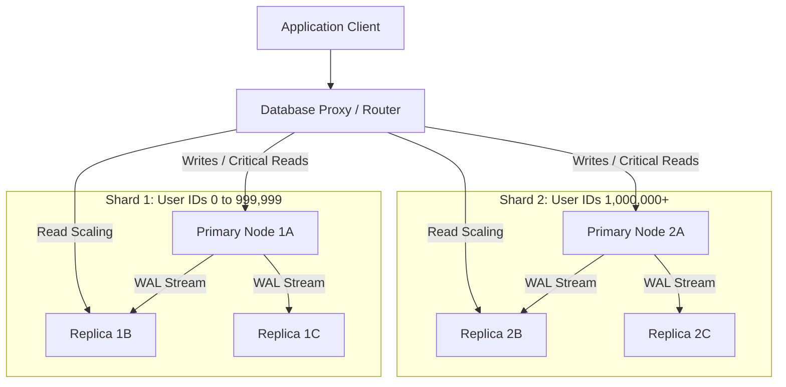

<span className="badge badge--warning margin-bottom--md">Medium</span>

> **Interview Question:** "What is database replication, and what is database sharding? How are they fundamentally different, what are the failure modes of each, and how do enterprise architectures combine both?"

As data volumes and traffic surpass the compute and storage boundaries of a single physical server, databases scale horizontally using two distinct primitives: **Replication** and **Sharding**.

They target completely different architectural bottlenecks.

---

### Conceptual Comparison

```
REPLICATION (Copying the identical dataset across multiple machines):
Node 1 (Primary): [All Records: Rows 1 to 1,000,000]  <-- Handles 100% of Writes
      │
      ├──> Node 2 (Replica): [All Records: Rows 1 to 1,000,000]  <-- Handles Reads
      └──> Node 3 (Replica): [All Records: Rows 1 to 1,000,000]  <-- Handles Reads


SHARDING (Partitioning distinct subsets of rows across different machines):
Shard 1 (Node A): [Rows 1 to 333,333]       <-- 33.3% of total data
Shard 2 (Node B): [Rows 333,334 to 666,666] <-- 33.3% of total data
Shard 3 (Node C): [Rows 666,667 to 1,000,000] <-- 33.3% of total data
```

---

### Architectural Comparison Matrix

| Dimension | Database Replication | Database Sharding |
| :--- | :--- | :--- |
| **Primary Problem Solved** | **Read Throughput** & **High Availability (HA)** | **Write Throughput** & **Disk / RAM Storage Limits** |
| **Data Distribution** | **Every node holds 100% of the dataset** | **Each node holds a disjoint fraction** (e.g., 20%) |
| **Write Scalability** | **Zero write scaling.** All writes must funnel through the single Primary. | **Linear write scaling.** Writes parallelize across independent physical shards. |
| **Fault Recovery** | Automatic failover: Promote an up-to-date replica to become the new Primary. | If a shard fails without internal replicas, its data partition is completely unavailable. |
| **Query Complexity** | **Zero.** Standard SQL queries and local `JOIN` operations work unchanged. | **Severe.** Cross-shard `JOIN` operations and distributed aggregate queries require broadcast scatter-gather. |
| **Transaction Scope** | Standard single-node ACID transactions on Primary. | Distributed transactions require **Two-Phase Commit (2PC)** or **Saga patterns**. |

---

### Deep Dive: Database Replication Mechanics

In a standard **Primary-Replica (Leader-Follower)** topology:
1. All write mutations (`INSERT`, `UPDATE`, `DELETE`, `DDL`) execute on the **Primary**.
2. The Primary persists mutations to its **Write-Ahead Log (WAL)** or binary log.
3. Dedicated background sender threads stream log frames across the network to read replicas.
4. Replicas apply the WAL frames to their local storage engines and serve read queries (`SELECT`).

#### Replication Modes & Trade-offs

1. **Asynchronous Replication (Default):**
   - The Primary commits the transaction locally, sends an immediate success ack to the client, and asynchronously streams logs to replicas.
   - *Risk:* **Replication Lag**. If the primary crashes before WAL logs reach replicas, data committed on the primary is permanently lost upon failover (**RPO > 0**).
2. **Synchronous Replication:**
   - The Primary writes locally and blocks until at least one replica confirms WAL persistence on disk before acknowledging the client.
   - *Trade-off:* Zero data loss (**RPO = 0**), but write latency increases by the round-trip network time (RTT) to the slowest replica.
3. **Semi-Synchronous Replication (e.g., MySQL):**
   - The Primary blocks until at least one replica acknowledges receipt into its relay log (in-memory or disk), decoupling disk flush latency on followers from client response time.

#### Anomalies Caused by Replication Lag
- **Read-Your-Own-Writes Violation:** A user updates their bio, the page refreshes, and the UI displays their old bio because the read routed to a lagging follower.
- **Monotonic Reads Violation:** A user refreshes their inbox twice; refresh 1 reads from an up-to-date replica showing 5 emails, while refresh 2 hits a lagging replica showing 3 emails (time-travel anomaly).
- **Consistent Prefix Reads:** If transaction $B$ causally depends on transaction $A$, a replica might apply $B$ before $A$ if log streaming is partitioned, exposing inconsistent intermediate states.

---

### Deep Dive: Database Sharding Mechanics

When an enterprise database grows from 500GB to **50 Terabytes**, it exceeds the maximum RAM, disk IOPS, and single-instance bandwidth of the largest cloud instances (e.g., AWS `r6i.32xlarge`). 

Sharding horizontally partitions tables across distinct physical database clusters using a **Shard Key**:

```sql
-- Hash-based routing formula:
Target_Shard_ID = CRC32(user_id) % Number_Of_Shards
```

#### The Architectural Penalties of Sharding

#### 1. Distributed Transactions across Shards: 2PC vs Saga
When a transaction must atomically mutate records residing on Shard $A$ (e.g., debiting User 101) and Shard $B$ (crediting User 202):

```
Two-Phase Commit (2PC) Protocol:
Coordinator                     Shard A (Prepare)               Shard B (Prepare)
    │ ─── 1. Prepare to commit? ───> │                               │
    │ ─── 1. Prepare to commit? ───────────────────────────────────> │
    │ <─── 2. Voted YES (Locked) ─── │                               │
    │ <─── 2. Voted YES (Locked) ─────────────────────────────────── │
    │
    │ ─── 3. Global COMMIT! ───────> │ (Commits & unlocks)           │
    │ ─── 3. Global COMMIT! ───────────────────────────────────────> │ (Commits & unlocks)
```

- **Why 2PC is avoided at hyperscale:** 2PC is a **blocking protocol**. If the coordinator dies after Shard A and B vote YES, both shards must hold row-level exclusive locks indefinitely to prevent split-brain inconsistencies, halting overall database throughput.
- **The Alternative (Saga Pattern):** Distributed workflows are decomposed into a sequence of local transactions coordinated via message queues. If step 2 fails, the coordinator executes pre-defined **Compensating Transactions** (e.g., issuing an explicit refund) rather than holding distributed database locks.

#### 2. Cross-Shard JOIN Elimination
Relational engines cannot perform local index-nested loop joins across distinct network endpoints. Cross-shard joins require pulling massive intermediate row sets over the network into an application router, leading to high latency and memory saturation. Production sharded systems denormalize data or duplicate reference lookup tables across every shard.

---

### Combining Both in Production: Sharded Replicated Architecture

Every modern hyperscale datastore (e.g., CockroachDB, Spanner, MongoDB sharded clusters, YouTube's Vitess) pairs **Sharding with Replication**:



- **Sharding** scales write throughput and partition storage linearly.
- **Replication** within each shard provides high availability, fault tolerance, and localized read scalability.

---

### Summary

"Database replication copies the entire dataset across multiple nodes to scale read queries and guarantee high availability, but leaves write throughput bounded by the single primary. Sharding horizontally partitions disjoint subsets of rows across independent nodes using a shard key to scale write throughput and storage capacity, at the expense of cross-shard joins and distributed transaction complexity."

---

### Python Verification: Sharded Database Router & Replica Pool

The following executable Python script simulates a production sharded database cluster with dedicated read replicas, demonstrating shard routing, replica load balancing, and scatter-gather operations:

```python
"""
Sharded Database Architecture Simulation
Demonstrates:
  1. Shard key routing via deterministic hashing
  2. Primary write routing with read-replica load balancing
  3. Scatter-gather queries across distributed shards
"""

import hashlib
from typing import List, Dict, Any, Optional

class DatabaseNode:
    def __init__(self, node_id: str, is_primary: bool = False):
        self.node_id = node_id
        self.is_primary = is_primary
        self.storage: Dict[str, Dict[str, Any]] = {}

    def write(self, key: str, record: Dict[str, Any]) -> None:
        self.storage[key] = record

    def read(self, key: str) -> Optional[Dict[str, Any]]:
        return self.storage.get(key)


class ShardGroup:
    """Represents a single Shard consisting of 1 Primary and N Read Replicas."""
    def __init__(self, shard_id: int, num_replicas: int = 2):
        self.shard_id = shard_id
        self.primary = DatabaseNode(f"shard_{shard_id}_primary", is_primary=True)
        self.replicas = [
            DatabaseNode(f"shard_{shard_id}_rep_{i}", is_primary=False)
            for i in range(num_replicas)
        ]
        self._next_replica_idx = 0

    def write(self, key: str, record: Dict[str, Any]) -> None:
        # Write to primary
        self.primary.write(key, record)
        # Asynchronously / Synchronously replicate to read followers
        for rep in self.replicas:
            rep.write(key, record)

    def read_replica(self, key: str) -> Optional[Dict[str, Any]]:
        # Round-robin load balancing across read replicas
        replica = self.replicas[self._next_replica_idx]
        self._next_replica_idx = (self._next_replica_idx + 1) % len(self.replicas)
        return replica.read(key)

    def scan_shard(self, filter_field: str, expected_val: Any) -> List[Dict[str, Any]]:
        # Scan local shard records matching filter
        return [
            rec for rec in self.primary.storage.values()
            if rec.get(filter_field) == expected_val
        ]


class DistributedRouter:
    """Application router directing queries to correct shards and replica nodes."""
    def __init__(self, num_shards: int = 3):
        self.num_shards = num_shards
        self.shards = [ShardGroup(shard_id=i) for i in range(num_shards)]

    def _get_shard_index(self, shard_key: str) -> int:
        hash_val = int(hashlib.md5(shard_key.encode('utf-8')).hexdigest(), 16)
        return hash_val % self.num_shards

    def insert_record(self, shard_key: str, data: Dict[str, Any]) -> str:
        shard_idx = self._get_shard_index(shard_key)
        self.shards[shard_idx].write(shard_key, data)
        return f"Routed key '{shard_key}' -> Shard {shard_idx} (Primary)"

    def point_read(self, shard_key: str) -> Tuple[Optional[Dict[str, Any]], str]:
        shard_idx = self._get_shard_index(shard_key)
        record = self.shards[shard_idx].read_replica(shard_key)
        return record, f"Fetched from Shard {shard_idx} (Read Replica)"

    def scatter_gather_search(self, filter_field: str, expected_val: Any) -> List[Dict[str, Any]]:
        """Executed when shard key is absent from the query filter."""
        results = []
        for shard in self.shards:
            # Fan out query to every physical shard in parallel
            shard_matches = shard.scan_shard(filter_field, expected_val)
            results.extend(shard_matches)
        return results


def main():
    print("=== Distributed Sharding & Replication Routing Simulation ===\n")
    router = DistributedRouter(num_shards=3)

    # 1. Targeted Writes (Routed via Shard Key 'user_id')
    users = [
        {"user_id": "usr_alpha", "name": "Alice", "country": "US", "balance": 450},
        {"user_id": "usr_beta", "name": "Bob", "country": "DE", "balance": 820},
        {"user_id": "usr_gamma", "name": "Charlie", "country": "US", "balance": 150},
        {"user_id": "usr_delta", "name": "David", "country": "JP", "balance": 990},
    ]

    print("--- 1. Writing Users (Targeted Shard Routing) ---")
    for u in users:
        route_msg = router.insert_record(u["user_id"], u)
        print(f"Insert {u['user_id']}: {route_msg}")

    # 2. Targeted Point Reads (Directly routes to specific Shard Replica)
    print("\n--- 2. Point Query with Shard Key (Single Shard Read) ---")
    query_key = "usr_beta"
    record, route_info = router.point_read(query_key)
    print(f"Query for '{query_key}': {record} | {route_info}")

    # 3. Scatter-Gather Query (Shard Key Absent in WHERE clause)
    print("\n--- 3. Scatter-Gather Query (WHERE country = 'US') ---")
    print("Notice: Shard key is NOT provided. Router must broadcast to ALL shards!")
    us_users = router.scatter_gather_search("country", "US")
    print(f"Found {len(us_users)} results across cluster:")
    for res in us_users:
        print(f"  -> {res}")

if __name__ == "__main__":
    from typing import Tuple
    main()
```
