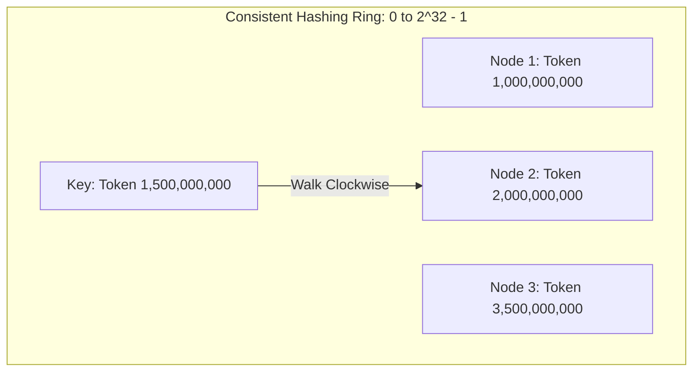

<span className="badge badge--danger margin-bottom--md">Hard</span>

> **Interview Question:** "What is a shard key, what makes a disastrous shard key in a distributed database, and why are monotonically increasing keys lethal? How does consistent hashing with virtual nodes resolve re-sharding storms?"

A **Shard Key** is the indexed column (or composite tuple of columns) that a distributed database router evaluates to determine which physical shard (partition) holds a given row.

Choosing a shard key is the single most critical, irreversible architectural decision in distributed systems design. Sharding on the wrong key leads to severe **hotspotting**, where one server collapses under 100% CPU/disk saturation while the remaining 99 servers sit idle.

---

### The Three Mandates of an Ideal Shard Key

1. **High Cardinality:** The key must have millions of distinct values (e.g., UUIDs or User IDs) rather than a handful (e.g., Status or Country).
2. **Uniform Write Distribution:** Concurrent insert and update operations must disperse uniformly across all shards, avoiding write concentration.
3. **Query Isolation (Targeted Routing):** High-frequency queries must filter by the shard key in the `WHERE` clause, directing requests to a single shard instead of broadcasting across the entire cluster.

---

### Antipatterns: What Makes a Disastrous Shard Key?

#### 1. The Monotonically Increasing Key Trap (`created_at` or Auto-Increment `id`)
Using range-based sharding on timestamps or auto-incrementing sequential integers is the most common architectural failure in distributed databases:

```
Range-Based Partitioning on created_at:
Shard 1: Orders from 2024
Shard 2: Orders from 2025
Shard 3: Orders from 2026 (Current Year / Now)

Consequence:
Write 1 (Now) ──> [ Shard 3 ] (100% Write Bottleneck!)
Write 2 (Now) ──> [ Shard 3 ]
Write 3 (Now) ──> [ Shard 3 ]

Shard 1 (2024) ──> 0% writes (Idle cold storage)
Shard 2 (2025) ──> 0% writes (Idle cold storage)
```

- **The Failure:** 100% of all current inserts hammer **only the newest active shard**. The total write capacity of your 100-node cluster collapses to that of a single server.
- **The Remedy:** Never use raw chronological sequences as shard keys. Use hash-based sharding (`MurmurHash3(id)`) or composite salted keys.

#### 2. Low Cardinality Keys (e.g., `country_code`, `gender`, `is_active`)
- If an application with 50 million users shards on `country_code`:
  - 80% of users reside in the US $\implies$ Shard `US` balloons to 40 million rows, saturating its disk and memory.
  - Shard `IS` (Iceland) holds 20,000 rows.
  - The system can never have more physical shards than distinct countries ($\sim 195$), capping cluster horizontal scalability forever.

#### 3. High-Volume Celebrity Skew (e.g., `creator_id` or `product_id`)
- In a multi-tenant platform sharding by `tenant_id`:
  - 99.9% of tenants generate 5 requests/sec.
  - A massive enterprise tenant (e.g., Nike on Shopify or a viral influencer on TikTok) generates 150,000 requests/sec.
  - That single tenant's designated shard experiences severe thread exhaustion and cascading failover.

---

### The Latency Nightmare: Scatter-Gather (Fan-Out) Queries

When an application issues a query that does **not** specify the shard key in the `WHERE` clause:

```sql
-- Assume the orders table is sharded on user_id:
SELECT * FROM orders WHERE tracking_code = 'FDX-9988112';
```

Because the router cannot know which user placed this order, it must execute a **Scatter-Gather (Broadcast)**:
1. Fans out the query across all $M$ physical shards simultaneously.
2. Waits for all $M$ shards to complete and reply over the network.
3. Merges the result sets in router memory.

#### Mathematical Proof: The Tail Latency Amplification Penalty
If an individual shard has a 99th percentile latency of $P_{99} = 15\text{ms}$ (meaning there is a $p = 0.01$ probability that a single query is slow), then for a scatter-gather query fanning out across $M = 100$ independent shards, the probability that the entire query is delayed by at least one slow node is:

$$P(\text{Delayed Client Request}) = 1 - (1 - p)^M = 1 - (1 - 0.01)^{100} = 1 - (0.99)^{100} \approx 63.4\%$$

**Over 63% of user requests will experience the tail latency!** Scatter-gather queries degrade aggregate cluster throughput and must be strictly avoided on critical paths.

---

### Mitigating Celebrity Hotspots: Salting & Global Secondary Indexes

1. **Key Salting (Write Spreading):**
   - For heavily skewed keys (e.g., viral creator `usr_nike`), append a random salt suffix between $0$ and $K-1$:
     $$\text{Salted\_Key} = \text{tenant\_id} + \text{"\_"} + \text{random}(0, 9)$$
   - Writes for this celebrity distribute evenly across 10 distinct shards.
   - *Trade-off:* Point reads for that tenant must query all 10 salted buckets and aggregate results in memory.
2. **Global Secondary Indexes (GSI):**
   - Systems like DynamoDB maintain an asynchronous secondary index table sharded on alternative attributes (e.g., sharded by `tracking_code` instead of `user_id`), trading storage and eventual consistency for targeted point lookups.

---

### Consistent Hashing with Virtual Nodes (Vnodes)

#### The Modular Hashing Disaster (`hash(k) % N`)
If you shard using traditional modular arithmetic:
$$\text{Shard} = \text{hash}(\text{key}) \pmod N$$
When the cluster expands from $N = 10$ to $N = 11$ nodes, the divisor changes for every key. **Approximately 91% ($\frac{N}{N+1}$) of all keys must move to a new physical server!** This triggers a massive network and I/O storm known as a re-sharding stampede.

#### The Consistent Hashing Ring
Consistent hashing places both nodes and data keys onto a continuous $2^{32}-1$ integer ring:



1. Each node is assigned a token position on the circular ring using its IP address or ID.
2. A key is hashed onto the ring; the router traverses **clockwise** until it encounters the first node token, which owns the key.
3. When Node $N+1$ joins, it only absorbs a fraction of keys from its immediate clockwise neighbor:

$$\text{Keys Migrated} = \frac{1}{N+1} \text{ of the total cluster dataset}$$

#### Why Virtual Nodes (Vnodes) are Essential
If each physical server receives only a single token on the ring, statistical hash variance causes non-uniform spacing. One server may end up owning 40% of the ring circumference while another owns 5%.

**Solution:** Assign each physical server $V$ virtual tokens across the ring (e.g., $V = 256$ vnodes). The variance of key distribution decreases proportionally to $O\left(\frac{1}{\sqrt{V}}\right)$, ensuring near-perfect uniform distribution across all hardware.

---

### Summary

"A bad shard key has low cardinality, creates write hotspots via monotonically increasing timestamps or auto-increment IDs, or causes celebrity skew. An ideal shard key exhibits high cardinality, distributes writes uniformly using hash-based partitioning, and aligns with high-frequency query filters to avoid expensive scatter-gather broadcasts. Consistent hashing with virtual nodes eliminates re-sharding stampedes by restricting key migration to $1/(N+1)$ when scaling nodes."

---

### Python Verification: Consistent Hashing Ring with Virtual Nodes

The following executable Python script implements a production-grade consistent hashing ring with virtual nodes (vnodes), demonstrating deterministic routing and minimal key migration upon cluster scaling:

```python
"""
Consistent Hashing with Virtual Nodes (Vnodes) Simulator
Demonstrates:
  1. Clockwise token ring key assignment
  2. Uniform distribution via virtual nodes (vnodes)
  3. Minimal key reassignment when adding/removing physical nodes
"""

import hashlib
import bisect
from typing import Dict, List, Set

class ConsistentHashRing:
    def __init__(self, vnodes_per_node: int = 100):
        self.vnodes_per_node = vnodes_per_node
        self.ring: List[int] = []                    # Sorted list of virtual token hashes
        self.vnode_to_node: Dict[int, str] = {}     # token_hash -> physical_node_id
        self.nodes: Set[str] = set()

    def _hash(self, key: str) -> int:
        # MD5 128-bit integer hash space [0, 2^128 - 1]
        return int(hashlib.md5(key.encode('utf-8')).hexdigest(), 16)

    def add_node(self, node_id: str) -> None:
        self.nodes.add(node_id)
        for i in range(self.vnodes_per_node):
            vnode_key = f"{node_id}#vnode_{i}"
            token = self._hash(vnode_key)
            self.vnode_to_node[token] = node_id
            bisect.insort(self.ring, token)

    def remove_node(self, node_id: str) -> None:
        if node_id not in self.nodes:
            return
        self.nodes.remove(node_id)
        for i in range(self.vnodes_per_node):
            vnode_key = f"{node_id}#vnode_{i}"
            token = self._hash(vnode_key)
            del self.vnode_to_node[token]
            idx = bisect.bisect_left(self.ring, token)
            if idx < len(self.ring) and self.ring[idx] == token:
                del self.ring[idx]

    def get_node(self, key: str) -> str:
        """Finds the first node clockwise on the token ring."""
        if not self.ring:
            raise RuntimeError("Ring is empty")
        key_hash = self._hash(key)
        # Binary search for the first vnode token >= key_hash
        idx = bisect.bisect_right(self.ring, key_hash)
        # If past the end of the ring, wrap around clockwise to index 0
        if idx == len(self.ring):
            idx = 0
        return self.vnode_to_node[self.ring[idx]]


def main():
    print("=== Consistent Hashing with Virtual Nodes Simulation ===\n")
    ring = ConsistentHashRing(vnodes_per_node=200)

    # Initial cluster of 4 physical database nodes
    initial_nodes = ["db_server_0", "db_server_1", "db_server_2", "db_server_3"]
    for n in initial_nodes:
        ring.add_node(n)

    # Generate 10,000 synthetic customer keys
    num_keys = 10_000
    keys = [f"customer_session_uuid_{i}" for i in range(num_keys)]

    # Initial key mapping
    initial_mapping = {k: ring.get_node(k) for k in keys}

    # Evaluate initial distribution uniformity
    distribution: Dict[str, int] = {}
    for node in initial_mapping.values():
        distribution[node] = distribution.get(node, 0) + 1

    print(f"--- Initial Distribution Across 4 Nodes ({num_keys} keys) ---")
    for node, count in sorted(distribution.items()):
        percentage = (count / num_keys) * 100
        print(f"  {node}: {count} keys ({percentage:.1f}%) [Ideal: 25.0%]")

    # Scale cluster: Add a 5th node
    print("\n--- Scaling Event: Adding 'db_server_4' to Cluster ---")
    ring.add_node("db_server_4")

    # Evaluate how many keys moved
    new_mapping = {k: ring.get_node(k) for k in keys}
    keys_moved = sum(1 for k in keys if initial_mapping[k] != new_mapping[k])
    migration_pct = (keys_moved / num_keys) * 100
    theoretical_pct = (1.0 / 5.0) * 100

    print(f"Keys migrated to new node: {keys_moved} / {num_keys} ({migration_pct:.1f}%)")
    print(f"Theoretical minimal migration (1/(N+1)): {theoretical_pct:.1f}%")
    print("Notice: Under modular hashing (hash % N), ~80% of all keys would have moved!")

if __name__ == "__main__":
    main()
```
