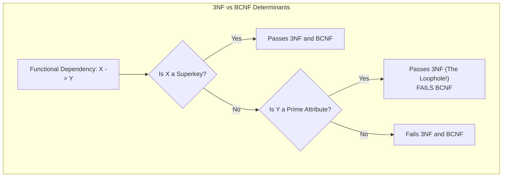

import Tabs from '@theme/Tabs';
import TabItem from '@theme/TabItem';

<span className="badge badge--warning margin-bottom--md">Medium</span>

> **Interview Question:** "What is Boyce-Codd Normal Form (BCNF), and how does it differ from 3NF? Give a concrete example of a schema that is in 3NF but violates BCNF, and explain the fundamental trade-off between BCNF and Dependency Preservation."

---

### The Fundamental Rule Difference

**Boyce-Codd Normal Form (BCNF)**, often described as "3.5NF", is a stricter, mathematically cleaner variant of Third Normal Form (3NF). It was designed to eliminate redundancy anomalies that occur when a relation possesses **multiple overlapping candidate keys**.

For every non-trivial functional dependency $X \to Y$ (where $Y \not\subseteq X$):

| Normal Form | Condition Required for Non-Trivial $X \to Y$ |
| :--- | :--- |
| **3NF** | $X$ is a **Superkey** <br/>**OR**<br/> $Y$ is a **Prime Attribute** (part of *at least one* candidate key) |
| **BCNF** | $X$ must be a **Superkey** *(Strict: zero exceptions permitted!)* |



> **The 3NF Loophole:** If $Y$ belongs to any candidate key, 3NF tolerates the dependency even if the determinant $X$ cannot uniquely identify a row. BCNF completely eliminates this second clause.

---

### The Classic Proof: Student, Subject, Advisor

Consider a university academic advising schema with the following business rules:
1. Each student can enroll in multiple subjects.
2. For each subject, a student is assigned exactly one advisor.
3. Each advisor specializes in **only one** subject.
4. Multiple advisors can advise the same subject.

Table: `StudentAdvising(StudentID, Subject, Advisor)`

#### 1. Functional Dependencies:
- $FD_1: \{\text{StudentID}, \text{Subject}\} \to \text{Advisor}$ (A student-subject pair has one advisor)
- $FD_2: \text{Advisor} \to \text{Subject}$ (Each advisor teaches only one subject)

#### 2. Candidate Keys:
- Key 1: $\{\text{StudentID}, \text{Subject}\}$
- Key 2: $\{\text{StudentID}, \text{Advisor}\}$ *(Because $\text{Advisor} \to \text{Subject}$, knowing StudentID and Advisor determines all attributes!)*

Both candidate keys are composite and **overlap** on `StudentID`.
- **Prime Attributes:** `StudentID`, `Subject`, `Advisor` (Every single attribute is prime!).
- **Non-Prime Attributes:** None.

---

### Why the Schema Passes 3NF

Evaluate the functional dependency $\text{Advisor} \to \text{Subject}$:
1. Is `Advisor` a superkey? **No.** (An advisor has many students).
2. Is `Subject` a prime attribute? **Yes**, because `Subject` is part of candidate key $\{\text{StudentID}, \text{Subject}\}$.

Because 3NF contains the fallback clause *"OR $Y$ is a prime attribute"*, this relation **fully satisfies 3NF**!

---

### Why It Fails BCNF & The Resulting Anomalies

BCNF does not permit the prime attribute loophole. For $\text{Advisor} \to \text{Subject}$, `Advisor` is not a superkey. Therefore, **the table violates BCNF**.

This violation causes severe data modification anomalies:

```
StudentAdvising Table (In 3NF, Violates BCNF):
+-----------+---------+------------+
| StudentID | Subject | Advisor    |
+-----------+---------+------------+
| S101      | Physics | Dr. Robert |
| S102      | Physics | Dr. Robert |  <-- Redundancy: Dr. Robert -> Physics repeated
| S103      | Math    | Dr. Gauss  |
+-----------+---------+------------+
```

1. **Update Anomaly:** If Dr. Robert switches from advising Physics to Quantum Mechanics, we must locate and update every student row assigned to Dr. Robert. Missing a row leads to inconsistent state.
2. **Insertion Anomaly:** We cannot hire a new advisor who specializes in Chemistry until a student signs up with them, because `StudentID` is part of the primary key and cannot be `NULL`.
3. **Deletion Anomaly:** If student `S103` drops out, deleting their row completely wipes out the record that Dr. Gauss advises Math.

---

### The BCNF Decomposition

To reach BCNF, decompose the relation into two tables using the violating dependency $\text{Advisor} \to \text{Subject}$:

1. **`AdvisorSubject`**
   - Columns: `(Advisor, Subject)`
   - Primary Key: `Advisor`
   - Functional Dependency: $\text{Advisor} \to \text{Subject}$ (`Advisor` is now a superkey! Satisfies BCNF).
2. **`StudentAdvisor`**
   - Columns: `(StudentID, Advisor)`
   - Primary Key: `(StudentID, Advisor)`
   - Foreign Key: `Advisor` references `AdvisorSubject(Advisor)`
   - Satisfies BCNF.

---

### The Fundamental Database Trade-Off: Dependency Preservation

> **Senior Bar-Raiser Principle:**
> - **3NF guarantees:** Lossless-Join Decomposition **AND** Dependency Preservation.
> - **BCNF guarantees:** Lossless-Join Decomposition, but **CANNOT guarantee Dependency Preservation**!

#### Why Dependency Preservation is Lost in BCNF:
In the original schema, we had the business constraint:

$$\{\text{StudentID}, \text{Subject}\} \to \text{Advisor}$$

In our decomposed BCNF tables (`StudentAdvisor` and `AdvisorSubject`), `StudentID` and `Subject` reside in **different physical tables**! 
- An application cannot enforce this constraint using standard database primary key or unique constraints.
- To prevent a student from having two advisors for the same subject, the database would have to perform an expensive `JOIN` across both tables on every single `INSERT` or `UPDATE`.
- **Production Decision:** When BCNF sacrifices dependency preservation, real-world database architects often choose to **stay in 3NF** and enforce constraints via triggers or application logic to avoid expensive inter-table join validation.

---

### The Interview Answer (60-90 seconds)

> "The core distinction between 3NF and BCNF lies in the treatment of prime attributes.
>
> In 3NF, for every non-trivial functional dependency $X \to Y$, either $X$ must be a superkey, or $Y$ must be a prime attribute (part of a candidate key). BCNF eliminates that second condition: $X$ must strictly be a superkey, period.
>
> The classic scenario that satisfies 3NF but violates BCNF is the Student-Subject-Advisor schema with overlapping candidate keys. Because an Advisor determines Subject, and Subject is a prime attribute, the table is in 3NF. However, because Advisor is not a superkey, the table violates BCNF, causing insertion, update, and deletion anomalies.
>
> While decomposing into BCNF eliminates all redundancy anomalies, it comes with a major theoretical trade-off: 3NF is guaranteed to preserve both lossless joins and functional dependencies, whereas BCNF guarantees lossless joins but can lose dependency preservation. Enforcing the lost dependency in BCNF requires an expensive cross-table join on every write."

---

### Code Demonstration: Simulating 3NF Anomalies & BCNF Decomposition

The following Python script models the Student-Subject-Advisor schema in SQLite, demonstrating the insertion and deletion anomalies in 3NF and verifying the decomposed BCNF schema.

```python
import sqlite3

def run_bcnf_demo():
    conn = sqlite3.connect(":memory:")
    cursor = conn.cursor()

    print("--- 1. Demonstrating 3NF Anomalies ---")
    cursor.execute("""
        CREATE TABLE StudentAdvising_3NF (
            student_id TEXT,
            subject TEXT,
            advisor TEXT,
            PRIMARY KEY (student_id, subject)
        );
    """)

    # Populate 3NF table
    cursor.execute("INSERT INTO StudentAdvising_3NF VALUES ('S101', 'Physics', 'Dr. Robert');")
    cursor.execute("INSERT INTO StudentAdvising_3NF VALUES ('S102', 'Physics', 'Dr. Robert');")
    cursor.execute("INSERT INTO StudentAdvising_3NF VALUES ('S103', 'Math', 'Dr. Gauss');")

    # Insertion Anomaly: Cannot insert an advisor without a student
    try:
        cursor.execute("INSERT INTO StudentAdvising_3NF VALUES (NULL, 'Chemistry', 'Dr. Curie');")
    except sqlite3.IntegrityError as e:
        print("[Insertion Anomaly Confirmed] Cannot hire Dr. Curie without a student: " + str(e))

    # Deletion Anomaly: Removing student S103 deletes all record of Dr. Gauss advising Math
    cursor.execute("DELETE FROM StudentAdvising_3NF WHERE student_id = 'S103';")
    cursor.execute("SELECT * FROM StudentAdvising_3NF WHERE advisor = 'Dr. Gauss';")
    if not cursor.fetchall():
        print("[Deletion Anomaly Confirmed] S103 deleted; record of Dr. Gauss advising Math was lost!")

    print("\n--- 2. Decomposing into BCNF ---")
    cursor.execute("""
        CREATE TABLE AdvisorSubject_BCNF (
            advisor TEXT PRIMARY KEY,
            subject TEXT NOT NULL
        );
    """)
    cursor.execute("""
        CREATE TABLE StudentAdvisor_BCNF (
            student_id TEXT NOT NULL,
            advisor TEXT NOT NULL,
            PRIMARY KEY (student_id, advisor),
            FOREIGN KEY (advisor) REFERENCES AdvisorSubject_BCNF(advisor)
        );
    """)

    # In BCNF: Hiring Dr. Curie without students is completely valid!
    cursor.execute("INSERT INTO AdvisorSubject_BCNF VALUES ('Dr. Curie', 'Chemistry');")
    cursor.execute("INSERT INTO AdvisorSubject_BCNF VALUES ('Dr. Gauss', 'Math');")
    cursor.execute("INSERT INTO StudentAdvisor_BCNF VALUES ('S103', 'Dr. Gauss');")

    # Deleting student S103 leaves advisor record intact!
    cursor.execute("DELETE FROM StudentAdvisor_BCNF WHERE student_id = 'S103';")
    cursor.execute("SELECT * FROM AdvisorSubject_BCNF WHERE advisor = 'Dr. Gauss';")
    res = cursor.fetchall()
    print("[BCNF Success] Dr. Gauss still exists in AdvisorSubject: " + str(res))

    conn.close()

if __name__ == "__main__":
    run_bcnf_demo()
```
