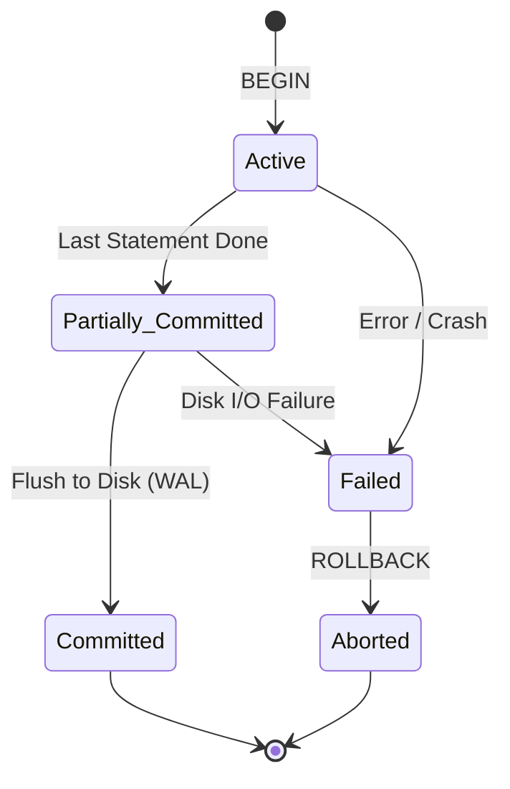

<span className="badge badge--success margin-bottom--md">Easy</span>

> **Interview Question:** "What is a transaction, and why do we need it? What happens if an operation fails halfway through without one, how do Savepoints enable partial rollbacks, and what is the WAL Log-Ahead Rule?"

### The Quick Answer

"A database transaction is a single logical unit of work consisting of one or more database operations (reads, writes, updates, deletes) that execute under an **all-or-nothing** contract. Either every statement succeeds and becomes permanent (**Commit**), or if any failure occurs, all tentative changes are completely reversed (**Rollback**), preserving system invariants."

---

### Why Do We Need Transactions?

Without transactions, multi-step database workflows are vulnerable to **partial failure anomalies** and **concurrency race conditions**.

Consider a basic peer-to-peer bank transfer of \$100 from Alice to Bob:
1. `Deduct $100 from Alice's account`
2. `Add $100 to Bob's account`

If step 1 succeeds, but the database server crashes, power trips, or a network partition occurs before step 2 executes:
* **Without a transaction:** \$100 vanishes from Alice's balance without ever appearing in Bob's account. The database is left in a corrupted, inconsistent state.
* **With a transaction:** The database recovery engine detects an uncommitted in-flight transaction on reboot. It reads the **undo log / Write-Ahead Log (WAL)** to reverse step 1, restoring Alice's \$100.

```sql
BEGIN TRANSACTION;

UPDATE accounts 
SET balance = balance - 100 
WHERE user_id = 'alice' AND balance >= 100;

-- If application crashes here or throws an exception:
-- The database aborts and rolls back automatically.

UPDATE accounts 
SET balance = balance + 100 
WHERE user_id = 'bob';

COMMIT;
```

---

### The Transaction State Machine

During its lifecycle, a database transaction moves through five formal states:



1. **Active:** The initial state where read and write statements are actively being executed.
2. **Partially Committed:** All query statements have executed in RAM, but final write verification has not yet been flushed to non-volatile disk.
3. **Failed:** An integrity check failed, deadlock was detected, or a hardware crash occurred.
4. **Aborted:** The database uses rollback logs to reverse all partial changes, restoring the state prior to `BEGIN`.
5. **Committed:** Changes are guaranteed durable on disk. Once committed, a transaction cannot be rolled back.

---

### Partial Rollbacks: Savepoints

Interviewers often ask: *"Can you roll back a single failed operation without aborting the entire transaction?"*

**Yes, using Savepoints.** A savepoint creates a designated checkpoint within an active transaction:

```sql
BEGIN TRANSACTION;

INSERT INTO orders (order_id, user_id) VALUES (501, 'alice');
SAVEPOINT payment_attempt;

-- Attempting secondary payment gateway
INSERT INTO payments (order_id, method, status) VALUES (501, 'crypto', 'FAILED');

-- Roll back ONLY the failed payment attempt, keeping the order intact
ROLLBACK TO payment_attempt;

-- Fallback to credit card
INSERT INTO payments (order_id, method, status) VALUES (501, 'credit_card', 'SUCCESS');

COMMIT;
```

*(Note: Most relational engines like PostgreSQL and MySQL do not support true autonomous nested transactions; they use savepoints to simulate nested transaction blocks).*

---

### The Recovery Engine: The "Log-Ahead" Rule

How does the database guarantee that rollbacks and crash recovery always work? Through **Write-Ahead Logging (WAL)** governed by the **Log-Ahead Rule**:

> **The Log-Ahead Invariant:** A dirty data page in volatile RAM (the Buffer Pool) can **never** be flushed to permanent disk until the corresponding log record describing the update has first been flushed and synced (`fsync`) to non-volatile WAL storage.

If the server crashes mid-transaction, the engine reads the WAL log:
* **REDO Phase:** Replays changes for transactions marked as committed.
* **UNDO Phase:** Reverses changes for transactions that were active without a commit mark.

---

### The ELI5 Analogy: Packing a Parachute

Imagine you are packing an emergency parachute. The packing procedure has 5 sequential folding and fastening steps. If you complete steps 1, 2, and 3, but the fire alarm rings and you walk away leaving steps 4 and 5 undone, you cannot jump with that half-packed parachute—doing so is fatal.

You either pack the **entire** parachute completely to 100% readiness (Commit), or if interrupted, you discard the partial fold and start over from scratch (Rollback). There is no such thing as a valid "half-packed" parachute.

---

### Crucial Nuance: Transactions vs. Auto-Commit

In most relational databases (such as MySQL InnoDB or PostgreSQL CLI clients), the default session mode is `AUTOCOMMIT = ON`. In this mode, every standalone SQL statement (`UPDATE ...`) executes as its own immediate, single-statement transaction. Backend services must explicitly open an interactive transaction block (`BEGIN` / `START TRANSACTION`) to group interdependent queries into a single atomic boundary.
