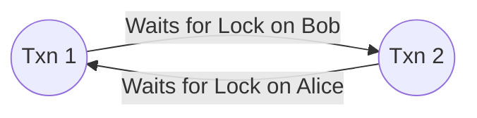

<span className="badge badge--warning margin-bottom--md">Medium</span>

> **Interview Question:** "What is a database deadlock? How do single-node and distributed engines detect or prevent them, how does victim selection work, and how do you design application code to prevent them?"

A **deadlock** is an irreconcilable concurrency state in a relational database where two or more transactions permanently block one another because each holds an exclusive lock on a resource that the other requires, forming a circular wait dependency.

---

### The Classic Deadlock Scenario

Consider two concurrent accounts transferring money to each other:

```
Transaction 1: Alice transfers $50 to Bob
Transaction 2: Bob transfers $30 to Alice

Time | Transaction 1 (Alice -> Bob)         | Transaction 2 (Bob -> Alice)
-----+--------------------------------------+-------------------------------------
T1   | BEGIN;                               | BEGIN;
T2   | UPDATE accounts SET bal = bal - 50   | 
     | WHERE id = 'Alice';                  | 
     | [Acquires Exclusive Lock on Alice]   | 
T3   |                                      | UPDATE accounts SET bal = bal - 30
     |                                      | WHERE id = 'Bob';
     |                                      | [Acquires Exclusive Lock on Bob]
T4   | UPDATE accounts SET bal = bal + 50   | 
     | WHERE id = 'Bob';                    | 
     | [BLOCKED: Waiting for Bob's lock...] | 
T5   |                                      | UPDATE accounts SET bal = bal + 30
     |                                      | WHERE id = 'Alice';
     |                                      | [DEADLOCK! Waiting for Alice's lock]
```

Neither transaction can complete. Transaction 1 is waiting for Bob; Transaction 2 is waiting for Alice.

---

### How Single-Node Engines Detect Deadlocks

Relational database engines like PostgreSQL and MySQL InnoDB employ two detection strategies:

#### 1. Wait-For Graph (WFG) Cycle Detection
The engine maintains an internal directed dependency graph in memory:
- **Nodes:** Active transactions ($T_1, T_2$).
- **Directed Edges:** $T_1 \to T_2$ means $T_1$ is blocked waiting for a lock held by $T_2$.
- A background worker runs periodically (e.g., every 500ms or 1s). If a **directed cycle** is detected ($T_1 \to T_2 \to T_1$), a deadlock has definitively formed.



#### 2. Lock Wait Timeouts
If a transaction waits for a lock longer than a configured threshold (e.g., MySQL's `innodb_lock_wait_timeout = 50s`), the engine terminates the waiting transaction, regardless of whether a full cycle exists.

---

### How Engines Resolve Deadlocks: Victim Selection

Once a cycle is identified, the engine breaks the circular wait by choosing a **Victim Transaction** to abort and roll back:
- The engine rolls back the victim's uncommitted writes and returns a specific error to the client (e.g., PostgreSQL `40P01: deadlock detected`, MySQL `1213: Deadlock found`).
- **Victim Selection Heuristics:**
  - **Undo Log Volume:** The transaction that has generated the smallest undo log (cheapest to roll back).
  - **Transaction Age:** The younger transaction is aborted so the older, longer-running transaction can complete.
  - **Lock Footprint:** The transaction holding the fewest locks.

---

### Distributed Deadlock Prevention: Wait-Die vs. Wound-Wait

In distributed databases (e.g., Google Spanner, CockroachDB), maintaining a centralized Wait-For Graph across dozens of physical nodes is too slow and chatty. Instead, distributed systems use **timestamp-based deadlock prevention**:

Each transaction is assigned a monotonically increasing timestamp upon creation ($TS(T_i)$). Smaller timestamps indicate **older** transactions.

| Algorithm | Mechanism | Priority Behavior |
| :--- | :--- | :--- |
| **Wait-Die** (Non-preemptive) | If $T_{\text{old}}$ requests a lock held by $T_{\text{young}}$: **$T_{\text{old}}$ waits**. <br/> If $T_{\text{young}}$ requests a lock held by $T_{\text{old}}$: **$T_{\text{young}}$ dies (aborts and restarts)**. | Younger transactions are killed immediately when competing with older ones. |
| **Wound-Wait** (Preemptive) | If $T_{\text{old}}$ requests a lock held by $T_{\text{young}}$: **$T_{\text{old}}$ wounds (aborts/preempts) $T_{\text{young}}$**. <br/> If $T_{\text{young}}$ requests a lock held by $T_{\text{old}}$: **$T_{\text{young}}$ waits**. | Older transactions preempt younger transactions immediately; minimizes aborts of near-complete work. |

---

### The Hidden Trap: Deadlocks on `INSERT` Statements

Deadlocks do not only occur on updates! In MySQL InnoDB under Repeatable Read, **`INSERT` statements frequently deadlock on Gap Locks**:

1. Transaction A and Transaction B both attempt to insert into an empty range (e.g., between IDs 10 and 20).
2. Both transactions acquire **Shared Gap Locks** on the open interval `(10, 20)`. (Shared gap locks do not conflict with each other).
3. Both transactions then attempt to write their new row, which requires an **Exclusive Insert Intention Lock** on that same gap.
4. Because each transaction holds a shared gap lock that blocks the other's exclusive intention lock, an immediate deadlock occurs!

---

### How to Prevent Deadlocks in Application Code

#### 1. Strict Global Lock Ordering (The Gold Standard)
Ensure that **every transaction in the entire codebase acquires locks in the exact same deterministic order** (e.g., sorted numerically by Primary Key):

```
Always lock min(Account_A, Account_B) first, then lock max(Account_A, Account_B) second.
```
Because both transactions attempt to lock `Alice` before `Bob`, Transaction 2 waits at step 1 instead of acquiring Bob and forming a cycle.

#### 2. Keep Transactions Short
Never execute HTTP API calls, external webhook notifications, or heavy CPU parsing inside a database transaction block. Open the transaction, execute queries, and commit immediately.

#### 3. Exponential Backoff with Jitter Retry Loops
Deadlocks are inevitable under heavy concurrency. Applications must handle deadlock error codes automatically with a randomized backoff retry decorator.

---

### The ELI5 Analogy: The Narrow One-Way Bridge

Two cars drive onto a narrow, single-lane bridge from opposite sides and meet in the middle. Neither can move forward:
- **Detection (WFG):** A traffic drone sees the circular standoff.
- **Victim Selection:** The police officer orders the smaller car (cheapest to reverse) to back up off the bridge.
- **Distributed Prevention:** A timestamp camera grants older cars right-of-way, forcing newer cars to wait or turn around before entering.
- **Lock Ordering:** Building two separate one-way lanes so cars never cross in opposing directions.

---

### Summary
"Deadlocks occur when transactions form a circular lock dependency. Engines detect them via Wait-For Graphs and abort a victim transaction. Distributed engines prevent them using timestamp schemes (Wait-Die / Wound-Wait). Applications prevent them by enforcing deterministic global lock ordering, keeping transactions short, and retrying on deadlock codes."

---

### Code Demonstration: Deterministic Lock Ordering & Retry Loop

```python
import time
import random

MAX_RETRIES = 3

def transfer_funds(db, from_account_id: int, to_account_id: int, amount: float):
    # CRITICAL: Always acquire locks in identical global order (by ID)
    first_id, second_id = sorted([from_account_id, to_account_id])
    
    for attempt in range(MAX_RETRIES):
        try:
            with db.transaction():
                # Step 1: Acquire exclusive locks in deterministic order
                db.execute("SELECT id, balance FROM accounts WHERE id = %s FOR UPDATE", [first_id])
                db.execute("SELECT id, balance FROM accounts WHERE id = %s FOR UPDATE", [second_id])
                
                # Step 2: Validate balance and transfer
                db.execute("UPDATE accounts SET balance = balance - %s WHERE id = %s", [amount, from_account_id])
                db.execute("UPDATE accounts SET balance = balance + %s WHERE id = %s", [amount, to_account_id])
                
                # Transaction commits cleanly
                return True
                
        except DeadlockDetectedException:
            if attempt == MAX_RETRIES - 1:
                raise RuntimeError("Transfer failed after maximum deadlock retries")
            
            # Randomized exponential backoff (Jitter) to prevent thundering herds
            sleep_duration = (0.05 * (2 ** attempt)) + random.uniform(0.01, 0.05)
            time.sleep(sleep_duration)
```
