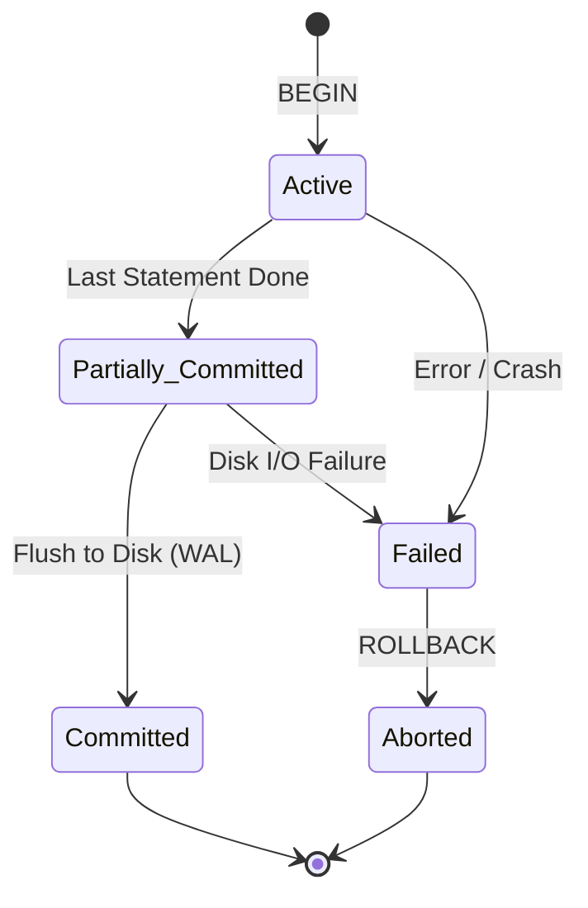

<span className="badge badge--success margin-bottom--md">Easy</span>

> **Interview Question:** "What is a transaction, and why do we need it? What happens if an operation fails halfway through without one?"

A database transaction is a single logical unit of work comprising one or more database operations (reads, writes, updates, deletes) that must execute under an **all-or-nothing** contract. Either every single modification in the unit succeeds and becomes permanent (**Commit**), or if any failure occurs, all changes are completely undone (**Rollback**), leaving the database in its original consistent state.

---

### Why Do We Need Transactions?

Without transactions, a multi-step database workflow leaves the system vulnerable to **partial failure anomalies** and **concurrency race conditions**.

Consider a basic peer-to-peer bank transfer of \$100 from Alice to Bob:
1. `Deduct \$100 from Alice's account`
2. `Add \$100 to Bob's account`

If step 1 succeeds, but the database server crashes, network cable disconnects, or power trips before step 2 executes:
- **Without a transaction:** \$100 vanished from Alice's balance and was never credited to Bob. The database is left in a corrupted, inconsistent state.
- **With a transaction:** The database recovery engine detects that the transaction was in flight but uncommitted. It invokes the **undo log / Write-Ahead Log (WAL)** to roll back step 1, restoring Alice's \$100.

```sql
BEGIN TRANSACTION;

UPDATE accounts 
SET balance = balance - 100 
WHERE user_id = 'alice' AND balance >= 100;

-- If application crashes here or throws an exception:
-- The database aborts and rolls back automatically.

UPDATE accounts 
SET balance = balance + 100 
WHERE user_id = 'bob';

COMMIT;
```

---

### The Transaction State Machine

During its lifecycle, a database transaction moves through formal states:



1. **Active:** The initial state where read and write statements are actively being processed.
2. **Partially Committed:** All query statements have executed successfully in memory, but final writes have not yet been guaranteed on persistent storage.
3. **Failed:** An integrity check failed, a syntax error occurred, a deadlock was detected, or a hardware failure interrupted execution.
4. **Aborted:** The database reverses all tentative writes using rollback logs, restoring the database to the state prior to `BEGIN`.
5. **Committed:** Changes are guaranteed durable on disk via the Write-Ahead Log. Once committed, the transaction cannot be rolled back.

---

### The ELI5 Analogy: Packing a Parachute

Imagine you are packing an emergency parachute. The packing procedure has 5 crucial folding and fastening steps. If you complete steps 1, 2, and 3, but a fire alarm rings and you walk away leaving step 4 and 5 undone, you cannot use that half-packed parachute—jumping with it would be fatal. 

You either pack the **entire** parachute completely to 100% readiness (Commit), or if interrupted, you discard the partial fold and start over from scratch (Rollback). There is no such thing as a valid "half-packed" parachute.

---

### Summary
"A transaction is a boundary wrapped around multiple database operations guaranteeing atomicity, consistency, isolation, and durability. We need it to protect data integrity against server crashes, network timeouts, and concurrent access conflicts, ensuring partial updates never persist."

---

### Crucial Nuance: Transactions vs. Auto-commit
In most relational databases (such as MySQL or PostgreSQL CLI clients), the default session mode is `AUTOCOMMIT = ON`. In this mode, every isolated SQL statement (`UPDATE ...`) is treated as its own standalone, single-statement transaction that commits immediately. When building backend services, developers must explicitly open an interactive transaction block (`BEGIN` / `START TRANSACTION`) to group interdependent statements; otherwise, multi-line business logic will run as separate auto-committing queries that cannot be rolled back together.
