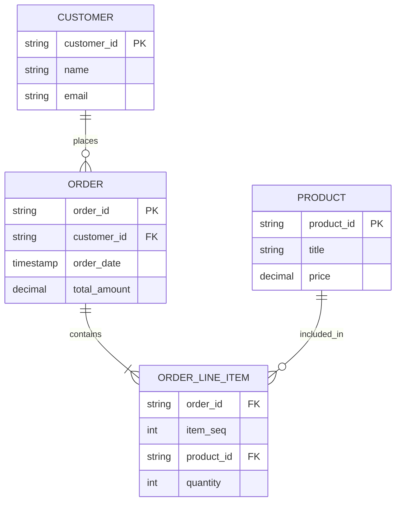

Easy

> **Interview Question:** "What is an ER diagram? Explain the difference between strong and weak entities, types of attributes, and relationship cardinalities."

An **Entity-Relationship (ER) Diagram** is a high-level conceptual data model that visually represents the logical structure of a database, defining the real-world objects (**Entities**), their properties (**Attributes**), and the associations between them (**Relationships**).

---

### Core Components of an ER Model

---

### 1. Entities: Strong vs. Weak
- **Strong Entity:** An entity that possesses its own independent identity and has a primary key composed of its own attributes (e.g., `Customer`, `Product`). It exists independently of other entities.
- **Weak Entity:** An entity that cannot be uniquely identified by its own attributes alone and depends on the existence of a strong entity (the identifying parent entity). It uses a **partial key (discriminator)** combined with the parent's primary key to form a composite identifier.
  - *Example:* `Order_Line_Item` or `Dependent` (e.g., employee children for health insurance). If the employee leaves the company, the dependent record has no independent meaning.

---

### 2. Attribute Classifications

| Attribute Type | Description | Real-World Example |
| :--- | :--- | :--- |
| **Simple / Atomic** | Indivisible value that cannot be broken down further | `age`, `salary` |
| **Composite** | Can be subdivided into smaller meaningful sub-parts | `full_name` (first, middle, last), `address` (street, city, zip) |
| **Single-Valued** | Holds exactly one value for a specific entity instance | `social_security_number`, `date_of_birth` |
| **Multi-Valued** | Can hold multiple values for a single entity | `phone_numbers`, `skills` (in 1NF, normalized into a child table) |
| **Derived** | Computed dynamically from other stored attributes | `age` (derived from `date_of_birth` and `current_date`) |

---

### 3. Relationship Cardinalities

Cardinality specifies the maximum number of entity instances that can participate in a relationship:

1. **One-to-One (1:1):** 
   - *Example:* `User` to `Citizen_Passport`. Each citizen has at most one passport; each passport belongs to one citizen.
   - *Schema Implementation:* Add `passport_id` as a `UNIQUE FOREIGN KEY` in `User`, or share the exact same Primary Key across both tables.

2. **One-to-Many (1:N):**
   - *Example:* `Customer` to `Orders`. A single customer can place many orders, but an order belongs to exactly one customer.
   - *Schema Implementation:* Place `customer_id` as a Foreign Key in the `Orders` (the "Many" side) table.

3. **Many-to-Many (M:N):**
   - *Example:* `Students` to `Courses`. A student takes multiple courses; a course contains multiple students.
   - *Schema Implementation:* Relational databases cannot represent M:N directly. It must be resolved into two 1:N relationships using an **Associative / Junction Table** (`Enrollments`).

---

### The ELI5 Analogy: The Family Tree Blueprint

An ER diagram is like the architect's blueprint before building a skyscraper. You don't start pouring concrete (writing SQL `CREATE TABLE` scripts) until you have agreed on where the walls, doors, and electrical sockets go on paper. 
- **Entities** are the rooms (Kitchen, Bedroom).
- **Attributes** are room dimensions and paint colors.
- **Relationships** are the hallways connecting the rooms.

---

### Summary
"An ER diagram is a conceptual schema modeling entities, attributes, and relationship cardinalities. Strong entities stand alone with distinct keys, weak entities depend on identifying parents, multi-valued attributes require normalization, and Many-to-Many relationships resolve through junction tables."

---

### Crucial Nuance: Participation Constraints (Mandatory vs. Optional)
Cardinality specifies *how many*, but **participation** specifies *whether existence is required*:
- **Total Participation (Mandatory):** Every entity instance *must* participate (represented by a double line or `1..*`). For example, every `Order` must be placed by a `Customer` (`customer_id NOT NULL`).
- **Partial Participation (Optional):** Participation is optional (represented by `0..*`). For example, a `Customer` can exist without having placed any orders yet.
