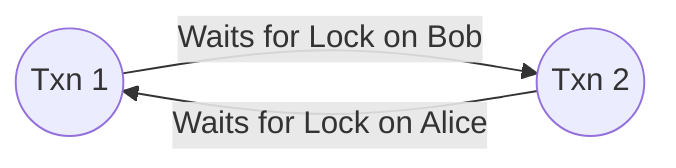

<span className="badge badge--warning margin-bottom--md">Medium</span>

> **Interview Question:** "What is a database deadlock? How does the database detect them, how does it resolve them when they occur, and how do you design application code to prevent them?"

A **deadlock** is a concurrency state in a relational database where two or more transactions permanently block one another because each holds a lock that the other needs, creating a circular wait chain that neither can break independently.

---

### The Classic Deadlock Scenario

Consider two concurrent bank transfers:

```
Transaction 1: Alice transfers \$50 to Bob
Transaction 2: Bob transfers \$30 to Alice

Time | Transaction 1 (Alice -> Bob)         | Transaction 2 (Bob -> Alice)
-----+--------------------------------------+-------------------------------------
T1   | BEGIN;                               | BEGIN;
T2   | UPDATE accounts SET bal = bal - 50   | 
     | WHERE id = 'Alice';                  | 
     | [Acquires Exclusive Lock on Alice]   | 
T3   |                                      | UPDATE accounts SET bal = bal - 30
     |                                      | WHERE id = 'Bob';
     |                                      | [Acquires Exclusive Lock on Bob]
T4   | UPDATE accounts SET bal = bal + 50   | 
     | WHERE id = 'Bob';                    | 
     | [BLOCKED: Waiting for Bob's lock...] | 
T5   |                                      | UPDATE accounts SET bal = bal + 30
     |                                      | WHERE id = 'Alice';
     |                                      | [DEADLOCK! Waiting for Alice's lock]
```

Neither transaction can proceed. Transaction 1 is waiting for Bob; Transaction 2 is waiting for Alice.

---

### How Databases Detect Deadlocks

Relational database engines use two primary strategies to detect deadlocks:

#### 1. Wait-For Graph (WFG) Cycle Detection
The database maintains an internal directed graph representing active dependencies:
- **Nodes:** Active transactions (T_1, T_2).
- **Directed Edges:** T_1  o T_2 means T1 is waiting for a lock held by T2.
- A background thread runs periodically (e.g., every 500ms or 1s). If it discovers a **directed cycle** (T_1  o T_2  o T_1), a deadlock has definitively occurred!



#### 2. Lock Wait Timeouts
A simpler mechanism: If a transaction waits for a lock longer than a configured threshold (e.g., MySQL's `innodb_lock_wait_timeout = 50s`), the database automatically aborts the waiting transaction with a timeout error.

---

### How Databases Resolve Deadlocks (Victim Selection)

Once a cycle is identified, the database breaks the circle by choosing a **Victim Transaction** to abort and roll back:
- The engine rolls back the victim and returns an error code to the client (e.g., PostgreSQL `40P01: deadlock detected`, MySQL `1213: Deadlock found`).
- **Victim Selection Heuristics:**
  - The transaction that has performed the least amount of undo log work (cheapest to roll back).
  - The youngest transaction (to maximize chances that older transactions finish).
  - The transaction with the fewest locked rows.

---

### How to Prevent Deadlocks in Application Code

#### 1. Strict Global Lock Ordering (The Gold Standard)
The most effective architectural prevention is ensuring that **all transactions acquire locks in the exact same deterministic order across the entire codebase**.
- In our Alice and Bob example, order locks alphabetically or numerically by ID:
  `Lock min(ID_A, ID_B) first, then lock max(ID_A, ID_B) second`.

```python
# Deterministic lock ordering prevents cycles:
first_id, second_id = sorted([alice_id, bob_id])

db.execute("SELECT * FROM accounts WHERE id = %s FOR UPDATE", [first_id])
db.execute("SELECT * FROM accounts WHERE id = %s FOR UPDATE", [second_id])
```
Because both transactions attempt to lock `Alice` before `Bob`, Transaction 2 waits at step 1 instead of acquiring Bob and creating a cycle.

#### 2. Keep Transactions Short and Focused
- Do not perform slow HTTP network calls, file I/O, or CPU-heavy parsing inside a database transaction.
- Open the transaction, execute queries, and commit immediately.

#### 3. Automatic Application Retry Loops
Deadlocks are normal in high-concurrency systems. Robust backends wrap transactions in an exponential backoff retry decorator:

```python
for attempt in range(MAX_RETRIES):
    try:
        with db.transaction():
            execute_transfer(alice, bob, 50)
            break
    except DeadlockDetectedException:
        if attempt == MAX_RETRIES - 1:
            raise
        time.sleep(random.uniform(0.05, 0.2)) # Jittered retry
```

---

### The ELI5 Analogy: The Narrow One-Way Bridge

Imagine a narrow single-lane bridge. Car 1 enters from the North; Car 2 enters from the South at the same time. They meet in the exact middle. Neither driver can move forward because the other car is blocking them. 
- **Detection:** A police officer walks up and sees the standoff.
- **Victim Selection:** The police officer makes the smaller car (cheapest to reverse) back up off the bridge.
- **Prevention:** Install a traffic light ensuring cars only cross in one predetermined direction at a time.

---

### Summary
"Deadlocks occur when concurrent transactions form a circular wait for locks. Database engines detect them via Wait-For Graph cycle detection and abort a victim transaction. Engineers prevent them by enforcing deterministic global lock ordering, keeping transactions short, and implementing exponential backoff retry loops."

---

### Crucial Nuance: Gap Locks and Deadlocks on Inserts
Deadlocks do not only occur on `UPDATE` statements! In MySQL InnoDB running under Repeatable Read, **`INSERT` statements can deadlock on Gap Locks**. If Transaction A and Transaction B both attempt to insert into the same empty index range, both acquire shared gap locks. When both subsequently try to insert, each needs an exclusive insert intention lock on the gap held by the other, resulting in a silent deadlock.
