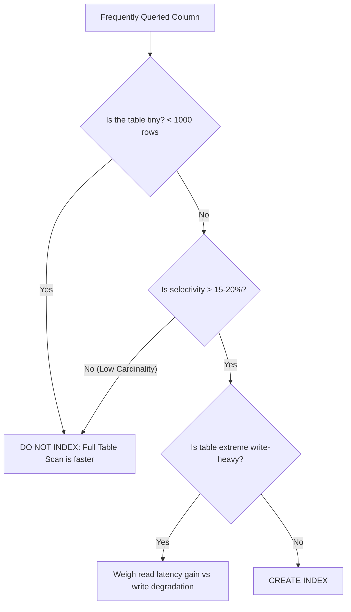

<span className="badge badge--warning margin-bottom--md">Medium</span>

> **Interview Question:** "When would you deliberately NOT create an index on a column, even if that column appears frequently in WHERE clauses?"

Junior engineers often assume that *"adding indexes always makes queries faster."* In production engineering, adding unnecessary or ineffective indexes is one of the quickest ways to degrade system throughput. 

Here are the critical scenarios where creating an index should be deliberately avoided.

---

### 1. Low Cardinality Columns (Poor Selectivity)
**Cardinality** refers to the number of unique values in a column relative to the total number of rows.
- *Examples:* `gender` (`M`, `F`, `Other`), `is_active` (`TRUE`, `FALSE`), `order_status` (`Pending`, `Completed`).
- If a table has 10,000,000 rows, an index on `is_active = TRUE` matches roughly 5,000,000 rows (50% of the table).
- **The Engine's Behavior:** Traversing a secondary B+ tree to retrieve 5,000,000 row pointers, followed by performing 5,000,000 random I/O bookmark lookups on the clustered table, is vastly **slower** than simply reading the table sequentially from beginning to end via a Full Table Scan. The query optimizer will recognize this and ignore your index completely.

---

### 2. Small Tables (Less than a few thousand rows)
If a table has only 500 or 1,000 rows (e.g., `lookup_countries`, `payment_status_types`):
- The entire table fits into a single 8KB or 16KB disk page in memory.
- Scanning a single in-memory page takes fractions of a millisecond (under 0.05ms).
- Traversing a B+ tree index requires reading the index page, extracting the pointer, and then reading the data page—doubling memory page dereferences for zero gain.

---

### 3. Write-Heavy Tables (High-Frequency Ingestion)
In high-throughput ingestion pipelines (e.g., IoT sensor telemetry, application log streams, audit event ledgers) where the write-to-read ratio is 100:1:
- Every single index on a table incurs synchronous overhead during `INSERT`:
  1. The new key must be placed into the B+ tree.
  2. If a target leaf page is full, the engine triggers an expensive **B+ Tree Page Split**, allocating a new disk page, redistributing keys, and updating parent pointers up the tree.
- Adding 6 indexes on an audit table can reduce ingestion throughput by **70% to 80%**.

---

### 4. Columns Frequently Modified by `UPDATE` Statements
If a column's value changes continuously (e.g., `user_last_seen_at`, `current_queue_position`):
- Updating an indexed column forces the database to delete the old key from the B+ tree node and insert the new key into another leaf node.
- This creates **B+ tree page fragmentation**, dead index space, and heavy Write-Ahead Log (WAL) traffic.

---

### 5. Wide Text Columns (Without Prefix Indexing)
Creating a standard B+ tree index on wide string columns (e.g., `VARCHAR(2000)` comments, URLs, or JSON blobs):
- Because keys are huge, internal B+ tree pages can only hold a few keys, drastically lowering fan-out.
- The index consumes gigabytes of RAM, displacing hot data pages from the database buffer cache.
- *Solution:* If you must search text, use **Full-Text Search (GIN indexes in Postgres)** or prefix indexing (`INDEX (url(25))`).

---

### The Decision Matrix: To Index or Not to Index?



---

### The ELI5 Analogy: The Book of 2-Letter Words

Imagine a 500-page dictionary containing only two words: "YES" and "NO". 
If the publisher adds a 50-page index at the back saying:
- *"YES: appears on pages 1, 3, 5, 7, 9, 11..."*
- *"NO: appears on pages 2, 4, 6, 8, 10, 12..."*

The index is completely useless. It takes you longer to read the index list than it does to just flip through the pages of the book!

---

### Summary
"Do not create an index on low-cardinality columns where the optimizer prefers sequential scans, on small tables that fit into a single disk page, on high-throughput write-heavy tables where page splits cripple ingestion, or on columns undergoing rapid continuous updates."

---

### Crucial Nuance: Partial / Filtered Indexes
If a column has low cardinality overall, but one specific value is extremely rare, you can use a **Partial Index** (supported natively in PostgreSQL and SQL Server):
```sql
-- 99.9% of orders are 'processed', 0.1% are 'failed'
CREATE INDEX idx_failed_orders ON orders (created_at) 
WHERE status = 'failed';
```
This index completely ignores the millions of `'processed'` rows, storing only the few hundred `'failed'` rows. The index is tiny, fast, and does not penalize normal order processing writes!
