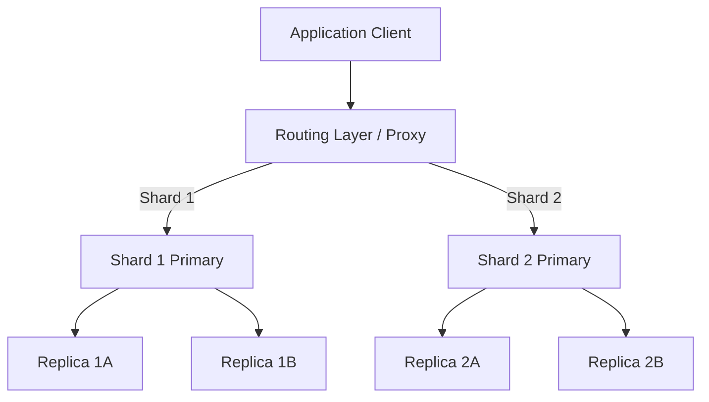

<span className="badge badge--warning margin-bottom--md">Medium</span>

> **Interview Question:** "What is database replication, and what is database sharding? How are they fundamentally different, and when do you combine both?"

As applications scale beyond the capacity of a single physical server, engineering teams must scale their database layer horizontally. The two foundational techniques are **Replication** and **Sharding**.

They solve two completely different bottlenecks.

---

### Conceptual Comparison

```
REPLICATION (Duplicating the same data across nodes):
Node 1 (Primary): [All Rows: 1 to 1,000,000]  <-- Handles Writes
      │
      ├──> Node 2 (Replica): [All Rows: 1 to 1,000,000]  <-- Handles Reads
      └──> Node 3 (Replica): [All Rows: 1 to 1,000,000]  <-- Handles Reads


SHARDING (Partitioning different rows across different nodes):
Shard 1 (Node A): [Rows 1 to 333,333]       <-- 1/3 of total dataset
Shard 2 (Node B): [Rows 333,334 to 666,666] <-- 1/3 of total dataset
Shard 3 (Node C): [Rows 666,667 to 1,000,000] <-- 1/3 of total dataset
```

---

### Core Differences

| Dimension | Database Replication | Database Sharding |
| :--- | :--- | :--- |
| **Primary Problem Solved** | **Read Throughput** & **High Availability (HA)** | **Write Throughput** & **Storage Capacity Limits** |
| **Data Distribution** | **Every node holds 100% of the data** | **Each node holds a disjoint fraction** (e.g., 20%) |
| **Write Scalability** | **Does NOT scale writes.** (All writes still funnel to the single Primary) | **Scales writes linearly.** (Writes are parallelized across distinct shards) |
| **Failover / Disaster Recovery**| If Primary dies, promote a Replica to become new Primary | If a shard dies, that partition of data is unavailable (unless replicated!) |
| **Application Complexity** | Low (direct writes to Primary, reads to Replicas via load balancer) | Very High (must route queries via Shard Key; cross-shard joins are brutal) |

---

### 1. Database Replication Deep Dive

In a **Primary-Replica (Master-Slave)** architecture:
- All mutations (`INSERT`, `UPDATE`, `DELETE`) execute on the **Primary**.
- The Primary streams its Write-Ahead Log (WAL) or binlog to read replicas.
- **Replication Lag:** If replication is **Asynchronous**, network delay can cause read replicas to trail the primary by a few milliseconds to seconds. A user might write a comment and fail to see it upon instant page reload.
- **Synchronous Replication:** The primary waits for at least one replica to acknowledge writing the log before returning success to the client, guaranteeing zero data loss at the cost of higher write latency.

---

### 2. Database Sharding Deep Dive

When your database grows from 500GB to **50 Terabytes**, it no longer fits on the largest available cloud server disk, or write IOPS saturate the hardware. 

Sharding splits the table horizontally based on a **Shard Key**:
```
User_ID % 3 = Target Shard
User 101 % 3 = 2 -> Routed to Shard 2
User 102 % 3 = 0 -> Routed to Shard 0
User 103 % 3 = 1 -> Routed to Shard 1
```

#### The Heavy Costs of Sharding:
1. **Cross-Shard JOINs:** Joining tables located on physically separate network servers is prohibitively slow and complex.
2. **Distributed Transactions:** Enforcing ACID across multiple shards requires **Two-Phase Commit (2PC)**, which cripples throughput.
3. **Re-Sharding Overhead:** Adding new shards when traffic grows requires costly data migration and hashing algorithms like **Consistent Hashing**.

---

### Combining Both in Production: Sharded Replicas

In real-world hyperscale architectures (e.g., Uber, Instagram, Discord), databases use **both together**:


- The dataset is sharded into 10 shards to distribute storage and write capacity.
- Each individual shard consists of a Primary node and 2 Replicas to provide read scale and failover redundancy!

---

### The ELI5 Analogy: The Restaurant Kitchen

- **Replication (Hiring More Waiters):** The kitchen has 1 Master Chef cooking meals (The Primary). Customers are ordering food fast, so you hire 5 Waiters (Replicas) to deliver plates and answer customer questions (Read Scaling). But if 500 orders flood the kitchen at once, the 1 Master Chef gets overwhelmed and the restaurant collapses (Write Bottleneck).
- **Sharding (Building Multiple Kitchens):** You build 3 separate kitchens. Kitchen 1 cooks Italian food (Shard 1), Kitchen 2 cooks Mexican food (Shard 2), Kitchen 3 cooks Desserts (Shard 3). Now 3 chefs cook simultaneously (Write Scaling). But if a customer wants a taco AND a pizza on the same plate (Cross-Shard Join), the waiters have to run across parking lots between kitchens to assemble the meal!

---

### Summary
"Replication duplicates the full dataset across multiple nodes to scale read traffic and provide failover high availability, but does not scale write capacity. Sharding horizontally partitions disjoint subsets of data across nodes using a shard key to scale write throughput and storage, introducing high architectural complexity for cross-shard joins."

---

### Crucial Nuance: Vertical Partitioning vs. Horizontal Sharding
Do not confuse horizontal sharding with **Vertical Partitioning**. 
- **Horizontal Sharding:** Splits **rows** across nodes (e.g., Users 1-100k on Node A, Users 100k-200k on Node B).
- **Vertical Partitioning:** Splits **columns / tables** across nodes (e.g., placing the heavy `users_multimedia_blobs` table on a dedicated high-storage server while keeping lightweight `users_auth` on a high-CPU server).
