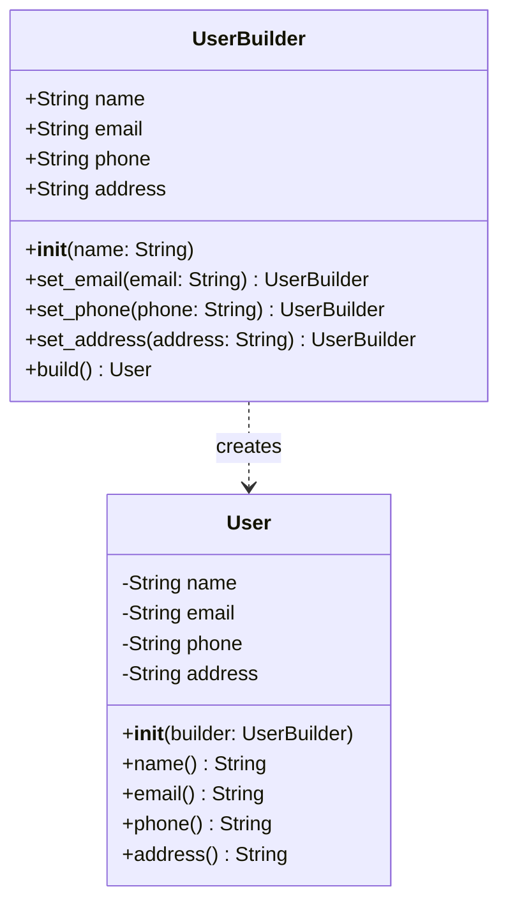

<span className="badge badge--warning margin-bottom--md">Medium</span>

> **Interview Question:** What is the Builder pattern? Why would you use it over a constructor with many parameters (the "telescoping constructor" problem)? Show me a Python implementation  -  use a scenario involving building an immutable User object with several optional fields (name required, email/phone/address optional).

### The Interview Quick-Hit

"The Builder pattern is a creational design pattern used to construct complex objects step-by-step. It solves the 'telescoping constructor' problem - where you are forced to write dozens of overloaded constructors for optional parameters. More importantly, it is the perfect mechanism for creating completely Immutable objects that require complex, multi-step configuration before instantiation."



### The "Why": Immutability & The Scaffolding

If an interviewer asks, "Why not just use a no-argument constructor and a bunch of setter methods to configure the object?"

This is where you bridge design patterns with backend thread-safety. An immutable object (like a User or Transaction) has no setters. It must be created fully formed and valid in a single step. You cannot build it piece-by-piece.

The Builder pattern solves this by acting as mutable scaffolding. You do all your conditional logic, multi-step piecing together, and validation on the mutable Builder object. Once the configuration is perfect, you call `build()`. The scaffolding is thrown away, and you are left with a thread-safe, permanently immutable final object.

### The ELI5 Analogy: Ordering at Subway

Imagine walking into a Subway sandwich shop. You do not hand the employee a piece of paper with 15 fields filled out with "Yes, No, Null, Null, Yes" for every possible ingredient.

Instead, you use a Builder. You start with the required foundation: "I want a 6-inch sub." Then, you chain optional steps together: "Add lettuce." -> "Add tomatoes." -> "Skip the mayo." Finally, you call the termination method: "Toast it and wrap it up!" The final product is assembled cleanly based only on the steps you invoked.

### The Python Implementation (Fluent API Style)

Here is how you build an immutable User object using method chaining, with all properties correctly mapped.

```python
class User:
    # 1. The constructor takes the Builder object as its only parameter
    def __init__(self, builder):
        self._name = builder.name
        self._email = builder.email
        self._phone = builder.phone
        self._address = builder.address

    # 2. Getters only (No setters) makes the resulting object completely Immutable
    @property
    def name(self): return self._name
    
    @property
    def email(self): return self._email
    
    @property
    def phone(self): return self._phone
    
    @property
    def address(self): return self._address

    def __str__(self):
        return f"User(name={self.name}, email={self.email}, phone={self.phone})"


class UserBuilder:
    # 1. Required fields go in the Builder's constructor
    def __init__(self, name):
        self.name = name
        self.email = None
        self.phone = None
        self.address = None

    # 2. Optional fields get setter methods that return 'self' to allow chaining
    def set_email(self, email):
        self.email = email
        return self

    def set_phone(self, phone):
        self.phone = phone
        return self
        
    def set_address(self, address):
        self.address = address
        return self

    # 3. The build method actually creates the final immutable object
    def build(self):
        return User(self)


# --- Execution ---
# Clean, readable, and handles optional parameters perfectly
admin = (UserBuilder("Alice")
         .set_email("alice@test.com")
         .set_phone("555-0192")
         .build())

print(admin)
```

### The Senior-Level Pivots (Bonus Points)

Drop these at the end of your explanation to show deep architectural maturity:

1.  **Python Native Alternative:** "While building an explicit Builder class is great for complex validation (e.g., verifying the email format before allowing the object to build), Python natively handles the telescoping constructor problem beautifully using Keyword Arguments (`**kwargs`). In Java, however, this pattern is strictly necessary."
2.  **The Gang of Four "Director":** "If we look at the original Gang of Four textbook definition, the Builder pattern originally included a separate Director class. The Director memorized a standard sequence of steps (like `build_admin_user()`) to automate common configurations. In modern backend practice, the Director is largely skipped in favor of the fluent-chaining style you see above, which offers more flexible, readable client code."

---

### Crucial Nuance: The Mandatory Field Dilemma

A common flaw in basic Builder implementations is the lack of compile-time enforcement for mandatory fields. Since the `.build()` method can technically be called at any time, a developer might forget to chain a crucial `.set_email()` method, causing a runtime failure. To solve this, advanced architects use a "Step Builder" pattern (or interface-driven Builder), which forces the developer to call specific methods in a precise sequence before the `.build()` method even becomes accessible in their IDE.
