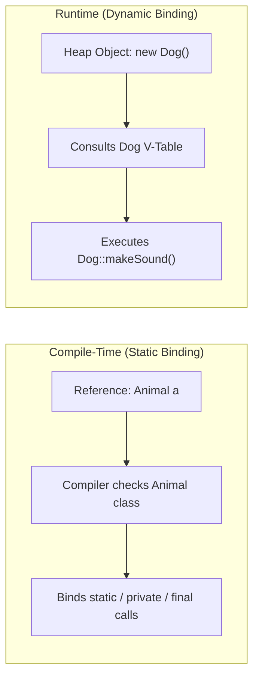
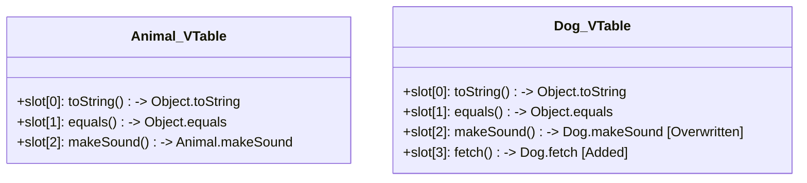

<span className="badge badge--danger margin-bottom--md">Hard</span>

> **Interview Question:** "What is the core difference between static and dynamic binding? How does the JVM decide which method implementation to execute at runtime, and what are the exact roles of bytecode dispatch instructions and the Virtual Method Table (v-table)?"

### The Quick Answer

Static binding (early binding) occurs at compile time when the compiler resolves method invocations based strictly on the declared reference type—applying to `static`, `private`, `final`, and overloaded methods (`invokestatic`, `invokespecial`). Dynamic binding (late binding) defers resolution to runtime based on the actual concrete object allocated on the heap, powering method overriding via Virtual Method Table (`v-table`) lookups (`invokevirtual`, `invokeinterface`). Importantly, member variables (fields) and static methods are never dynamically dispatched; they are always resolved statically at compile time.

---

### The ELI5 Analogy

Imagine two ways a medical prescription gets fulfilled:

* **Static Binding (The Pre-Printed Prescription):** A doctor writes a prescription for a specific medication code. The pharmacy technician reads the printed label on the slip (the declared reference type) and pulls the exact bottle off the shelf before ever speaking with you. The decision was locked in advance at "compile time."
* **Dynamic Binding (The On-Site Emergency Triage):** An emergency room physician greets whoever walks through the door. Even if the clipboard simply says "Patient" (the base reference type), the physician examines the actual, living human being in the room (the heap object) and decides which protocol to run on the spot in real time.

---

### The Core Architectural Distinction

Binding refers to the linking of a method call to its actual method body (memory address of executable code):

* **Static Binding (Early Binding):** The binding decision is finalized at **compile-time** by the compiler. The compiler uses the **declared reference type** and argument types to resolve the call.
* **Dynamic Binding (Late Binding):** The binding decision is deferred until **runtime**. The runtime environment (e.g., the HotSpot JVM) inspects the **actual concrete object** on the heap and dispatches the call dynamically.



---

### Comparison: Static vs. Dynamic Binding

| Dimension | Static Binding (Early Binding) | Dynamic Binding (Late Binding) |
| :--- | :--- | :--- |
| **Resolution Phase** | Compile-time by `javac`. | Runtime by JVM execution engine. |
| **Deciding Factor** | **Declared Reference Type** (left-hand side). | **Actual Object Type on Heap** (right-hand side). |
| **Target Methods** | `static`, `private`, `final` methods, and overloaded methods. | Overridden non-final instance methods. |
| **Polymorphism Form** | Compile-time polymorphism (Method Overloading). | Runtime polymorphism (Method Overriding). |
| **JVM Bytecode** | `invokestatic`, `invokespecial`. | `invokevirtual`, `invokeinterface`. |
| **Performance** | Zero runtime overhead (direct jump/inlining). | Slight overhead (`O(1)` v-table dereference, JIT devirtualization/monomorphic inlining). |

---

### JVM Bytecode Dispatch Instructions

To demonstrate staff-level mastery, explain the five method invocation instructions defined in the Java Virtual Machine Specification:

1. **`invokestatic`:**
   * Invokes class-level static methods (e.g., `Collections.sort()`).
   * Completely resolved at compile-time; requires no object instance reference on the operand stack.
2. **`invokespecial`:**
   * Invokes instance initialization methods (`<init>` constructors), `private` methods, and `super.method()` invocations.
   * Non-overridable methods resolved statically; no dynamic dispatch table is consulted.
3. **`invokevirtual`:**
   * Standard dynamic dispatch for public and protected instance methods.
   * Looks up the target method address dynamically via the class **Virtual Method Table (v-table)**.
4. **`invokeinterface`:**
   * Dynamic dispatch for methods declared in interfaces.
   * Inspects the **Interface Method Table (itable)**. Because a class can implement multiple independent interfaces with different method offsets, itable resolution is slightly more complex than single-inheritance v-table indexing.
5. **`invokedynamic` (Java 7+):**
   * Bootstrapped dynamic call sites; used for lambda expressions, method references, and dynamic JVM languages.

---

### Under the Hood: The Virtual Method Table (V-Table)

In C++ and Java (HotSpot JVM), dynamic dispatch is implemented using a **Virtual Method Table (v-table)**:



1. **V-Table Generation:** During class loading and verification, the JVM constructs a v-table for each loaded class.
2. **Method Offsets:** In single inheritance, each method is assigned a fixed index offset in the array. For example, `makeSound()` is always at index 2 for `Animal` and all its subclasses.
3. **Overriding as Table Overwriting:** If `Dog` overrides `makeSound()`, `Dog`'s v-table at slot 2 points directly to `Dog.makeSound()`. If `Dog` does not override `equals()`, slot 1 continues to point to `Object.equals()`.
4. **Dispatch Execution (`O(1)`):**
   * When executing `animalRef.makeSound()`, the JVM reads the object's header to find its metadata pointer (`Klass*`).
   * It directly looks up index 2 in that class's v-table and jumps to the target machine code:

```text
Target Address = Object -> KlassPointer -> VTable[offset]
```

---

### Crucial Trap: Fields & Static Methods Are ALWAYS Statically Bound

A favorite senior interview trap tests whether candidates realize that **fields (variables) never participate in dynamic dispatch**:

```java
class Parent {
    int value = 10;
    static void printType() { System.out.println("Parent Static"); }
}

class Child extends Parent {
    int value = 20; // Hides Parent.value
    static void printType() { System.out.println("Child Static"); } // Hides Parent.printType
}

Parent obj = new Child();
System.out.println(obj.value); // Prints 10 (NOT 20!)
obj.printType();               // Prints "Parent Static" (NOT "Child Static"!)
```

* **Explanation:** Variables and static methods are bound strictly to the declared reference type (`Parent`) at compile-time. There is no concept of a "virtual variable" in Java or C++.

---

### The Interview Answer (60-90 seconds)

> "Static binding occurs at compile time, whereas dynamic binding occurs at runtime.
>
> In static binding, the compiler binds the method call based strictly on the declared reference type and compile-time arguments. This applies to `static`, `private`, and `final` methods, as well as overloaded methods, translating into `invokestatic` or `invokespecial` bytecode instructions.
>
> In dynamic binding, the JVM resolves the method call based on the actual concrete object residing on the heap at runtime. This powers method overriding and translates to `invokevirtual` or `invokeinterface`.
>
> Under the hood, the HotSpot JVM uses a Virtual Method Table (v-table). Each class has an array of method pointers. Subclasses inherit parent offsets, and overridden methods overwrite that specific slot. At runtime, the JVM performs an O(1) pointer lookup through the object's header to the v-table.
>
> Finally, a classic interview trap is field shadowing: fields and static methods are never dynamically dispatched—they are always resolved statically based on the reference type."

---

### Code Demonstration: Demonstrating Static vs. Dynamic Resolution

The following self-contained Java program proves how the compiler and JVM differentiate between static field resolution, static method hiding, and dynamic virtual dispatch.

```java
public class BindingMechanics {

    static class Superclass {
        // Field (Statically Bound)
        public String name = "Superclass Field";

        // Static Method (Statically Bound via invokestatic)
        public static void identify() {
            System.out.println("[Static] Superclass.identify()");
        }

        // Instance Method (Dynamically Bound via invokevirtual)
        public void execute() {
            System.out.println("[Virtual] Superclass.execute()");
        }
    }

    static class Subclass extends Superclass {
        // Field Hiding
        public String name = "Subclass Field";

        // Method Hiding
        public static void identify() {
            System.out.println("[Static] Subclass.identify()");
        }

        // Method Overriding
        @Override
        public void execute() {
            System.out.println("[Virtual] Subclass.execute()");
        }
    }

    public static void main(String[] args) {
        // Reference type: Superclass | Actual Heap Object: Subclass
        Superclass polymorphicRef = new Subclass();

        System.out.println("--- 1. Field Access (Static Binding) ---");
        // Evaluated at compile-time using the declared type (Superclass)
        System.out.println("Accessed Field: " + polymorphicRef.name);
        // Output: "Superclass Field"

        System.out.println("\n--- 2. Static Method Call (Static Binding) ---");
        // Compiler transforms this directly to Superclass.identify()
        polymorphicRef.identify();
        // Output: "[Static] Superclass.identify()"

        System.out.println("\n--- 3. Overridden Method Call (Dynamic Binding) ---");
        // JVM consults the Subclass V-Table at runtime
        polymorphicRef.execute();
        // Output: "[Virtual] Subclass.execute()"
    }
}
```
