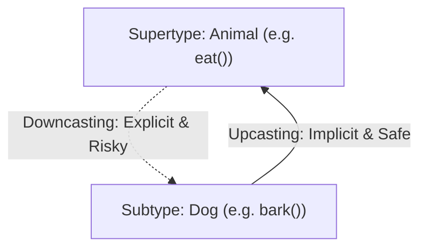

<span className="badge badge--success margin-bottom--md">Easy</span>

> **Interview Question:** "Explain upcasting vs downcasting in Java. Why is downcasting prone to `ClassCastException`, how does `instanceof` prevent it, and what are the subtle rules regarding interfaces and `null` values?"

### The Quick Answer

Upcasting casts a subtype reference to a supertype reference (`Animal a = new Dog()`); it is implicit, 100% type-safe at compile-time, and forms the bedrock of polymorphism. Downcasting casts a supertype reference down to a specialized subtype (`Dog d = (Dog) a`); it requires explicit syntax and carries runtime risk, throwing `ClassCastException` if the underlying heap object is incompatible. Safe downcasting relies on `instanceof` (or modern Java 16+ pattern matching `if (obj instanceof Dog d)`), which always safely evaluates to `false` when tested against `null` without throwing `NullPointerException`.

---

### The ELI5 Analogy

* **Upcasting (Zooming Out / Generalizing):** You look at a Golden Retriever and state: *"That is an Animal."* This statement is guaranteed to be 100% true and risk-free. You lose access to breed-specific commands (like "fetch duck"), but you gain the ability to treat it generically alongside cats, horses, and birds.
* **Downcasting (Zooming In / Guessing Specifics):** You see a creature hidden behind a frosted glass window labeled "Animal" and proclaim: *"That is definitely a Golden Retriever."* If you are right, you can open the door and ask it to fetch. But if the shadow actually belonged to a tiger, your assumption fails catastrophically at runtime (`ClassCastException`). That is why downcasting always requires verification (`instanceof`).

---

### Upcasting vs. Downcasting Overview

Typecasting in object-oriented programming changes the declared reference type through which an object is accessed:

* **Upcasting (Subtype → Supertype):**
  * **Implicit & Automatic:** Completely safe because a subtype strictly honors the contract of its supertype (Liskov Substitution Principle).
  * **Purpose:** Enables polymorphism. Allows generic algorithms to operate on collections of base types (e.g., `List<Shape>` holding `Circle` and `Square`).
* **Downcasting (Supertype → Subtype):**
  * **Explicit & Risky:** Requires explicit casting syntax: `(Subtype) reference`.
  * **Purpose:** Recovers access to subtype-specific methods that are invisible through the supertype interface.
  * **The Risk:** If the underlying heap object is not actually an instance of the target subtype, the JVM immediately throws a runtime `ClassCastException`.



---

### Comparison: Upcasting vs. Downcasting

| Dimension | Upcasting | Downcasting |
| :--- | :--- | :--- |
| **Direction** | Child class → Parent class | Parent class → Child class |
| **Syntax** | Implicit: `Animal a = new Dog();` | Explicit: `Dog d = (Dog) a;` |
| **Safety** | 100% type-safe at compile-time. | Prone to runtime `ClassCastException`. |
| **Method Visibility** | Restricts to superclass interface. | Unlocks all subclass-specific methods. |
| **Primary Use Case** | Polymorphic APIs and collections. | Downward inspection when specialization is required. |

---

### Compile-Time vs. Runtime Castability Rules

Interviewers frequently present subtle typecasting scenarios to test whether a candidate understands the compiler's boundary checks:

#### 1. Unrelated Concrete Classes (Compile Error)
If two classes belong to disjoint inheritance trees, the compiler intercepts the cast immediately:
```java
Dog dog = new Dog();
String text = (String) dog; // COMPILE ERROR: Inconvertible types
```
*Why?* The compiler knows with 100% certainty that no class can simultaneously inherit from both `Dog` and `String`.

#### 2. Downcasting Through an Interface (Compile Pass, Runtime Risk!)
Consider an interface that a class currently does **not** implement:
```java
Animal animal = new Dog(); // Dog does NOT implement Serializable
Serializable s = (Serializable) animal; // COMPILES WITHOUT ERROR!
```
*Why does this compile?* 
Unless `Dog` is declared `final`, the compiler cannot prove that some unknown subclass (e.g., `class GoldenRetriever extends Dog implements Serializable`) won't be passed at runtime. Therefore, the compiler permits the cast and delegates the check to the JVM runtime. If the object at runtime doesn't implement it, `ClassCastException` occurs.

---

### The `null instanceof T` Rule

A rapid-fire interview trap tests how `instanceof` handles `null` references:

```java
Dog myDog = null;
if (myDog instanceof Dog) {
    System.out.println("Is a Dog");
} else {
    System.out.println("Not a Dog");
}
```

* **Result:** Prints `"Not a Dog"`.
* **The Rule:** The `instanceof` operator **strictly returns `false` when evaluated against `null`**, and it **never throws a `NullPointerException`**. This makes `if (obj instanceof Target)` a safe compound guard against both incorrect types and null references.

---

### Modern Java: Pattern Matching for `instanceof` (Java 16+)

Historically, safe downcasting required verbose, error-prone boilerplate:

```java
// Pre-Java 16: Redundant test-and-cast
if (obj instanceof Dog) {
    Dog d = (Dog) obj; // Manual boilerplate downcast
    d.bark();
}
```

As of Java 16 (JEP 394), **Pattern Matching for `instanceof`** combines testing and variable binding into a single atomic operation:

```java
// Modern Java: Pattern Matching
if (obj instanceof Dog d) {
    d.bark(); // 'd' is automatically typed and scoped within this block!
}
```

---

### The Interview Answer (60-90 seconds)

> "Upcasting is casting a subtype reference to a supertype. It is implicit, completely safe, and forms the bedrock of polymorphism by allowing us to treat specialized objects generically.
>
> Downcasting is casting a supertype reference back down to a specialized subtype. It must be explicit because it carries runtime risk: if the actual object on the heap is not of that subtype, the JVM aborts with a `ClassCastException`.
>
> To safeguard downcasting, we use the `instanceof` operator, or modern Java 16 pattern matching like `if (obj instanceof Dog d)`.
>
> Two critical edge cases interviewers look for:
> 1. Evaluating `null instanceof Type` always safely yields `false` without throwing `NullPointerException`.
> 2. Casting an un-finalized concrete class to an interface will always compile, even if the class doesn't implement the interface, because the compiler cannot rule out that a future subclass might implement it at runtime."

---

### Code Demonstration: Typecasting Edge Cases & Pattern Matching

The following Java program illustrates upcasting, dangerous downcasting caught with `instanceof`, interface casting rules, and Java 16 pattern matching.

```java
import java.io.Serializable;

public class CastingMechanicsDemo {

    static class Animal {
        public void breathe() {
            System.out.println("[Animal] Breathing...");
        }
    }

    static class Dog extends Animal {
        public void bark() {
            System.out.println("[Dog] Woof! Woof!");
        }
    }

    static class Cat extends Animal {
        public void meow() {
            System.out.println("[Cat] Meow!");
        }
    }

    public static void main(String[] args) {
        // 1. Upcasting: Safe and automatic
        Animal myAnimal = new Dog();
        myAnimal.breathe(); // Accessible via Animal reference

        // 2. The Downcasting Risk: ClassCastException
        Animal catAnimal = new Cat();
        try {
            System.out.println("--- Attempting blind downcast ---");
            Dog forcedDog = (Dog) catAnimal; // Throws ClassCastException!
            forcedDog.bark();
        } catch (ClassCastException e) {
            System.out.println("[Caught] " + e.getMessage());
        }

        // 3. Safe Downcasting with Java 16+ Pattern Matching
        System.out.println("\n--- Pattern Matching for instanceof ---");
        processAnimal(new Dog());
        processAnimal(new Cat());

        // 4. The null instanceof rule
        System.out.println("\n--- Testing null instanceof ---");
        Animal nullAnimal = null;
        if (nullAnimal instanceof Dog) {
            System.out.println("Evaluated to true");
        } else {
            System.out.println("null instanceof Dog is safely FALSE (no NPE)");
        }

        // 5. Interface Castability Edge Case
        Animal animalDog = new Dog();
        try {
            // Compiles fine because Animal is not final, but fails at runtime!
            Serializable s = (Serializable) animalDog;
        } catch (ClassCastException e) {
            System.out.println("Interface cast failed at runtime as expected: " + e.getClass().getSimpleName());
        }
    }

    static void processAnimal(Animal a) {
        if (a instanceof Dog d) {
            System.out.print("Identified Dog: ");
            d.bark();
        } else if (a instanceof Cat c) {
            System.out.print("Identified Cat: ");
            c.meow();
        }
    }
}
```
