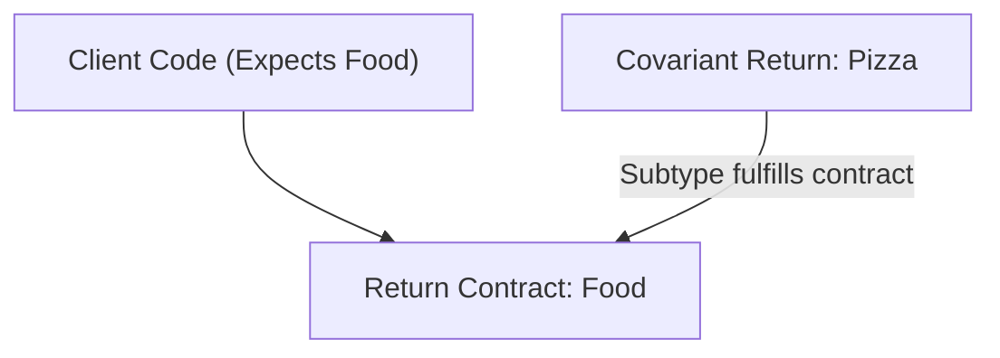

<span className="badge badge--warning margin-bottom--md">Medium</span>

> **Interview Question:** "What is a covariant return type in Java? How does it honor the Liskov Substitution Principle, why does the compiler generate synthetic bridge methods under the hood, and do covariant returns apply to primitives?"

### The Quick Answer

A covariant return type allows an overriding method in a subclass to return a narrower subtype of the return type declared in its superclass (for example, returning `Pizza` instead of `Food`). Introduced in Java 5, this honors the Liskov Substitution Principle (LSP) and spares client code from cumbersome, error-prone downcasting. Because the JVM method descriptor treats return types as part of the method identity, the `javac` compiler automatically injects a hidden "synthetic bridge method" into the subclass bytecode to preserve binary backward compatibility. Covariant returns apply strictly to reference types, never to primitives.

---

### The ELI5 Analogy

Imagine ordering from an online grocery store versus a specialty bakery:

* **Superclass Contract (The Grocery Store):** A general store guarantees: *"Order from our kitchen department, and you will receive `Food`."*
* **Subclass Specialization (The Artisan Bakery):** A boutique bakery fulfills that contract, but specifies: *"Order from our kitchen, and you will receive `FreshCroissant`."*

Because every `FreshCroissant` **IS-A** `Food`, any customer expecting general sustenance is 100% satisfied without breaking expectations (Liskov Substitution Principle). Furthermore, customers ordering specifically from the bakery don't need to open the box, inspect the item, and run tests to confirm it is a pastry; they can enjoy their croissant immediately without manual "downcasting."

---

### Conceptual Definition

Introduced in Java 5 (JSR 14), a **covariant return type** allows an overriding method in a subclass to return a **narrower, more specific subtype** than the return type declared in the superclass:

```java
class Superclass {
    public SuperType produce() { return new SuperType(); }
}

class Subclass extends Superclass {
    @Override
    public SubType produce() { return new SubType(); } // Valid: SubType extends SuperType
}
```

Prior to Java 5, overriding methods were required to match the superclass return type with 100% exactness, forcing client code to perform repetitive, boilerplate, and potentially unsafe manual downcasts.

---

### Architectural Alignment: Liskov Substitution Principle (LSP)

Covariant return types are a direct manifestation of the **Liskov Substitution Principle (LSP)**:
* LSP states that objects of a superclass should be replaceable with objects of a subclass without altering the correctness of the program.
* If a client consumes `Restaurant.serve()` expecting a `Food` object, receiving a `Pizza` object (where `Pizza IS-A Food`) guarantees that every method available on `Food` (`eat()`, `getCalories()`) works flawlessly.



> **Contravariance Note:** While Java supports **covariant returns**, it does **NOT** support contravariant parameter types. If a subclass method widens an input parameter (e.g., from `Dog` to `Animal`), the Java compiler treats it as a **method overload**, not an override.

---

### Comparison: Return Type Variance vs. Parameter Variance

| Dimension | Covariant Return Types | Overriding Parameter Types | Primitive Return Types |
| :--- | :--- | :--- | :--- |
| **Language Support** | Supported since Java 5 (JSR 14). | Strictly **Invariant** (Must match exact types). | Strictly **Invariant** (Must match exact primitive). |
| **Subtyping Direction** | Subtype allowed (`Food` → `Pizza`). | Changing parameter creates an **Overload**, not Override. | Widening/narrowing illegal (`double` cannot become `int`). |
| **Type Domain** | Reference types / Objects only. | All types. | Primitives only (`int`, `double`, `boolean`, etc.). |
| **OOP Principle** | Liskov Substitution Principle (LSP). | Uniform invocation contract. | Primitive memory alignment and CPU register sizing. |
| **JVM Bytecode Role** | Compiler emits hidden **Synthetic Bridge Method**. | Normal bytecode dispatch with distinct signatures. | Incompatible return instruction (`ireturn` vs `dreturn`). |
| **Caller Impact** | Eliminates manual typecasts at invocation site. | Caller must choose matching overload signature. | Compile-time rejection (`Incompatible return type`). |

---

### Under the Hood: Synthetic Bridge Methods

To understand how the JVM executes covariant returns, you must understand a fundamental discrepancy between Java source code and JVM bytecode:

1. **In Java Language:** A method signature consists strictly of the **method name and parameter types**. Return types are excluded.
2. **In JVM Classfiles:** A method descriptor includes the **return type**! To the JVM, `serve()LFood;` and `serve()LPizza;` are two entirely distinct methods.

If client code holds a superclass reference (`Restaurant r = new Pizzeria()`) and calls `r.serve()`, the bytecode instruction emitted is:
```bytecode
invokevirtual #2 // Method Restaurant.serve:()LFood;
```

If `Pizzeria.class` only contained `serve()LPizza;`, the JVM would throw an `AbstractMethodError` or `NoSuchMethodError` at runtime!

#### The Compiler's Solution: Synthetic Bridge Methods
To maintain binary backward compatibility, the `javac` compiler automatically injects a hidden **synthetic bridge method** into the subclass bytecode:

```java
// What the compiler secretly generates inside Pizzeria.class:
public synthetic bridge Food serve() {
    // Delegates to the covariant method returning Pizza
    return this.serve(); // Invokes serve()LPizza;
}
```

This bridge method satisfies the polymorphic contract of `Restaurant.serve()LFood;` while allowing callers with a `Pizzeria` reference to receive `Pizza` directly without downcasting.

---

### The Primitive Type Restriction

A classic interview trap asks: *"If `int` fits into a `double`, can an overriding method return `int` if the superclass method returns `double`?"*

**Answer:** **No.** Covariant return types apply exclusively to **reference types (objects)**.
* Primitives have fundamentally different memory allocations (e.g., 32-bit `int` vs. 64-bit `double`) and entirely distinct JVM bytecode instructions (`ireturn` for ints vs. `dreturn` for doubles).
* Attempting to change a primitive return type will result in a hard compile-time error: `"The return type is incompatible with Superclass.method()"`.

---

### The Interview Answer (60-90 seconds)

> "A covariant return type allows an overriding method in a child class to declare a return type that is a subclass of the parent's declared return type. This adheres to the Liskov Substitution Principle and eliminates manual downcasting on the caller side.
>
> Under the hood, Java bytecode includes the return type in its method descriptor. To prevent runtime linkage errors when called through a parent reference, the Java compiler automatically generates a hidden synthetic bridge method. This bridge method matches the parent's exact return descriptor and internally delegates to the specialized child method.
>
> Finally, covariant return types only apply to reference types; primitives are strictly invariant because their memory layout and bytecode return instructions differ fundamentally."

---

### Code Demonstration: Inspecting Synthetic Bridge Methods

The following Java program demonstrates covariant return types and uses Reflection to inspect and prove the existence of the compiler-generated synthetic bridge method.

```java
import java.lang.reflect.Method;

public class CovariantBridgeDemo {

    static class Food {
        public String getName() { return "Generic Food"; }
    }

    static class Pizza extends Food {
        @Override
        public String getName() { return "Wood-Fired Pizza"; }
        public void slice() { System.out.println("Pizza sliced into 8 pieces."); }
    }

    static class Restaurant {
        public Food serve() {
            return new Food();
        }
    }

    static class Pizzeria extends Restaurant {
        // Covariant Return Type: Returning Pizza instead of Food
        @Override
        public Pizza serve() {
            return new Pizza();
        }
    }

    public static void main(String[] args) {
        // 1. Direct use: No downcasting required!
        Pizzeria shop = new Pizzeria();
        Pizza pizza = shop.serve(); // Type is already Pizza!
        pizza.slice();

        // 2. Polymorphic use: Superclass contract still honored
        Restaurant genericShop = new Pizzeria();
        Food food = genericShop.serve();
        System.out.println("Polymorphic Meal: " + food.getName());

        // 3. Proving the Compiler's Synthetic Bridge Method
        System.out.println("\n--- Inspecting Pizzeria Methods via Reflection ---");
        Method[] methods = Pizzeria.class.getDeclaredMethods();
        for (Method m : methods) {
            if (m.getName().equals("serve")) {
                System.out.println("Method Name : " + m.getName());
                System.out.println("  Return Type : " + m.getReturnType().getSimpleName());
                System.out.println("  Is Synthetic: " + m.isSynthetic());
                System.out.println("  Is Bridge   : " + m.isBridge());
                System.out.println();
            }
        }
    }
}
```
