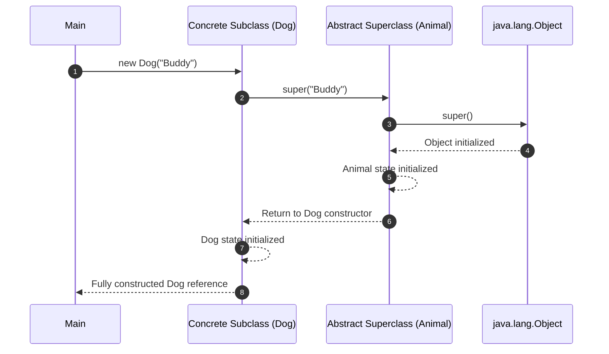

<span className="badge badge--warning margin-bottom--md">Medium</span>

> **Interview Question:** "Can an abstract class have a constructor if it cannot be instantiated directly with `new`? What is the complete object initialization lifecycle, what catastrophic bug occurs if a constructor invokes an overridable method, and why would you ever declare a private constructor?"

### The Quick Answer

Yes, abstract classes can and do have constructors: while they cannot be directly instantiated via `new`, their constructors are invoked through constructor chaining (`super()`) by concrete subclasses to initialize inherited state and enforce invariants. Invoking an overridable method inside any constructor is a catastrophic anti-pattern because dynamic dispatch calls the child method before child fields are initialized, leading to `NullPointerException`s or corrupted state. Private constructors are used to suppress instantiation in static utility classes (e.g., `Math`), implement singletons, and control instance creation via static factory methods.

---

### The ELI5 Analogy

* **Abstract Class Constructor (The House Foundation):** You cannot live in an isolated concrete foundation slab by itself (you cannot instantiate an abstract class with `new`). However, when you construct a two-story home (`new ConcreteSubclass()`), the construction crew must lay down and cure the foundation first (`super()`) before erecting the framing and roof. The foundation's constructor initializes the base structure that the upper floors rely on.
* **Private Constructor (The Secret Speakeasy Door):** A building with no exterior front entrance. The general public cannot open the door and walk in (`new PrivateClass()` is blocked). The only way inside is if the concierge inside greets you through a secure sliding slot and hands you an authorized pass (`PrivateClass.getInstance()` static factory).

---

### Abstract Class Constructors: Why They Exist

A common interview trap begins with: *"If an abstract class cannot be instantiated using `new`, why would it ever have a constructor?"*

While an abstract class cannot be instantiated independently, it **forms the partial foundation of its concrete subclasses**:
* Abstract classes often declare private fields, enforce non-null invariants, or initialize core dependencies.
* Subclasses cannot initialize private fields of their parent directly; they must delegate that initialization up the inheritance chain using `super(...)`.
* If an abstract class does not explicitly declare a constructor, the Java compiler automatically inserts a default no-argument constructor: `public AbstractClass() { super(); }`.



---

### Comparison: Abstract Class Constructors vs. Private Constructors

| Feature | Abstract Class Constructor | Private Constructor | Standard Public Constructor |
| :--- | :--- | :--- | :--- |
| **Accessibility** | Usually `protected` or `public`. | Strictly internal to enclosing class. | Open to all callers (`public`). |
| **Direct Instantiation (`new`)** | **Forbidden** (`Cannot instantiate the type`). | **Forbidden** outside the class. | **Allowed** freely. |
| **Subclass Chaining (`super()`)** | **Required** (Explicitly or via implicit `super()`). | **Forbidden** to external subclasses (prevents inheritance). | **Allowed** and standard. |
| **Primary Purpose** | Initializes inherited state and enforces base invariants. | Utility classes, Singletons, static factory methods. | Standard general-purpose object creation. |
| **Inheritance Impact** | Enables polymorphic subclass hierarchies. | Prevents external subclassing (seals class hierarchy). | Permits open subclassing (unless class is `final`). |
| **Reflection Vulnerability** | N/A (Cannot instantiate directly). | Can be bypassed via `setAccessible(true)` (unless `enum`). | Standard access. |

---

### Complete Object Initialization Lifecycle

When a subclass is instantiated (`new Child()`), the JVM follows a strict initialization order:

1. **Class Loading Phase (Once per ClassLoader):**
   * Superclass static fields and static initialization blocks execute.
   * Subclass static fields and static initialization blocks execute.
2. **Instance Initialization Phase (On Every `new`):**
   * Superclass instance fields and instance initializer blocks execute.
   * Superclass constructor body executes.
   * Subclass instance fields and instance initializer blocks execute.
   * Subclass constructor body executes.

---

### The Catastrophic Bug: Invoking Overridable Methods in Constructors

> **Staff-Level Bar Raiser:** Joshua Bloch (*Effective Java*, Item 19) explicitly warns: **"Constructors must not invoke overridable methods, directly or indirectly."**

Consider what happens if an abstract constructor calls an overridable method:

```java
abstract class Parent {
    public Parent() {
        init(); // DANGEROUS: Invokes overridable method!
    }
    public abstract void init();
}

class Child extends Parent {
    private String resource;

    public Child() {
        this.resource = "CRITICAL_DATABASE_CONNECTION";
    }

    @Override
    public void init() {
        // Evaluated DURING Parent's constructor, BEFORE Child's constructor!
        System.out.println("Resource length: " + resource.length()); // THROWS NullPointerException!
    }
}
```

#### Why it crashes:
1. `new Child()` begins by calling `super()` (the `Parent` constructor).
2. Inside `Parent()`, `init()` is invoked via dynamic dispatch (`invokevirtual`).
3. The JVM routes the call to `Child.init()`.
4. **However, `Child`'s constructor body has not run yet!** Its field `resource` is still initialized to its default value (`null`).
5. `resource.length()` triggers an immediate `NullPointerException`, crashing the application during instantiation.

---

### Private Constructors: Architectural Use Cases

Changing a constructor's access modifier to `private` prevents external classes from directly calling `new`. There are four primary production use cases:

#### 1. Preventing Instantiation of Static Utility Classes
Classes that exist purely to hold stateless static utility methods (e.g., `java.lang.Math`, `java.util.Collections`, `java.util.Arrays`) should never be instantiated. Declaring a private constructor prevents accidental instantiation:
```java
public final class MathUtils {
    private MathUtils() {
        throw new AssertionError("Utility class; cannot be instantiated.");
    }
    public static int add(int a, int b) { return a + b; }
}
```

#### 2. The Singleton Pattern
Enforces that exactly one instance of a class exists across the application runtime, providing a global point of access:
```java
public class CacheManager {
    private static final CacheManager INSTANCE = new CacheManager();
    private CacheManager() {} // Closed door
    public static CacheManager getInstance() { return INSTANCE; }
}
```

#### 3. Static Factory Methods
Hides constructors to provide readable, descriptive creation semantics (e.g., `User.createAdmin()` vs. `User.createGuest()`), caching immutable instances, or returning subclasses without exposing concrete implementation types.

#### 4. Disallowing External Subclassing
If an abstract class declares **only private constructors**, no external class can extend it! Subclasses can only exist as nested inner classes inside the abstract class itself. *(Historically used before Java 17 `sealed` classes to model closed type hierarchies).*

---

### The Reflection Bypass & The Enum Defense

A classic interview follow-up: *"Can a private constructor ever be breached?"*

**Yes.** Through Java Reflection:
```java
Constructor<Singleton> c = Singleton.class.getDeclaredConstructor();
c.setAccessible(true); // Bypasses private access!
Singleton rogueInstance = c.newInstance();
```

#### Defenses:
1. **Throw an exception in constructor:** Check if `instance != null` and throw `IllegalStateException`.
2. **Use an Enum (The Best Solution):** Java Enums are guaranteed by the JVM to be strictly singleton. The JVM explicitly rejects reflection attempts on enums with `IllegalArgumentException: Cannot reflectively create enum objects`.

---

### The Interview Answer (60-90 seconds)

> "Yes, an abstract class can and should have constructors. Although it cannot be instantiated directly via `new`, its constructors are invoked through constructor chaining (`super()`) by concrete subclasses to safely initialize inherited fields and enforce invariants.
>
> The initialization sequence always runs from top to bottom: superclass static blocks, subclass static blocks, superclass instance variables and constructor, and finally subclass instance variables and constructor.
>
> A critical anti-pattern is calling an overridable method inside a constructor. Because dynamic dispatch routes the call to the subclass implementation before the subclass fields have been initialized, the method will access uninitialized null state, causing `NullPointerException`s.
>
> Private constructors are used intentionally to suppress instantiation in static utility classes like `java.lang.Math`, to control instantiation via static factory methods, and to enforce the Singleton pattern. While Reflection can bypass private constructors using `setAccessible(true)`, Enum singletons are immune to reflection attacks by JVM specification."

---

### Code Demonstration: Constructor Initialization Lifecycle & Anti-Pattern

The following Java program proves the exact execution sequence during subclass construction and demonstrates the fatal trap of invoking overridable methods inside constructors.

```java
public class ConstructorLifecycleDemo {

    static abstract class BaseEntity {
        private final long id;

        public BaseEntity(long id) {
            System.out.println("1. BaseEntity constructor called with ID: " + id);
            this.id = id;
            // CRITICAL ANTI-PATTERN: Calling overridable method from constructor!
            validate();
        }

        public abstract void validate();

        public long getId() { return id; }
    }

    static class UserAccount extends BaseEntity {
        // This field is NOT yet initialized when BaseEntity constructor runs!
        private String username = "default_user";

        public UserAccount(long id, String username) {
            super(id);
            System.out.println("2. UserAccount constructor called.");
            this.username = username;
        }

        @Override
        public void validate() {
            // When BaseEntity calls this, username is still NULL!
            System.out.println("   [Validate Hook] Validating username: " + username);
            if (username == null) {
                System.out.println("   [WARNING] Detected UNINITIALIZED child state during parent constructor!");
            }
        }
    }

    // Static Utility Class with Protected Private Constructor
    public static final class SecurityUtils {
        private SecurityUtils() {
            throw new AssertionError("Non-instantiable utility class.");
        }
        public static String hash(String input) { return "hashed:" + input; }
    }

    public static void main(String[] args) {
        System.out.println("--- Instantiating Subclass ---");
        UserAccount account = new UserAccount(101, "alice_admin");

        System.out.println("\n--- Construction Complete ---");
        System.out.println("Final Username: " + account.username);
        System.out.println("Security Hash: " + SecurityUtils.hash("secret"));
    }
}
```
