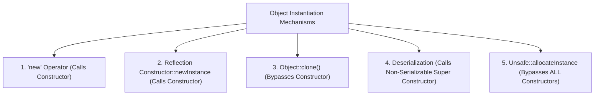

import Tabs from '@theme/Tabs';
import TabItem from '@theme/TabItem';

<span className="badge badge--warning margin-bottom--md">Medium</span>

> **Interview Question:** "What are all the distinct ways to instantiate an object in Java? Crucially: which of these mechanisms invoke constructors, which do not, and what is the exact constructor behavior during Deserialization?"

### The Quick Answer

Java provides 5 primary mechanisms to instantiate objects: the standard `new` operator, Reflection (`Constructor.newInstance()`), `Object.clone()`, Deserialization (`readObject()`), and low-level memory allocation (`Unsafe.allocateInstance()`). Crucially, only `new` and Reflection invoke the target class constructor; `clone()` makes a direct bitwise shallow heap copy, and `Unsafe` allocates raw memory bypassing all constructors entirely. During Deserialization, the target serializable class constructor is bypassed, but the JVM strictly walks up the hierarchy to invoke the no-argument constructor of the first **non-serializable superclass**, failing with `InvalidClassException` if none exists.

---

### The 5 Object Creation Mechanisms

Beyond the standard `new` keyword, the Java runtime provides multiple mechanisms to allocate and instantiate objects in heap memory:



---

### Comparison: Constructor Invocation Behavior

The defining technical distinction interviewers evaluate is whether the constructor logic actually executes during instantiation:

| Creation Mechanism | Invokes Target Class Constructor? | Constructor Details |
| :--- | :---: | :--- |
| **1. `new` Keyword** | **Yes** | Standard constructor chaining down the inheritance tree (`invokespecial <init>`). |
| **2. Reflection (`Constructor.newInstance`)** | **Yes** | Programmatically resolves and invokes the targeted constructor. *(Note: `Class.newInstance()` was deprecated in Java 9).* |
| **3. `Object.clone()`** | **No** | Copies memory bit-fields directly from the source instance into new heap space. |
| **4. Deserialization (`readObject`)** | **No\*** | **The Trap:** Does *not* invoke the serializable class constructor, but **DOES invoke the no-arg constructor of its first non-serializable superclass**! |
| **5. `Unsafe.allocateInstance`** | **No** | Directly allocates memory on the heap. Bypasses **all** constructors and initializers entirely. |

---

### Detailed Mechanics

#### 1. The `new` Keyword
The standard syntax. The JVM executes the `new` bytecode instruction to allocate uninitialized heap space, pushes the reference onto the operand stack, and issues `invokespecial` to execute the `<init>` constructor method.

#### 2. The Reflection API (`java.lang.reflect.Constructor`)
Frameworks like Spring Boot, Hibernate, and Jackson instantiate objects reflectively:
```java
Constructor<User> c = User.class.getDeclaredConstructor(String.class);
c.setAccessible(true); // Can access private constructors
User u = c.newInstance("Alice");
```
> **Deprecation Notice:** `Class.newInstance()` was deprecated in Java 9 because it bypassed constructor exception handling (propagating checked exceptions without declaring them) and could not handle parameterized constructors. Always use `Class.getDeclaredConstructor().newInstance()`.

#### 3. The `clone()` Method
Requires the class to implement the `Cloneable` marker interface and override `protected Object clone()`. The JVM creates a direct shallow bitwise memory copy of the original object without executing the `<init>` constructor.

#### 4. Deserialization (`ObjectInputStream.readObject()`)
When an object implementing `java.io.Serializable` is deserialized:
- The JVM reads the saved field values directly from the binary stream into the newly allocated heap memory.
- **The Non-Serializable Superclass Rule:** The JVM walks up the class hierarchy to find the **first non-serializable superclass**. It invokes that superclass's no-argument constructor to initialize inherited non-serializable state. If that superclass does not have an accessible no-arg constructor, deserialization aborts with `java.io.InvalidClassException`!

#### 5. Low-Level Memory Allocation (`sun.misc.Unsafe`)
High-performance serialization and mocking libraries (e.g., Objenesis, Kryo, Mockito) use `Unsafe.allocateInstance(Class<?>)`:
```java
// Bypasses constructor, field initializers, and security checks completely
User u = (User) unsafe.allocateInstance(User.class);
```
The object exists in memory, but its fields hold uninitialized default JVM values (`0`, `null`, `false`).

---

### The Singleton Deserialization Trap & `readResolve()`

If an application serializes and deserializes a Singleton object, deserialization bypasses the private constructor and creates a **brand-new duplicate instance**, violating the singleton guarantee.

To protect Singletons against deserialization duplication, define the `readResolve()` hook:

```java
public class DatabasePool implements Serializable {
    private static final DatabasePool INSTANCE = new DatabasePool();
    private DatabasePool() {}
    public static DatabasePool getInstance() { return INSTANCE; }

    // JVM hook during deserialization
    protected Object readResolve() {
        // Discards the newly deserialized object and returns the true Singleton
        return INSTANCE;
    }
}
```

---

### The Interview Answer (60-90 seconds)

> "There are five primary ways to create an object in Java:
> 1. The `new` keyword, which allocates heap space and executes the constructor chain.
> 2. The Reflection API via `Constructor.newInstance()`, which programmatically executes constructors.
> 3. `Object.clone()`, which creates a shallow bitwise copy on the heap, bypassing the constructor entirely.
> 4. Deserialization via `ObjectInputStream.readObject()`, which populates fields from a byte stream. The trap here is that while the target class constructor is bypassed, the JVM strictly invokes the no-argument constructor of its first non-serializable superclass.
> 5. `Unsafe.allocateInstance()`, used by mocking frameworks like Mockito to allocate objects without running any constructors.
>
> Finally, because deserialization creates a new object without running constructors, it can break the Singleton pattern. To prevent this, classes implement the `readResolve()` method to substitute the existing singleton instance."

---

### Code Demonstration: Tracing Constructor Invocations Across Creation Types

The following Java program logs constructor invocations across `new`, Reflection, `clone()`, and Deserialization to prove which mechanisms trigger constructor logic.

<Tabs>
<TabItem value="java" label="ObjectCreationDemo.java" default>

```java
import java.io.*;
import java.lang.reflect.Constructor;

public class ObjectCreationDemo {

    // First non-serializable superclass in hierarchy
    static class SuperNonSerializable {
        public SuperNonSerializable() {
            System.out.println("   [Constructor] SuperNonSerializable() FIRED!");
        }
    }

    // Serializable and Cloneable child class
    static class Entity extends SuperNonSerializable implements Cloneable, Serializable {
        private static final long serialVersionUID = 1L;
        public String name;

        public Entity(String name) {
            super();
            System.out.println("   [Constructor] Entity(String) FIRED for: " + name);
            this.name = name;
        }

        @Override
        public Object clone() throws CloneNotSupportedException {
            return super.clone();
        }
    }

    public static void main(String[] args) throws Exception {
        System.out.println("--- 1. Using 'new' Keyword ---");
        Entity e1 = new Entity("NewInstance");

        System.out.println("\n--- 2. Using Reflection ---");
        Constructor<Entity> cons = Entity.class.getDeclaredConstructor(String.class);
        Entity e2 = cons.newInstance("ReflectedInstance");

        System.out.println("\n--- 3. Using clone() ---");
        System.out.println("Calling e1.clone()...");
        Entity e3 = (Entity) e1.clone();
        System.out.println("Cloned Entity Name: " + e3.name + " (Notice NO constructor fired!)");

        System.out.println("\n--- 4. Using Deserialization ---");
        // Serialize e1 to byte array
        ByteArrayOutputStream baos = new ByteArrayOutputStream();
        try (ObjectOutputStream oos = new ObjectOutputStream(baos)) {
            oos.writeObject(e1);
        }

        // Deserialize
        System.out.println("Deserializing Entity from bytes...");
        ByteArrayInputStream bais = new ByteArrayInputStream(baos.toByteArray());
        try (ObjectInputStream ois = new ObjectInputStream(bais)) {
            Entity e4 = (Entity) ois.readObject();
            System.out.println("Deserialized Entity Name: " + e4.name);
            System.out.println("Notice: SuperNonSerializable constructor fired, but Entity constructor was bypassed!");
        }
    }
}
```

</TabItem>
</Tabs>
