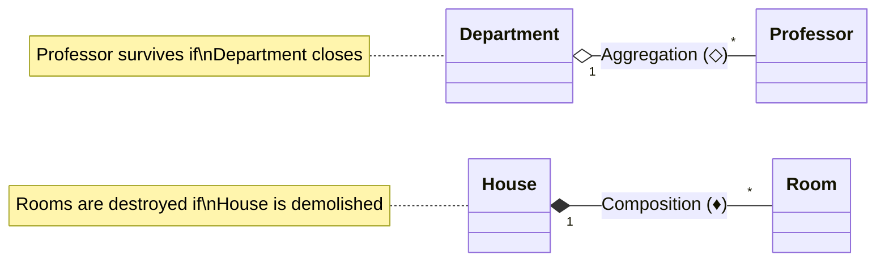

import Tabs from '@theme/Tabs';
import TabItem from '@theme/TabItem';

<span className="badge badge--warning margin-bottom--md">Medium</span>

> **Interview Question:** "Both aggregation and composition represent a 'has-a' association. What is the precise boundary separating them in terms of lifecycle dependency, UML notation, and defensive copying?"

### The Quick Answer

Both aggregation and composition model whole-part ("has-a") relationships, but they differ fundamentally in lifecycle dependency and ownership. In Aggregation (UML hollow diamond `◇`), components exist independently with shared ownership: if the container is destroyed, the child component survives (e.g., a Department and Professors). In Composition (UML solid diamond `♦`), the container has exclusive ownership and co-terminating lifecycles: if the parent is destroyed, the child is destroyed too (e.g., a House and Rooms), which requires defensive copying in getters and constructors to prevent external reference leaks from inadvertently degrading composition into aggregation.

---

### The Association Hierarchy

In Object-Oriented Analysis and Design (OOAD), object relationships fall into a clear hierarchy of coupling strength:

```text
Association (broadest) ⊃ Aggregation (weak "has-a") ⊃ Composition (strong "part-of")
```

- **Association:** A broad relationship where two independent classes interact or use each other (e.g., a `Student` and a `Course`).
- **Aggregation (Weak "Has-A"):** A whole-part relationship where the component (part) **can exist independently** of the container (whole). The component's lifecycle is not bound to the container.
- **Composition (Strong "Part-Of"):** A whole-part relationship where the component **cannot exist independently** of the container. The container exercises **exclusive ownership**; destroying the container destroys all constituent parts.

---

### Comparison: Aggregation vs. Composition

| Feature | Aggregation (Weak Association) | Composition (Strong Association) |
| :--- | :--- | :--- |
| **Relationship** | "Has-A" | "Part-Of" |
| **Lifecycle Dependency** | **Independent**: Child survives parent's destruction. | **Coincidental / Bound**: Child dies when parent is garbage collected. |
| **Ownership** | **Shared**: Multiple objects can hold references to the child. | **Exclusive**: The parent is the sole owner of the child component. |
| **UML Symbol** | **Hollow Diamond (`◇`)** on the owner side. | **Filled/Solid Diamond (`♦`)** on the owner side. |
| **Instantiation** | Passed in from outside (constructor/setter injection). | Instantiated internally inside parent or created via private factory. |
| **Database Equivalent** | **Nullable Foreign Key** (deleting Department sets `dept_id = NULL`). | **Cascading Delete** (`ON DELETE CASCADE` deletes child rows). |

---

### UML Notations

Interviewers often ask candidates to whiteboard the exact UML symbols and explain multiplicity:



- **Hollow Diamond (`◇` / `o--`):** Indicates Aggregation. The professor exists as an entity outside the department.
- **Solid Black Diamond (`♦` / `*--`):** Indicates Composition. A room cannot exist floating in vacuum without a house.

---

### Encapsulation Trap: Leaking References Breaks Composition

> **Staff-Level Bar Raiser:** Instantiating a child object inside a parent class does **not** guarantee composition if you violate encapsulation!

If a parent class exposes a mutable child directly via a getter:

```java
public class Car {
    private final Engine engine = new Engine();
    public Engine getEngine() { return this.engine; } // LEAK!
}
```

An external caller can store `Engine leaked = car.getEngine()`. Even if the `Car` is subsequently garbage collected, `Engine` remains reachable in heap memory! The child has survived the parent, degrading composition into unintended aggregation.

#### The Architectural Remedy: Defensive Copying
To preserve true composition with mutable state:
1. **Never accept external mutable references directly:** Perform a deep defensive copy in the constructor.
2. **Never return internal mutable references directly:** Return a deep defensive copy or an unmodifiable view in getters.

---

### Modern Architecture: Domain-Driven Design (DDD) Aggregate Roots

In modern microservice architectures and Domain-Driven Design, composition defines the boundary of an **Aggregate**:
- The parent object acts as the **Aggregate Root**.
- External clients are strictly prohibited from holding direct pointers or issuing mutations to child entities.
- All operations (e.g., adding an item, recalculating totals) must flow through the Root. The root guarantees that transactional invariants and business rules are consistently enforced.

---

### The Interview Answer (60-90 seconds)

> "Both aggregation and composition represent whole-part associations, but they differ fundamentally in lifecycle dependency and ownership.
>
> In Aggregation, represented in UML by a hollow diamond (`◇`), the child object has an independent lifecycle and can be shared among multiple parents. For example, a University has Professors; if the University closes, the Professors continue to exist.
>
> In Composition, represented by a solid diamond (`♦`), the child object is exclusively owned by the parent and its lifecycle is bound to it. If the parent is destroyed, the child is destroyed as well, analogous to `ON DELETE CASCADE` in a relational database.
>
> Crucially, implementing composition in code requires defensive copying. If a class instantiates a child object internally but leaks the raw reference through a getter, external code can keep the child alive past the parent's lifecycle, unintentionally breaking composition encapsulation."

---

### Code Demonstration: Composition vs. Aggregation & Defensive Copying

The following Java application shows the implementation differences between Aggregation and Composition and demonstrates how reference leaking breaks composition encapsulation.

<Tabs>
<TabItem value="java" label="AssociationDemo.java" default>

```java
import java.util.ArrayList;
import java.util.Collections;
import java.util.List;

public class AssociationDemo {

    // 1. Independent Component
    static class Professor {
        public String name;
        public Professor(String name) { this.name = name; }
    }

    // 2. AGGREGATION: University aggregates Professor (Weak Ownership)
    static class University {
        private final List<Professor> faculty;

        // Injected from outside: University does not own the professor's lifecycle
        public University(List<Professor> faculty) {
            this.faculty = faculty;
        }

        public List<Professor> getFaculty() { return faculty; }
    }

    // 3. Dependent Component
    static class Room {
        public String roomNumber;
        public Room(String roomNumber) { this.roomNumber = roomNumber; }
        // Copy constructor for defensive copying
        public Room(Room other) { this.roomNumber = other.roomNumber; }
    }

    // 4. COMPOSITION: House exclusively owns Rooms (Strong Ownership)
    static class House {
        private final List<Room> rooms = new ArrayList<>();

        public House(List<String> roomNumbers) {
            // Internally manages lifecycle
            for (String num : roomNumbers) {
                this.rooms.add(new Room(num));
            }
        }

        // DEFENSIVE COPYING: Prevents callers from escaping internal state
        public List<Room> getRoomsDefensive() {
            List<Room> copies = new ArrayList<>();
            for (Room r : rooms) copies.add(new Room(r));
            return Collections.unmodifiableList(copies);
        }
    }

    public static void main(String[] args) {
        System.out.println("--- 1. Testing Aggregation ---");
        Professor drSmith = new Professor("Dr. Smith");
        List<Professor> profs = new ArrayList<>();
        profs.add(drSmith);

        University uni = new University(profs);
        uni = null; // University destroyed!

        // drSmith still exists independently in memory!
        System.out.println("Professor survived university destruction: " + drSmith.name);

        System.out.println("\n--- 2. Testing Composition & Encapsulation ---");
        List<String> rooms = List.of("Master Bedroom", "Kitchen", "Living Room");
        House house = new House(rooms);

        // Accessing rooms defensively
        List<Room> safeRooms = house.getRoomsDefensive();
        System.out.println("House contains " + safeRooms.size() + " rooms.");
        // safeRooms cannot mutate house internals!
    }
}
```

</TabItem>
</Tabs>
