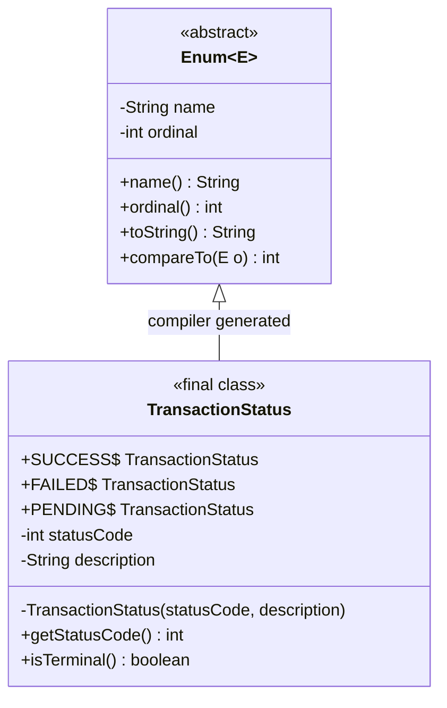

<span className="badge badge--warning margin-bottom--md">Medium</span>

> **Interview Question:** "Unlike in C/C++, Java enums are fully-fledged classes. How do constructors, fields, and methods work in Java enums, and why does Joshua Bloch famously advocate the Enum Singleton idiom over traditional Double-Checked Locking (DCL) or Bill Pugh holder singletons?"

### The Quick Answer

In Java, an `enum` is not merely an integer constant or a primitive alias; it is a specialized, final class implicitly extending `java.lang.Enum<E>`. Each enum constant is a public, static, final instance of that class pre-allocated when the class is initialized. Because Java enums can define private fields, parameterized constructors, and business methods, they model rich, domain-driven value objects cleanly.

The **Enum Singleton** is widely regarded as the gold standard implementation of the Singleton pattern in Java. By JVM design, enum constants are inherently thread-safe, immune to reflection attacks (the JVM's `Constructor.newInstance()` explicitly throws `IllegalArgumentException: Cannot reflectively create enum objects`), and natively serializable without risking duplicate instance generation.

---



---

### Part 1: Enums as Rich Objects (The Money Tracker Example)

In a typical production backend, an enum must represent more than just a label; it must encapsulate metadata, HTTP status codes, and domain behavior.

If enums were mere numbers or labels, developers would scatter repetitive, fragile `switch` or `if/else` statements across service and controller layers. In Java, you attach fields, constructors, and methods directly to the enum constants:

```java
public enum TransactionStatus {
    // 1. Each constant calls the private constructor during class loading
    SUCCESS(200, "Payment cleared successfully") {
        @Override
        public boolean isTerminal() {
            return true;
        }
    },
    FAILED(400, "Insufficient funds or declined") {
        @Override
        public boolean isTerminal() {
            return true;
        }
    },
    PENDING(202, "Awaiting banking network confirmation") {
        @Override
        public boolean isTerminal() {
            return false;
        }
    };

    // 2. Encapsulated instance state
    private final int statusCode;
    private final String description;

    // 3. Constructor is implicitly private (public/protected are forbidden)
    TransactionStatus(int statusCode, String description) {
        this.statusCode = statusCode;
        this.description = description;
    }

    // 4. Regular instance methods
    public int getStatusCode() {
        return this.statusCode;
    }

    public String getDescription() {
        return this.description;
    }

    // 5. Abstract method allowing constant-specific class bodies
    public abstract boolean isTerminal();
}
```

#### How Client Code Uses It
```java
TransactionStatus status = TransactionStatus.PENDING;
System.out.println("HTTP Code: " + status.getStatusCode()); // 202
System.out.println("Terminal?  " + status.isTerminal());    // false
```

---

### Part 2: The Enum Singleton (The Ultimate Fix)

When implementing the Singleton pattern, developers historically relied on:
1. **Double-Checked Locking (DCL):** Requires a `volatile` instance variable and synchronized blocks to prevent multithreaded race conditions and CPU instruction reordering.
2. **Bill Pugh Singleton (Static Holder Class):** Uses JVM class-loader mechanics for lazy initialization without explicit synchronization.

#### The Vulnerabilities of Traditional Singletons
Traditional class-based Singletons suffer from two critical attack vectors:
1. **Reflection Attacks:** A rogue client can invoke `AccessibleObject.setAccessible(true)` on the private constructor, spawning a second instance.
2. **Serialization Traps:** Serializing a singleton to disk/network and deserializing it invokes Java's deserialization engine, which constructs a brand-new object on the heap unless an explicit `readResolve()` method is meticulously coded.

#### Joshua Bloch's Solution: The Enum Singleton
In *Effective Java* (Item 3), Joshua Bloch declared: *"A single-element enum type is the best way to implement a singleton."*

```java
public enum DatabaseConnection {
    // The ONE and ONLY singleton instance
    INSTANCE;

    private final String connectionUrl;
    private boolean connected;

    // Executed exactly once when the enum class is initialized
    DatabaseConnection() {
        this.connectionUrl = "jdbc:postgresql://db.prod.internal:5432/wallet";
        this.connected = true;
    }

    public void executeQuery(String sql) {
        if (!connected) throw new IllegalStateException("Database disconnected");
        System.out.println("Executing on " + connectionUrl + ": " + sql);
    }
}
```

```java
// Accessing the singleton
DatabaseConnection.INSTANCE.executeQuery("SELECT * FROM users WHERE active = true");
```

---

### Comparison: Enum Singleton vs. Traditional Implementations

| Dimension | Enum Singleton | Traditional Lazy Singleton (DCL) | Bill Pugh Holder Singleton |
| :--- | :--- | :--- | :--- |
| **Thread Safety** | **Guaranteed by JVM** (class initialization phase) | Manual via `synchronized` + `volatile` | **Guaranteed by JVM** (holder class loading) |
| **Lazy Loading** | **Semi-Lazy** (initialized when `DatabaseConnection` is referenced) | **Yes** (initialized upon first `getInstance()` call) | **Yes** (initialized when holder class is first referenced) |
| **Reflection Immunity** | **Absolute** (`Constructor.newInstance` rejects enums) | **Vulnerable** (requires custom exception guards in constructor) | **Vulnerable** (requires custom exception guards in constructor) |
| **Serialization Safety** | **Automatic** (JVM guarantees identical instance via name lookup) | **Vulnerable** (spawns duplicate without `readResolve()`) | **Vulnerable** (spawns duplicate without `readResolve()`) |
| **Boilerplate / Code Size** | **Minimal** (1-3 lines of core structure) | **High** (`volatile`, double `null` check, synchronized) | **Moderate** (nested static class + static field) |
| **Inheritance** | Cannot extend other classes (can implement interfaces) | Can extend base classes and implement interfaces | Can extend base classes and implement interfaces |

---

### Deep Dive: Why Enum Singletons Cannot Be Broken

#### 1. Immunity to Reflection Attacks
Even if an attacker accesses the enum constructor reflectively and invokes `setAccessible(true)`, the Java standard library explicitly blocks instantiation at the JVM bytecode level.

```java
import java.lang.reflect.Constructor;

public class ReflectionAttackDemo {
    public static void main(String[] args) {
        try {
            // Attempt to fetch the synthetic constructor of the enum
            Constructor<DatabaseConnection> constructor = 
                DatabaseConnection.class.getDeclaredConstructor(String.class, int.class);
            constructor.setAccessible(true);

            // Try to force creation of a second instance
            DatabaseConnection secondInstance = constructor.newInstance("FAKE_INSTANCE", 1);
        } catch (Exception e) {
            // java.lang.IllegalArgumentException: Cannot reflectively create enum objects
            System.out.println("Reflection blocked! Reason: " + e.getMessage());
        }
    }
}
```

Inside the JDK source code (`java.lang.reflect.Constructor.java`), there is an explicit hardware-level guard:
```java
if ((clazz.getModifiers() & Modifier.ENUM) != 0)
    throw new IllegalArgumentException("Cannot reflectively create enum objects");
```

#### 2. Native Serialization Safety
When a normal class implements `Serializable`, deserializing a byte stream bypasses the constructor entirely and allocates a brand-new object on the heap, violating the singleton invariant:

```java
// TRADITIONAL SINGLETON SERIALIZATION TRAP:
TraditionalSingleton s1 = TraditionalSingleton.getInstance();
// Serialize s1 to byte stream...
// Deserialize s2 from byte stream...
assert s1 == s2; // FAILS! (Different memory addresses) unless readResolve() is defined.
```

With an Enum Singleton, the Java serialization specification treats enums as a special case:
- During serialization, only the enum's `name()` string is written to the byte stream.
- During deserialization, the JVM calls `Enum.valueOf(Class, name)` to locate the pre-existing singleton instance.
- No new object is allocated. Reference equality (`s1 == s2`) is strictly preserved.

---

### Crucial Nuance: The Enum Extensibility Trap

While Enum Singletons provide unmatched safety, they introduce one architectural constraint that interviewers frequently probe:

> **The Trap:** Enums cannot extend classes.

Because all Java enums implicitly inherit from `java.lang.Enum<E>`, and Java prohibits multiple class inheritance, an enum cannot extend any custom parent class (e.g., `public enum MySingleton extends BaseService` will fail compilation).

#### The Workaround: Implement Interfaces
Enums are fully permitted to implement one or more interfaces. If your singleton must conform to a polymorphic contract or mock interface for testing, implement an interface:

```java
public interface CacheService {
    void put(String key, Object val);
    Object get(String key);
}

public enum RedisCacheService implements CacheService {
    INSTANCE;

    private final Map<String, Object> localStore = new ConcurrentHashMap<>();

    @Override
    public void put(String key, Object val) {
        localStore.put(key, val);
    }

    @Override
    public Object get(String key) {
        return localStore.get(key);
    }
}
```

---

### Concise Interview Answer

> "In Java, enums are full-featured classes extending `java.lang.Enum`. Each constant is a pre-initialized public static final object that can hold instance variables, constructors, and polymorphic methods.
>
> The **Enum Singleton** idiom, recommended by Joshua Bloch, is the safest way to implement the Singleton pattern. Unlike traditional Double-Checked Locking or Bill Pugh singletons, an Enum Singleton provides JVM-level thread safety during class loading, total immunity to reflection attacks (because `Constructor.newInstance` explicitly throws an `IllegalArgumentException` for enums), and native serialization safety (the JVM deserializes enums by name lookup rather than allocating new heap instances). The primary trade-off is that enums cannot extend a superclass, though they can implement interfaces."
