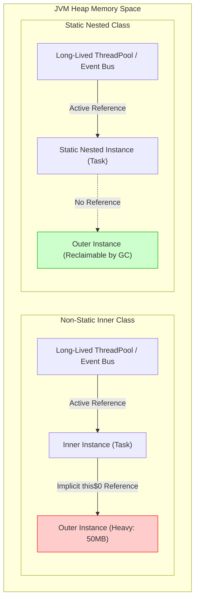

<span className="badge badge--warning margin-bottom--md">Medium</span>

> **Interview Question:** "Walk me through the difference between a static nested class and a non-static inner class. In production architectures, why is choosing the wrong one a severe memory leak hazard?"

### The Quick Answer

In Java, any class defined inside another is a **nested class**. If declared with `static`, it is a **Static Nested Class**; if declared without `static`, it is an **Inner Class**. 

The fundamental distinction lies in heap memory references:
- A **Non-Static Inner Class** holds an implicit, synthetic reference (`this$0`) to the specific enclosing instance that created it. It cannot exist without an outer instance, and it can directly access all private fields and methods of that enclosing object.
- A **Static Nested Class** is simply a top-level class packaged inside another class for namespace scoping. It has **no reference** to any instance of the outer class and can only access the outer class's static members directly.

Because non-static inner classes secretly retain their outer instance, passing them to long-lived pools, background threads, or event buses creates a catastrophic **memory leak**: the Garbage Collector cannot reclaim the outer object even when the outer object is no longer referenced anywhere else.

---



---

### The ELI5 Analogy: Attached Room vs. Toolbox in the Garage

1. **Non-Static Inner Class (The Attached Living Room):**
   Think of a House (`Outer`) and its Living Room (`Inner`). A living room cannot exist floating in empty space—it must physically belong to a specific house. Because it is physically inside that house, anyone standing in the living room can directly adjust that house's thermostat or open its private refrigerator (the outer instance's private variables).
2. **Static Nested Class (The Toolbox in the Garage):**
   Think of a Toolbox (`StaticNested`) stored inside the house's garage. The toolbox is stored there for neat organization and grouping, but it is a completely autonomous object. You can pick up the toolbox, drive it to another city, and use its wrenches independently. It has no physical wire connecting it to the house's thermostat.

---

### Syntax and Instantiation Mechanics

Because a non-static inner class is bound to an enclosing instance, you must instantiate the outer object first:

```java
public class House {
    private String thermostatSetting = "72°F";
    private static String neighborhood = "Oakwood Hills";

    // 1. NON-STATIC INNER CLASS: Attached to an instance
    public class LivingRoom {
        public void adjustTemp() {
            // Direct access to outer private instance variable
            System.out.println("Current temp: " + thermostatSetting);
            System.out.println("Neighborhood: " + neighborhood);
        }
    }

    // 2. STATIC NESTED CLASS: Independent namespace grouping
    public static class Toolbox {
        public void inspect() {
            // Can access static members of the outer class
            System.out.println("Located in: " + neighborhood);

            // COMPILER ERROR! Cannot make a static reference to the non-static field
            // System.out.println(thermostatSetting);
        }
    }
}
```

#### Instantiation Code
```java
public class Main {
    public static void main(String[] args) {
        // --- Instantiating Non-Static Inner Class ---
        // Step 1: Construct outer instance
        House myHouse = new House();
        // Step 2: Use special outerInstance.new syntax
        House.LivingRoom room = myHouse.new LivingRoom();
        room.adjustTemp();

        // --- Instantiating Static Nested Class ---
        // Clean, direct, and completely independent of any House instance
        House.Toolbox box = new House.Toolbox();
        box.inspect();
    }
}
```

---

### Comparison: All 4 Types of Nested Classes in Java

| Dimension | Non-Static Inner Class | Static Nested Class | Local Inner Class | Anonymous Inner Class |
| :--- | :--- | :--- | :--- | :--- |
| **Outer Instance Reference** | **Yes:** Retains hidden `Outer.this` pointer (`this$0`) | **No:** Completely decoupled from outer instance | **Yes:** Retains reference to enclosing instance | **Yes:** Retains reference to enclosing instance |
| **Direct Access to Outer Private State** | Both instance fields and static fields | **Only static** fields and methods | Both instance fields and `effectively final` local variables | Both instance fields and `effectively final` local variables |
| **Memory Leak Risk** | **High:** Retains outer instance even if outer is otherwise dead | **Zero:** Does not anchor or retain the enclosing object | **Moderate:** Leaks outer state if passed out of method | **High:** Frequently leaked in event listeners or thread callbacks |
| **Instantiation Syntax** | `outerObj.new Inner()` | `new Outer.StaticNested()` | Defined & instantiated inside a method block | Inline expression: `new Interface() { ... }` or lambda |
| **Typical Industry Use Cases** | Internal data structures (iterators, custom collection nodes) | **Builder pattern**, DTO groupings, `Map.Entry` | Complex temporary helper algorithms in single method | Quick one-off listeners, runnables, sorting comparators |

---

### The Production Reality: The Silent Memory Leak Hazard

In backend enterprise applications (and Android mobile apps), improperly using non-static inner classes causes notorious Out-Of-Memory (`OutOfMemoryError`) leaks.

#### The Anti-Pattern: Background Task Leaking an Outer Service
Imagine a service handling an HTTP request. It spawns a background task via an inner class:

```java
public class OrderService {
    // 50MB of memory: cache, byte buffers, user session state
    private byte[] heavyPayload = new byte[50 * 1024 * 1024];

    // DANGEROUS: Non-static inner class
    public class OrderSyncTask implements Runnable {
        private final long orderId;

        public OrderSyncTask(long orderId) {
            this.orderId = orderId;
        }

        @Override
        public void run() {
            try {
                // Simulating long network I/O
                Thread.sleep(60_000); 
                System.out.println("Synced order: " + orderId);
            } catch (InterruptedException ignored) {}
        }
    }

    public void processOrder(long orderId, ExecutorService threadPool) {
        // Leaking the entire 50MB OrderService instance to the global thread pool!
        threadPool.submit(this.new OrderSyncTask(orderId));
    }
}
```

#### Why This Crashes the Server:
1. `OrderService.processOrder()` finishes, and the web request completes. The local reference to `OrderService` falls out of scope.
2. However, `OrderSyncTask` is queued in `threadPool` for 60 seconds.
3. Because `OrderSyncTask` is a non-static inner class, the bytecode injects a hidden reference `final OrderService this$0`.
4. As long as the task sits in the thread pool, the Garbage Collector **cannot collect** `OrderService` or its 50MB payload. If 100 requests arrive per second, the heap exhausts immediately.

#### The Production Fix: Make it Static
```java
// SAFE: Static nested class holds NO reference to OrderService
public static class OrderSyncTask implements Runnable {
    private final long orderId;

    public OrderSyncTask(long orderId) {
        this.orderId = orderId; // Passes only what it strictly needs
    }

    @Override
    public void run() {
        System.out.println("Synced order: " + orderId);
    }
}
```

> **The Golden Rule:** Always declare nested classes `static` by default. Only remove `static` if the child class strictly needs continuous access to the enclosing instance's state.

---

### Industry Best Practice: The Builder Pattern

The classic `Builder` pattern (e.g. `User.builder().name("Alice").build()`) is universally implemented as a **static nested class**. 

A builder must be instantiated **before** the parent object exists. If it were a non-static inner class, you would face a chicken-and-egg paradox: you would need an existing `User` instance just to create the `UserBuilder` that builds the `User`!

---

### Crucial Nuance: Synthetic References and Nestmates (JEP 181)

Under the hood, the Java Virtual Machine does not recognize "nested" classes; class files are always flat. When compiled, the compiler produces two discrete `.class` files:
- `House.class`
- `House$LivingRoom.class`

In `House$LivingRoom.class`, the compiler automatically inserts a synthetic field:
```bytecode
final House this$0;
```
Every constructor in the inner class receives `House this$0` as an invisible first parameter.

#### Java 11 Nest-Based Access Control (JEP 181)
Prior to Java 11, the JVM enforced standard access rules: `House` and `House$LivingRoom` were different classes, so the JVM disallowed `House$LivingRoom` from accessing `private` fields in `House`. To circumvent its own rules, the Java compiler generated package-private synthetic bridge methods:
```java
// Generated by compiler in House prior to Java 11
static String access$000(House house) {
    return house.thermostatSetting;
}
```
This was both an execution overhead and an encapsulation vulnerability. Starting with Java 11 (JEP 181), the JVM natively supports **Nestmates** through bytecode attributes (`NestHost` and `NestMembers`), permitting mutual private member access directly without synthetic bridge methods.

---

### Concise Interview Answer

> "A nested class declared with `static` is a **Static Nested Class**; without `static`, it is an **Inner Class**.
>
> An Inner Class holds an implicit synthetic reference (`this$0`) to the enclosing outer instance, allowing it to directly access outer private instance fields. Because it cannot exist without an outer object, it is instantiated via `outer.new Inner()`. In contrast, a Static Nested Class is simply packaged inside the outer class's namespace for cohesion; it has no enclosing instance reference and is instantiated via `new Outer.StaticNested()`.
>
> In production systems, failing to make a nested class `static` is a major **memory leak risk**. If an inner class instance is retained by a long-lived thread pool, cache, or event listener, it anchors the entire outer object in memory, preventing the Garbage Collector from freeing it. Therefore, Joshua Bloch's rule of thumb is: **favor static member classes over non-static ones by default**."
