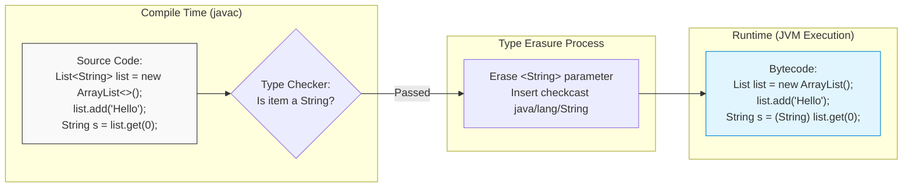

<span className="badge badge--warning margin-bottom--md">Medium</span>

> **Interview Question:** "What fundamental problems did Generics solve when introduced in Java 5? How does the JVM execute generics under the hood via Type Erasure, and what practical limitations does this architectural choice impose?"

### The Quick Answer

Before Java 5, collections stored raw `Object` references, requiring developers to write brittle manual downcasts and exposing production systems to catastrophic runtime `ClassCastException`s. Generics introduced **compile-time type safety**, transforming collections from untyped bags of references into strictly checked containers.

To maintain 100% backward binary compatibility with millions of lines of pre-Java 5 enterprise bytecode, Java implemented generics via **Type Erasure**. The compiler strictly verifies generic types at compile time, injects required casts at bytecode boundaries, and then strips away all generic type parameters. At runtime, the JVM has no knowledge of generic arguments: an unbounded `List<T>` becomes a raw `List` holding `Object` references, and a bounded `List<T extends Number>` becomes a `List` of `Number`.

---



---

### Part 1: The Problem Generics Solved (Raw Types vs. Generics)

Prior to Java 5, collections were "raw types". Every collection stored plain `Object` references:

```java
// ==========================================
// PRE-JAVA 5: Raw Collections (Dangerous)
// ==========================================
List rawList = new ArrayList();
rawList.add("Alice");
rawList.add(100); // Valid at compile time! Object accepts anything.

// Retrieval requires manual downcasting
String name = (String) rawList.get(0); // OK

// THE RUNTIME CRASH:
// Compiles cleanly, but crashes JVM at runtime with ClassCastException
String number = (String) rawList.get(1); 
```

#### The Modern Generic Approach
```java
// ==========================================
// MODERN JAVA: Parameterized Collections
// ==========================================
List<String> safeList = new ArrayList<>();
safeList.add("Alice");

// safeList.add(100); 
// COMPILER ERROR: The method add(String) is not applicable for (int)

// No manual downcasting needed; compiler guarantees type safety
String name = safeList.get(0); 
```

#### The Two Core Wins of Generics:
1. **Compile-Time Detection:** Type mismatches become compilation errors rather than 3 AM production server crashes.
2. **Boilerplate Removal:** Eliminates verbose, error-prone manual casts `(Dog)` or `(String)` across the codebase.

---

### The ELI5 Analogy: The Mystery Box vs. The VIP Club Bouncer

- **Raw Types (The Mystery Box):** You have a cardboard box with no label. Anyone can toss an apple, a shoe, or a live grenade inside. When you reach your hand inside blindfolded and assume you are pulling out an apple, you might pull out a grenade and explode (`ClassCastException`).
- **Generics (The Labeled Box with a Bouncer):** You stick a label on the box saying `<Apple>`. The Java compiler acts as an uncompromising VIP bouncer at the opening. If someone tries to toss a shoe into the box, the bouncer slaps it away before it enters.
- **Type Erasure (Throwing Away the Ticket):** Once everyone is safely inside the club, the bouncer shreds all tickets at the door. Inside the club, the JVM treats every attendee as an `Object`. Because the bouncer checked every credential at the door, the JVM can safely assume everyone inside conforms to the rules.

---

### Part 2: How Type Erasure Works Under the Hood

When `javac` compiles generic code into bytecode (`.class` files), it executes three distinct steps:

1. **Replaces type parameters with their bounds:**
   - Unbounded type `<T>` becomes `Object`.
   - Bounded type `<T extends Number>` becomes `Number`.
2. **Inserts synthetic casts:**
   - Call sites retrieving generic values receive an automatic `checkcast` bytecode instruction to ensure type preservation.
3. **Generates Synthetic Bridge Methods:**
   - Preserves method overriding polymorphism in inheritance hierarchies.

#### Bounded vs. Unbounded Erasure
```java
// Developer writes:
public class DataHolder<T> {
    private T value;
    public T getValue() { return value; }
}

// Compiler generates bytecode equivalent to:
public class DataHolder {
    private Object value;
    public Object getValue() { return value; }
}
```

```java
// Developer writes (Bounded):
public class NumericStats<T extends Number> {
    private T number;
    public double toDouble() { return number.doubleValue(); }
}

// Compiler generates bytecode equivalent to:
public class NumericStats {
    private Number number; // Erased to its primary bound
    public double toDouble() { return number.doubleValue(); }
}
```

#### Synthetic Bridge Methods Explained
Consider an implementation of `Comparable<T>`:

```java
public class Node implements Comparable<Node> {
    @Override
    public int compareTo(Node o) {
        return 0;
    }
}
```
In `Comparable<T>`, type erasure replaces `compareTo(T)` with `compareTo(Object)`. If `Node` only defines `compareTo(Node)`, it would not override `Comparable.compareTo(Object)` at the bytecode level! 

To fix this, `javac` automatically synthesizes a hidden **bridge method**:
```java
// Generated by compiler silently in Node.class
public synthetic bridge int compareTo(Object o) {
    return this.compareTo((Node) o); // Casts to Node and calls real method
}
```

---

### Comparison: Java Generics vs. Raw Types vs. C++ Templates

| Dimension | Raw Types (Pre-Java 5) | Java Generics (Type Erasure) | C++ Templates (Reification) |
| :--- | :--- | :--- | :--- |
| **Type Safety** | None (deferred to manual runtime casts) | **Strong compile-time guarantee** | Strong compile-time guarantee |
| **Runtime Type Awareness** | Only root `Object` type preserved | **Erased:** Type arguments vanish at runtime | **Reified:** Full runtime type data preserved |
| **Code Bloat (Binary Size)** | Single class file | **Zero Bloat:** One `.class` file shared across all types | **High Bloat:** New binary code generated for every type (`vector<int>`, `vector<double>`) |
| **Bytecode / ABI Compatibility** | Legacy baseline | **100% Backward Compatible** with pre-2004 bytecode | Requires full source-level recompilation |
| **Primitive Support** | Primitives not accepted directly | **No:** `List<int>` forbidden; requires boxing (`List<Integer>`) | **Yes:** Direct native support (`std::vector<int>`) with zero heap boxing |
| **Runtime Performance** | Manual casting overhead | Identical to raw types + auto-generated bytecode casts | Maximal efficiency; enables aggressive compiler inlining |

---

### Practical Limitations Caused by Type Erasure

Because type arguments are erased at runtime, several intuitive operations are strictly illegal in Java:

#### 1. Cannot Instantiate Generic Types (`new T()`)
```java
public class Factory<T> {
    public T create() {
        // COMPILER ERROR: Cannot instantiate the type T
        // return new T(); 
        return null;
    }
}
```
*Why:* At runtime, the JVM does not know what `T` is (it only sees `Object`). It cannot know which constructor exists or how much heap memory to allocate.  
*Workaround:* Pass a runtime type token: `Class<T> clazz` and call `clazz.getDeclaredConstructor().newInstance()`.

#### 2. Cannot Use `instanceof` with Parameterized Types
```java
List<String> list = new ArrayList<>();

// COMPILER ERROR: Cannot perform instanceof check against parameterized type
// if (list instanceof List<String>) { ... }

// VALID: Unbounded wildcard check
if (list instanceof List<?>) { ... }
```
*Why:* At runtime, all `List<String>`, `List<Integer>`, and `List<Date>` are simply `ArrayList` in memory. The JVM cannot distinguish them.

#### 3. Cannot Create Generic Arrays (`new T[10]`)
```java
// COMPILER ERROR: Cannot create a generic array of T
// T[] items = new T[10]; 

// WORKAROUND (Standard JDK Collection idiom):
@SuppressWarnings("unchecked")
T[] items = (T[]) new Object[10];
```
*Why:* Java arrays are **reified**—they carry their exact component type into runtime to enforce array-store checks (`ArrayStoreException`). Generics are **erased**. The two systems are fundamentally incompatible.

#### 4. Cannot Use Primitives as Type Arguments
```java
// COMPILER ERROR: Syntax error, insert "Dimensions" to complete ReferenceType
// List<int> numbers = new ArrayList<>(); 

// VALID: Must use boxed wrapper objects
List<Integer> numbers = new ArrayList<>();
```
*Why:* Type erasure replaces unbounded types with `java.lang.Object`. Primitive types (`int`, `double`, `boolean`) do not inherit from `Object`.

---

### Crucial Nuance: Method Overloading & Same-Erasure Collisions

A favorite trick question in senior technical interviews involves overloading methods with generic collections:

```java
public class Printer {
    // Will this compile?
    public void print(List<String> stringList) {
        System.out.println("Printing strings");
    }

    public void print(List<Integer> intList) {
        System.out.println("Printing integers");
    }
}
```

> **The Verdict:** **This will not compile.**  
> The compiler rejects this with:  
> `Method print(List<String>) has the same erasure print(List<E>) as another method in type Printer`.

Because both methods erase to `print(List list)` in bytecode, the JVM cannot disambiguate them at runtime. To resolve this, you must give the methods distinct names (e.g., `printStrings` and `printIntegers`).

---

### Concise Interview Answer

> "Generics were introduced in Java 5 to provide **compile-time type safety** and remove hazardous runtime `ClassCastException`s and manual downcasting.
>
> Under the hood, Java uses **Type Erasure** to maintain complete binary compatibility with legacy pre-Java 5 bytecode. During compilation, `javac` verifies type constraints, inserts necessary casts, and strips generic parameter information from the bytecode. Unbounded types (`T`) are erased to `Object`, while bounded types (`T extends Number`) are erased to their first bound (`Number`).
>
> This architectural trade-off prevents binary code bloat (unlike C++ templates, which replicate code for every specialization), but introduces limitations: you cannot instantiate generic types (`new T()`), check parameterized instances via `instanceof`, allocate generic arrays (`new T[10]`), or use primitives as generic arguments (`List<int>`)."
