```mermaid
flowchart TD
    subgraph DirectCall ["Direct Method Call (Standard OOP)"]
        A1["Source Code: wallet.deposit(100)"] --> B1["Compile-Time Verification"]
        B1 --> C1["Bytecode: invokevirtual"]
        C1 --> D1["JIT Compiler Inlining & Machine Code"]
        D1 --> E1["Fast Native CPU Execution (&lt;1ns)"]
    end

    subgraph ReflectiveCall ["Reflective Call (Metaprogramming)"]
        A2["Source Code: method.invoke(wallet, 100)"] --> B2["No Compile Check (String Lookup)"]
        B2 --> C2["JVM Security & Access Checks"]
        C2 --> D2["Argument Boxing & Array Allocation"]
        D2 --> E2["Dynamic Dispatch (No JIT Inlining: ~20-50ns)"]
    end

    style DirectCall fill:#e8f5e9,stroke:#2e7d32
    style ReflectiveCall fill:#ffebee,stroke:#c62828
```

<span className="badge badge--danger margin-bottom--md">Hard</span>

> **Interview Question:** "Explain Java Reflection to me. Frameworks like Spring, Hibernate, and JUnit use it extensively, but if you were reviewing my PR and saw I wrote custom Reflection code in a business service, why would you reject it?"

### The Quick Answer

**Java Reflection** (`java.lang.reflect`) is a runtime metaprogramming API that enables a program to inspect, examine, and manipulate the internal structure of classes, interfaces, constructors, methods, and fields at runtime, completely bypassing compile-time access modifiers.

Reflection is the bedrock of modern Java frameworks:
- **Spring** uses it to scan annotations and inject dependencies into private fields.
- **JUnit** uses it to detect and invoke methods annotated with `@Test`.
- **Jackson** uses it to dynamically map JSON keys to private POJO variables.

However, writing custom reflection in business logic is an **anti-pattern** and ground for PR rejection. Reflection strips away compile-time type safety (turning typos into runtime crashes), destroys object encapsulation by forcefully modifying `private` state, incurs a severe performance penalty (preventing JIT compiler inlining), and is actively restricted by modern Java's Module System (Java 9+ Project Jigsaw).

---



---

### The ELI5 Analogy: The X-Ray Master Key

Imagine you construct a secure Bank Vault (a Java Class). You follow strict Object-Oriented design: the front lobby door is `public`, but the inner vault containing the cash reserves is marked `private`. 

The Java compiler acts as the bank's armed security guard. If any outside customer tries to walk directly into the private cash vault, the security guard halts them immediately at compile time.

**Reflection is an X-ray scanner combined with a master skeleton key.** It allows code to walk right past the compiler's security guard, X-ray the vault to see all hidden compartments, and use the master key (`setAccessible(true)`) to unlock and alter the cash balance directly. While framework architects need this master key to build automated security inspection systems, handing it to everyday customers (business logic developers) invites chaos and security breaches.

---

### Real-World Framework Use Cases: How Modern Frameworks Depend on It

As an enterprise engineer, you rarely write raw reflection code, but your applications execute millions of reflective operations daily through frameworks:

#### 1. Spring Framework (Dependency Injection)
When you annotate a field with `@Autowired` or declare a `@Service`, Spring does not require you to call `new Service()`. At startup, Spring's `ApplicationContext`:
1. Scans the classpath using the Reflection API.
2. Identifies classes marked with `@Component`, `@Service`, or `@Repository`.
3. Reflectively invokes their constructors via `Constructor.newInstance()`.
4. Discovers fields marked with `@Autowired`, bypasses access control, and injects the dependency directly.

#### 2. JUnit (Automated Test Execution)
How does JUnit know which methods to run when you click "Run Tests"?
```java
@Test
public void shouldCalculateTaxCorrectly() { ... }
```
JUnit does not have a hardcoded list of your tests. At runtime, it reflects on your test class:
```java
for (Method method : TestClass.class.getDeclaredMethods()) {
    if (method.isAnnotationPresent(Test.class)) {
        method.invoke(testInstance); // Dynamically runs your test method
    }
}
```

#### 3. Jackson & Gson (JSON Serialization & Deserialization)
When an HTTP request delivers a JSON payload like `{"userId": 42, "role": "admin"}`, Jackson:
1. Inspects the target Java POJO using `Class.getDeclaredFields()`.
2. Matches JSON keys to Java field names.
3. Sets private fields directly on the newly created POJO instance even if no public setters exist.

---

### Comparison: Direct Method Invocation vs. Reflection API

| Dimension | Direct Method Invocation | Reflection API |
| :--- | :--- | :--- |
| **Performance** | **Sub-nanosecond:** Compiles directly to native machine instructions | **10x to 50x slower:** Dynamic lookups, boxing/unboxing, and security checks |
| **Compile-Time Safety** | **Guaranteed:** Typos in class/method names fail at build time | **Zero:** Methods referenced as Strings (`"deposit"`); fails at runtime |
| **Encapsulation** | **Strictly Preserved:** Cannot access `private` or package-private members | **Bypassed:** Can force access via `setAccessible(true)` |
| **JIT Optimization & Inlining** | **Aggressive:** JIT inlines hot methods and devirtualizes calls | **Severely Limited:** Dynamic targets prevent call-site inlining |
| **Refactoring Safety** | **Safe:** Renaming a method in your IDE updates all call sites automatically | **Fragile:** Renaming a method leaves string literals unchanged, breaking at runtime |
| **Failure Mode** | Compiler error (`cannot find symbol`) | Runtime crash (`NoSuchMethodException`, `IllegalAccessException`) |

---

### Code Demonstration: Forcefully Violating Encapsulation

The code below shows how Reflection bypasses Java's `private` visibility modifier:

```java
import java.lang.reflect.Field;

class DigitalWallet {
    // Encapsulated private state: no public setter provided
    private double balance = 150.00;

    public double getBalance() {
        return this.balance;
    }
}

public class ReflectionBreaker {
    public static void main(String[] args) throws Exception {
        DigitalWallet wallet = new DigitalWallet();
        System.out.println("Original Balance: $" + wallet.getBalance()); // $150.0

        // 1. Obtain the Field object reflectively via class metadata
        Field balanceField = DigitalWallet.class.getDeclaredField("balance");

        // 2. The Master Key: Override JVM access checks
        balanceField.setAccessible(true);

        // 3. Forcefully overwrite private state from the outside!
        balanceField.set(wallet, 1_000_000.00);

        System.out.println("Compromised Balance: $" + wallet.getBalance()); // $1000000.0
    }
}
```

#### Why Senior Engineers Reject This in Business Logic:
1. **Broken Invariants:** The `DigitalWallet` class might enforce that balances can never exceed credit limits. Reflection bypasses all business validation logic.
2. **Hidden Coupling:** If the maintainer of `DigitalWallet` renames `balance` to `currentBalance`, the compiler will not warn you. The reflection code will crash silently in production with `NoSuchFieldException`.

---

### Crucial Nuance: The Java 9+ Module System Lockdown (Project Jigsaw)

Historically, calling `setAccessible(true)` gave developers unrestricted god-mode over the entire JVM. Starting in Java 9 with the **Java Platform Module System (JPMS / Project Jigsaw)**, the JVM clamped down on illegal reflective access:

> **Strong Encapsulation by Default:** A class in one module cannot reflectively access private or package-private members in another module unless the containing package is explicitly declared `opens` in `module-info.java`.

#### What Happens in Modern Java (Java 17+)?
If an application attempts to reflectively alter internal JDK fields (e.g., inside `java.lang` or `java.util`), the JVM aborts immediately with an `InaccessibleObjectException`:

```text
java.lang.reflect.InaccessibleObjectException: Unable to make field private final byte[] 
java.lang.String.value accessible: module java.base does not "opens java.lang" to unnamed module
```

To permit reflection across modules in modern enterprise deployments, operators must explicitly pass JVM command-line flags:
```bash
java --add-opens java.base/java.lang=ALL-UNNAMED -jar app.jar
```
This architectural shift demonstrates that Java is actively retiring unchecked reflective access in favor of strict, enforceable security boundaries.

---

### Concise Interview Answer

> "Java **Reflection** is a runtime API that allows code to inspect and manipulate class metadata, invoke methods, and read or write fields dynamically, even if they are marked `private`.
>
> Frameworks like Spring (Dependency Injection), JUnit (Test discovery), and Jackson (JSON deserialization) use reflection heavily to build flexible, configuration-driven systems. 
>
> However, writing custom reflection in business applications is an **anti-pattern**. It strips away compile-time type safety (deferring typos to runtime crashes), completely breaks encapsulation by mutating private state, degrades performance by inhibiting JIT compiler inlining, and breaks refactoring tools. Furthermore, modern Java (Java 9+) enforces strong module boundaries by default, causing unconfigured reflective access to throw `InaccessibleObjectException`s."
