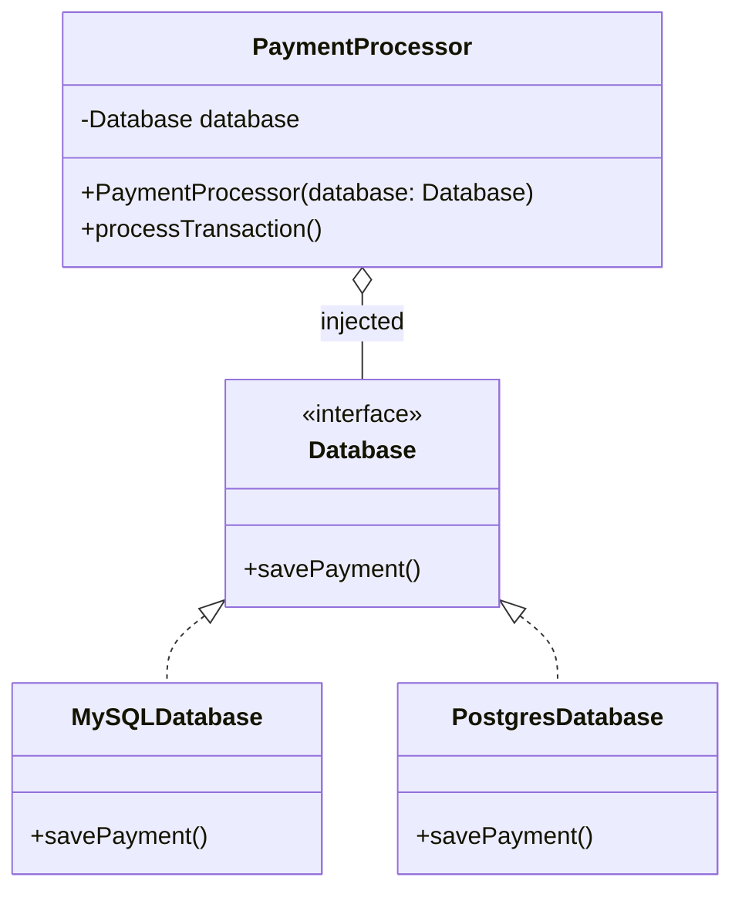

<span className="badge badge--danger margin-bottom--md">Hard</span>

> **Interview Question:** "Everyone throws around the terms Dependency Injection, Dependency Inversion, and Inversion of Control. Are they the same thing? What are the three types of DI, and why is field injection considered an anti-pattern?"

### The Quick Answer

"**Dependency Inversion (DIP)** is the high-level SOLID principle stating that high-level modules should depend on abstractions (interfaces) rather than concrete classes. **Dependency Injection (DI)** is the design pattern used to deliver those dependencies from the outside. **Inversion of Control (IoC)** is the overarching architectural framework paradigm where the framework manages the lifecycle and flow of control."

---



---

### The Three Types of Dependency Injection

Interviewers frequently ask you to evaluate the 3 mechanisms of dependency injection:

| Injection Type | How It Works | Verdict |
|---|---|---|
| **1. Constructor Injection** | Dependencies are passed as parameters into the constructor. | **Best Practice.** Enforces complete object initialization, enables immutable (`final`) fields, and allows straightforward POJO unit testing without frameworks. |
| **2. Setter Injection** | Dependencies are supplied through public setter methods. | **Use with Caution.** Suitable for optional or reconfigurable dependencies, but leaves objects vulnerable to `NullPointerException` if called before setters run. |
| **3. Field Injection** | Annotating private fields directly with `@Autowired` via reflection. | **Anti-Pattern.** Hides dependencies, breaks plain unit testing (requires reflection or container), and masks circular dependencies until runtime. |

---

### The ELI5 Analogy: The Formula 1 Driver

* **Without DI (Using `new` inside):** Imagine an F1 driver who is hardcoded to manufacture their own car. Before racing, the driver must weld the chassis and attach slick tires. If it starts raining, the driver is helpless—they are permanently glued to the dry-weather tires they manufactured.
* **With DI:** The driver simply declares: *"I need a `Vehicle` to race."* The pit crew assembles the car outside with rain tires and hands it to the driver. The driver focuses purely on racing logic without coupling to tire manufacturing.

---

### The Distinction: DIP vs. DI vs. IoC

| Concept | Nature | Role in Architecture |
|---|---|---|
| **Dependency Inversion (DIP)** | Architectural Principle | **The Goal:** Mandates *what* the system should look like (high-level code depends on interfaces, not implementations). |
| **Dependency Injection (DI)** | Design Pattern | **The Mechanism:** The technique of *how* we achieve DIP (passing dependencies into a class). |
| **Inversion of Control (IoC)** | Framework Paradigm | **The Engine:** The runtime container (e.g., Spring `ApplicationContext`, NestJS) that automatically resolves and wires dependencies together. |

---

import Tabs from '@theme/Tabs';
import TabItem from '@theme/TabItem';

### Clean Code Example

Here is how constructor dependency injection enables flexible swapping and easy unit testing across languages:

<Tabs groupId="programming-language">
<TabItem value="java" label="Java" default>

```java
// 1. Abstraction (DIP)
interface Database {
    void save(String data);
}

class PostgresDatabase implements Database {
    @Override
    public void save(String data) {
        System.out.println("Saved to Postgres: " + data);
    }
}

// 2. Class depends on interface; receives it via Constructor Injection
class PaymentProcessor {
    private final Database database; // Immutability guaranteed

    public PaymentProcessor(Database database) {
        this.database = database; // Injected from outside
    }

    public void process(String transaction) {
        database.save(transaction);
    }
}

// Usage in tests: easy to inject a MockDatabase without a framework
```

</TabItem>
<TabItem value="cpp" label="C++">

```cpp
#include <iostream>
#include <memory>
#include <string>

// 1. Interface
class Database {
public:
    virtual ~Database() = default;
    virtual void save(const std::string& data) = 0;
};

class PostgresDatabase : public Database {
public:
    void save(const std::string& data) override {
        std::cout << "Saved to Postgres: " << data << std::endl;
    }
};

// 2. Constructor Dependency Injection
class PaymentProcessor {
private:
    std::shared_ptr<Database> database;

public:
    PaymentProcessor(std::shared_ptr<Database> db) : database(db) {}

    void process(const std::string& transaction) {
        database->save(transaction);
    }
};
```

</TabItem>
<TabItem value="python" label="Python">

```python
from abc import ABC, abstractmethod

# 1. Interface
class Database(ABC):
    @abstractmethod
    def save(self, data: str) -> None:
        pass

class PostgresDatabase(Database):
    def save(self, data: str) -> None:
        print(f"Saved to Postgres: {data}")

# 2. Constructor Dependency Injection
class PaymentProcessor:
    def __init__(self, database: Database):
        self._database = database # Injected dependency

    def process(self, transaction: str) -> None:
        self._database.save(transaction)

# In unit tests, simply pass a MockDatabase() to PaymentProcessor
```

</TabItem>
</Tabs>
