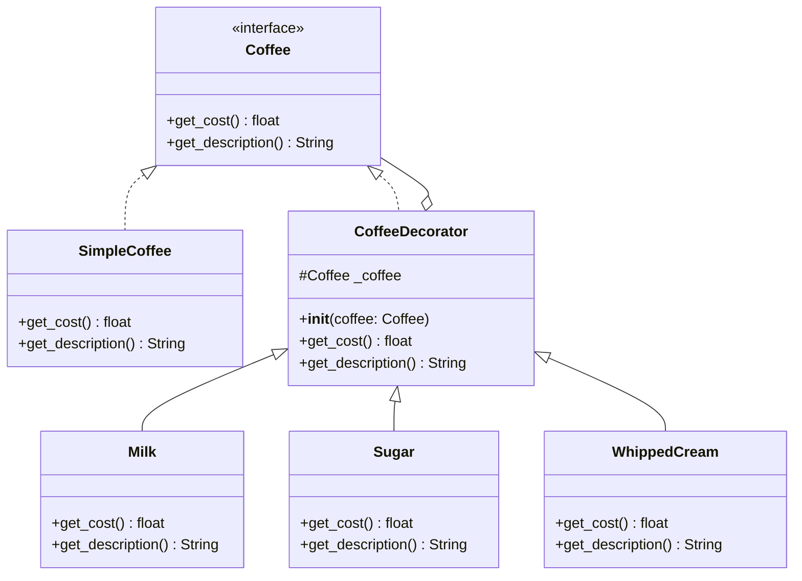

<span className="badge badge--warning margin-bottom--md">Medium</span>

> **Interview Question:** What is the Decorator pattern? How does it let you "add behavior without modifying the class"  -  tying back to OCP? Show me a Python implementation  -  use a coffee order system (base Coffee, then decorators like Milk, Sugar, WhippedCream that each add cost/description).

### The Interview Quick-Hit

"The Decorator pattern is a structural design pattern that allows you to dynamically attach new behaviors or state to an object at runtime by wrapping it in an object of a similar type. It perfectly embodies the Open/Closed Principle (OCP) because you can infinitely extend an object's behavior using new wrappers without ever modifying the original underlying class code."



### The Problem: Subclass Explosion (Failing OCP)

Imagine building a coffee shop checkout system. You start with a `Coffee` class. Then someone wants Milk. So you create `CoffeeWithMilk extends Coffee`. Then someone wants Sugar. You create `CoffeeWithSugar`. Then someone wants Milk and Sugar. You create `CoffeeWithMilkAndSugar`.

If you add just three more ingredients (Caramel, Vanilla, Whipped Cream), you suddenly need dozens of subclasses to handle every possible combination. If the base price of coffee changes, you have to modify 50 different classes. This completely violates the Open/Closed Principle.

### The ELI5 Analogy: The Russian Nesting Dolls

Instead of creating a permanent, rigidly baked-in subclass, think of the Decorator pattern like Russian Nesting Dolls.

You start with the smallest solid doll (the `SimpleCoffee`).
You place it inside a hollow doll called `Milk`. The Milk doll knows it costs $0.50, but it asks the doll inside it for the base price and adds them together.
You place that whole thing inside another hollow doll called `Sugar`.

When the cashier asks the outermost doll for the final price, the request is passed all the way to the center and calculated on the way back out.
If you invent a new ingredient tomorrow, you just create a new hollow doll. The inner dolls never change.

### The Python Implementation

Notice how the `CoffeeDecorator` implements the exact same interface as the base `Coffee`. This is the secret to the pattern: The wrapper must look identical to the thing it is wrapping so the client code doesn't know the difference.

```python
from abc import ABC, abstractmethod

# 1. The Base Component (The Interface)
class Coffee(ABC):
    @abstractmethod
    def get_cost(self) -> float:
        pass
    
    @abstractmethod
    def get_description(self) -> str:
        pass

# 2. The Concrete Component (The innermost doll)
class SimpleCoffee(Coffee):
    def get_cost(self) -> float:
        return 2.00
    
    def get_description(self) -> str:
        return "Espresso"

# 3. The Base Decorator (The hollow doll blueprint)
class CoffeeDecorator(Coffee):
    def __init__(self, coffee: Coffee):
        # The wrapper holds a reference to the inner object
        self._coffee = coffee

    def get_cost(self) -> float:
        return self._coffee.get_cost()
        
    def get_description(self) -> str:
        return self._coffee.get_description()

# 4. Concrete Decorators (The specific hollow dolls)
class Milk(CoffeeDecorator):
    def get_cost(self) -> float:
        return self._coffee.get_cost() + 0.50
        
    def get_description(self) -> str:
        return self._coffee.get_description() + ", Milk"

class Sugar(CoffeeDecorator):
    def get_cost(self) -> float:
        return self._coffee.get_cost() + 0.25
        
    def get_description(self) -> str:
        return self._coffee.get_description() + ", Sugar"

class WhippedCream(CoffeeDecorator):
    def get_cost(self) -> float:
        return self._coffee.get_cost() + 0.75
        
    def get_description(self) -> str:
        return self._coffee.get_description() + ", Whipped Cream"


# --- Execution ---
# 1. Start with the base object
my_order = SimpleCoffee()

# 2. Wrap it dynamically at runtime!
my_order = Milk(my_order)
my_order = Sugar(my_order)
my_order = WhippedCream(my_order)

# The outermost wrapper (WhippedCream) triggers the chain reaction
print(f"Order: {my_order.get_description()}")
print(f"Total: ${my_order.get_cost():.2f}")

# Output: 
# Order: Espresso, Milk, Sugar, Whipped Cream
# Total: $3.50
```

### The Senior-Level Pivot (Python Specifics)

If you are asked about the Decorator pattern in a Python-specific interview, it is crucial to address the naming collision.

"In classical Object-Oriented Programming (like Java), the Decorator pattern uses class composition and wrapping to extend object behavior dynamically, just like this Coffee example.

However, Python has a built-in syntax feature called decorators (the `@` symbol above functions). While they share the same name and the exact same conceptual philosophy (wrapping something to add behavior without modifying the original code), Python's `@decorator` is a functional programming feature used to modify functions or methods, whereas the classic Gang of Four Decorator pattern modifies Object state and behavior at runtime."

---

### Crucial Nuance: The Object Identity Crisis

The Decorator pattern introduces a massive pitfall regarding object identity. Once a base object (e.g., `SimpleCoffee`) is wrapped in a decorator (e.g., `Milk`), the resulting object is technically of type `Milk`, not `SimpleCoffee`. Any downstream code relying on `isinstance()` checks against the concrete base class will break. You must ensure your system only depends on the shared interface (`Coffee`) and never assumes the specific concrete type of a wrapped object.
