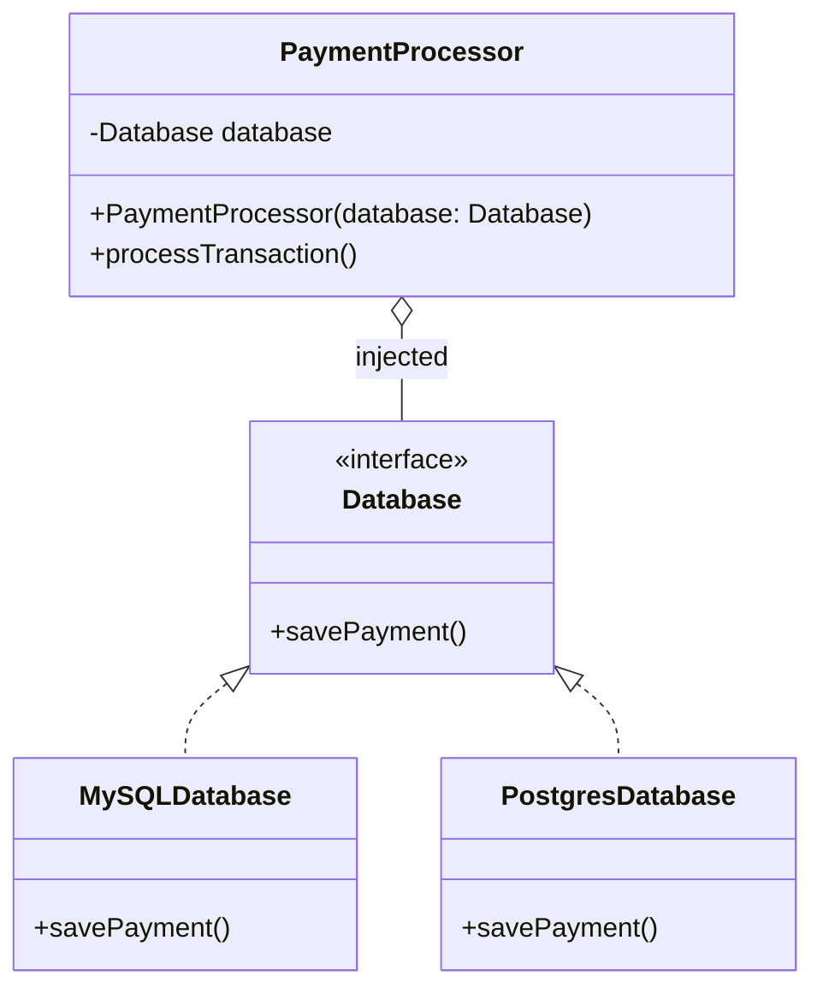

<span className="badge badge--danger margin-bottom--md">Hard</span>

> **Interview Question:** What is Dependency Injection? How is it different from just using new to create dependencies inside a class? And how does it relate to the Dependency Inversion Principle you already know from SOLID  -  are they the same thing?

### The Interview Quick-Hit

"Dependency Injection (DI) is a design pattern where an object receives its required dependencies from the outside rather than instantiating them internally using the `new` keyword. It makes code loosely coupled and highly testable. Dependency Inversion (DIP from SOLID) is the theoretical principle stating that high-level modules should depend on abstractions; Dependency Injection is the actual technique used to deliver those abstractions to the class."



### The ELI5 Analogy: The Formula 1 Driver

**Without DI (Using new):** Imagine a Formula 1 Driver who is hardcoded to build their own car. Before they can race, the driver has to manufacture the engine, weld the chassis, and attach slick dry-weather tires. If it suddenly starts raining, the driver is doomed. They are tightly coupled to the slick tires they built. To change the tires, you would have to completely rewrite the Driver.

**With DI:** The Driver simply asks for a Car in their constructor. The race engineers build the car with wet-weather tires outside, and then hand it (inject it) into the Driver. The Driver doesn't care how the car was built; they just know how to drive it.

### The Code Proof: The Danger of `new`

In backend systems, tying your business logic directly to a database implementation is a classic rookie mistake.

#### 1. The Tightly Coupled Way (Bad)
Whenever you see `new` inside a class, it is a red flag. It creates a hard, unbreakable link.
```java
public class PaymentProcessor {
    // 1. The class creates its own dependency
    private MySQLDatabase database = new MySQLDatabase();

    public void processTransaction() {
        database.savePayment();
    }
}
```
**The Problem:** What if you want to switch to PostgreSQL? What if you want to write a unit test without actually hitting a live database? You can't. You are permanently glued to `MySQLDatabase`.

#### 2. The Dependency Injection Way (Good)
Instead of building the database, we ask for it in the constructor.
```java
public class PaymentProcessor {
    // 1. Depend on an abstraction (Interface), not a concrete class
    private Database database;

    // 2. DEPENDENCY INJECTION: We force the outside world to hand us the database
    public PaymentProcessor(Database database) {
        this.database = database;
    }

    public void processTransaction() {
        database.savePayment();
    }
}
```
Now, when the server starts, you can easily swap implementations: 
`PaymentProcessor myProcessor = new PaymentProcessor(new PostgresDatabase());`

### DIP vs. DI: What's the exact difference?

Interviewers love this specific trap. They want to see if you know the difference between a Concept and a Tool.

*   **Dependency Inversion Principle (DIP):** This is the Strategy. It is the "D" in SOLID. It is the architectural rule that says: "PaymentProcessor should not know about MySQL. Both should depend on a generic Database interface."
*   **Dependency Injection (DI):** This is the Tactic. It is the actual physical act of passing that Database object into the PaymentProcessor via its constructor.

You can technically achieve DIP without DI (by using a Service Locator or Factory pattern), but DI is by far the most popular way to do it.

### The Senior-Level Pivot (IoC and Testing)

To seal the deal on a backend interview, mention how this impacts day-to-day development:

1.  **The Magic of Frameworks (IoC Containers):** "In modern production systems, we rarely inject dependencies manually. Frameworks like Spring Boot (Java) or NestJS (Node) use Inversion of Control (IoC) containers. We just tag a class with `@Service`, and when the application starts, the framework automatically finds all the required dependencies and injects them for us behind the scenes."
2.  **The Unit Testing Superpower:** "The biggest practical benefit of DI is testing. If I inject my database, I can pass in a fake `MockDatabase` during my unit tests. If I used the `new` keyword, my tests would actually write garbage data to my real database."

---

### Crucial Nuance: The Danger of Field Injection

When working with frameworks like Spring, developers often use Field Injection (e.g., slapping `@Autowired` directly on a private field). Interviewers consider this an anti-pattern. Field injection hides the class's dependencies, making it impossible to instantiate the class manually without the framework. It also allows circular dependencies to form undetected. You should always use **Constructor Injection**, which loudly declares the class's requirements and ensures the object can never be instantiated in an invalid, partially constructed state.
