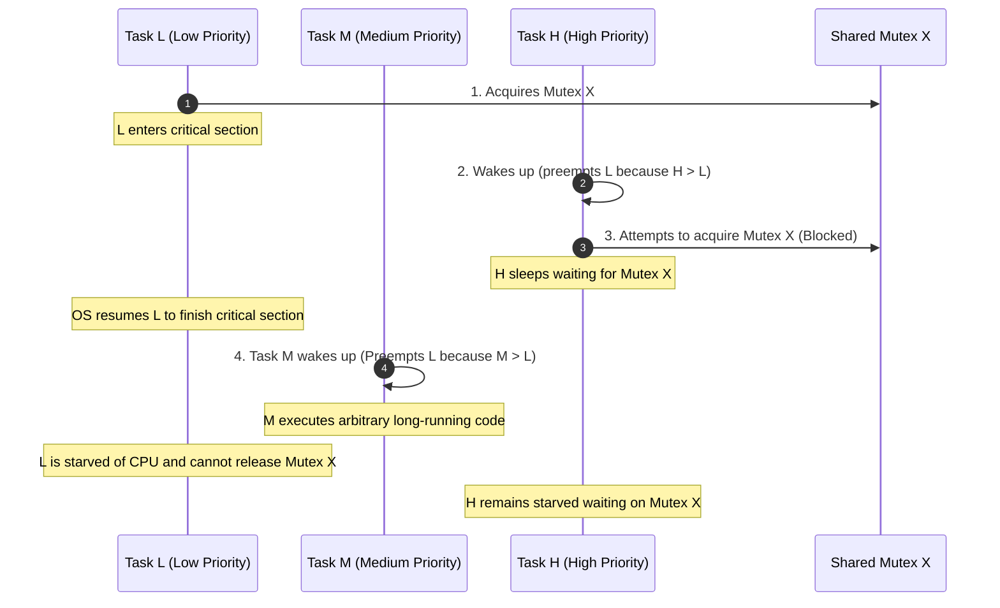

<span className="badge badge--danger margin-bottom--md">Hard</span>

> **Interview Question:** "What is Priority Inversion? What causes it, why did it repeatedly reboot the Mars Pathfinder in 1997, and how does Priority Inheritance fix it?"

**Priority Inversion** is a critical concurrency hazard in preemptive priority-based operating systems where a **high-priority task is indirectly preempted and delayed by a medium-priority task**, completely inverting the intended scheduling hierarchy.

If left unresolved, priority inversion leads to deadline misses, system unresponsiveness, or catastrophic failure in Real-Time Operating Systems (RTOS).

---

### The ELI5 Analogy: The Office Projector

Imagine a company with three employees:
- **The CEO** (High-Priority Task $H$)
- **The Manager** (Medium-Priority Task $M$)
- **The Intern** (Low-Priority Task $L$)

There is only one **Projector** (the shared Mutex) in the building:

1. **Intern locks the projector:** The Intern ($L$) checks out the projector to practice a presentation.
2. **CEO requests the projector:** The CEO ($H$) arrives to give an emergency investor pitch. Because the Intern currently holds the projector, the CEO must wait in the lobby (Task $H$ blocks).
3. **Manager interrupts the Intern:** Right then, the Manager ($M$) walks into the Intern's room and orders: *"Drop everything and update these 50 spreadsheets right now."*
4. **The Inversion:** Because the Manager outranks the Intern ($M > L$), the Intern must stop their presentation and work on spreadsheets. The Manager does not need the projector!
5. **The Absurd Result:** The CEO is waiting for the Intern, but the Intern cannot finish because of the Manager. **The CEO is effectively stuck waiting on the Manager.**

The highest-priority person in the organization is starved of execution by a medium-priority person.

---

### Concurrency Anatomy of Priority Inversion

In a strict priority-preemptive RTOS, the scheduler guarantees that the highest-priority runnable thread always executes on the CPU:



1. **Task $L$** runs and acquires shared `Mutex_X`.
2. **Task $H$** wakes up on an interrupt or timer. Because priority $H > L$, the kernel preempts $L$ and dispatches $H$.
3. **Task $H$** attempts to acquire `Mutex_X`. Because $L$ holds it, $H$ is suspended and placed into the mutex wait queue.
4. The kernel returns the CPU to $L$ so it can release the lock.
5. **The Trap:** One or more independent **Medium-priority tasks ($M$)** wake up. Because $M > L$, the kernel preempts $L$ and executes $M$.
6. **Task $M$ does not need `Mutex_X`.** It consumes CPU cycles indefinitely. Task $L$ is starved and cannot complete its critical section. Consequently, Task $H$ is starved indefinitely!

---

### The Real-World Incident: The Mars Pathfinder (1997)

On July 4, 1997, NASA's Mars Pathfinder landed on Mars. A few days into the mission, the spacecraft began experiencing unexplained system resets, losing valuable scientific data:

```
                          Mars Pathfinder Tasks:
┌────────────────────────────────────────────────────────────────────────┐
│  bc_dist (High Priority)     : Mil-Std-1553 Information Bus Manager   │
│  comm / radio (Med Priority) : Long-running communications tasks       │
│  asi_publish (Low Priority)  : Meteorological science sensor reads     │
└────────────────────────────────────────────────────────────────────────┘
```

1. **`asi_publish` ($L$)** acquired a shared mutual exclusion semaphore protecting the bus memory table.
2. An interrupt woke up **`bc_dist` ($H$)**, which scheduled bus transactions. It attempted to acquire the bus mutex and was blocked.
3. Several medium-priority communication and processing tasks woke up. Because they outranked `asi_publish`, they preempted it and ran for prolonged durations.
4. **The Watchdog Reset:** Pathfinder was equipped with a hardware **Watchdog Timer**. If `bc_dist` did not run within a designated time window, the watchdog assumed the CPU had locked up, reset the hardware bus, and rebooted the entire spacecraft!
5. **The Patch from 100 Million Miles Away:** JPL engineers reproduced the failure on an identical replica in their laboratory. Using the dynamic C interpreter in Wind River's **VxWorks RTOS**, they uploaded a patch that toggled the mutex creation flag to enable **Priority Inheritance** (`semMCreate(..., SEM_INVERSION_SAFE)`), saving the mission.

---

### The Fix: Priority Inheritance vs. Priority Ceiling

#### 1. Priority Inheritance Protocol (PIP)
- **Mechanism:** When a high-priority task ($H$) blocks on a mutex held by a lower-priority task ($L$), the operating system **temporarily elevates the priority of task $L$ to match task $H$** for the duration of the critical section:
  $$\text{Priority}(L) = \max(\text{Priority}(L), \text{Priority}(H))$$
- **Result:** Medium-priority tasks ($M$) can no longer preempt $L$. Task $L$ quickly finishes its critical section, releases the lock, drops back to its base priority, and $H$ immediately acquires the lock and runs.
- **Drawback:** Can cause **transitive inheritance chains** ($H \to M \to L$) and does not prevent deadlocks if multiple locks are acquired in arbitrary orders.

#### 2. Priority Ceiling Protocol (PCP)
- **Mechanism:** Every shared mutex is statically assigned a **priority ceiling** equal to the highest priority of any task that could ever lock it.
- When a task acquires the mutex, its priority is immediately boosted to the mutex ceiling.
- **Advantage:** Mathematically guarantees that a high-priority task is blocked by lower-priority tasks at most **once**, and **completely prevents deadlocks**.

---

### Comparison Matrix

| Dimension | Standard Mutex | Priority Inheritance (PIP) | Priority Ceiling (PCP) |
| :--- | :--- | :--- | :--- |
| **Priority Inversion Risk** | **Unbounded** (Can starve indefinitely) | **Bounded** to critical section duration | **Strictly bounded** (at most 1 blocking) |
| **Deadlock Prevention** | None | None (Deadlocks still possible) | **Guaranteed Deadlock-Free** |
| **Implementation Overhead** | Minimal ($O(1)$) | Moderate (Dynamic priority tracking) | Higher (Static ceiling calculation) |
| **Use Cases** | General OS (Linux, Windows) | Real-time kernels (VxWorks, FreeRTOS) | Safety-critical RTOS (Avionics, Automotive) |

---

### Summary

"Priority inversion occurs when a low-priority thread holding a shared mutex is preempted by medium-priority threads, indirectly starving a high-priority thread that is blocked on the mutex. The standard solution is the Priority Inheritance Protocol, where the OS temporarily elevates the lock-holding thread's priority to match that of the highest blocked waiter, ensuring it finishes its critical section without preemption from intermediate threads."

---

### Python Verification: Priority Inversion & Inheritance Simulator

The following executable Python script simulates a priority-based scheduler demonstrating how medium-priority tasks starve high-priority tasks under standard mutexes, and how priority inheritance resolves the inversion:

```python
"""
Priority Inversion & Priority Inheritance Simulator
Demonstrates:
  1. Unbounded priority inversion under standard mutexes
  2. Bounded execution when priority inheritance is applied
"""

from typing import Optional, List

class Task:
    def __init__(self, name: str, base_priority: int, work_units: int, needs_lock: bool = False):
        self.name = name
        self.base_priority = base_priority
        self.effective_priority = base_priority
        self.work_remaining = work_units
        self.needs_lock = needs_lock
        self.holds_lock = False
        self.blocked = False

    def __repr__(self):
        return f"{self.name}(prio={self.effective_priority}, rem={self.work_remaining})"


class Mutex:
    def __init__(self, enable_priority_inheritance: bool = False):
        self.owner: Optional[Task] = None
        self.waiters: List[Task] = []
        self.enable_pi = enable_priority_inheritance

    def acquire(self, task: Task) -> bool:
        if self.owner is None:
            self.owner = task
            task.holds_lock = True
            return True
        else:
            task.blocked = True
            self.waiters.append(task)
            # Priority Inheritance: Boost owner's priority to match highest waiter
            if self.enable_pi and self.owner.effective_priority < task.effective_priority:
                self.owner.effective_priority = task.effective_priority
            return False

    def release(self, task: Task) -> Optional[Task]:
        assert self.owner == task, "Only owner can release mutex"
        task.holds_lock = False
        self.owner = None
        # Restore owner's base priority
        if self.enable_pi:
            task.effective_priority = task.base_priority

        if self.waiters:
            # Wake up highest priority waiter
            self.waiters.sort(key=lambda t: t.effective_priority, reverse=True)
            next_task = self.waiters.pop(0)
            next_task.blocked = False
            self.owner = next_task
            next_task.holds_lock = True
            return next_task
        return None


def run_simulation(enable_pi: bool):
    mode = "WITH Priority Inheritance" if enable_pi else "WITHOUT Priority Inheritance (VULNERABLE)"
    print(f"\n================ Running {mode} ================")

    mutex = Mutex(enable_priority_inheritance=enable_pi)
    low = Task("Task_L (Low)", base_priority=1, work_units=3, needs_lock=True)
    med = Task("Task_M (Med)", base_priority=5, work_units=4, needs_lock=False)
    high = Task("Task_H (High)", base_priority=10, work_units=2, needs_lock=True)

    tasks = [low, med, high]
    execution_timeline = []

    # Step 0: Low task starts and acquires the mutex
    mutex.acquire(low)
    print(f"Step 0: {low.name} acquired Mutex.")

    for tick in range(1, 12):
        # Determine all non-blocked, unfinished tasks
        runnable = [t for t in tasks if not t.blocked and t.work_remaining > 0]
        if not runnable:
            break

        # Pick task with highest effective priority
        runnable.sort(key=lambda t: t.effective_priority, reverse=True)
        active_task = runnable[0]

        # Simulate High task waking up at tick 1 and requesting the mutex
        if tick == 1 and not high.holds_lock and not high.blocked:
            print(f"Tick {tick}: {high.name} wakes up and requests Mutex...")
            acquired = mutex.acquire(high)
            if not acquired:
                print(f"       -> Mutex locked by {mutex.owner.name}! {high.name} BLOCKED.")
                if enable_pi:
                    print(f"       -> [PI ACTIVE] {low.name} boosted to priority {low.effective_priority}!")
            # Re-evaluate active task
            runnable = [t for t in tasks if not t.blocked and t.work_remaining > 0]
            runnable.sort(key=lambda t: t.effective_priority, reverse=True)
            active_task = runnable[0]

        # Execute 1 unit of work
        active_task.work_remaining -= 1
        execution_timeline.append(active_task.name.split()[0])
        print(f"Tick {tick:02d}: Running {active_task.name} (Effective Prio: {active_task.effective_priority})")

        # If Low finishes its work, it releases the mutex
        if active_task == low and active_task.work_remaining == 0 and active_task.holds_lock:
            print(f"       -> {low.name} finished critical section and released Mutex!")
            woken = mutex.release(low)
            if woken:
                print(f"       -> {woken.name} unblocked and granted Mutex!")

    print(f"\nExecution Timeline: {' -> '.join(execution_timeline)}")


if __name__ == "__main__":
    # Case 1: Priority Inversion without fix
    run_simulation(enable_pi=False)
    # Case 2: Priority Inversion resolved via Priority Inheritance
    run_simulation(enable_pi=True)
```