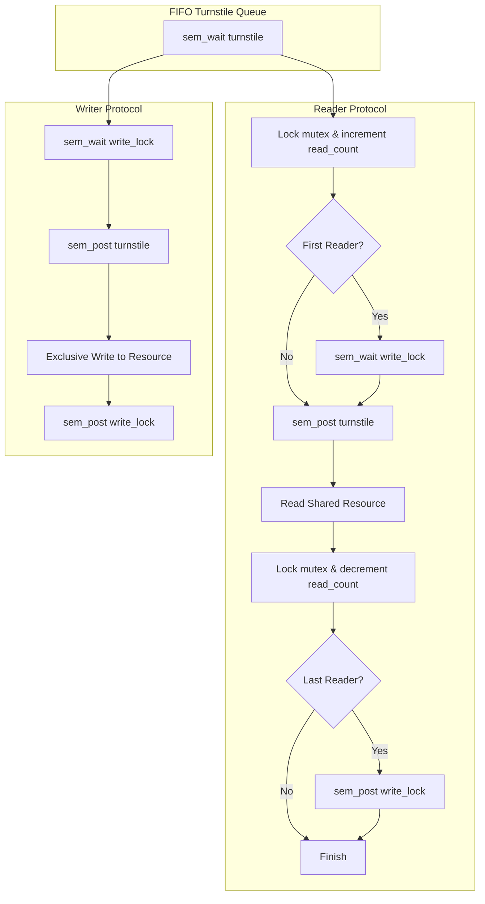

<span className="badge badge--danger margin-bottom--md">Hard</span>

> **Interview Question:** "What is the Readers-Writers problem? Why can't you solve it with a single mutex the same way you'd solve Producer-Consumer, and how do you prevent writer starvation using a fair turnstile?"

The **Readers-Writers Problem** is a canonical synchronization challenge modeling concurrent access to a shared resource (such as an in-memory cache, database table, or file system).

Threads are partitioned into two distinct categories:
- **Readers:** Threads that only read and query data without mutating it.
- **Writers:** Threads that mutate, insert, or delete data.

The core synchronization challenge is: **Multiple readers may access the resource concurrently, but a writer requires exclusive access to prevent data corruption.**

---

### The ELI5 Analogy: The Museum Manuscript

Imagine an ancient, rare manuscript displayed inside a glass case at a museum:
- **The Readers (Tourists):** 100 tourists can gather around the glass case and read the manuscript simultaneously. Their eyes reading the words do not degrade or alter the ink.
- **The Writer (Curator):** A museum curator must occasionally open the glass case to restore the ink or repair paper fibers.
- **The Safety Rule:** While the curator works, tourists must step back behind a curtain (Exclusive Write Access). No tourists can look, and no other curators can touch the manuscript.
- **The Single Mutex Disaster:** If the museum manager installed a bathroom-style single-occupancy lock on the room, only **one tourist** could look at the manuscript at a time while 99 tourists waited outside in a 2-hour line. It over-protects the room and destroys tourist throughput.

---

### Constraint Comparison: Readers-Writers vs. Producer-Consumer

A common interview trap is conflating the Bounded-Buffer problem with Readers-Writers:

| Dimension | Producer-Consumer (Bounded Buffer) | Readers-Writers |
| :--- | :--- | :--- |
| **State Mutation** | **Both** producers and consumers mutate shared memory (modifying buffer elements and moving pointers). | **Only writers** mutate state; readers preserve state completely. |
| **Concurrency Rule** | Strict mutual exclusion: **At most one thread** inside the buffer at any moment. | Shared access: **Infinite readers** may read simultaneously; **at most one writer** may write. |
| **Primary Primitive** | Semaphores (Capacity counting) + Binary Mutex. | Shared/Exclusive Locks (`rwlock`) or RCU (Read-Copy-Update). |

---

### The Three Classic Variants

#### 1. First Readers-Writers Problem (Reader-Preference)
- **Policy:** No reader is forced to wait simply because a writer is waiting. Readers only wait if a writer actively holds the lock.
- **Implementation:** Uses a `read_count` integer, a mutex `mutex` protecting `read_count`, and a semaphore `write_lock` protecting the resource:

```c
// Reader
pthread_mutex_lock(&mutex);
read_count++;
if (read_count == 1) {
    sem_wait(&write_lock); // First reader locks out writers
}
pthread_mutex_unlock(&mutex);

// --- CRITICAL SECTION: Read Data ---

pthread_mutex_lock(&mutex);
read_count--;
if (read_count == 0) {
    sem_post(&write_lock); // Last reader unlocks writers
}
pthread_mutex_unlock(&mutex);
```

```c
// Writer
sem_wait(&write_lock);
// --- CRITICAL SECTION: Write Data ---
sem_post(&write_lock);
```

- **The Fatal Flaw (Writer Starvation):** If a steady stream of readers arrives, `read_count` will never drop to zero. The first reader locks `write_lock`, and subsequent readers slip in continuously. A waiting writer will **starve indefinitely**.

---

#### 2. Second Readers-Writers Problem (Writer-Preference)
- **Policy:** Once a writer signals its intent to write, **no new readers are allowed to enter**. Arriving readers queue up until the waiting writer finishes.
- **Trade-off:** Eliminates writer starvation, but introduces **Reader Starvation** if writers arrive frequently.

---

#### 3. Third Readers-Writers Problem (Fair / Starvation-Free Turnstile)
- **Policy:** Readers and writers are serviced strictly in arrival order (**FIFO**). Neither side starves.
- **The Turnstile Mechanism:** An additional semaphore `turnstile` is placed at the entrance. Every thread (reader or writer) must pass through the turnstile:



When a writer arrives:
1. It acquires the `turnstile` and blocks on `write_lock`.
2. Any newly arriving readers get blocked on the `turnstile` **behind the writer**.
3. As soon as the active reading batch departs, the waiting writer executes immediately without being cut off by fresh readers!

---

### The Modern Alternative: Linux Read-Copy-Update (RCU)

In high-performance operating system kernels (like the Linux VFS and routing tables), even reader-writer locks (`pthread_rwlock_t`) cause bus contention because readers must atomically increment `read_count`.

Linux solves this with **Read-Copy-Update (RCU)**:
1. **Readers pay zero lock overhead:** Readers read shared memory pointers without locks or atomic operations.
2. **Writers never block readers:** When updating an object, a writer creates a private duplicate copy of the struct, modifies the copy, and atomically updates the global pointer using a single atomic store instruction.
3. **Grace Period & Reclamation:** Existing readers continue reading the old version safely. The writer waits for a "grace period" (until all CPU cores perform a context switch) before freeing the memory of the old struct.

---

### Summary

"The Readers-Writers problem introduces shared-read and exclusive-write access. Using a single mutex forces readers into sequential execution, severely degrading read throughput. The naive reader-preference solution causes writer starvation under continuous read traffic. A fair solution uses a turnstile semaphore to enforce arrival order, ensuring that a waiting writer blocks incoming readers. In modern performance-critical kernels, lockless Read-Copy-Update (RCU) eliminates reader contention entirely."

---

### Python Verification: Reader-Preference Starvation vs. Fair Turnstile

The following executable Python script demonstrates multi-threaded reader-writer synchronization, contrasting writer starvation in naive reader-preference with starvation-free FIFO turnstile scheduling:

```python
"""
Readers-Writers Synchronization Simulator
Demonstrates:
  1. Reader-preference writer starvation under continuous read load
  2. Starvation-free Fair Turnstile implementation
"""

import threading
import time

class FairReaderWriterLock:
    """Implements the 3rd Readers-Writers Problem using a turnstile."""
    def __init__(self):
        self.turnstile = threading.Semaphore(1)  # Enforces FIFO arrival
        self.resource_lock = threading.Semaphore(1)  # Exclusive write lock
        self.mutex = threading.Lock()  # Protects reader count
        self.read_count = 0

    def acquire_read(self):
        # Pass through turnstile in arrival order
        self.turnstile.acquire()
        with self.mutex:
            self.read_count += 1
            if self.read_count == 1:
                self.resource_lock.acquire()  # First reader locks out writers
        self.turnstile.release()

    def release_read(self):
        with self.mutex:
            self.read_count -= 1
            if self.read_count == 0:
                self.resource_lock.release()  # Last reader frees writers

    def acquire_write(self):
        # Writer blocks turnstile so newly arriving readers cannot jump ahead
        self.turnstile.acquire()
        self.resource_lock.acquire()
        self.turnstile.release()

    def release_write(self):
        self.resource_lock.release()


def run_fair_lock_test():
    print("=== Testing Fair Turnstile Readers-Writers Lock ===\n")
    lock = FairReaderWriterLock()
    execution_order = []

    def reader(reader_id: int):
        lock.acquire_read()
        execution_order.append(f"Reader_{reader_id} (Reading)")
        time.sleep(0.02)
        lock.release_read()

    def writer(writer_id: int):
        lock.acquire_write()
        execution_order.append(f"Writer_{writer_id} (WRITING)")
        time.sleep(0.03)
        lock.release_write()

    # Step 1: Start 2 initial readers
    t_r1 = threading.Thread(target=reader, args=(1,))
    t_r2 = threading.Thread(target=reader, args=(2,))
    t_r1.start()
    t_r2.start()
    time.sleep(0.005)

    # Step 2: Queue a writer while readers are inside
    t_w1 = threading.Thread(target=writer, args=(1,))
    t_w1.start()
    time.sleep(0.005)

    # Step 3: Queue 2 more readers after the writer
    t_r3 = threading.Thread(target=reader, args=(3,))
    t_r4 = threading.Thread(target=reader, args=(4,))
    t_r3.start()
    t_r4.start()

    t_r1.join()
    t_r2.join()
    t_w1.join()
    t_r3.join()
    t_r4.join()

    print("Execution Sequence:")
    for event in execution_order:
        print(f"  -> {event}")

    # Verify writer was NOT starved by late readers
    w_index = next(i for i, s in enumerate(execution_order) if "Writer_1" in s)
    r3_index = next(i for i, s in enumerate(execution_order) if "Reader_3" in s)
    assert w_index < r3_index, "Writer was starved by subsequent readers!"
    print("\nResult: Writer_1 executed BEFORE Reader_3 and Reader_4.")
    print("Turnstile successfully prevented writer starvation!")


if __name__ == "__main__":
    run_fair_lock_test()
```