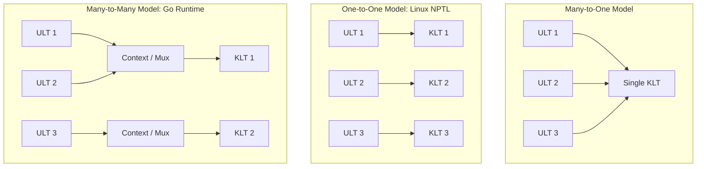

<span className="badge badge--danger margin-bottom--md">Hard</span>

> **Interview Question:** "What are the three main threading models (Many-to-One, One-to-One, Many-to-Many), what is the fundamental tradeoff between User-Level Threads (ULTs) and Kernel-Level Threads (KLTs), and how does Go's M:N scheduler resolve historical limitations?"

How an application achieves concurrent execution across modern multi-core processors depends on how the operating system and language runtime map **User-Level Threads (ULTs)** to **Kernel-Level Threads (KLTs)**.

The core tradeoff is **Execution Overhead (Creation & Context Switch Latency) vs. True Multicore Concurrency**.

---

### The ELI5 Analogy: The Restaurant Kitchen

Imagine an enterprise restaurant kitchen:
- **User-Level Threads (Tasks):** The individual recipes the chefs want to cook—chopping onions, boiling pasta, searing salmon.
- **Kernel-Level Threads (Physical Stoves):** The actual gas burners provided by the building owner (the OS Kernel).

```
1. Many-to-One:   10 Recipes (Tasks)  ──────> 1 Gas Burner (Stove)
2. One-to-One:    10 Recipes (Tasks)  ──────> 10 Gas Burners (1 Stove per task)
3. Many-to-Many:  100 Recipes (Tasks) ──────> 4 Gas Burners (Dynamically shared)
```

1. **Many-to-One:** The chefs have 10 tasks, but the owner only gave them 1 single burner. The chef must rapidly shuffle pans on and off that one flame. If someone puts a pot on to boil and stands there watching it (**Blocking I/O**), the entire kitchen freezes!
2. **One-to-One:** The owner installs a dedicated gas burner for every single recipe created. If 10 tasks are created, 10 burners roar. If one boils water, the other 9 cook in parallel. But commercial stoves are extremely expensive: building 10,000 stoves exhausts the building's physical floor space and gas line (**Memory exhaustion**).
3. **Many-to-Many:** The smart hybrid. The owner installs 4 heavy-duty burners (equal to the number of physical chefs/cores), and the chefs dynamically multiplex 100 recipes across them as burners free up.

---

### Fundamental Definitions: ULT vs. KLT

| Dimension | User-Level Threads (ULTs) | Kernel-Level Threads (KLTs) |
| :--- | :--- | :--- |
| **Management Entity** | User-space runtime/library (e.g., Goroutines, Green Threads) | Operating System Kernel (e.g., Linux CFS, Windows Scheduler) |
| **Kernel Awareness** | **Kernel is 100% blind.** Sees only 1 single-threaded process. | **Kernel is fully aware.** Direct `task_struct` scheduling. |
| **Creation & Switch Cost** | Nanoseconds ($\sim 10\text{--}30\text{ ns}$). No syscalls, no mode switch. | Microseconds ($\sim 1\text{--}3\ \mu\text{s}$). Requires Ring 0 privilege traps. |
| **Stack Memory Footprint** | Dynamic: starts at **2 KB** (Go Goroutines). | Fixed: typically **2 MB to 8 MB** per thread. |
| **Blocking Syscall Behavior** | **Lethal:** If one ULT blocks, the **entire process blocks**. | **Safe:** If one KLT blocks on I/O, other KLTs continue running. |
| **Multicore Parallelism** | **Zero.** All ULTs execute on whichever core runs the process. | **True Parallelism.** Scheduled concurrently across all physical CPU cores. |

---

### The Three Classic Mapping Models



#### 1. Many-to-One Model
- **Mechanism:** Maps many user threads to a single kernel thread.
- **Advantage:** Lightning-fast switching and virtually unlimited thread counts.
- **Fatal Flaw:** Cannot scale across multi-core processors, and a single blocking system call halts the entire application.
- **Examples:** GNU Portable Threads, Ruby Green Threads (pre-1.9).

#### 2. One-to-One Model (Modern Industry Standard)
- **Mechanism:** Every thread created in application code spawns a dedicated kernel thread.
- **Advantage:** True parallel execution on multi-core hardware; non-blocking I/O.
- **Linux Implementation (NPTL):** In Linux, threads are created using the `clone()` system call with shared memory flags:
  ```c
  clone(child_func, stack, CLONE_VM | CLONE_FS | CLONE_FILES | CLONE_SIGHAND | CLONE_THREAD, arg);
  ```
  In the Linux kernel, threads and processes share the exact same scheduler representation (`struct task_struct`).
- **Limitation:** High memory overhead (each thread allocates a multi-megabyte kernel stack). A web server cannot spawn 500,000 threads without crashing via Out-Of-Memory.
- **Examples:** Modern Linux (NPTL), Windows NT/11, macOS, standard Java `Thread` (pre-Project Loom).

---

### The Many-to-Many Triumph: The Go $M:N:P$ Scheduler

Historically, M:N models struggled with the **"Scheduler Activation"** problem—when a user thread blocked in the kernel on I/O, the kernel had no clean way to notify the user-space scheduler to swap in another task.

The **Go Runtime** revolutionized the M:N model using three primitives ($M:N:P$):
- **$G$ (Goroutine):** A lightweight user thread with a dynamic stack starting at just **2 KB**.
- **$M$ (Machine):** An OS Kernel Thread managed by the host operating system.
- **$P$ (Processor):** A logical context representing a compute resource, bounded by `GOMAXPROCS` (equal to the number of physical CPU cores).

```
                      Go M:N:P Runtime Architecture:
[ P0 Local Runqueue: G1, G2, G3 ] ──────> [ M0 (OS Thread) ] ──> Core 0
[ P1 Local Runqueue: G4, G5, G6 ] ──────> [ M1 (OS Thread) ] ──> Core 1
```

#### Why Go's M:N Succeeds Where Others Failed:
1. **Work-Stealing Scheduler:** If processor $P_0$ exhausts its local queue of Goroutines, it attempts to "steal" half the Goroutines from $P_1$'s runqueue, maintaining near-perfect CPU core utilization.
2. **Network Poller Integration:** Instead of issuing blocking `read()` syscalls, network sockets are registered with non-blocking kernel multiplexers (`epoll` on Linux, `kqueue` on macOS). When a Goroutine waits for a socket, it yields its $P$ without blocking the underlying OS thread $M$!
3. **Syscall Handoff:** If a Goroutine issues an unavoidable blocking file syscall, $M_0$ blocks in the kernel, but $P_0$ instantly detaches and pairs with a newly spawned or idle $M_2$ to keep other Goroutines executing.

---

### Summary

"The Many-to-One model provides fast user-space switching but cannot utilize multicore processors and blocks entirely on a single I/O call. The One-to-One model (used by Linux NPTL and Windows) provides true hardware parallelism and isolated blocking at the expense of heavy kernel memory footprint per thread. The Many-to-Many model (exemplified by Go's M:N:P scheduler) combines lightweight micro-stacks with work-stealing and non-blocking I/O multiplexing, enabling millions of concurrent threads with low overhead."

---

### Python Verification: User-Space Coroutine Scheduler Simulation

The following executable Python script implements a user-space cooperative scheduler (Green Thread / M:N simulation), demonstrating non-preemptive user-level thread switching with microsecond overhead:

```python
"""
User-Level Thread (Green Thread / Coroutine) Scheduler Simulation
Demonstrates:
  1. Nanosecond user-space cooperative context switching
  2. Multiplexing multiple user tasks over a single thread of execution
  3. Workload completion without kernel-mode transitions
"""

import time
from typing import List, Generator

class GreenThreadScheduler:
    def __init__(self):
        self.runqueue: List[Generator] = []
        self.switches = 0

    def spawn(self, coroutine: Generator):
        """Adds a user-level thread to the scheduler queue."""
        self.runqueue.append(coroutine)

    def run(self):
        """Executes the cooperative user-space event loop."""
        start = time.perf_counter()
        while self.runqueue:
            # Pop task from front of user queue
            task = self.runqueue.pop(0)
            try:
                # Execute user task until its next voluntary yield
                self.switches += 1
                next(task)
                # Re-queue task if it has more work
                self.runqueue.append(task)
            except StopIteration:
                # Task completed
                pass

        total_time = time.perf_counter() - start
        return total_time, self.switches


def task_worker(task_id: str, steps: int):
    for step in range(1, steps + 1):
        # Perform tiny compute, then cooperatively yield CPU
        yield
    print(f"  [ULT Finished] {task_id} completed all {steps} steps.")


def main():
    print("=== User-Level Thread (ULT) Cooperative Scheduler ===\n")
    sched = GreenThreadScheduler()

    NUM_THREADS = 10_000
    STEPS_PER_THREAD = 3

    print(f"Spawning {NUM_THREADS:,} User-Level Threads (Green Threads)...")
    for i in range(NUM_THREADS):
        sched.spawn(task_worker(f"Thread_{i}", STEPS_PER_THREAD))

    print("Running user-space scheduler loop (Zero Kernel Syscalls)...")
    total_time, switches = sched.run()

    per_switch_ns = (total_time / switches) * 1_000_000_000
    print(f"\nExecution Summary:")
    print(f"  Total User Context Switches: {switches:,}")
    print(f"  Total Runtime:               {total_time:.4f} seconds")
    print(f"  Average Switch Latency:      {per_switch_ns:5.1f} nanoseconds per switch")
    print("Result: Spawning 10,000 OS Kernel Threads would consume gigabytes of RAM;")
    print("        ULTs executed 30,000 context switches in milliseconds in user space!")

if __name__ == "__main__":
    main()
```